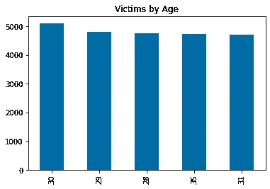
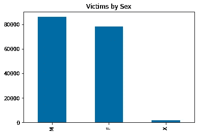
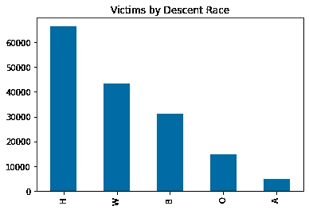
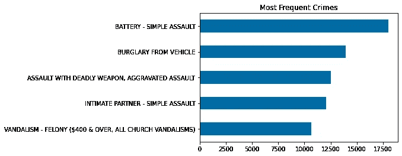
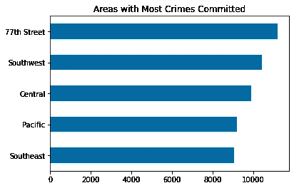
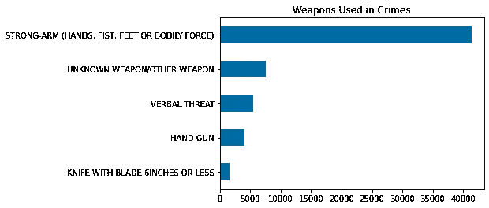

# 利用熊猫分析洛杉矶犯罪数据

> 原文：<https://medium.com/analytics-vidhya/los-angeles-crime-data-analysis-using-pandas-a68780d80a83?source=collection_archive---------13----------------------->


由 [Luca Micheli](https://unsplash.com/@lucamicheli) 在[unlash](https://unsplash.com/photos/ewspoqBfALg)上拍摄的照片

在我使用熊猫进行数据科学研究的过程中，我讨论了一个关于世界各地大都市犯罪分析的话题。在寻找公开数据的一些研究之后，我决定在洛杉矶探索这些数据。它位于加利福尼亚南部，是美国人口第二多的城市(仅次于纽约)，是电影和电视业的中心。

[Pandas](https://pandas.pydata.org) 这是 Python 中最著名的数据科学库之一，它是一个强大的数据分析工具，有许多工具和方法来处理数据操作。这

# **关于数据集**

接下来几行中要展示的数据集可从[洛杉矶公开数据](https://data.lacity.org)中获得，为此，我使用了数据集[“2020 年至今的犯罪数据”](https://data.lacity.org/Public-Safety/Crime-Data-from-2020-to-Present/2nrs-mtv8)，它涵盖了 2020 年至 2021 年间洛杉矶的犯罪事件。原始文件有 28 列和 220405 行。该文件已经在 [Jupyter 笔记本](https://jupyter.org/)中进行了预处理，删除了一些分析中不会用到的行值和列。

以下是数据集中的所有变量，后面是其说明:

*   `DR_NO` -记录编号部门:由 2 位数字的年份、区域 ID 和 5 位数字组成的官方文件编号。
*   `DATE OCC` -犯罪发生日期(年-月-日)
*   `AREA`——LAPD 有 21 个社区警察局，在警察局内被称为地理区域。这些地理区域从 1 到 21 依次编号。
*   `AREA NAME`-21 个地理区域或巡逻部门也有一个名称，指的是其负责的地标或周围社区。
*   `Rpt Dist No` -代表地理区域内的子区域的代码。
*   `Crm Cd` -表示所犯罪行。
*   `Crm Cd Desc` -定义所提供的犯罪代码。
*   `Vict Age` -表示受害者的年龄。
*   `Vict Sex` -女:女男:男 X:未知
*   `Vict Descent` -血统代号: **A** -其他亚洲人 **B** -黑人 **C** -中国人 **D** -柬埔寨人 **F** -菲律宾人 **G** -关岛人 **H** -西班牙人/拉丁人/墨西哥人 **I** -美洲印第安人/阿拉斯加土著 **J** -日本人**K **-夏威夷 **V** -越南 **W** -白人 **X** -未知 **Z** -亚洲印第安人****
*   `Premis Cd` -犯罪发生的建筑、车辆或地点的类型。
*   `Premis Desc` -定义提供的服务地址代码。
*   `Weapon Used Cd` -犯罪中使用的武器类型。
*   `Weapon Desc` -定义所提供的武器使用代码。
*   `LOCATION` -犯罪事件的街道地址四舍五入到最近的 100 个街区以保持匿名。
*   `LAT` -纬度坐标。
*   `LON` -经度坐标。

# 导入库和创建 de 数据框

# 初步分析

在深入数据框之前，我们需要检查标题、形状、变量类型、列名以及缺失值的百分比。

数据帧头

**数据帧容量和数据类型**

```
print('Rows:\t{}'.format(df.shape[0]))
print('Variables:\t{}'.format(df.shape[1]))
df.dtypesRows: 220405
Variables: 17DR_NO                      int64
DATE OCC          datetime64[ns]
AREA                       int64
AREA NAME                 object
Rpt Dist No                int64
Crm Cd                     int64
Crm Cd Desc               object
Vict Age                   int64
Vict Sex                  object
Vict Descent              object
Premis Cd                float64
Premis Desc               object
Weapon Used Cd           float64
Weapon Desc               object
LOCATION                  object
LAT                      float64
LON                      float64
```

**缺失值百分比**

```
(df.isnull().sum()).sort_values(ascending=False) / df.shape[0]Weapon Desc       0.631528
Weapon Used Cd    0.631528
Vict Descent      0.131826
Vict Sex          0.131807
Premis Desc       0.000368
Premis Cd         0.000014
Crm Cd            0.000000
DATE OCC          0.000000
AREA              0.000000
AREA NAME         0.000000
Rpt Dist No       0.000000
LON               0.000000
Crm Cd Desc       0.000000
Vict Age          0.000000
LAT               0.000000
LOCATION          0.000000
DR_NO             0.000000
```

# 缺失数据

正如我们在初步分析中看到的，dataframe 在列`Weapon Desc`、`Weapon Used Cd`、`Vict Descent`、`Vict Sex`、`Premis Desc`和`Premis Cd`中包含一些空白行。使用`dropna`命令，列`Vict Descent`、`Vict Sex`和`Premis Desc`中的空值将从数据框中删除。其他缺失值将用“不适用”填充。我选择填充这些值，而不是删除它们，这样一些没有全部信息的犯罪就不会被丢弃。

```
# removing blank values for 'Vict Descent', 'Vict Sex' and 'Premis Desc'df.dropna(subset=['Vict Descent', 'Vict Sex', 'Premis Desc'],inplace=True)# adding the "N/A" text on blank values for 'Weapon Desc' and 'Weapon Used Cd'df.fillna(value='N/A')
```

# 关于洛杉矶犯罪数据的统计信息

在删除和清除一些行之后，我们可以跳到数据图表的统计分析。使用简单的功能，是否可以提取统计简历，最常犯的罪行，按月犯罪，甚至围绕信息的图形数据。

```
# checking the statistical data for each columndf.describe()
```

统计简历，

观察上面的简历，我们可以检查计数、最小值、最大值、百分比值、平均值和标准偏差。受害者年龄一栏有错误，显示受害者的最小年龄为-1。我们可以通过设置删除特定值的规则，使用函数 drop 轻松地删除该值。需要指出的是，一些缺失数据的位置字段被标记为(0，0)，地址字段只提供给最近的 100 个街区，以保护隐私。

```
# removing the values ​​below one for the "Vict Age" columndf.drop(df[df['Vict Age'] < 1].index, axis=0, inplace=True)
```

现在，我们将把我们的分析分成两部分。首先，我们将检查更侧重于人的数据，以获得按年龄、性别和种族分列的受害者结果。在此之后，分析将更加侧重于开放的概念，如最常见的犯罪，事件发生率较高的地区，以及使用的武器。

# 受害者分析

关于受害者年龄的结果非常接近，分析前 10 项，有可能看到 25 至 35 岁之间的范围。这个结果直接反映了洛杉矶市民的平均年龄。据人口普查记者 T2 称，20-29 岁和 30-39 岁的人分别占 17%和 16%。



按年龄划分的受害者结果，按作者划分的图像

*   30 年，约 3.1%
*   29 年，约 3.0%
*   28 年，约 2.9%
*   35 年，约 2.8%
*   31 年，约 2.8%

`Vict Sex`列在数据框中呈现了四个不同的类别。根据[洛杉机公开赛数据](https://data.lacity.org)中的列描述字段，只有三种类型:女性(F)，男性(M)，未知(X)。因此，我们不会考虑结果中显示为 H 的值。



按性别、作者分类的受害者结果

*   男性，约占 51.9%
*   女性，约占 47.1%
*   未知(X)，约 1.04%

洛杉矶市是由西班牙发现者建立的，也是墨西哥领土的一部分。《瓜达卢佩·伊达尔戈条约》签订后，这座城市和整个加利福尼亚州都被并入美国版图。由于这一过程，以及其他事件，如加利福尼亚的淘金热和石油开采，洛杉矶市继承了巨大的种族多样性，所有这些种族融合非常明显，使种族冲突比其他城市更加激烈。



按血统种族划分的受害者结果，按作者划分的图像

上图的结果很好地说明了该市存在的多样性，按种族划分的犯罪百分比值如下:

*   西班牙裔/拉丁裔/墨西哥裔(H)，约 40.1%
*   白色(W)，约占 26.1%
*   黑色(B)，约占 18.7%
*   其他(O)，约 8.97%
*   其他亚洲人(A)，约占 2.88%

# 犯罪分析

关于在洛杉矶市发生的犯罪，五种类型因发生次数而更加突出，下表列出了 2020 年至 2021 年间最常见的犯罪。



最常见的犯罪，作者图片

以上结果以百分比表示为:

*   殴打——简单攻击，约占 10.9%
*   车内盗窃，约 8.39%
*   使用致命武器袭击，约占 7.54%
*   恐吓伴侣，约 7.28%
*   故意破坏，约 6.44%

洛杉矶警察局(LAPD)有一个按社区划分的警察局，在那里提供一般信息和援助，全市有 21 个地理区域。请记住，地址字段并不完全相同，因为 LAPD 会将记录保存到最近的 100 个街区以保护隐私。根据数据框架，犯罪最多的社区是:



犯罪率最高的地区，按作者分类的图像

*   第 77 街地区，约 6.76%
*   西南地区，约为 6.28%
*   中心区，约 5.97%
*   太平洋地区，约 5.54%
*   东南地区，约为 5.46%

洛杉矶使用枪支的法律允许你持枪，但是除非你有持枪许可证，否则你不能持枪。加利福尼亚州拥有全国最严格的枪支管制法律之一，由于学校事件和大规模枪击事件，法律变得更加严格。



犯罪中更多使用的武器，作者图片

以百分比值表示的图表结果等于:

*   强势，约 24.9%
*   未知武器，约 4.54%
*   口头威胁，约 3.32%
*   手枪，约占 2.43%
*   刀具，约 0.98%

# 结论

数据科学的使用让我们对许多主题有一个开阔的视野，分析过去甚至现在的数据库，有可能提取相关信息以做出决策。在公共安全的特定情况下，可以确定犯罪事件最多的地方，加强枪支控制和规划策略以减少暴力，并为当地人民带来更多的安全。

# 感谢阅读！

感谢阅读。把你的想法和主意发给我。你可以写信只是为了说声嗨。如果你真的需要告诉我是怎么错的，我期待着尽快和你聊天。如果想查看原始文件，请使用下面的[链接](https://bit.ly/2PATNOr)。

LinkedIn: [法比奥·罗德里格兹](https://www.linkedin.com/in/f-rodrigues/) |Github: [法比奥多克姆](https://github.com/fabiodotcom)