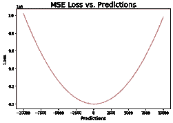
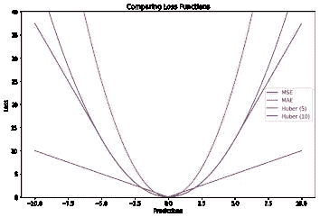

# 损失函数第一部分

> 原文：<https://medium.com/analytics-vidhya/loss-functions-part-1-17b2601031c1?source=collection_archive---------6----------------------->

首先让我们理解，机器是如何从给定的数据中学习的。其实就是学习数据内部的关系。有 3 个步骤，机器首先学习，然后预测输出。主要是第一次预测大多是随机的。然后它计算误差，然后学习，然后这个过程发生多次。错误继续减少成本函数也称为损失函数。如果代价函数是凸的，那么就更容易计算误差并将其作为全局和局部极小值来最小化。但并不是所有的成本函数本质上都是凸的。我们会通过观察它们的图形来看例子，慢慢理解误差函数。

# 损失函数

> **为什么我们需要损失函数？**

损失函数实际上衡量的是模型的预测结果有多好，这是衡量模型有多好的标准。

> **成本函数和损失函数是一样的吗？**

在我们的日常生活中，我们通常会看到成本函数和损失函数这两个术语互换使用，但实际上，这两个术语并不相同。损失函数针对单个训练示例(条目)。成本函数是整个训练数据集的平均损失。

> 我们是否对所有数据集使用相同的损失函数？

在我们考虑损失函数之前，我们需要确定问题是什么，我们正在解决的是回归还是分类。在分类中，我们可以使用损失函数，如交叉熵、铰链损失。在回归中，我们使用 SME、MAE 和 Huber。

> **损失函数都是凸的吗？**

没有。请看下图。

凸的、非凸的成本函数

> **为什么不使用相同的损失函数进行回归&分类？**

在对惩罚进行分类时，我们需要知道模型预测的置信度。这意味着，如果模型以高置信度预测了错误的结果，那么它应该受到更多的惩罚。在回归中，我们只看到预测值和实际值之间的差异。

# 回归损失平方的推导

回归问题中损失函数的一个常见选择是平方损失。现在，该过程正在为每个输入 x 选择 t 值的特定估计值 y(x)，假设这样做，我们招致损失 L(t，y(x))。平均或预期损失由 E[L]给出。我们的目标是找到 E[L]。

最佳最小二乘预测值由条件均值给出，另一项是目标数据的固有可变性。现在让我们看看回归问题的一些损失函数。

## 均方误差

均方差是最常用的回归损失函数。MSE 是我们的实际目标值和预测值之间距离的平方和。

它克服了轴上和轴下距离相减的问题，因为现在所有值都是正的。它不考虑方向，只关注平均震级。至于平方的原因，与偏差较小的预测值相比，远离实际值的预测值受到严重惩罚。这一特性使得 MSE 对异常值的鲁棒性较差。因此，它不应该用于我们的数据容易出现许多异常值。观察下图中 MSE 的形状。

二次函数只有全局最小值。因为没有局部极小值，我们永远不会陷入其中。因此，总是保证梯度下降将收敛到全局最小值(如果它收敛的话)。MSE 等于方差和偏差平方之和。下面就是证明。通过最小化 MSE，我们可以估计最佳拟合直线方程。首先来看推导。

通过最小化 MSE，我们可以估计最佳拟合直线方程。首先来看推导。

正如我们已经看到的从 MSE 最小化得到线方程的推导。下面这个题目的数值问题。

# 平均绝对误差

平均绝对误差是用于回归问题的另一个损失函数。MAE 是我们的目标值和模块函数预测值之差的总和。

所以它不考虑误差的方向。由于差不是平方的，所以它比 MSE 对异常值更稳健。但是当我们最小化 MAE 时，预测将是训练数据集的中间值。

# MAE Vs MSE

具有 MAE 损失的模型的预测受异常值和噪声的影响较小，而具有 MSE 损失函数的预测由于平方误差而略有偏差。所以人们想到了 RMSE，它就是 MSE 的平方根。但是具有 RMSE 的模型针对少量的异常值进行了调整，这再次降低了性能。但我们不能得出一个结论，我们总是会使用 MAE，因为它的导数不是连续的，所以效率很低，而使用 MSE 时，我们可以找到它的导数，等于 0，以找到最优解。因此，如果数据有许多异常值，那么使用 MAE，因为对于异常值，它比 MSE 更稳健。

# 胡伯损失

Huber 损失是 MSE 和 MAE 中较好点的组合。Huber 损失在 0 处是可微的，并且比 MSE 对异常值更不敏感。基本上是绝对误差，误差小了就变成二次误差了。当δ ~ 0 时，Huber 损耗接近 MSE，当δ ~ ∞时，接近 MAE。但是 Huber 损失也有一个问题，就是我们需要迭代地训练超参数 delta。

# 回归损失函数的比较

经验是，当没有很多异常值时，我们使用 MSE 作为误差函数。下图显示了上述所有误差函数。

