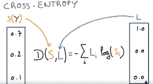
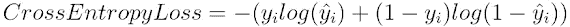
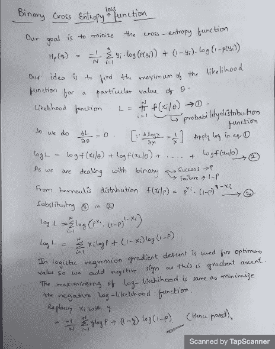
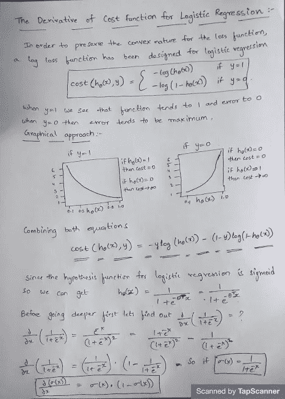

# 损失函数第二部分

> 原文：<https://medium.com/analytics-vidhya/loss-functions-part-2-c9d0255cbcfc?source=collection_archive---------13----------------------->

这是[这个](https://srinivask-bits.medium.com/loss-functions-part-1-17b2601031c1)的延续博客

# 用于分类的损失函数

众所周知，对于回归问题，我们使用最小二乘误差作为损失函数。通过这种方法，我们得到一个凸损失函数，我们可以通过找到它的全局最小值来进行优化。但是当涉及到逻辑回归时，这个概念就完全改变了，最小二乘误差会给我们一个非凸的损失函数，它有不止一个局部极小值。这里，由于在逻辑回归假设中使用了非线性 sigmoid 函数，所以我们得到了波形曲线，因此它具有多个局部最小值，这对用于寻找最小值的梯度下降是不利的。

# 交叉熵损失

这是分类问题最常见的设置。交叉熵损失随着预测概率偏离实际标签而增加。其中一个重要的方面是，交叉熵损失会严重惩罚那些有把握但却是错误的预测。我们不能对所有错误的结果给予同等的重视。

例如，如果置信度低，同时预测到一个结果；如果置信度太高，同时预测到一个结果，但两次预测都是

假的。误差函数应该为具有更高置信度的预测使用高权重。二元交叉熵损失函数的如下证明。

下面是寻找逻辑回归的复杂成本函数的梯度。

# 铰链损耗

对于支持向量机，我们使用铰链损失。铰链损耗训练分类器。铰链损耗的差异是凸的，但不可微。铰链损失惩罚超平面的错误一侧，但是因为它是不可微的，所以梯度或随机梯度下降，所以我们大部分时间使用交叉熵。