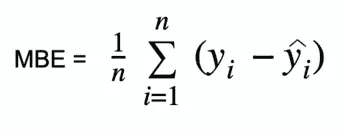

# 评估回归模型的损失函数

> 原文：<https://medium.com/analytics-vidhya/loss-functions-to-evaluate-regression-models-8dac47e327e2?source=collection_archive---------0----------------------->


[图像来源](https://unsplash.com/photos/5fNmWej4tAA)

任何机器学习模型的目标都是从数据中理解和学习模式，这些模式可以进一步用于进行预测或回答问题，或者只是理解数据中的潜在模式，否则这些模式不是显而易见的。大多数时候，学习部分是迭代的。一个模型从数据中学习一些模式，我们根据模型在训练中没有遇到的一些新数据来测试它，我们看到它做得有多好或多差，我们调整和调整一些参数，然后我们再次测试它。这个过程一直重复，直到我们看到一个足够好的模型(虽然，一些真实世界的模型可能只是令人满意的，并使世界变得不同)。我们评估和测试模型的部分就是损失函数发挥作用的地方。

损失函数采用模型的预测值，并将它们与实际值进行比较。它根据模型在映射 X(特征、自变量、预测变量)和 Y(目标、因变量、响应变量)之间的关系的能力来评估模型的好坏。有时，仅仅知道模型的表现有多差可能还不够，我们可能还需要计算模型与实际值有多远。通过了解预测值和实际值之间的偏差量，我们可以相应地训练我们的模型。实际值和预测值之间的差异称为损失。高损失值意味着模型性能差。

评估回归模型的损失函数有很多。

> T 这里没有*“一个函数统治所有人”。*

选择合适的损失函数是非常关键的，什么使一个期望取决于手头的数据。每个函数都有自己的属性。有许多因素有助于损失函数的适当选择，如算法的选择、数据中的异常值、可微性等。

这篇文章的目的是给你一个回归损失函数的列表，以及它们的优缺点。尽管所有这些都可以使用诸如 SciPy、PyTorch、Scikit Learn、Keras 等库来实现，但我还是使用 NumPy 实现了代码，因为它有助于更好地理解幕后发生的事情。

事不宜迟，我们开始吧。

## 目录

1.  损失函数与成本函数
2.  平均绝对误差
3.  平均偏差误差
4.  相对绝对误差(RAE)
5.  平均绝对百分比误差(MAPE)
6.  均方误差
7.  均方根误差(RMSE)
8.  相对平方误差
9.  归一化均方根误差(NRMSE)
10.  相对均方根误差(RRMSE)
11.  均方根对数误差
12.  胡伯损失
13.  对数损失
14.  分位数损失

## 损失函数与成本函数

计算 1 个数据点损失的函数称为损失函数。


损失函数

计算所使用的全部数据的损失的函数称为成本函数。


价值函数

## 平均绝对误差

平均绝对误差，也称为 L1 损失，是最简单的损失函数之一。它的计算方法是取预测值和实际值之间的绝对差值，并在整个数据集中取平均值。从数学上讲，是绝对误差的算术平均值。MAE 只测量误差的大小，并不关心它们的方向。MAE 越低，模型的精确度越高。

数学上，MAE 可以表示如下:


绝对平均误差

其中 y_i =实际值，y_hat_i =预测值，n =样本量

```
def mean_absolute_error(true, pred):
    abs_error = np.abs(true - pred)
    sum_abs_error = np.sum(abs_error)
    mae_loss = sum_abs_error / true.size
    return mae_loss
```


梅绘图

**优点**

*   这很容易计算。
*   由于采用了绝对值，所有误差都在同一标度上加权。
*   如果训练数据有异常值，这是有用的，因为 MAE 不会惩罚由异常值引起的高错误。
*   它提供了一个衡量模型性能的平均标准。

**缺点**

*   有时，来自异常值的大误差最终会被视为小误差。
*   MAE 遵循与尺度相关的精度测量，使用与被测数据相同的尺度。因此，它不能用于比较使用不同方法的序列。
*   MAE 的一个主要缺点是它在零点不可微。许多优化算法倾向于使用微分来寻找参数的最佳值。
*   在 MAE 中计算梯度可能具有挑战性。

# 平均偏差误差

*“平均偏差误差”中的偏差*是测量过程高估或低估参数值的趋势。偏差只有方向，可以是正的，也可以是负的。正偏差意味着数据误差被高估，负偏差意味着误差被低估。平均偏差误差(MBE)是预测值和实际值之差的平均值。MBE 量化了总体偏差，并捕获了预测中的平均偏差。它几乎类似于 MAE，唯一的区别是这里不取绝对值。MBE 应该小心处理，因为正负误差可以抵消。

MBE 的公式，



平均偏差误差

```
def mean_bias_error(true, pred):
    bias_error = true - pred
    mbe_loss = np.mean(np.sum(diff) / true.size)
    return mbe_loss
```


MBE 图

**优点**

*   如果您想要检查模型的方向(即，是否存在正偏差或负偏差)并纠正模型偏差，MBE 是一个很好的度量。

**缺点**

*   就幅度而言，这不是一个好的度量，因为误差往往会相互补偿。
*   它不是高度可靠的，因为有时高个体误差产生低 MBE。
*   MBE 在一个方向上可能是一贯错误的。例如，如果你试图预测交通模式，它总是显示低于实际观察到的交通。

# 相对绝对误差(RAE)

相对绝对误差的计算方法是将总绝对误差除以平均值和实际值之间的绝对差值。

RAE 表示为，


相对绝对误差

其中 y_bar 是 n 个实际值的平均值。

RAE 衡量预测模型的性能，用比率表示。RAE 的值可以从零到一。一个好的模型应该有接近于零的值，零是最好的值。该误差显示了平均残差与目标函数与其均值的平均偏差之间的关系。

```
def relative_absolute_error(true, pred):
    true_mean = np.mean(true)
    squared_error_num = np.sum(np.abs(true - pred))
    squared_error_den = np.sum(np.abs(true - true_mean))
    rae_loss = squared_error_num / squared_error_den
    return rae_loss
```


RAE 图

**优点**

*   RAE 可用于比较以不同单位测量误差的模型。
*   在某些情况下，RAE 是可靠的，因为它提供了对离群值的保护。

**缺点**

*   RAE 的一个主要缺点是，如果[参考预测](https://en.wikipedia.org/wiki/Reference_class_forecasting)等于地面实况，它可能是不确定的。

# 平均绝对百分比误差(MAPE)

平均绝对百分比误差的计算方法是取实际值和预测值之间的差值，然后除以实际值。将绝对百分比应用于该值，并在整个数据集中取平均值。MAPE 也被称为平均绝对百分比偏差(MAPD)。它随着误差的增加而线性增加。MAPE 越小，模型性能越好。


平均绝对百分比误差

```
def mean_absolute_percentage_error(true, pred):
    abs_error = (np.abs(true - pred)) / true
    sum_abs_error = np.sum(abs_error)
    mape_loss = (sum_abs_error / true.size) * 100
    return mape_loss
```


MAPE 图

**优点**

*   MAPE 与变量的规模无关，因为它的误差估计是以百分比表示的。
*   所有的误差都在一个共同的尺度上标准化，这很容易理解。
*   由于 MAPE 使用绝对百分比误差，避免了正值和负值相互抵消的问题。

**缺点**

*   MAPE 的一个主要缺点是当分母值为零时。我们面临着“被零除”的问题，因为它没有被定义。
*   MAPE 对负面错误的惩罚多于正面错误。因此，当我们比较预测方法的准确性时，它是有偏差的，因为它会选择一个默认值过低的方法。
*   由于使用除法运算，对于相同的误差，实际值的变化将导致损失的差异。考虑一个场景，当实际值为 100，预测值为 75 时，损失为 25%。而实际值是 50，预测值是 75，损失将是 50%。但是在这两种情况下，实际误差是相同的。即 25 岁。

# 均方误差

MSE 是最常见的回归损失函数之一。在均方误差(也称为 L2 损失)中，我们通过计算预测值和实际值之间的差值的平方，并在整个数据集内取平均值来计算误差。MSE 也称为二次损失，因为损失与误差不成比例，而是与误差的平方成比例。平方误差给予异常值更高的权重，这导致小误差的平滑梯度。优化算法受益于这种对大误差的惩罚，因为它有助于找到参数的最佳值。因为误差是平方的，所以 MSE 永远不会是负的。误差值的范围从零到无穷大。MSE 随着误差的增加呈指数增加。一个好的模型将具有接近于零的 MSE 值。


均方误差

```
def mean_squared_error(true, pred):
    squared_error = np.square(true - pred) 
    sum_squared_error = np.sum(squared_error)
    mse_loss = sum_squared_error / true.size
    return mse_loss
```


MSE 图

**优点**

*   MSE 值用二次方程表示。因此当我们画它的时候，我们得到一个只有一个全局最小值的梯度下降。
*   对于小误差，它有效地收敛到最小值。不存在局部最小值。
*   MSE 通过平方误差来惩罚有巨大误差的模型。
*   它特别有助于从模型中剔除误差较大的异常值，方法是增加它们的权重。

**缺点**

*   当有坏的预测时，MSE 的优点之一变成了缺点。对异常值的敏感性通过平方它们放大了高误差。
*   MSE 对单个大误差的影响与对许多小误差的影响相同。但最重要的是，我们将寻找一种在整体水平上表现足够好的模式。
*   MSE 依赖于尺度，因为其尺度取决于数据的尺度。这使得在不同的度量之间进行比较非常不理想。
*   当一个新的异常值被引入到数据中时，模型会尝试接受这个异常值。这样做将产生不同的最佳拟合线，这可能会导致最终结果出现偏差。

# 均方根误差(RMSE)

通过取 MSE 的平方根来计算 RMSE。RMSE 也叫均方根[偏差。它](http://Deviation.It)测量误差的平均值，并与实际值的偏差有关。RMSE 值为零表示模型非常适合。RMSE 越低，模型及其预测就越好。较高的 RMSE 表明残差与地面真实值存在较大偏差。RMSE 可用于不同的特征，因为它有助于确定该特征是否提高了模型的预测。


均方根误差

```
def root_mean_squared_error(true, pred):
    squared_error = np.square(true - pred) 
    sum_squared_error = np.sum(squared_error)
    rmse_loss = np.sqrt(sum_squared_error / true.size)
    return rmse_loss
```


RMSE 图

**优点**

*   RMSE 很容易理解。
*   它作为训练模型的启发。
*   这是计算简单，容易微分，许多优化算法的愿望。
*   由于平方根的原因，RMSE 不会像 MSE 那样惩罚错误。

**缺点**

*   像 MSE 一样，RMSE 依赖于数据的规模。如果误差范围增大，它的幅度也会增大。
*   RMSE 的一个主要缺点是它对异常值非常敏感，为了正常运行，必须删除异常值。
*   RMSE 随着测试样本大小的增加而增加。当我们计算不同测试样本的结果时，这是一个问题。

# 相对平方误差

为了计算相对平方误差，您需要将均方误差(MSE)除以实际数据与平均值之间的差值的平方。换句话说，我们将模型的 MSE 除以使用平均值作为预测值的模型的 MSE。


相对平方误差

```
def relative_squared_error(true, pred):
    true_mean = np.mean(true)
    squared_error_num = np.sum(np.square(true - pred))
    squared_error_den = np.sum(np.square(true - true_mean))
    rse_loss = squared_error_num / squared_error_den
    return rse_loss
```

RSE 的产值用比率表示。它的范围可以从零到无穷大。一个好的模型的值应该接近于零，而一个大于 1 的模型是不合理的。


RSE 图

**优点**

*   RSE 与规模无关。因此，它可以用来比较不同单位的误差模型。
*   RSE 对预测的平均值和规模不敏感。

# 归一化均方根误差(NRMSE)

归一化 RMSE 通常通过除以标量值来计算。它可以有不同的方式，

*   RMSE /系列中的最大值
*   RMSE /均值
*   RMSE /最大值和最小值之间的差值(如果平均值为零)
*   RMSE /标准偏差
*   RMSE /四分位间距

```
# implementation of NRMSE with standard deviationdef normalized_root_mean_squared_error(true, pred):
    squared_error = np.square((true - pred))
    sum_squared_error = np.sum(squared_error)
    rmse = np.sqrt(sum_squared_error / true.size)
    nrmse_loss = rmse/np.std(pred)
    return nrmse_loss
```


NRMSE 图(标准偏差)

有时选择四分位范围可能是最好的选择，因为其他方法容易出现异常值。当您想要比较不同因变量的模型或因变量被修改(对数转换或标准化)时，NRMSE 是一个很好的度量。它克服了尺度依赖性，简化了不同尺度模型之间甚至数据集之间的比较。

# 相对均方根误差(RRMSE)

RRMSE 是 RMSE 的无量纲形式。相对均方根误差(RRMSE)是由均方根值归一化的均方根误差，其中每个残差与实际值成比例。虽然 RMSE 受到原始测量规模的限制，但 RRMSE 可以用来比较不同的测量技术。当你的预测不准确时，就会导致 RRMSE 增加。RRMSE 用相对误差或百分数来表示误差。模型精度是，

*   优秀当 RRMSE < 10%
*   Good when RRMSE is between 10% and 20%
*   Fair when RRMSE is between 20% and 30%
*   Poor when RRMSE > 30%


相对均方根误差

```
def relative_root_mean_squared_error(true, pred):
    num = np.sum(np.square(true - pred))
    den = np.sum(np.square(pred))
    squared_error = num/den
    rrmse_loss = np.sqrt(squared_error)
    return rrmse_loss
```


RRMSE 图

# 均方根对数误差

均方根对数误差的计算方法是将对数应用于实际值和预测值，然后取它们的差值。RMSLE 对于异常值是稳健的，其中小误差和大误差被平均对待。

如果预测值小于实际值，它对模型的惩罚更大，而如果预测值大于实际值，模型的惩罚更小。它不会因为日志而惩罚高错误。因此，该模型对低估的惩罚比高估大。这在我们不会被高估困扰，但低估是不可接受的情况下会很有帮助。


均方根对数误差

```
def root_mean_squared_log_error(true, pred):
    square_error = np.square((np.log(true + 1) - np.log(pred + 1)))
    mean_square_log_error = np.mean(square_error)
    rmsle_loss = np.sqrt(mean_square_log_error)
    return rmsle_loss
```


RMSLE 图

**优点**

*   RMSLE 不依赖于规模，并且在一系列规模上都是有用的。
*   它不受大的异常值的影响。
*   它只考虑实际值和预测值之间的相对误差。

**缺点**

*   它有偏见的惩罚，惩罚低估多于高估。

# 胡伯损失

如果您想要一个既能了解异常值又能忽略它们的函数呢？Huber loss 是你的。Huber loss 是线性和二次评分法的结合。它有一个超参数增量(𝛿)，可以根据数据进行调整。对于高于 delta 的值，损耗将是线性的(L1 损耗),对于低于 delta 的值，损耗将是二次的(L2 损耗)。它平衡并结合了 MAE(平均绝对误差)和 MSE(均方误差)的良好特性。换句话说，对于小于δ的损失值，将使用 MSE，而对于大于δ的损失值，将使用 MAE。delta (𝛿)的选择非常关键，因为它定义了我们对异常值的选择。Huber 损失通过使用 MAE 降低了我们对较大损失值的异常值的权重，而对于较小的损失值，它使用 MSE 保持二次函数。


胡伯损失

```
def huber_loss(true, pred, delta):
    huber_mse = 0.5 * np.square(true - pred)
    huber_mae = delta * (np.abs(true - pred) - 0.5 * (np.square(delta)))
    return np.where(np.abs(true - pred) <= delta, huber_mse, huber_mae)
```


具有不同(0.5，1，5)δ值的 Huber 图

**优点**

*   它在零点是可微的。
*   由于高于 delta 的线性度，异常值被适当地处理。
*   超参数，𝛿可以调整，以最大限度地提高模型的准确性。

**缺点**

*   对于大型数据集，额外的条件和比较使得 Huber 损失在计算上很昂贵。
*   为了最大化模型精度，需要优化𝛿，这是一个迭代过程。
*   它只可微一次。

# 对数损失

Log cosh 计算误差的双曲余弦的对数。这个函数比二次损失更平滑。它像 MSE 一样工作，但是不受大的预测误差的影响。它与 huber loss 非常相似，因为它是线性和二次评分方法的组合。


对数损失

```
def log_cosh(true, pred):
    logcosh = np.log(np.cosh(pred - true))
    logcosh_loss = np.sum(logcosh)
    return logcosh_loss
```


对数余弦图

**优点**

*   它具有 Huber 损失的优点，同时又是处处两次可微的。像 XGBoost 这样的优化算法比像 Huber 这样只能微分一次的函数更喜欢双重可微。
*   它比 Huber 需要更少的计算。

**缺点**

*   它的适应性较差，因为它遵循固定的尺度。
*   与 Huber 损失相比，推导更复杂，需要更深入的研究。

# 分位数损失

分位数回归损失函数用于预测分位数。分位数是确定组中有多少值低于或高于某个限制的值。它通过预测(独立)变量的值来估计响应(因变量)变量的条件中位数或*分位数*。损失函数是 MAE 的扩展，除了第 50 百分位，它是 MAE。它甚至为具有非恒定方差的残差提供预测区间，并且它不假设响应的特定参数分布。


分位数损失

𝛾代表所需的分位数。分位数值是根据我们希望如何衡量正负误差来选择的。

在上面的损失函数中，𝛾的值在 0 和 1 之间。当存在低估时，公式的第一部分将起主导作用，而对于高估，公式的第二部分将起主导作用。quantile(𝛾的选定值)对过预测和欠预测给出了不同的惩罚。当𝛾 = 0.5 时，低估和高估由相同的因子惩罚，并获得中间值。当𝛾值较大时，高估比低估更不利。例如，当𝛾 = 0.75 时，该模型将惩罚高估，其代价是低估的三倍。基于梯度下降的优化算法从分位数而不是平均值学习。

```
def quantile_loss(true, pred, gamma):
    val1 = gamma * np.abs(true - pred)
    val2 = (1-gamma) * np.abs(true - pred)
    q_loss = np.where(true >= pred, val1, val2)
    return q_loss
```


具有不同(0.25，0.5，0.75)伽马值的分位数损失图

**优点**

*   当我们预测区间而不是点估计时，它特别有用。
*   该函数也可用于计算神经网络和基于树的模型中的预测区间。
*   它对异常值是鲁棒的。

**缺点**

*   分位数损失是计算密集型的。
*   如果我们使用平方损失来衡量效率，或者如果我们要估计均值，那么分位数损失会更糟。

感谢您一路阅读到这里！我希望这篇文章对你的学习之旅有所帮助。我很想在评论中听到我错过的其他损失函数。评价愉快！

在 LinkedIn 上与我联系

## 参考

*   数据挖掘算法，用 R
*   [https://www . science direct . com/topics/engineering/mean-bias-error](https://www.sciencedirect.com/topics/engineering/mean-bias-error)
*   [https://www . science direct . com/science/article/ABS/pii/s 1364032115013258](https://www.sciencedirect.com/science/article/abs/pii/S1364032115013258)
*   [https://journals.plos.org/plosntds/article?id = 10.1371/journal . pntd . 0005295](https://journals.plos.org/plosntds/article?id=10.1371/journal.pntd.0005295)
*   [https://support . SAS . com/resources/papers/proceedings 17/SAS 0525-2017 . pdf](https://support.sas.com/resources/papers/proceedings17/SAS0525-2017.pdf)
*   [https://stats . stack exchange . com/questions/39002/when-is-quantile-regression-bad-than-ols](https://stats.stackexchange.com/questions/39002/when-is-quantile-regression-worse-than-ols)