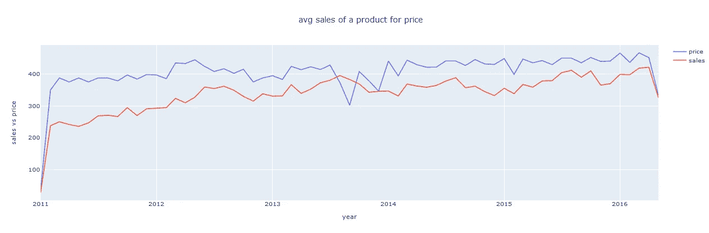

# M5-预测-准确性

> 原文：<https://medium.com/analytics-vidhya/m5-forecasting-accuracy-3668d6103130?source=collection_archive---------3----------------------->

估计沃尔玛零售商品的单位销售额


# 目录:

1.  商业问题
2.  数据集
3.  用最大似然法解决问题
4.  绩效指标
5.  探索性数据分析
6.  基线模型
7.  特征工程和数据预处理
8.  机器学习模型
9.  部署
10.  未来的工作
11.  参考
12.  结束注释

# 1.商业问题

**1.1 描述**

在当今竞争异常激烈的商业环境中，每个人都想增加自己的收入/销售额。作为一个整体，我们听说过招聘新员工时的战略规划，但你真的知道你到底什么时候需要扩大你的团队，开始你的下一个促销活动或推出你的新产品吗？对于所有这些事情，销售预测已经完成。基本上，这是一个利用历史销售数据来估计未来短期或长期销售的过程。

**1.2 比赛背景**

尼科西亚大学的 Makridakis 开放预测中心(MOFC)进行前沿预测研究，并提供商业预测培训。它帮助公司实现准确的预测，估计不确定性水平，避免代价高昂的错误，并应用最佳预测实践。商务部因其 Makridakis 竞赛而闻名，第一次竞赛于 20 世纪 80 年代举行。

在第五次迭代的竞赛中，您将使用全球收入最大的公司沃尔玛的分层销售数据来预测未来 28 天的日销售额。

**1.3 目标:**

主要目的是尽可能精确地估计沃尔玛在美国销售的各种产品的单位销售额预测值，从而帮助不同的沃尔玛商店增加收入。

# 2.资料组

这个问题的数据可以从下面的链接下载[https://www.kaggle.com/c/m5-forecasting-accuracy/data](https://www.kaggle.com/c/m5-forecasting-accuracy/data)

**2.1 数据概述:**

它使用沃尔玛慷慨提供的分层销售数据，从商品层面开始，汇总到美国三个地理区域的部门、产品类别和商店:加利福尼亚、德克萨斯和威斯康星。除了时间序列数据，它还包括解释变量，如价格、促销、星期几和特殊事件。

简而言之，数据集涉及 *3，049 种产品的单位销售额，分为 3 个产品类别(爱好、食品和家庭)和 7 个产品部门*，产品在位于三个州(CA、TX 和 WI)的 10 家商店销售。

提供的数据集包含从 2011 年 1 月 29 日到 2016 年 4 月 22 日的 5 年销售数据。


**数据概述**

我们收到了以下 CSV 文件:

1.  `**calendar.csv**`:包含产品销售日期的信息。
2.  `**sales_train_evaluation.csv**`:包含每个产品和商店的历史每日单位销售数据。
3.  `**sell_prices.csv**`:包含每个商店和日期销售的产品的价格信息。
4.  `**sample_submission.csv**`:提交的正确格式。

演职员表:[M5-指导方针](https://mk0mcompetitiont8ake.kinstacdn.com/wp-content/uploads/2020/01/M5-Guidelines.pdf)

# 3.用最大似然法解决问题

我们正在解决的问题是一个时间序列问题，我们可以通过对原始时间序列数据执行特征工程来将其转化为监督学习问题。然后，我们可以将这些特征用作输入变量，将“商品销售额”用作输出变量。这样我们就可以解决使用机器学习回归模型来预测时间序列数据的问题。

# 4.绩效指标

M5 竞赛提供了均方根标度误差度量，其数学函数如下所示。


其中，Yₜ是所考察的时间序列在 t 点的实际未来值

Ŷₜ生成的预测

n-训练样本的长度(历史观察值的数量), h-预测范围

WRMSSE 分数越低越好

# 5.探索性数据分析

> **要通过机器学习解决问题，首先，我们必须了解数据，这是一种被称为探索性数据分析的重要方法。**

所以，首先从数据的分类及其分布开始


在 3049 种独特产品中，约 47%(1437 种)的产品属于食品类，34%(1047 种)属于家用类，剩余的 18.5%(565 种)产品属于爱好类。因此，在给定的数据中，有许多产品与食品相关

> **现在，将检查从第 1 天到最后一天的每日销售额，以找到模式**


**外卖:**

1.首先观察到的是这种模式，每年都有相同的模式。

2.与 2011 年和 2016 年相比，年销售额增长缓慢，但增幅高达 60k

3.每年年底，销售额都会急剧下降。

> **由于数据是分层格式的，所以让我们对每一层进行数据分析，以便清楚地了解每个部门，即州、商店、类别和部门**

## 5.1 状态划分分析:

**a .每个州的日销售额**


**拿走:**

1.加利福尼亚州的销售量比其他两个州都多。

2.德克萨斯州和威斯康星州的销售模式几乎相同，因此在这些州，销售范围几乎相同。

3.在加州，销售额略有增加，但在其他两个州，销售额几乎每年都处于相同的水平，每年年底销售额都在下降。

**b .每个州的月销售额:**


**带走:**

1.首先，加州的销售额超过了两个州。

2.在加州，直到 2014 年，销售额有所增加，但在 2014 年至 2015 年期间略有下降，2015 年后销售额趋于增加，德克萨斯州和威斯康星州的销售额与 2013 年几乎相同。

3.从 2013 年到 2015 年年中，WI 的销售额一直保持稳定，之后略有增长。

**c .各州总销售额:**


**拿走:**

1.  加利福尼亚州的销售额很高，接近 3000 万，而德克萨斯州和威斯康星州的销售额几乎相同。
2.  加利福尼亚州记录了 43%的销售额，比其他两个州高出约 10%。
3.  因此，加州比其他州有更高和更好的销量。

**d .各州销售:**


**拿走:**

1.  在加州，近 70%的销售发生在食品类，很少销售发生在爱好类。
2.  在所有的州，食品类的销售额较高，而家庭类的销售额很低，每个州几乎都在下降，每个类别的销售额分布相同。

## 5.2 店铺划分分析

**a .各店铺产品的供货情况:**


**拿走:**

每个商店包含相同数量的产品，并且所有商店的三个产品类别的分布相同。

**b .各店销售额:**


**拿走:**

1.  几乎 17%的销售发生在 ca_3 商店。
2.  平均而言，其余商店的销售额占每家商店销售额的 8%。
3.  每个州的所有商店的销售百分比几乎相同，略有不同，但只有加利福尼亚州的商店的销售百分比不同。

## 5.3 类别划分分析

**答:每个品类的月销售额:**


**拿走:**

1.大量销售发生在食品上，也就是说，许多人消费食品多于其他商品。

2.食品销售有很多起伏，但与 2011 年相比，销售情况有所改善。

3.业余爱好产品的销量很低，而且每年都有持续的销售，家庭用品的销量与食品销量相比没有太大的差异。

**b .每个类别的总销售额:**


**拿走:**

1.总共有 68%的食品被售出，只有很少的爱好被售出。

2.只有 22%家庭用品售出。

## 5.4 部门划分分析

**a .各部门产品数量**


**拿走:**

1.正如我们看到的，食品在数据中更多地出现在各个部门，我们在每个部门都有不同数量的产品

2.在食品部，食品 3 部的产品数量较多，而食品 2 部和食品 1 部的产品数量较少。

3 .我们总共有 10470 种家用产品，它有两个部门，每个部门几乎有 50%的产品。

4 .爱好产品的存储数量非常少，它有两个部门，其中部门 1 的产品比部门 2 多。

**b .各部门总销售额**


**带走:**

1.近 50%的销售额来自食品部。

2.除了食品部，甚至我们在家庭中储存的物品比 2 个食品部都多，更多的产品在食品部出售，只有 0.81%的爱好被出售。

> **我们检查了每个级别的销售额，这样我们就可以大致了解每个州、商店、类别和部门的销售额波动情况**

## 5.5 所有州中最畅销的产品


**拿走:**

1.在所有州中，FOODS_3_090 商品的销售额接近 100 万英镑。

2.FOODS_3_586 项目的销售额也比 FOODS_3_090 高约 100 万英镑。

十大畅销商品是一个食品类别，所以在每个州，食品比其他类别产生更多的收入。

## **5.6 考虑价格的分析**

**答:每个类别的平均价格:**


**拿走:**

1.平均而言，食品的平均价格低于其他产品。

2.家庭和爱好的平均价格几乎是食品价格的 2 倍。

由于食品平均价格较低，这也可能是食品销售较高的一个原因。

**b .每月给定价格的高销量产品的平均销售额**

检查高销量商品的价格和平均销售波动，如食品 _3_090



**拿走:**

1.在某些时候，当价格下降时，我们可以观察到平均销售额略有增加。

2.在 2013 年至 2014 年期间，由于该产品价格较低，销售额会突然上升，因此销售额也可能取决于该产品的价格。

> **现在，我们将对活动日、工作日进行一些分析，以了解这些天的收入变化情况。**

## 5.7 工作日平均销售额


**拿走:**

1.许多销售大多发生在周日、周六和周五，与除周末之外的其他日子相比，销售额也很高。

2.低销售额发生在星期二、星期三和星期四。

## 5.8**事件类型的平均销售额:**


**拿走:**

1.  体育赛事的销售额略高于其他全国性赛事，但低于其他赛事。
2.  即使在没有活动的日子，销售也几乎出现在有活动的日子，所以我们不能得到一个确切的结论，即销售可能在有活动的日子发生得更多。

# 6.基线模型

因为销售是这个问题的关键因素，所以我将只把销售作为一个特征，即我们的数据集有 d1 到 d1941 的销售。因此，我们只需要将 1941 列作为数据。

我们需要正确预测未来 28 天的销售额，因此我们使用随机森林作为基础模型，并将输出变量作为 28 列(日销售额)，这样我们就可以预测 1941 天之后的销售额。

现在我们将考虑 1000 天的销售额

```
d_cols =[i for i in sales.columns if 'd_' in i] #d_1,d_2....
train_start=1000
train_end=1913–28**#train data:**
x_train_cols=d_cols[train_start:train_end]
y_train_cols=d_cols[train_end:train_end+28]X_train=sales[x_train_cols] #upto 1886
y_train=sales[y_train_cols] #1886 to 1913 **#validation data:**
x_val_cols=d_cols[train_start+28:train_end+28]
y_val_cols=d_cols[train_end+28:]X_val=sales[x_val_cols] #upto 1913
y_val=sales[y_val_cols] #1913 to 1941**#test_data:** x_test=d_cols[train_start+28+28:]X_test=sales[x_test] #upto 1941

**#So now we going to predict the next 28 days i.e after 1941 day by sending the xtest into the random forest model**
```

**输出:**


**关键 _ 外卖:**

对于这个基本模型输出，我们得到了 0.85 的私人分数。只是只有销售为特色，没有任何额外的功能，我们得到了一个低体面的分数。因此，我们需要添加现有的功能，也通过一些功能工程，我们可以更好地降低分数。而且很明显，销售作为特征在获得更好的模型中起着更重要的作用，所以如果我们通过使用一些特征工程技术来建立基于销售的新特征，我们可以获得良好的结果。

# **7。特征工程&数据预处理**

> 在基本模型中，我们只将销售额作为特征，而输出变量(y)包含 28 个变量，因此，当给定一个产品在 28 天之前的销售额时，它预测未来 28 天的销售额，但这里我们没有使用其他数据，如日历特征、销售价格列。因此，提出这种时间序列数据的一种有效方法是将给定数据作为单个数据集重新构建到监督学习中，即输出变量仅包含销售额，其余所有特征作为输入，因此这里输出变量(y)将仅预测给定产品细节的一天销售额。

1.  首先，我们需要通过结合销售数据，日历数据，价格数据创建一个单一的数据框架。这可以通过 melt(将宽数据格式转换为长数据格式)和合并所有其他数据集来完成。

***融化前:***


***融化后:***


因此，melt 帮助我们将问题转化为精确的回归问题，将销售列作为输出变量，即 y，这样我们就可以将回归模型拟合到该数据。

2.然后，我们需要通过均值插补技术处理来自销售价格数据的缺失值。我们不采用简单的平均价格，而是采用与商店相关的平均价格，因为价格可能会因商店而异。

```
final[‘sell_price’].fillna(final.groupby([‘store_id’,’item_id’])[‘sell_price’].transform(‘mean’),inplace=True)
```

3.通过用它们的分类代码替换它们来转换所有的分类特征。

```
for i in final.columns:
 if str(final[i].dtype)==’category’:
 final[i] = final[i].cat.codes
```

**添加新功能:**

> 从原始时间序列数据中提取特征在更好地预测销售中起着重要的作用。这里，我们需要创建一些重要的特性来帮助模型给出好的结果。因此，简单地创建一个特征并不能改善我们的模型，我们必须引入有意义的特征，否则如果我们得到了许多不必要的特征，我们有时可能会过度拟合，也会使模型性能变得最差。

**a .滞后特征**

因为这是一个时间序列问题，所以我引入了一些时间序列相关的特性，如滞后特性。因为我们要处理未来 28 天的预测，所以我引入了 28 到 56 天的滞后，即[28，30，35，42，49，56]。

**b .假期和周末特征:**

从 EDA 中，我们看到销售在周末和活动日受到的影响更大。因此，我引入了基于周末的特性，即周六和周日。同样，从美国日历中，我得到了假期的日期和标签 1，如果是假期，则为 0。

```
**#weekend feature:**
weekends= [‘Saturday’, ‘Sunday’]
def if_weekends(x):
 if x in weekends:
 return 1
 else:
 return 0calender['if_weekend']=calender['weekday'].apply(if_weekends)**#holiday feature:**
```

**c .基于销售的特征:**

因为销售是这个问题的重要因素。因此，我根据每个级别的销售额介绍了一些功能。已经基于为每个项目、商店、州以及类别产生平均收入产生了一些特征。Like wise 根据每个商店和州发生的收入为每个商品生成了另外两个特性。通过这些功能，我们可以了解每个部门的收入情况。

```
def mean_price(input,target):
 final[target]=final.groupby(input)[‘sell_price’].transform(‘mean’).astype(np.float16)mean_price(‘item_id’,’item_price_avg’)
mean_price(‘store_id’,’avg_pric_storewis’)
mean_price(‘state_id’,’avg_pri_statewis’)
mean_price(‘cat_id’,’avg_price_catwis’)
mean_price([‘item_id’,’store_id’],’avg_price_store_item’)
mean_price([‘item_id’,’state_id’],’avg_price_state_item’)
```

# 8.机器学习模型

应用不同的机器学习算法来检查哪种算法更适合我们的数据

1.  线性回归
2.  岭回归量
3.  随机森林回归量
4.  LGBM
5.  XG 增强回归器

在训练模型之前，我们需要将数据分为训练、测试和验证数据，即训练日(1–1913)销售、验证日(1914–1941)销售和测试日(1942–1969)。

在所有模型中，轻型 gbm 给出了低 rmse。因此，lgbm 被认为是最终模型，我们将在这个模型上训练数据。该模型用于预测未来 28 天的销售额，即测试数据。

在训练模型和测量性能指标后，我们需要预测未知数据的销售额。最后，我们需要生成一个适合 Kaggle 提交的 CSV 文件。

收到的所有模型的最终得分如下:


从上面的私人领导委员会分数中，我们观察到在所有模型中，轻型 gbm 模型表现良好，因为它以较低的分数(WRMSSE)=0.64566 的私人分数预测销售，在 **5558** 参与者中排名 **286** ，并在**前 5%** 中排名第一。

# 9.部署

在使用 light gbm 训练模型之后，我使用 flask API 通过构建最终管道进行了部署，该管道将输入作为特定产品的 item_id 和 store_id，并预测该产品在未来 28 天(即 1942 年至 1969 年)的**销售额**。

# 10.参考

 [## M5 竞赛

### M 比赛中最新的 M5 比赛于 2020 年 3 月 2 日至 6 月 30 日举行。它不同于以前的…

中国商务部](https://mofc.unic.ac.cy/m5-competition/) 

[https://mofc . UNIC . AC . cy/WP-content/uploads/2020/03/M5-竞争对手-指南-决赛-10-3-2020 . docx](https://mofc.unic.ac.cy/wp-content/uploads/2020/03/M5-Competitors-Guide-Final-10-March-2020.docx)

[](https://www.appliedaicourse.com/) [## 应用根

### 我们知道转行是多么具有挑战性。我们的应用人工智能/机器学习课程被设计为整体学习…

www.appliedaicourse.com](https://www.appliedaicourse.com/) [](https://www.analyticsvidhya.com/blog/2019/12/6-powerful-feature-engineering-techniques-time-series/) [## 时间序列数据的特征工程技术

### 特征工程是每个数据科学家都应该知道如何执行的技能，尤其是在时间序列的情况下…

www.analyticsvidhya.com](https://www.analyticsvidhya.com/blog/2019/12/6-powerful-feature-engineering-techniques-time-series/) [](https://www.kaggle.com/c/m5-forecasting-accuracy/discussion/135388) [## M5 预测-准确性

### 估计沃尔玛零售商品的单位销售额

www.kaggle.com](https://www.kaggle.com/c/m5-forecasting-accuracy/discussion/135388) 

# 11.未来的工作

1.  尝试任何深度学习技术，如 lstm 模型。
2.  因为我从第 1500 天开始计算销售额，所以用性能更好的模型来计算整个数据可能会得到好的结果。
3.  根据可提高模型性能的要素重要性创建少量新要素。

# **12。结束注释**

我要感谢应用人工智能团队的支持和指导，帮助我成功地完成了这个案例研究。

你可以在我的 Github [这里](https://github.com/Naveenrajuu/Sales-Forecasting-for-next-28-days)找到完整的代码