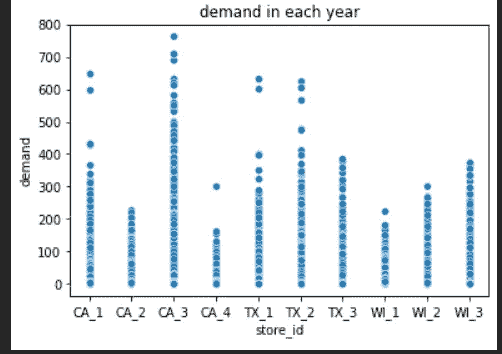

# M5 预测—准确性

> 原文：<https://medium.com/analytics-vidhya/m5-forecasting-accuracy-9fbbb28e0e6f?source=collection_archive---------2----------------------->

## 估计沃尔玛零售商品的单位销售额

[https://mofc.unic.ac.cy/launch-m5-forecasting-competition/](https://mofc.unic.ac.cy/launch-m5-forecasting-competition/)

# **目录:**

1.  商业问题
2.  数据来源
3.  为什么是最大似然法，为什么不是正常的统计方法
4.  性能指标
5.  解决问题的现有方法
6.  探索性数据分析
7.  第一次切割溶液
8.  模型解释
9.  模型比较
10.  未来的工作
11.  参考

# **商业问题**

在网上商店的时代，了解任何产品在不久的将来的需求变得必不可少。这将有助于商店储存在不久的将来需求量会很高的产品。如果我们能够这样做，将直接提高公司的收入。

也就是说*如果我们下周有活动，根据活动*，某些产品的销量肯定会增加。

# 数据来源

[https://www . best designs . co/uploads/inspiration _ images/4350/990 _ _ 1511457498 _ 404 _ Walmart . png](https://www.bestdesigns.co/uploads/inspiration_images/4350/990__1511457498_404_walmart.png)

为了解决这个问题，我们将使用来自 Kaggle 的 [M5 预测-精确度](https://www.kaggle.com/c/m5-forecasting-accuracy)数据。这是一项由沃尔玛在 Kaggle 上举办的比赛，旨在预测未来 28 天的产品销售情况。

## 数据集概述

这是 [*层次时间序列预测*](https://otexts.com/fpp2/hts.html) ，我们需要预测给定商品未来 28 天的每日销售额。数据集由沃尔玛提供，*涵盖美国三个州(加利福尼亚州、德克萨斯州和威斯康星州)*的商店，包括*商品级别、部门、产品类别和商店详情*。此外，它还有解释变量，如价格、促销、星期几和特殊事件。数据集包括*3049 种产品的单位销售额，分为 3 个产品类别(爱好、食品和家庭)和 7 个产品部门*，其中上述类别被细分。这些产品在位于三个州(加利福尼亚州、德克萨斯州和威斯康星州)的十家商店销售

我们给出了 CSV 格式的 3 个数据框架日历、销售培训评估和销售价格。我们还在 sample_submission.csv 中给出了 Kaggle 提交的格式

**calendar.csv** —包含产品销售日期的信息。

● **sell_prices.csv** —包含关于每个商店和日期销售的产品价格的信息。

●**sales _ train _ evaluation . CSV**—包含每个产品和商店的历史每日单位销售数据[d_1 — d_1941]

●**sample _ submission . CSV**—提交的正确格式。

# 为什么是最大似然法，为什么不是正常的统计方法

当我们有一个单变量数据集或一步预测时，统计方法可以很好地执行。已经看到，对于多步预测，ML 方法工作良好。

# **性能指标**

我们将使用 **RMSE(均方根误差)**来评估我们的模型。当我们更关心预测时，RMSE 是一个很好的度量。它是平均平方误差的平方根。

[https://media . geeks forgeeks . org/WP-content/uploads/20200622171741/RMSE 1 . jpg](https://media.geeksforgeeks.org/wp-content/uploads/20200622171741/RMSE1.jpg)

RMSE 更重视最显著的错误。如果在需求上有一点小小的误差，我们的 RMSE 就会显著增加。

# 解决这个问题的现有方法

我们将看到前两个解决方案讨论不[*M5 准确性竞赛:结果、发现和结论*](https://www.researchgate.net/profile/Evangelos-Spiliotis/publication/344487258_The_M5_Accuracy_competition_Results_findings_and_conclusions/links/5f7c0258458515b7cf6a25e2/The-M5-Accuracy-competition-Results-findings-and-conclusions.pdf)

## **第一个放置的解决方案:**

a.他使用各种 LightGBM 模型的同等加权组合。

b.训练模型使用每个商店(10 个模型)、商店类别(30 个模型)和商店部门(70 个模型)的数据来生成产品商店系列的预测。

c.建立了 220 个模型，每个系列平均用 6 个模型进行预测，其中包括每种类型模型的两个变体，递归和非递归。

d.这些模型考虑了各种标识符、日历相关信息、特殊事件、促销、价格和单位销售数据，包括递归和非递归格式。

e.使用 CV 可用数据的最后四个 28 天窗口，并通过测量单个模型及其组合产生的误差的平均值和标准偏差，对该方法进行了微调。

f.之所以选择最终解决方案，是因为它提供了准确而稳健的预测。

## 第二名解决方案:

a.这种方法也使用等权重 LightGBM 模型，但是，根据 N-BEATS 产生的预测，通过乘数进行外部调整。

b.共训练了 50 个模型，首先训练每个商店的 10 个模型，然后使用五个不同的乘数来调整他们的预测。

c.LightGBM 模型仅使用关于日历效果和价格的一些基本特征进行训练(不考虑过去的单位销售)，而 N-BEATS 模型仅基于历史单位销售。

## 改进:

第一名和第二名获奖者使用了论文中讨论的解决方案。他们的解决方案非常好，但主要问题是当您使用非常低端的设备时，理解和实施起来太复杂了。正如我们已经讨论过的，数据集非常庞大。我们将尝试实现一个简单的解决方案，并取得一些好成绩。

## 向下投射数据

在向下转换函数中，我们检查数据框对象类型，并将其更改为低内存需求类型。也就是说，熊猫创建 64 位整数值，所以我们的向下转换将把它变成 8 位。

## 合并数据

我们给出了 3 个数据帧日历、销售培训评估和销售价格，它们没有唯一的 *列*，以将销售培训评估合并到日历和销售价格中。首先，让我们看看每个数据框:

日历的前 5 个值

销售 _ 培训 _ 评估的五大价值

sell_price 的前 5 个值

我们可以合并 item_id 上的 sell_price 和 sale_train_evaluation，但是如果我们看到日历，就没有我们添加的列。因此，我们将在 sale_train_evaluation 中创建两个新列' *d'* 和' *demand '。其中“ *d* ”将是从 *d_1 到 d_1941* 的天数，在熊猫融化功能的帮助下，将帮助将列变为行。*和需求*会给出当天某个特定物品的需求。*

合并数据后，我们的数据框将如下所示

# 探索性数据分析

*   **每个州有多少家商店？(州有更多的卖家，哪个州有更多的商店)**

我们在加利福尼亚州、德克萨斯州和威斯康星州有 23672436、17754327、17754327 家商店的数据

*   **每个类别的产品数量？**

我们有 27892170，10966650，2032270 来自食品、爱好和家居的产品

*   **工作日需求**

与其他日子相比，我们在星期六和星期天有更多的需求。

*   **各门店需求**

与 WI 相比，位于加州和德克萨斯州的商店有更多需求

*   **销售价格和需求的相互关系**

1 .需求和销售价格之间存在负相关关系。2.我们可以说，如果价格高，需求就会低，反之亦然

*   **在工作日和有事件时出售类型 1**

*   **2011-2016 年各年需求**

*观察:*

1.  每年圣诞节都没有或者很少。
2.  我们的数据有季节性。每年都会重复。

## 最终观察

*   与 WI 相比，CA 和 TX 对产品有更多需求。
*   我们一年中允许抢购的日子很少。
*   需求和销售价格都呈下降趋势。
*   我们对国家和宗教事件有更高的要求。
*   我们食品部的产品多，爱好部的产品少。
*   周六周日需求高。
*   文化事件和国家事件有更多的需求。
*   Snap_purchasing 不会产生任何重大影响。
*   如果有什么大事发生，需求肯定会增加。
*   每年圣诞节都没有或很少出售。
*   我们的数据有季节性。每年都会重复。

# 第一次切割溶液

**处理缺失值:**

1.  事件类型 1 和事件类型 2 事件名称 1 和事件名称 2 缺少 91%和 99%的值。我们将创建一个新的类别作为 new_event，并将填充所有的空值。

2.销售价格缺少值，我们可以使用 pandas 的插值方法来填充 nan 值

**数据准备**

为了准备数据，我们将遵循以下步骤:

*   融化 sale_train_eval 并将其降级
*   使用 sample_submission 创建在 Kaggle 上提交预测的格式
*   按天拆分数据
*   创建一个新列作为包含我们的 train、test1 和 test2 的部分

*   从日历中删除“工作日”、“星期”、“月”、“年”
*   将数据与日历和销售价格合并

如果一切顺利，我们将在最终文件中获得 60034810 行。

# 特征工程

1.对于“事件 _ 名称 _1”，“事件 _ 类型 _1”，“事件 _ 名称 _2”和“事件 _ 类型 _2”将检查空值并填充 no_event，然后标记编码
2。对于状态标识、商店标识、分类标识、部门标识、项目标识，将直接标记编码

3.更改数据框中的日期列类型

4.**滞后特性:**从 28 天到 30 天 3 天轮班。

*   这里，我们将创建 3 个新特性 lag_28、lag_29 和 lag_30，它们分别是第 28、29 和 30 天的班次。

5.**滚动:**取一组 n(此处为 7 天)，取其平均值。

6.填充由滚动和滞后特征创建的所有 nan 值

7.分割数据

# 模型

1.  **XGBoost :** XGBoost 代表“极限梯度提升”。这是梯度推进的有效实现，可用于回归预测建模。

→我们的 val rmse 分数是 13。59860 . 68888886861

2. **XGboost 无额外功能**

→我们的 val rmse 分数是 13。59860 . 68888888861

3. **LightGBM :** Light GBM 是基于树的梯度推进算法。它垂直生长树。因为它的速度很快，所以被冠以“光”的前缀。它可以处理大规模的数据，空值，并采取较低的内存运行。

→我们的 rmse 分数是 5.1。58580.88888888861

4.**堆叠:**堆叠是一种集成学习技术，通过元分类器组合多个分类模型。基于完整的训练集训练个体分类模型；然后，基于集成中各个分类模型的输出(元特征)来拟合元分类器。

→我们的 rmse 分数是 5 . 8550 . 858888886886

5. **Adaboost:** AdaBoost 也是一种元算法，它帮助我们将多个“弱分类器”组合成单个“强分类器”。

→ rmse 得分为 8.1126887 . 48687868881

# 模型比较

# 未来的工作

1.  添加更多的功能可以带来好的结果。
2.  像 LSTM 或 FB prophet 这样的深度学习方法。

# 参考

*   [https://www . ka ggle . com/anshuls 235/time-series-forecasting-EDA-Fe-modeling/notebook](https://www.kaggle.com/anshuls235/time-series-forecasting-eda-fe-modelling/notebook)
*   [https://www . ka ggle . com/c/M5-预测-准确性/讨论/143070](https://www.kaggle.com/c/m5-forecasting-accuracy/discussion/143070)
*   [https://www . ka ggle . com/c/M5-预测-准确性/讨论/133468](https://www.kaggle.com/c/m5-forecasting-accuracy/discussion/133468)
*   [https://www . ka ggle . com/c/M5-预测-准确性/讨论/133834](https://www.kaggle.com/c/m5-forecasting-accuracy/discussion/133834)
*   [https://lightgbm.readthedocs.io/en/latest/index.html](https://lightgbm.readthedocs.io/en/latest/index.html)
*   [https://otexts.com/fpp2/intro.html](https://otexts.com/fpp2/intro.html)
*   [http://rasbt . github . io/mlx tend/user _ guide/classifier/stacking classifier/](http://rasbt.github.io/mlxtend/user_guide/classifier/StackingClassifier/)
*   [https://towards data science . com/what-makes-light GBM-lightning-fast-a 27 cf0 d 9785 e](https://towardsdatascience.com/what-makes-lightgbm-lightning-fast-a27cf0d9785e)
*   [https://machinelearningmastery.com/xgboost-for-regression/](https://machinelearningmastery.com/xgboost-for-regression/)
*   https://www.appliedaicourse.com/

## **笔记本链接:**

*   [https://github.com/namratesh/M5-forecasting/](https://github.com/namratesh/M5-forecasting/)

Linkedin 个人资料:

[www.linkedin.com/in/namratesh](http://www.linkedin.com/in/namratesh)