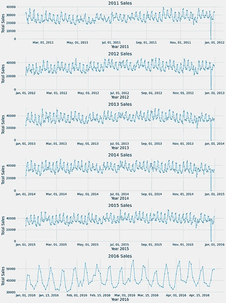

# M5 预测-准确性

> 原文：<https://medium.com/analytics-vidhya/m5-forecasting-accuracy-ad0d01a79b8e?source=collection_archive---------5----------------------->

## 估计沃尔玛零售商品的单位销售额

## **目录:**

1.  商业/现实世界的问题
2.  问题陈述
3.  数据来源和数据概述
4.  最大似然法在问题中的应用
5.  性能指标
6.  探索性数据分析
7.  现有方法
8.  第一次切割溶液
9.  特征工程和数据预处理
10.  模型解释
11.  模型比较
12.  Kaggle 提交
13.  部署
14.  未来的工作
15.  参考

# **1。业务问题:**

销售预测是通过使用历史销售数字来估计未来短期或长期销售的过程。预测销售对于公司来说是至关重要的，例如，投资新的方法来增加他们产品的收入，这可能会导致未来通过促销/折扣等方式的低销售额。因此，对于已建立的企业来说，准确预测未来的销售变得非常重要。

# **2。问题陈述:**

使用世界上收入最大的公司沃尔玛的历史销售数据，我们需要预测未来 28 天的日销售额。

这个问题由尼科西亚大学的 Makridakis 开放预测中心(MOFC)在 Kaggle 上主持，该中心进行前沿预测研究。商务部因其 Makridakis 竞赛而闻名，第一次竞赛于 20 世纪 80 年代举行。(M5 预测)是第五次迭代，我们使用沃尔玛的分层销售数据来预测未来 28 天的日销售额。

# **3。数据来源及数据概述:**

数据是从 Kaggle 下载的。[来源](https://www.kaggle.com/c/m5-forecasting-accuracy/data)

## **3.1 数据概述:**

沃尔玛提供的销售数据涵盖了美国三个州(加利福尼亚州、德克萨斯州和威斯康星州)的商店，包括商品级别、部门、产品类别和商店详细信息。此外，它还有解释变量，如价格、促销、星期几和特殊事件。

下面流程图中的高级 M5 系列组织概述。

M5 系列组织概述

数据主要分为 3 个文件:

1.  calender . CSV——包含产品销售日期以及日期行为的信息(例如:月、年、星期、该日期的任何特殊事件)。
2.  sales_train_evaluation.csv —包含历史每日单位销售额([包括从 d_1 到 d_1941]，即从**2011–01–29**到**2016–05–22**)。)每个产品和商店的数据
3.  sell _ prices.csv 包含每个商店和日期销售的产品的价格信息。

# **4。在问题上使用 ML:**

我们正在解决的问题是一个时间序列问题，我们可以通过对原始时间序列数据执行特征工程来将其转化为监督学习问题。然后，我们可以将这些特征用作输入变量，将“商品销售额”用作输出变量(实数)，并使用机器学习回归模型解决预测问题。

# **5。性能指标:**

在基于回归的问题中，一个常用的度量是 RMSE。这里，我们使用自定义指标 WRMSSE 作为这个问题的评估指标。它被定义为:

其中，Y_t 是所检查的时间序列在 t 点的实际未来销售额，(Y_t )^是从模型生成的预测销售额，n 是训练样本的长度(历史观察值的数量)，h 是预测范围(28 天)。

# **6。探索性数据分析:**

解决机器学习问题的第一步是从数据中获得洞察力。让我们从分析数据开始，如果有任何需要预处理的缺失值，得出关于特定功能如何影响我们的目标销售的有意义的结论。

## **6.1。数据概述:**

每个文件的样本数据点

## **6.2。所有商店的总销售额每日和每年模式:**

**观察:**

1.  从 2011 年到 2016 年，总销售额略有上升趋势，每年的 1 月 1 日，我们观察到零销售额(我们可以观察到商店在除夕关门)。
2.  不同年份的总销售额有相似的模式，并且有年度季节性。
3.  从 2012 年到 2015 年的总销售额，我们观察到每个 2 个月的销售额都有相似的模式，由此我们可以假设 2012 年到 2015 年每年的时间序列是平稳的时间序列。

## **6.3。销售比例:**

**观察:**

1.  在这三个州中，加利福尼亚州占总销售额的比例很高，得克萨斯州和威斯康星州的总销售额几乎相等。
2.  尽管加利福尼亚州占总销售额的 43.6%，但有趣的是，其 2 家商店的总销售额位于倒数第四，CA_3 商店的销售额最高，CA_4 商店的销售额最低。
3.  食品类销售占比最高，爱好类最低。可以得出结论，人们购物更多的是出于家庭需要，而不是他们的爱好，食品是必需品，因此销售额也很高。
4.  销售额最高的是“食品 _3”部门，最低的是“爱好 _2”部门。仅'食品 _3 '部门就占了 50%销售比例，其他 6 个部门占了剩余 50%销售。尽管“爱好”类别的总销售额非常少(9.3%)，但有趣的是，与食品类别的“食品 _1”部门相比，其部门“爱好 _1”的销售额很高。

## **6.4。状态和产品类别与销售比例:**

**观察:**

1.  所有三个州的三种产品类别的销售比例相似。德克萨斯州和威斯康星州的食品类销售比例相同。
2.  在所有 3 个州中，食品类别的销售额较高，而爱好的销售额最低。德克萨斯和威斯康星两个州的业余爱好产品类别的销售比例相似。

## **6.5。年份和产品类别与销售比例:**

**观察:**

1.  2015 年销量最高，2016 年销量最低(仅提供 4 个月销量)。
2.  在这三个类别中，食品类别的销售额在所有年份都较高。2013 年和 2014 年，食品、家居和业余爱好销售额相同。
3.  从 2012 年到 2015 年，食品类的销售额没有太大差异。

## **6.6。单品类日总销售额:**

**观察:**

1.  食品类的日总销售额最高，并呈上升趋势(销售额逐年增加)
2.  家庭类的每日总销售额也呈上升趋势，而爱好类的销售额最少，并且多年来几乎保持不变。

## **6.7。销量最高的 10 大产品:**

**观察:**

1.  我们观察到销售额最高的前 10 个产品是食品(因为食品是必不可少的)。
2.  首先，最高销售额是来自'加利福尼亚'州' CA_3 '商店产品'食品 _3_090_CA_3 ',第二高销售额是来自'得克萨斯'州' TX_2 '商店产品'食品 _3_586_TX_2 ',第三高销售额是来自'得克萨斯'州' TX_3 '商店产品'食品 _3_586_TX_3'。
3.  威斯康星州“WI_3”商店的“FOODS_3_090_WI_3”产品销售额排名第六。
4.  有趣的是，尽管加州在沃尔玛的销售比例更高，但德克萨斯州有 6 种产品的销售额在前 10 名。

## **6.8。缺失值分析:**

**观察:**

1.  prices_data 中没有缺失值。
2.  但是这里的 sell_price 是每周提供的给定周/商店的产品价格(七天的平均值)。如果这是不可用的，这意味着该产品没有在检查的一周内售出。我们需要检查这些价格缺失的产品。
3.  CA_2 商店的物品丢失价格较高。TX_1 和 TX_2 商店的商品缺失价格百分比相等。
4.  在所有商店中，超过 17%的商品价格丢失。
5.  除了“事件”和“事件类型”列之外，所有列都没有缺失值。应当理解，如果事件 _ 名称 _ 1/事件 _ 名称 _2 是 NAN，即那天是非事件日。

## **6.9。每个产品类别和每个州的抢购与非抢购日销售比例:**

**观察:**

1.  就食品类别而言，抢购日的销售额超过了非抢购日的销售额。爱好和家用产品类别在抢购日或非抢购日的类似销售数量。
2.  SNAP 在威斯康星州的销量较高，在加利福尼亚州的销量较低。威斯康辛州的 SNAP 销量明显高于非 SNAP 销量。

## **6.10。事件对销售的影响:**

**观察:**

1.  与销售额下降的全国性赛事相比，体育赛事的销售额有所增加。
2.  体育赛事日的销售额增幅最高，文化赛事日和宗教赛事日的销售额增幅第二高。销售额保持稳定(即，平均赛事日销售额不增加或减少)。
3.  体育赛事的销售额是赛事日平均销售额的 110%，即赛事日平均销售额增长 10%。
4.  文化活动的销售额是活动日平均销售额的 108%，即活动日平均销售额增长 8%。
5.  全国性活动的销售额是活动日平均销售额的 89%，即活动日平均销售额下降了 11%。
6.  与活动日相比，非活动日的销售额更高，总的来说，销售额随着活动日的增加而下降(人们在假日购物更少)，但降幅不大。

## **6.11。一个月内从开始到结束的销售趋势:**

**观察:**

1.  显然，我们观察到月初的销售额很高，并且在这个月的前 15 天保持稳定。
2.  一个月的 15 天后，销售额逐渐下降，为月初销售额的 75%。

## **6.12。2016 年各月周末与工作日的销售额:**

**观察:**

1.  每月开始的几天销售额会更高。
2.  周末销售额在月初和月末都很高。
3.  临近月底，工作日的销售额有所下降。
4.  但是周末的销售额是一致的(在月初和月末都很高)。
5.  由此，我们可以说，销售受到周末和工作日的影响。

## **6.13。从之前的非抢购日到抢购日的相对销售额变化:**

**观察:**

1.  每个快照活动持续“15 天”，因此我们检查了从第一个快照日到 15 个快照活动日的最后 15 天的销售额变化。
2.  我们观察到，沃尔玛的快照活动(跨三个州的快照活动)总会带来销售额的增长。
3.  在这里，我们绘制了 2011 年至 2016 年期间发生的 60 次快照活动中每一次活动的相对销售变化/增长。
4.  从“2014-05-01”开始到“2014-05-15”(持续 15 天)结束的第 37 次抢购活动的销售额增幅高达 30.55%，从“2015-03-01”开始到“2015-03-15”(持续 15 天)结束的第 49 次抢购活动的销售额增幅高达 29.96%。
5.  从“2015 年 11 月 1 日”开始到“2015 年 11 月 15 日”结束的第 57 届 snap 活动的销售额增幅最小，为 3.31%。
6.  我们观察到的另一个有趣的现象是，快照事件发生在月初。

## **6.14。每个产品类别、每个州、每个商店每年产生的收入:**

**观察:**

1.  食品产品产生的收入最高，其次是家用产品，最后是业余爱好产品。88%的收入仅来自食品和家用产品。类似于各产品品类的销售占比。
2.  来自加州的收入是最高的，德克萨斯州和威斯康星州的收入份额相似。尽管威斯康星州的销售比例为 27.6%，但产生的收入为 26.3%，相反，加利福尼亚州的销售比例为 43.6%，但产生的收入增加到 45%。德克萨斯州的收入和销售比例也是 28.8%。
3.  ca3 商店产生的收入最高，ca4 商店产生的收入最低，与销售比例相同。有趣的 TX_3 商店，销售比例排名第六，但收入排名第四。相反，WI_3 商店的销售额排名第五，比例收入排名第七。
4.  德克萨斯州和加利福尼亚州，尽管一些商店的销售额较少，但收入却很高(也许这些州销售的是高价产品)。相反，在威斯康辛州，尽管销售额很高，但产生的收入相对较少(可能这里卖的食物更多，价格更低)。
5.  2015 年的收入很高。我们观察到产生的收入逐年增加。2016 年的收入较少，因为只有 4 个月的数据可用。

## **6.15。州、商店、一年的周末与工作日销售额:**

**观察:**

1.  与工作日相比，这三个州周末的销售额都很高。
2.  在加州和德克萨斯州，周日的销售额高于周六，但在威斯康星州，周日的销售额低于周六。
3.  在加利福尼亚和得克萨斯的所有商店里，周末的销售额很高，星期天的销售额比星期六高。CA_3 商店有很高的周末销售额，因为我们看到 CA_3 也有很高的收入和最高的销售比例。
4.  在威斯康辛州的所有商店，周末的销售额很高，周日的销售额比周六少。
5.  这些年来，周末销售额比工作日销售额高。2011 年和 2013 年，周六的销售额高于周日。

# **7。现有方法:**

## **7.1。获胜者的解决方案:**

[https://www . ka ggle . com/c/M5-预测-准确性/讨论/163216](https://www.kaggle.com/c/m5-forecasting-accuracy/discussion/163216)

在该解决方案中，用于训练的模型是具有 Tweedie 目标的 LightGBM。验证分割是基于时间的 5 个折叠分割，其中每个折叠 28 天的销售是使用先前的历史销售数据预测的。即，第一次折叠—列车 d1-d1577，预测 d 1578-d 1605；第二次折叠—列车 d1-d1829，预测 d 1830-d 1857；第三次折叠—列车 d1-d1857，预测 d 1858-d 1885；第四次折叠—D1-d 1885 列车，预计 d 1886-d 1913；第 5 次折叠-训练 d1-d1913，预测 d1914-d1941，然后计算每次折叠的平均值，得出误差。然后从 d1-d1941 训练最终模型，并对 d1942-d1969 的 28 天进行预测。模型分割中使用的策略适用于 10 家商店中的每一家；每周训练一个模型来预测销售额，例如:模型 m1 —预测前 7 天(F1-F7)，模型 m2 —预测后 7 天(F8-F14)，模型 m3 —预测后 7 天(F15-F21)，模型 m4 —预测后 7 天(F22-28)，即，我们总共训练 40 个模型(10 * 4) [10 对应于 10 家商店，4 表示 28 天预测范围的 4 周]。提取的特征是具有不同窗口大小的滞后特征、滚动平均值/标准差，这里用于模型 m1 的滞后特征是{lag_7，lag_8…lag_21}，m2 具有滞后特征{lag_14，lag_15，…lag_28}，m3 具有滞后特征{lag_21，lag_22，…lag_35}，m4 具有滞后特征{lag_28，lag_29，…lag_42}。

## 7.2。改进:

正如我们在 EDA 的分析中看到的，每周(七天的平均值)提供的 sell_price 值(给定周/商店的产品价格)丢失了。对于所有缺少 sell_price 值的产品，使用该产品 id 的 sell_price 平均值估算所有这些值。销售数据上的一组新要素，即沿滚动平均值要素的滚动中值要素，是由于中值不容易出现异常值而创建的。

# **8。首切解决方案:**

## **8.1。该工作日过去 4 周平均销售额的预测销售额**

从 EDA 中，我们观察到有一种每周销售模式，即一周中每个工作日的销售都有一种趋势，因为周末的销售高于工作日的销售。使用最近 4 周的火车销售数据，我们尝试计算每个工作日的平均销售额。然后根据工作日的平均销售额预测接下来 4 周的销售额。

## **8.2。移动平均线**

顾名思义，销售额是基于最近 N 天销售额的平均值进行预测的，其中“N”是超参数。在使用不同的“N”值执行超参数调整后，得出的结论是 N=35(即，以过去 35 天的平均销售额来预测给定日期的销售额)提供了更好的性能。

# **9。特征工程&数据预处理:**

1.  首先，我们通过组合销售数据、日历数据、价格数据创建一个单一的数据框架。然后通过用 id *的平均价格进行转换来预处理价格的缺失值。*
2.  从原始时间序列数据中提取特征对于模型预测销售的好坏起着重要作用。在这里，我们创建了历史销售的一些重要特征，如滞后特征、滚动特征。
3.  创建滞后功能的目的是，对于当天的产品，它可以获得前 3 个月的销售额，并有一个转移期，以便考虑 28 天的预测。常量移位滚动 agg 均值和中值特征也被创建。
4.  提取的日历数据的一些其他特征是每月的*日，2011 年的年值为 0，2012 年的年值为 1。5 对于 2016 年，一个月中某一天的周数例如:1 月 29 日对应于 1 月的第 5 周。如果那天不是周末。*
5.  使用 LabelEncoder 将分类特征转换为标签编码特征。还拆分“d”列的值，只取日数。这样，在对最终数据集应用回归模型之前，我们可以将所有要素转换为数字或标注编码的要素。

# 10。车型说明:

## **10.1。线性和基于树的模型:**

1.  在特征工程和数据预处理之后，我们剩下 5800 万个数据点，这是一个巨大的数据量。我们没有试图在如此庞大的数据规模上建立 ML 模型，而是使用过去两年的数据，即从 2014 年 1 月 1 日开始。然后，我们将数据分为基于时间的训练-CV-测试分割，如下所示:

2.对训练数据拟合具有平方损失的线性模型的 SGDRegressor，并对 CV 数据执行具有不同α(正则化项的乘数)的交叉验证，发现α= 0.1 给出较低的 WRMSSE 分数。然后根据 alpha = 0.1 的测试数据预测销售额，本地 WRMSSE 得分为 0.8931。

3.应用其他基于树的模型，如 RandomForest、LGBMRegressor、AdaBoost regressor 模型。RandomForest 致力于 bootstrap aggregation 技术，该技术涉及在不同的数据样本上训练每个 base_models(决策树),其中采样是通过替换完成的，这种方式将多个决策树结合起来确定最终输出，而不是依赖于单个决策树。LGBMRegressor 是一种梯度推进技术，因其速度快和运行时占用内存少而被冠以“Light”的前缀。AdaBoost 也是 boosting 算法，有助于将多个弱学习者合并成一个强学习者。

4.在所有这些模型的超参数调整中，观察到具有最佳超参数 n_estimators = 50，max_depth = 10 的 RandomForestRegressor 给出的局部 WRMSSE 得分为 0.7487。

具有最佳超参数 num_leaves = 125，learning_rate= 0.075 的 LGBMRegressor 本地 WRMSSE 得分为 0.6087。

具有最佳超参数的 AdaBoostRegressor n _ estimators = 50，learning_rate = 0.05 局部 WRMSSE 得分为 0.7944。

## **10.2。自定义合奏:**

1.  当我们观察到基于集成树的模型比线性模型表现得更好时，我们尝试构建如下定制集成模型:
2.  首先将整个数据集分成两个数据集，基于基于时间的分割进行训练和测试。然后，基于基于时间的分割，将训练数据集分割成另外两个半数据集 D1、D2。
3.  从数据集 D1，我们用替换进行采样，以获得 N 个数据集，并训练 N 个模型作为基础学习器。这里 N →基础学习者的数量是一个超参数。对于每个经过训练的基础学习者，我们获得 D2 预测和测试数据，并将其用作特征。
4.  我们用 X_i 作为 N 个特征来训练元模型，其中我们得到的每个单个特征都来自 D2 对每个训练好的基础学习者的预测，Y_i 是 D2 的真实值。
5.  在元模型训练之后，利用从 N 个训练过的基础学习者中提取的测试数据的 N 个特征，我们从训练过的元模型中预测销售。
6.  对不同的基础学习器、元模型和“N”→数量的基础学习器进行超参数调整，发现 XGBRegressor 作为基础学习器，LGBMRegressor 作为元模型，N = 18，给出较低的局部 WRMSSE 为 0.6995。

定制集成模型

自定义集合预测

# **11。车型对比:**

在我们的问题上尝试的模型的性能:

据观察，移动平均和线性模型的性能比天真的模型差。表现最好的模型是集合模型。

# **12。Kaggle 投稿:**

Kaggle 对每个模型的评分:

1.  从上面的私人排行榜得分，我们观察到，在所有模型中，Custom ensemble 模型表现良好，因为它能够以较低的得分(WRMSSE)=0.66282 的私人得分预测销售。
2.  一旦我们从最终的最佳定制套装模型中获得验证日(1914-1941)销售额和评估日(1942-1969)销售额，并以给定的格式提交，我们将获得排行榜分数 **0.66282** ，在 **5558** 名参与者中排名 **352** ，位列**前 7%** 。

Kaggle 排行榜最佳表现车型排名

# **13。部署:**

1.  在使用最佳超参数训练定制集合模型后，我们将基础模型和元模型存储在 pickle 文件中，并将其与围绕最终渠道构建的 flask API 一起部署到 AWS 中，最终渠道将返回预测销售额。
2.  创建网页，以 csv 或 txt 文件作为输入，并提供未来 28 天(即 2016 年 5 月 23 日至 2016 年 6 月 19 日)的预测销售额。
3.  来自商店的示例产品的预测销售额及其在 csv 文件中的历史销售额如下。

以 csv 文件为输入的 html 页面

预测销售额

**解释结果的演示视频**

# **14。未来工作:**

1.  尝试使用神经网络方法，因为它提供了各种损失函数的灵活性。
2.  用 LSTM 模型进行时间序列预测的尝试。

# **15。参考文献:**

1.  [https://www . analyticsvidhya . com/blog/2019/12/6-强力-特征-工程-技术-时间系列/](https://www.analyticsvidhya.com/blog/2019/12/6-powerful-feature-engineering-techniques-time-series/)
2.  [https://www . ka ggle . com/c/M5-预测-准确性/讨论/144067](https://www.kaggle.com/c/m5-forecasting-accuracy/discussion/144067)
3.  [https://www . ka ggle . com/dhananjay 3/wrmsse-evaluator-with-extra-features](https://www.kaggle.com/dhananjay3/wrmsse-evaluator-with-extra-features)
4.  [https://www . ka ggle . com/head sortails/back-to-predict-the-future-interactive-M5-EDA](https://www.kaggle.com/headsortails/back-to-predict-the-future-interactive-m5-eda)
5.  [https://www . ka ggle . com/c/M5-预测-准确性/讨论/163216](https://www.kaggle.com/c/m5-forecasting-accuracy/discussion/163216)
6.  [https://www . applied ai course . com/lecture/11/applied-machine-learning-online-course/3194/mapping-to-ml-problem-time-series-forecasting regression/7/module-6-machine-learning-real-world-case-studies](https://www.appliedaicourse.com/lecture/11/applied-machine-learning-online-course/3194/mapping-to-ml-problem-time-series-forecastingregression/7/module-6-machine-learning-real-world-case-studies)

完整的项目可以在这里找到 [github](https://github.com/Bharanish/M5) 。关于这个项目的任何疑问，你可以通过 [Linkedin](https://www.linkedin.com/in/bharanish-kumar-7469ba121/) 联系我。