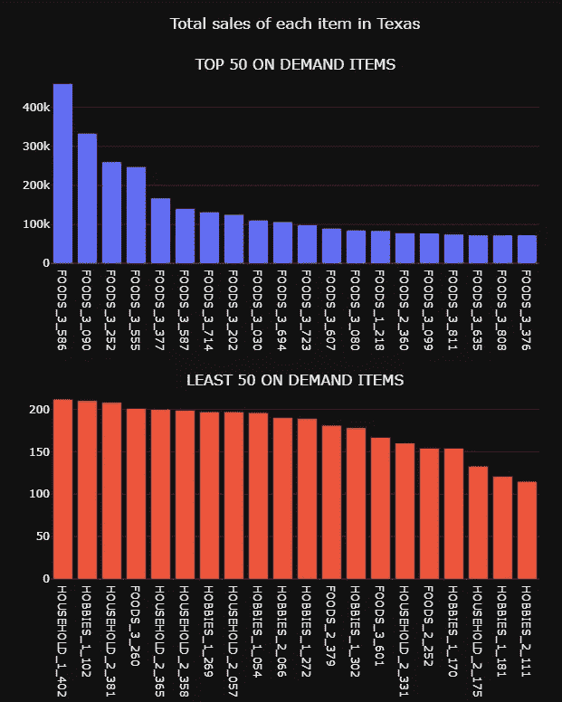
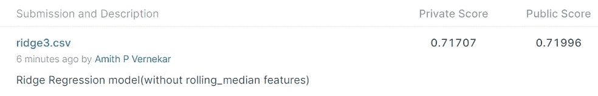
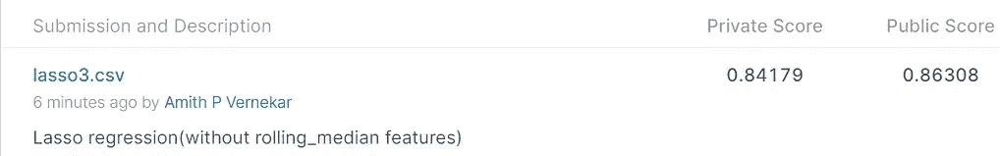
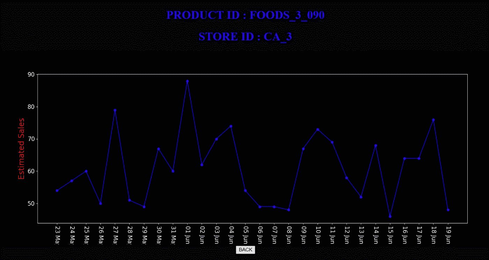

# M5 预测—准确性

> 原文：<https://medium.com/analytics-vidhya/m5-forecasting-accuracy-c5580c7883a?source=collection_archive---------4----------------------->

## *估算沃尔玛零售商品的单位销售额*

# 目录:

1.  *商业问题*
2.  *数据来源*
3.  *机器学习问题*
4.  *探索性数据分析*
5.  *特征工程&数据预处理*
6.  *模型接近*
7.  *Kaggle 提交*
8.  *部署*
9.  *未来工作*
10.  *参考文献*

# **1。商务问题:**

**1.1 概述:**

在今天竞争异常激烈的商业环境中，每个人都想增加收入/销售额。作为一个整体，我们听说过招聘新员工时的战略规划，但你真的知道你到底什么时候需要扩大你的团队，开始你的下一个促销活动或推出你的新产品吗？对于所有这些事情，销售预测已经完成。

> 那么我们是在预测未来吗？是啊！！但不那么准确。这是通过采用机器学习技术来完成的。

**预测**提供关于未来条件性质的知识。销售预测有助于每个企业做出更好的商业决策。它有助于整体业务规划、预算和风险管理。它允许公司有效地为未来增长分配资源，并管理其现金流。它还帮助企业准确地估计他们的成本和收入，并在此基础上预测他们的短期和长期业绩。

过去的销售业绩是未来销售业绩的良好先行指标。商务部因其 Makridakis 竞赛而闻名，在这个问题中，第五次迭代(M5 预测)给出了世界上最大的零售公司沃尔玛的历史销售(过去的销售)数据。

**1.2 目标:**

主要目的是尽可能精确地估计沃尔玛在美国销售的各种产品的单位销售预测，从而帮助不同的沃尔玛商店增加收入。

# 2.数据来源

本次比赛提供了沃尔玛的分层销售数据 [M5 预测-准确性](https://www.kaggle.com/c/m5-forecasting-accuracy)。

**2.1 数据概述:**

**数据组织方式概述。**

沃尔玛提供的销售数据涵盖了美国三个州(加利福尼亚州、德克萨斯州和威斯康星州)的商店，包括商品级别、部门、产品类别和商店详细信息。此外，它还有解释变量，如价格、促销、星期几和特殊事件。

1.  **Calendar.csv:** 它包含关于产品销售日期以及当天举行的活动和节目的信息。
2.  **Sales _ train _ evaluation . CSV:**它包含了从 1941 年第 1 天到第 2 天每家商店每种产品的历史每日单位销售额。
3.  **Sell_prices.csv:** 它包含每个商店每周的产品价格信息。

# 3.机器学习问题

上述问题是一个时间序列数据问题，可以使用经典的机器学习技术来解决，通过使用历史销售数据来估计特定日期的单位销售。通过使用特征工程技术，给定的时间序列数据可以被重新构造为监督学习数据集，然后可以对其应用机器学习算法。它可以使用机器学习回归模型来解决，因为输入变量是在特定日期生成的功能和售出的项目，而输出变量属于实数。

# 4.探索性数据分析

在 3049 种独特产品中，约 47%(1437 种)的产品属于食品类，34%(1047 种)属于家用类，剩余的 18.5%(565 种)产品属于爱好类。

销售额平稳增长。(上升趋势)具有重复的季节性模式。每年的 12 月份销售额下降。

我们可以清楚地看到，位于加州的商店表现良好，呈上升趋势(总销售额为 2910 万英镑)。直到 2012 年 10 月，WI 商店的月销售额低于其他商店。但在 2012 年 10 月之后，月销售额有所提高，表现与 TX 门店相似。WI 的销售额约为 1850 万，相对来说最少。

ca3 商店销售额最高，总销售额为 1130 万。尽管 WI_2 和 WI_3 的人口较少，但它们的销量相当不错。CA_4 销量最少，410 万。

显而易见，随着多年来销售额的逐渐增加，食品的需求量最大。大约 68%的销售额来自食品。通过这张图，我们可以看出，在其他类别中，食品类别的需求最高。爱好类产品的销售比例最低。(即约 9%)

FOOD_3 部门产品脱颖而出，成为需求量最高的产品部门，销售额呈上升趋势，并具有反复的季节性。从 2012 年 6 月起，HOUSEHOLD_1 的销售额有所增加，并呈现小幅上升趋势。食品部的产品占总销售额的 49%左右，售出 3290 万件产品。爱好 _2 部门产品销量最少，总销量 50 万。

FOODS_3_090 产品在 3049 个产品中需求最高，总销售额为 101.79 万。需求第二高的产品是 FOODS_3_586，总销售额为 93.2 万英镑。家用 _2_101 产品是总销量最少的产品，为 593。

FOODS_3_090 产品在 3049 个产品中需求最高，总销售额为 493k 销售和爱好 _1_052 产品是加州总销售额最少的产品，为 239。在 3049 种产品中，食品 _3_226 产品的需求最高，总销售额为 250.7 千英镑，家庭 _2_130 产品是威斯康星州总销售额最少的产品，为 109 英镑。

我们可以清楚地注意到，与其他日子相比，星期六和星期天的平均销售额较高，约为 41.7 万英镑。八月份的销售额最高，约为 36 万英镑。12 月销量最少，平均销量为 32.9k

通常每月的销售额每年都在增加。如果对比 2013 年和 2014 年的月销量，2014 年的月销量略有下降。

劳动节的平均销售额最高，达到 42154 英镑。圣诞节的销售额很低，平均只有 15 英镑。

我们可以清楚地注意到，销售价格不是恒定的。不同商店在几周内的售价不同。(有固定价格)CA_3 的销量波动。通常 CA_1 和 CA_2 的商店价格是相似的。通常位于德克萨斯州的商店的价格是相似的。我们发现过去 25 周的销售价格没有变化。

我们可以观察到,“wm_yr_wk”和“year”是影响销售的最显著特征。“月”特征也具有 0.022 的正相关性。

# 5.特征工程和数据预处理

*   由于数据集由时间序列数据组成，因此数据被重构为监督学习的单个数据集。销售数据集被融合(将宽数据格式转换为长数据格式)并合并所有其他数据集。
*   通过均值插补技术处理来自销售价格数据的缺失值。

*   通过用它们的分类代码替换它们来转换所有的分类特征。

*   采用特征工程来提取各种特征，例如滞后特征和滚动中值特征。

*   选择最近 15 个月的数据(1500 天后的数据)只是为了加快处理速度。

# **6。模型方法**

**6.1 首切车型**

*   在应用不同的算法来创建模型之前，我们需要将数据分成训练、测试和验证数据。

*   在训练模型和测量性能指标后，我们需要预测未知数据的销售额。最后，我们需要生成一个适合 Kaggle 提交的 CSV 文件。

*   在创建了用于数据分割和提交文件生成的函数之后，现在我们可以尝试不同的算法并测量性能指标来比较构建的模型。
*   作为第一个切割模型，尝试了线性回归、岭回归、贝叶斯岭回归和弹性网络等基本回归模型。
*   不包括滚动中值要素的输入要素通常表现更好。
*   Lightgbm Regressor 和 Catboost Regressor 等增强算法的性能优于基本模型。
*   收到的所有模型的最终得分如下

**6.2 Kaggle 提交文件**

**6.3 最佳模特**

**定制合奏模型**

1.  将数据集分为训练集和测试集。
2.  将训练数据集分割成两个相等且不相交的子集-D1 和 D2
3.  创建 D1 的 k 个子样本，并为每个子样本数据集构建基础模型。根据 D1 相应的二次抽样数据训练这些基本模型。
4.  将 D2 数据作为测试数据集，对所有基础模型进行预测。水平连接所有这些 k 基础模型的预测，以创建一个新的数据集，比如说元数据集。使用 D2 的标签作为其目标变量。
5.  在此元数据集上训练元模型
6.  通过将测试数据集提供给基础模型，然后堆叠基础模型的预测以创建将作为元模型输入的元数据集，来检查此元模型在测试数据集上的性能。
7.  这种基础模型和元模型的组合就是我们的定制集合模型。

*   创建实现自定义集成模型所需的自定义函数后。

最佳基础学习者在 10 个左右，但我们不知道最佳基础学习者的确切数量。所以再次找到 6 到 14 岁之间的最佳基础学习者。

# 7.Kaggle 提交

在用最优的**基础学习者训练模型之后，即 8 个**得到了最好的分数 **0.65766**

1.  从上面的私人排行榜得分中，我们观察到，在所有模型中，Custom ensemble 模型表现良好，因为它能够以较低的得分(WRMSSE)=0.65766 的私人得分预测销售。
2.  一旦我们从最终的最佳定制套装模型中获得验证日(1914-1941)销售额和评估日(1942-1969)销售额，并以给定的格式提交，我们将获得排行榜分数 **0.65766** ，在 **5558** 名参与者中排名 **331** ，位列**前 6%** 。

# 8.部署

1.  在使用最佳超参数训练定制集合模型后，我们将基础模型和元模型存储在 pickle 文件中，并将它们与围绕最终管道构建的 flask API 一起部署到 AWS EC2 中，最终管道将 ITEM_ID 和 STORE_ID 作为输入，并将绘制的预测销售额作为输出返回。
2.  创建一个 Html 页面，将 **ITEM_ID** 和 **STORE_ID** 作为输入，并给出特定商品未来 28 天(即 2016 年 5 月 23 日至 2016 年 6 月 19 日)的**预测销售额**。

估计商店 **CA_3 中 id 为 **FOODS_3_090** 的商品的销售额。**

商店 **CA_3 中 id 为 **FOODS_3_090** 的商品的预测销售额。**

估计所有商店中 id 为 **FOODS_3_090** 的商品的销售额。

id 为 **FOODS_3_090** 的商品在所有商店的预测销售额。

## **部署的应用链接是** [**这里是**](http://ec2-18-218-69-164.us-east-2.compute.amazonaws.com:8080/) **。**

# 9.未来工作:

1.  尝试使用神经网络方法，因为它提供了损失函数的灵活性。
2.  用 LSTM 模型进行时间序列预测的尝试。

# 10.参考资料:

1.  [https://mofc.unic.ac.cy/m5-competition/](https://mofc.unic.ac.cy/m5-competition/)
2.  [https://www . research gate . net/publication/344487258 _ The _ M5 _ 准确性 _ 竞争 _ 结果 _ 调查结果 _ 和 _ 结论](https://www.researchgate.net/publication/344487258_The_M5_Accuracy_competition_Results_findings_and_conclusions)
3.  [https://medium . com/analytics-vid hya/M5-预测-准确性-时间序列-预测-使用-沃尔玛-销售-数据-374765d3f1f7](/analytics-vidhya/m5-forecasting-accuracy-time-series-forecasting-using-walmart-sales-data-374765d3f1f7)
4.  [https://medium . com/the cyphy/M5-预测-准确性-af6c45fb7d58](/thecyphy/m5-forecasting-accuracy-af6c45fb7d58)
5.  [https://www . ka ggle . com/tarunparaju/M5-competition-EDA-models](https://www.kaggle.com/tarunpaparaju/m5-competition-eda-models)
6.  [https://www . Applied ai course . com/course/11/Applied-Machine-learning-course](https://www.appliedaicourse.com/course/11/Applied-Machine-learning-course)

完整的代码和模型实现可以在我的 GitHub 库中找到。你可以在这里查看

*你可以在 LinkedIn [***这里***](https://www.linkedin.com/in/amith-p-vernekar-56b137177/) 和我联系*