# 机器学习# 3 —线性回归(山脊和套索函数)

> 原文：<https://medium.com/analytics-vidhya/machine-learning-3-linear-regression-ridge-lasso-functions-2fa7fda624a0?source=collection_archive---------16----------------------->

这篇文章是我的机器学习系列的第三篇文章，旨在巩固和分享我所学到的知识。对于发表在 Analytics Vidhya 上的系列文章的第二篇: [*链接*](/analytics-vidhya/machine-learning-2-correlation-matrix-feature-selection-class-imbalance-decision-trees-9a447fdb825)

如果你对这篇文章的土耳其语不感兴趣，可以跳过这一段。

*Bu yaz，orendklerimi peki TIR MEK ve paylamak I in kale me ALD m 机器学习 yaz diziminüüNCüyaz SDR . serin in yaynlanan ikin ci yaz is in:*[*链接*](/deep-learning-turkiye/machine-learning-2-korelasyon-matrisi-özellik-seçimi-sınıfların-dengesizliği-karar-ağaçları-af993bd8ea66)

bu yazūn n türke si isi in:[链接](https://gokerguner.medium.com/makine-%C3%B6%C4%9Frenmesi-3-lineer-regresyon-ridge-lasso-fonksiyonlar%C4%B1-9dbf6036e29e)

来源:[https://unsplash.com/photos/oc9Mi40XY-0?utm_source=unsplash&UTM _ medium = referral&UTM _ content = creditShareLink](https://unsplash.com/photos/oc9Mi40XY-0?utm_source=unsplash&utm_medium=referral&utm_content=creditShareLink)

你好，在我的机器学习系列的第三个笔记本里，我们会学习；

*   线性回归的概念，
*   损失账户的概念和计量方法，
*   线性回归的子类型。

与之前的文章类似，我们从**导入**我们将再次使用的库并检查数据开始。

除了我们在以前的文章中提到的方法，我们还导入了一些库，这些库允许我们调用本文中遇到的 **LinearRegression、Ridge、Lasso** 函数，以及我们将用于误差计算的 mean_squared_error 方法。

我们将使用您可以通过[链接](https://www.kaggle.com/vikrishnan/boston-house-prices)访问的数据集来检查回归问题。“波士顿房价”数据集是一个非常有用的数据集，你可以在初级教育中经常看到。

**注:**我还会推荐您更详细地检查一下**[**ka ggle**](https://www.kaggle.com)平台，我们从该平台收到了本文中的数据集。这是一个非常丰富的数据科学&机器学习平台，有培训，数据集，竞赛，样本笔记本。**

**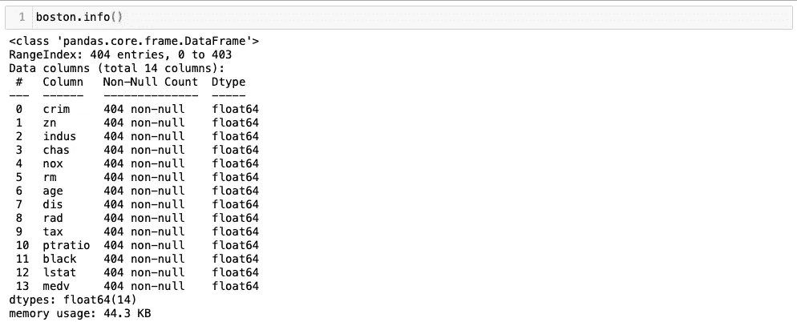**

**我们看到我们的数据集总共由 404 个元素组成，所有这些值都是数值并且**非空**。换句话说，我们可以继续了解我们的数据集，而无需任何预处理步骤。**

**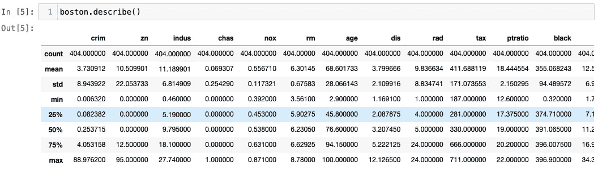****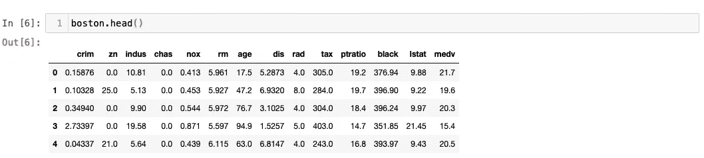**

**我们的主要目标是使用我们拥有的所有特征来估计房价，但是让我们首先通过检查仅房间数量特征对房价的影响来熟悉**线性回归**概念。**

**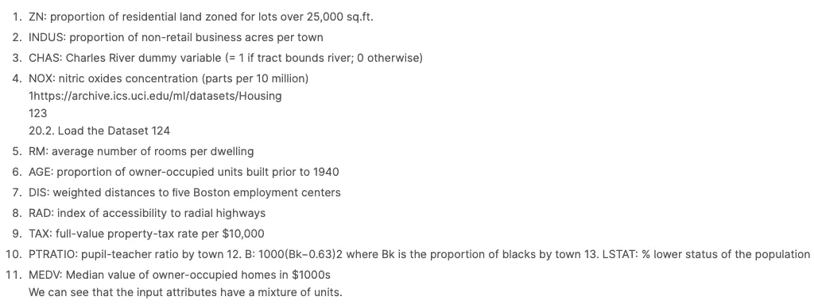**

**数据集内变量的描述。**

**从我们接收数据集的 **Kaggle** 中，我们可以检查数据集的列名是什么意思。medv 变量，我们目标上的房价变量。在这一步中，分别；**

*   **我们从数据集的**输入(X)** 变量中删除目标变量，**
*   **我们将这个目标变量分配给**输出(y)** 变量，**
*   **为了检查房间数和房价之间的关系，我们将房间数列定义为一个变量。**

**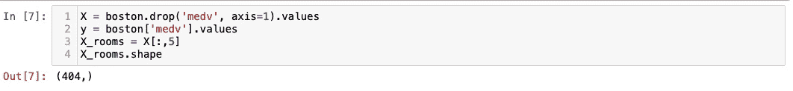**

**当我们检查房间数量的大小时，我们看到大小是缺失的。它应该是一个由 404 行和 1 列组成的数据帧，这样我们就可以对它进行处理。为此，我们从如下的整形函数中获得帮助。 ***重塑*** 过程至关重要，尤其是在**深度学习**研究中。当我们来到文章系列的这些部分时，我们将更多地讨论这个过程。**

**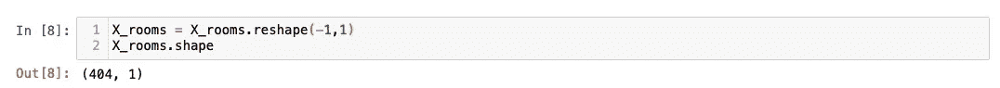****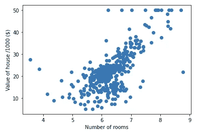**

**我们观察到，在我们的数据集中，房子大多是 6 个房间，一般是**，随着房间数量的增加，房子的价格也会增加。****

# ****最小二乘法****

****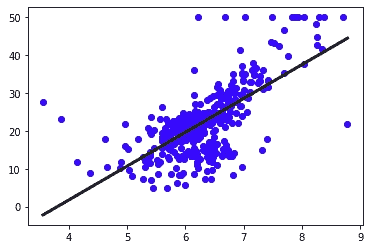****

****我们画了一条线来表示这两个变量之间的关系。我们在回归问题中的全部目的是最小化数据集中的点与直线的距离，从而获得最接近事实的直线。在这个例子中，我们的变量是房间的数量，我们的目标是房子的价格。我们可以用一个变量线函数来模拟。****

****如果我们将该等式表示为 **y = ax + b** ，**，我们将线性回归模型的数学目的定义为确定 a 和 b 的值，这将绘制最接近数据点的直线**。****

****这被称为**最小二乘法**。****

****现在，让我们包括所有的功能，而不是房间的数量，并重新编写我们在以前的笔记本中看到的猜测过程。****

******均方根误差**是用于测量模型(或估计器/预测器)预测值和实际(观察)值之间差异的指标之一。如果该指标为 0，则意味着模型没有出错。简单地将误差(损失)的平方相加，首先是平均值，然后是平方根。****

****让我们通过交叉验证分离我们的聚类并取我们获得的结果的平均值来完成文章的这一部分。****

****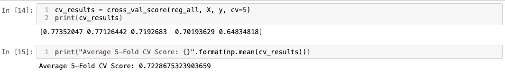****

# ****脊函数****

****岭回归是使用 **L2 正则化**的回归变量。在我们继续之前，如果我们简要地谈一下为什么我们需要这个；****

****记住，我们的主要目标是最优地确定方程的系数(具有最小的 RMSE 值)。我们的模型将分别确定每个**输入变量**的系数。这些系数有时会非常大，导致我们的模型过拟合。为了避免这样的情况，我们需要实现一个**正则化**。****

****我们需要确定的超参数是用于**脊**和**套索**功能的 **alpha** 值，我们稍后会提到。****

****虽然 alp **h** a 值为 0 不能解决我们的问题，但它会导致模型过拟合，反之，过高会导致欠拟合。****

****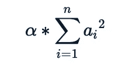****

****在损失计算中，山脊效应就是这样显示的。****

# ****Lasso(最小绝对收缩和选择算子)函数****

******2**与**脊**功能的主要区别。它使用 **L1 正则化**来排列系数，**另一个更重要的区别是，它可以完全忽略一些属性，因为它采用系数的绝对值而不是平方。******

****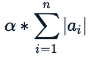****

****损失计算中的套索效应就是这样显示的。****

****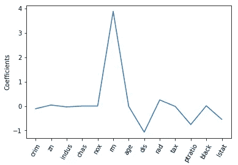****

****虽然我们在文章开始时用来采样的**房间号变量**的效果很明显，但是我们看到模型发现不重要的一些特征的系数也等于零。****

****最后，我们通过包含我们在以前的文章中使用的 **GridSearch** 和 **pipeline** 并观察结果来结束我们的文章。下一篇文章再见。****

**** [## gokerguner/笔记本

### 恩]:媒体的文章和我写的笔记本的主题是我对机器的了解和疑惑…

github.com](https://github.com/gokerguner/notebooks/tree/main/ml03)****