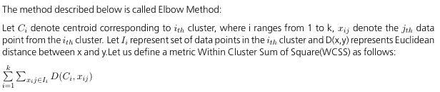
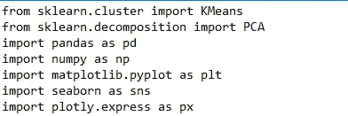
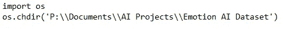
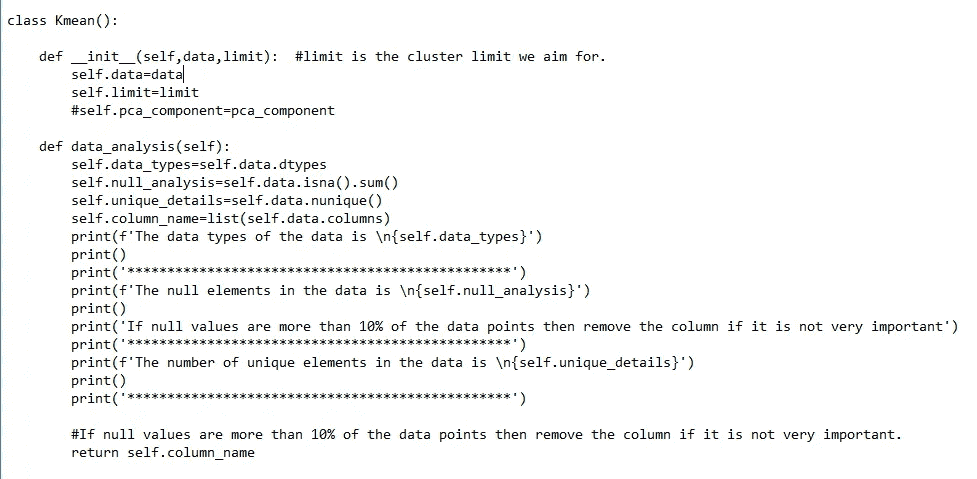
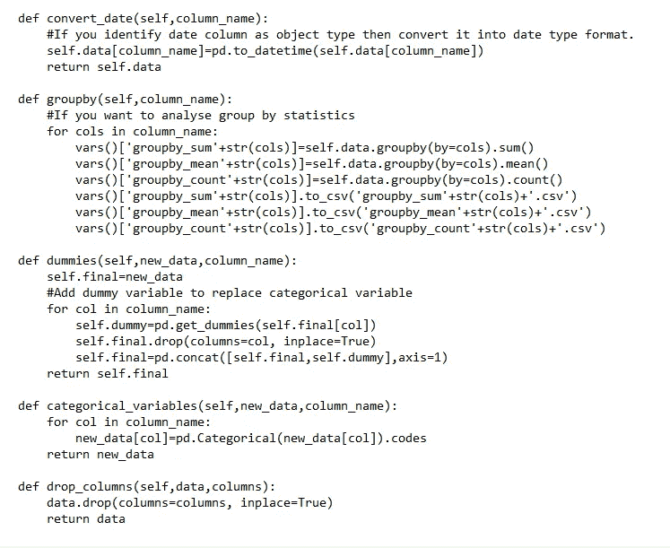
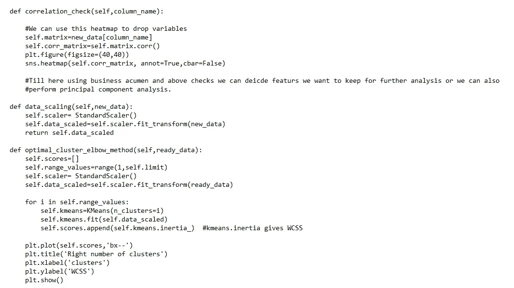
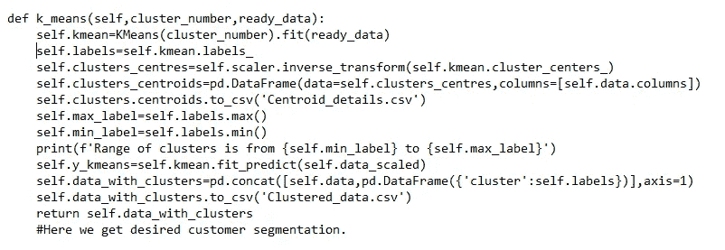

# 机器学习算法:K-Means 聚类算法及其在 Python 中的 OOP 实现。

> 原文：<https://medium.com/analytics-vidhya/machine-learning-algorithm-k-nearest-neighbors-and-its-implementation-in-python-using-oop-b012b4faf4cb?source=collection_archive---------17----------------------->

k 均值聚类是一种无监督的机器学习技术，用于将相似的数据点分组到一个聚类中。现在第一个问题出现了，如何测量数据点之间的相似性，这是一个可靠的算法吗？

下面让我们看看执行上述任务的算法:

1.  选择您要将数据放入的聚类数 k。不要担心，我们有一个可爱的方法，肘方法，我们将在后面的理论和 python 实现中看到。
2.  为每个聚类随机选择质心。意味着我们可以随机选择 k 个数据点作为质心。
3.  将每个数据点分配给最近的聚类。为了理解，可以通过测量每个点到所有质心的欧几里德距离，并选择对应于最小距离的质心。
4.  现在为每个聚类计算一个新的质心。
5.  重复第三步，继续这样做，直到新的质心位置不变。

简单易行！！

在任何事情之前，让我们看看我们如何决定集群的数量。有不同的方法可以做到这一点，根据你的专业知识和需求，你可以选择一个。让我们看看下面我们将如何做这件事。

让我们定义以下步骤:

1.  选择 k=1
2.  计算数据的质心并计算 WCSS。
3.  通过增加 k 值继续重复，并绘制它。

人们会得到手臂形状的曲线，并且必须选择对应于肘部的 k。

需要记住的更重要的一点是关于维数灾难。如果特征的数量太大，并且您仍然想要执行 k 均值算法，那么可以部署 PCA 来降低特征维数。其背后的数学和直觉将在下一篇文章中解释。我在下面附上了使用 OOP 概念的代码，所以它可以很容易地被别人使用。如果你想了解如何使用类和对象，那么你可以阅读我以前的文章[https://medium . com/analytics-vid hya/object-oriented-programming-OOP-concepts-encapsulation-abstraction-inheritance-polymorphism-d 712 EFA 70d 87](/analytics-vidhya/object-oriented-programming-oop-concepts-encapsulation-abstraction-inheritance-polymorphism-d712efa70d87)

我已经试着分段解释代码。

首先，我们将导入所有需要的库。

然后是我最喜欢的库之一，它使数据输入更容易。

在直接进入算法之前，我们需要理解数据。以下是摘录。我创建了一个 Kmean()类，它包含数据帧形式的特征数据，并限制为整数类型，包含允许的最大聚类数(选择 30 左右，这将处于安全区)。在函数 data_analysis()中，提取关于数据的简单信息，如数据类型、缺失值、唯一值等。会被打印出来。

在上面的代码片段中，我们可以将日期转换成 pandas 的 datetime 格式，这很容易操作。然后是一个方便的内置 groupby()函数，在这里输入不同列的名称作为列表数据类型。这些文件将分别直接保存到您的文件夹中。不错的 na！！

然后函数也可以使用上面的函数将变量转换成分类数据类型和虚拟变量。与列相关的输入是列表类型，数据的输入需要作为数据框。这适用于所有代码。

代码中最重要也是最容易理解的部分如下:

使用上面定义的最后一个函数，我们可以为下面定义的函数选择输入的最佳代码数:

这都是为了文章。如果你有任何疑问，或者想让我写任何其他与人工智能、人工智能、统计学、经济学、数学相关的特定主题，请在 Linkedin 上联系我。

[https://www.linkedin.com/in/ayush-yadav-2903b099/](https://www.linkedin.com/in/ayush-yadav-2903b099/)