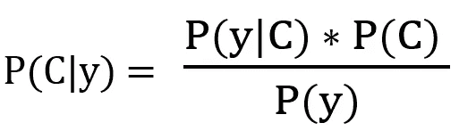
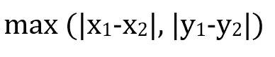

# 机器学习算法:朴素贝叶斯分类器和 KNN 分类器

> 原文：<https://medium.com/analytics-vidhya/machine-learning-algorithms-na%C3%AFve-bayes-classifier-and-knn-classifier-266537e9c2f2?source=collection_archive---------6----------------------->

在机器学习算法系列的第二篇文章中，我将重点介绍朴素贝叶斯分类器和 KNN 分类器。它们都是使用的最简单的算法类型之一，并且更容易实现。朴素贝叶斯分类器基于概率概念，广泛用于垃圾邮件过滤。K-最近邻分类器基于特征相似性原理工作。让我们深入研究这些算法:)

Anthony Intraversato 在 [Unsplash](https://unsplash.com?utm_source=medium&utm_medium=referral) 上拍摄的照片

# 朴素贝叶斯分类器

这种算法被称为 nave，因为它基于一个简单的假设，即特征是独立的。朴素贝叶斯分类器的工作原理是贝叶斯定理。贝叶斯定理是分析领域中最基本的概念之一，有着广泛的应用。它通常在决策过程中起着至关重要的作用。让我们考虑两个事件 A 和 b。相关的条件概率由下式给出:

> *一个事件 A 给定 B 的条件概率(P(A|B))是给定 B 已经发生的概率。它通常被定义为 A 和 B 的联合概率(A 和 B 一起发生的概率)与 A 的边际概率(事件 A 的概率)之比*

使用以上两个等式，我们可以表明

上面的等式解释了贝叶斯定理。因此，对于事件 B，我们可以在提供附加信息时更新关联的概率(这里 A 是附加信息)。

## 贝叶斯定理中的关键术语

1.  先验概率(P(B)，P(A))-没有任何附加信息的概率值
2.  后验概率(P(B|A))-在给定附加信息 A 的情况下，事件 B 的概率
3.  P(A|B)-如果 B 为真，观察到 A 的可能性

有一个有趣的游戏和贝叶斯定理有关。对游戏感兴趣？继续阅读著名的蒙蒂霍尔问题。

 [## 蒙蒂·霍尔问题背后的数学

### 当我们问统计学家概率如何改变了人类决策的视角时，第一个…

medium.com](/analytics-vidhya/the-math-behind-monty-hall-problem-ef7489ce7f20) 

当涉及到分类问题时，贝叶斯定理可以重新解释如下:

其中 c 代表数据所属的类别，y1.y2…yn 表示预测要素或标注。如果你看到分母项，可能会有证据概率为 0 的情况。这给组织制造了一个问题。为了解决这个问题，变量增加一个小值 1，这样概率不会变为零。这种调整称为**拉普拉斯校正。**

## 朴素贝叶斯分类的步骤

1.  计算所涉及类别的先验概率
2.  计算每个类别的每个特征的证据的可能性
3.  使用贝叶斯规则计算后验概率
4.  为输入选择具有较高概率的类

当特征 x 本质上是分类的时，计算相关的概率就更容易了。当特征 x 连续时，我们假设变量 x 是正态分布(**高斯朴素贝叶斯**)。概率值由下式给出

**优点**

1.  易于实施
2.  在有噪声的数据中表现相当好

**缺点**

1.  连续功能的低性能
2.  假设特征是独立的是有风险的

# KNN 分类器

k-最近邻算法可用于解决分类和回归问题。当朴素贝叶斯分类器等算法使用来自训练样本的概率进行预测时，KNN 是一个懒惰的学习者，不会提前创建任何模型。只是根据特征相似性找到最近的。

**相似性度量**

流行的相似性度量标准是距离度量。有几种距离测量方法可用。

1.欧几里得距离

这是最常用的距离测量方法。对于两点(x1，x2)和(y1，y2 ),欧几里得距离由下式给出:

2.曼哈顿距离

也被称为城市街区或绝对距离，它的灵感来自曼哈顿城的结构。对于两点(x1，x2)和(y1，y2 ),曼哈顿距离由下式给出:

3.切比雪夫距离

也称为棋盘或最大值距离，对于两点(x1，x2)和(y1，y2)，切比雪夫距离由下式给出:

4.闵可夫斯基距离

这是一种广义的距离度量。所有上述距离都可以从通用公式中获得。

当 c =1 时，闵可夫斯基=曼哈顿

当 c =2 时，闵可夫斯基=欧几里得

当 c =3 时，闵可夫斯基=切比雪夫

5.马哈拉诺比斯距离

为了计算多元空间中两品脱之间的距离，我们使用 Mahalanobis 距离。马氏距离由下式给出:

这里 x 和 y 是多元空间中相同分布的向量。c 是协方差矩阵的逆矩阵。

**步骤**

1.  根据所使用的相似性度量，查找靠近所选数据点的 K 个邻居。
2.  使用来自 k 个邻居的多数投票来识别数据点属于哪个类。

**选择 K 的最佳值**

可能有两种情况:

1.  K 越小，噪声对结果的影响越大
2.  高 K，计算成本高

因此，一些文章建议选择 K 作为 sqrt(N)/2，其中 N 是数据点的数量。

**优点**

1.  易于实施
2.  不涉及假设

**缺点**

1.  最佳 K 值总是一个挑战
2.  懒惰的学习者——计算成本高

链接到本系列的第一篇文章:

 [## 机器学习算法:逻辑回归

### Tom Mitchell 最著名的定义之一是将机器学习定义为“一个性能良好的计算机程序…

medium.com](/analytics-vidhya/machine-learning-algorithms-logistics-regression-8ba38af531b3) 

希望你读得不错。请鼓掌以示支持，并关注我以获取更多文章☺