# 机器学习算法:支持向量机

> 原文：<https://medium.com/analytics-vidhya/machine-learning-algorithms-support-vector-machines-ddfc413540d2?source=collection_archive---------8----------------------->

在机器学习算法系列的第三篇文章中，我将讨论最流行的监督学习算法，支持向量机。它们可用于分类和回归问题，但它们因其分类能力而被广泛使用。所以让我们开始用 SVM 分类吧！

安妮·索沃斯在 [Unsplash](https://unsplash.com?utm_source=medium&utm_medium=referral) 拍摄的照片

支持向量机算法的最终目标是识别能够尽可能地分离类别的最佳超平面，即能够产生最大间隔的超平面。

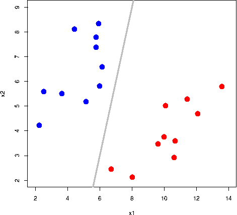

[两类不同数据的分类问题](https://exeter-data-analytics.github.io/MachineLearning/supervised-learning-1.html)

通过查看上图，我们可以确定平均分割数据的最佳超平面。但是算法如何识别这一点呢？**支持向量**是更接近超平面并影响超平面方向的数据点。**余量**被定义为两个类别的支持向量之间的距离。因此，支持向量用于最大化分类器的余量。

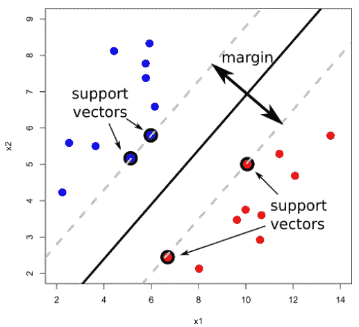

为了进行分类，我们需要首先确定决策边界。我们将假设任何低于决策边界的都是负的，高于决策边界的都是正的。所以，从数学上来说，

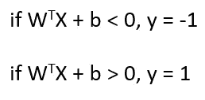

让我们任意取负类中的 x1 和正类中的 x2 两个点。

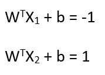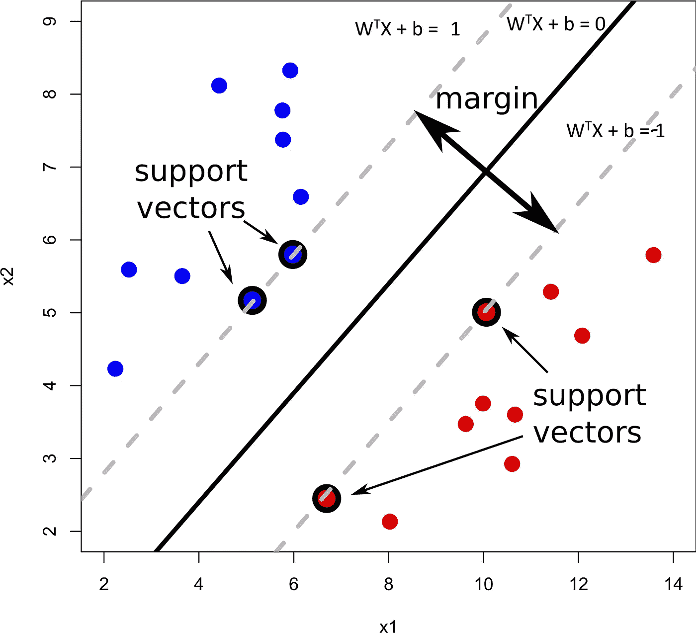

我们可以把它表示为 X2= X1+λ * W，其中λ是两点之间的距离。

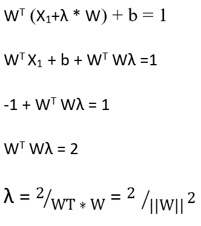

支持向量机的最终目标是尽可能最大化这个距离。我们可以用另一种方式来解释这件事。

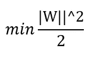

服从于:

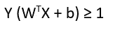

在大多数情况下，数据点可能不是线性可分的，如上图所示。因此，创建的超平面必须能够允许一些错误分类发生。这种情况被定义为软余量。一个松弛变量被引入到等式中来量化它。

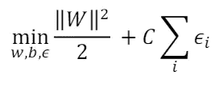

其中 c 是正则化参数，𝜖 *i* 是松弛变量。正则化参数控制模型中允许的错误分类级别，因此低 C 值比高 C 值允许更多的异常值。

**内核函数**

当数据变得线性不可分时，核函数将数据映射到更高维度，这反过来有助于找到合适的分类超平面。

有不同类型的内核函数可用:

线性核:当数据是线性可分的时候使用。

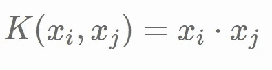

多项式内核:

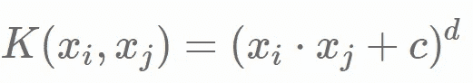

这里 c 是任意常数，d 是多项式次数。当 c=0 和 d=1 时，一些多项式核变成线性的

径向核:它们也被称为高斯核。

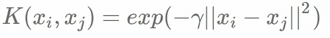

其中γ是可以控制模型方差的超参数。当γ较小时，其行为类似于线性模型。||xi-xj||代表两点之间的欧氏距离。

优点:

1.  非常适合高维数据

2.适用于非线性模型

3.适用于文本、图像和树等非结构化和半结构化数据

缺点:

1.  大型数据集的训练时间长
2.  超参数选择使得它们在计算上非常昂贵。

机器学习算法系列之前文章的链接:

 [## 机器学习算法:朴素贝叶斯分类器和 KNN 分类器

### 在机器学习算法的第二篇文章中，我将重点介绍朴素贝叶斯分类器和 KNN…

medium.com](/analytics-vidhya/machine-learning-algorithms-naïve-bayes-classifier-and-knn-classifier-266537e9c2f2)  [## 机器学习算法:逻辑回归

### Tom Mitchell 最著名的定义之一是将机器学习定义为“一个性能良好的计算机程序…

medium.com](/analytics-vidhya/machine-learning-algorithms-logistics-regression-8ba38af531b3) 

希望你读得不错。请鼓掌以示支持，并关注我以获取更多文章☺