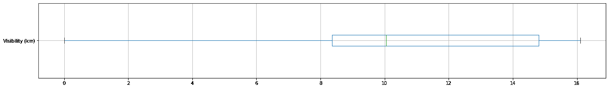
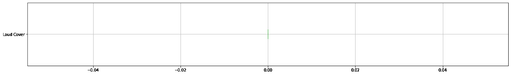
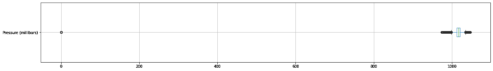

# 机器学习-分析 Szeged 2006-2016 年的天气以预测表观温度

> 原文：<https://medium.com/analytics-vidhya/machine-learning-analysis-of-weather-in-szeged-2006-2016-to-predict-the-apparent-temperature-76f195c2ec60?source=collection_archive---------6----------------------->

> 通过线性回归


用例:湿度和温度有关系吗？湿度和表观温度之间呢？给定湿度，你能预测表观温度吗？

数据集:[查看数据集](https://www.kaggle.com/budincsevity/szegedweather?select=weatherHistory.csv)

要做练习，你可以从上面的链接下载数据集。

首先我们必须导入一些库。因为大多数 python 库都有一组有用的函数，可以简单地消除从头编写代码的需要。所以我导入了下面的库。

```
import numpy as np
import pandas as pd
import scipy.stats as stats 
from matplotlib import pyplot as plt%matplotlib inline

from sklearn.preprocessing import StandardScaler
```

Pandas 主要用于逗号分隔值、JSON、SQL、Microsoft Excel 等各种文件格式的数据分析。此外，它可以做一些数据操作，如合并，整形，选择，清理等。更多的库我会在需要的地方解释。

我已经添加了以下代码，用于将 google drive 帐户安装到 google colaboratory，以访问 drive 上可用的文件。当我们执行下面的代码时，我们必须转到生成的 URL，并获得授权代码才能进入这里。

```
from google.colab import drive
drive.mount("/content/gdrive")
```

输入授权码后。您将收到一条消息，显示“安装在[/内容/驱动器](https://colab.research.google.com/drive/1XcLXQSvTYMfUL0ic6IUTLLitWWYs3p7j?authuser=1#)”。此后，通过下面的代码，您可以访问您连接的 google drive 上的文件。

```
data = pd.read_csv('/content/gdrive/My Drive/Colab Notebooks/data/weatherHistory.csv')
```

现在，您已经成功地将数据加载到名为“data”的变量中。出于修改的目的，我将数据复制到另一个名为“X”的变量中

```
X = data.copy() #dataset has been copied to  X
```

通过下面的代码，您可以看到该变量中存储的前 10 个数据行。Pandas 库提供了一个名为 head()的方法，广泛用于返回一个数据帧或系列的前 n 行。默认情况下，该方法返回存储数据集的前 5 行。

```
X.head(10)
```


# 步骤 01 数据预处理

数据预处理是机器学习中的一个主要步骤，因为从数据集中获得的有用信息直接影响模型的质量，所以在将数据输入模型之前，对数据进行必要的预处理是非常重要的。

# 步骤 01 A ->数据清理-识别和处理缺失值、重复记录

按照下面的代码，我们可以确定每列数据中缺少的值

```
X.isnull().any()
```


在上面的输出中，我们可以看到 Precip 类型为 True。平衡是虚假的。因此，我们可以得出结论，Precip 类型有一些缺失值，而 balance 特征没有缺失值。所以我们必须处理那些丢失的值。为此，我们必须检查给定值中缺失值的百分比。

```
X['Precip Type'].value_counts() # To get the count of each available types
```


```
(X['Precip Type'].isnull().sum()/len(X.index) )*100 # To check the null values percentage in available data set
```


从上面的输出百分比值中，我们可以说空值占可用数据的百分比非常小。因此，我们可以删除那些空值行，并为进一步的预处理活动获取余额数据。通过下面的代码，我们可以删除空值

```
X = X.dropna() #drop all nan values in given data set
X.isnull().sum() # For the verification.
```


在上面的输出中，所有的值都是零，所以现在我们可以得出结论，在数据集中没有任何 nan 值。

通过下面的代码，我们可以检查数据集中的重复行。在下面的输出中，您可以看到 24 个值为 True，95912 个值为 False。所以我们可以得出这个数据集有 24 个重复值的结论。

```
print(X.duplicated().value_counts()) # To check duplicated values
```


```
print(X[X.duplicated()]) # To check view the duplicated values
```


```
X=X.drop_duplicates() # To drop the duplicate values
print(X.duplicated().value_counts()) # To check duplicated values
```


从上面的输出我们可以得出结论，数据集中没有重复的行

# 步骤 01 B ->数据清理——识别和处理异常值

离群值被称为明显偏离其他对象的对象。它可能是由不同类型的错误引起的。因此，我们必须对给定的数据集进行离群点分析，以获得高质量的模型。

通过下面的代码，我们可以得到连续的列名，

```
plt.rcParams["figure.figsize"] = (22, 3)
X._get_numeric_data().columns.tolist()
```

上述代码的输出是['温度'，'表观温度'，'湿度'，'风速(km/h)'，'风向(度)'，'能见度(km)'，'大声覆盖'，'压力(毫巴)']，因此我们可以对这些列进行分析。

温度柱的箱线图和 Q-Q 图

通过下面的代码，我们可以绘制给定列的箱线图来检查异常值，

```
temp_df = pd.DataFrame(X, columns=['Temperature (C)'])
temp_df.boxplot(vert=False)
```


通过下面的代码，我们可以绘制给定列的概率图，以检查分布模式，取值范围等。,

```
plt.rcParams["figure.figsize"] = (10, 6)
stats.probplot(X["Temperature (C)"], dist="norm", plot=plt)
plt.show()
```


表观温度柱的箱线图和 Q-Q 图

通过下面的代码，我们可以绘制给定列的箱线图来检查异常值，

```
plt.rcParams["figure.figsize"] = (22, 3)
temp_df = pd.DataFrame(X, columns=['Apparent Temperature (C)'])
temp_df.boxplot(vert=False)
```


通过下面的代码，我们可以绘制给定列的概率图，以检查分布模式，取值范围等。,

```
plt.rcParams["figure.figsize"] = (10, 6)
stats.probplot(X['Apparent Temperature (C)'], dist="norm", plot=plt)
plt.show()
```


风速(km/h)柱的箱线图和 Q-Q 图

通过下面的代码，我们可以绘制给定列的箱线图来检查异常值，

```
plt.rcParams["figure.figsize"] = (22, 3)
temp_df = pd.DataFrame(X, columns=['Wind Speed (km/h)'])
temp_df.boxplot(vert=False)
```


通过下面的代码，我们可以绘制给定列的概率图，以检查分布模式，取值范围等。,

```
plt.rcParams["figure.figsize"] = (10, 6)
stats.probplot(X['Wind Speed (km/h)'], dist="norm", plot=plt)
plt.show()
```


风向(度)柱的箱线图和 Q-Q 图

通过下面的代码，我们可以绘制给定列的箱线图来检查异常值，

```
plt.rcParams["figure.figsize"] = (22, 3)
temp_df = pd.DataFrame(X, columns=['Wind Bearing (degrees)'])
temp_df.boxplot(vert=False)
```


通过下面的代码，我们可以绘制给定列的概率图，以检查分布模式，取值范围等。,

```
plt.rcParams["figure.figsize"] = (10, 6)
stats.probplot(X['Wind Bearing (degrees)'], dist="norm", plot=plt)
plt.show()
```


能见度(公里)柱的箱线图和 Q-Q 图

通过下面的代码，我们可以绘制给定列的箱线图来检查异常值，

```
plt.rcParams["figure.figsize"] = (22, 3)
temp_df = pd.DataFrame(X, columns=['Visibility (km)'])
temp_df.boxplot(vert=False)
```



通过下面的代码，我们可以绘制给定列的概率图，以检查分布模式，取值范围等。,

```
plt.rcParams["figure.figsize"] = (10, 6)
stats.probplot(X['Visibility (km)'], dist="norm", plot=plt)
plt.show()
```


大声盖柱的箱线图和 Q-Q 图

通过下面的代码，我们可以绘制给定列的箱线图来检查异常值，

```
plt.rcParams["figure.figsize"] = (22, 3)
temp_df = pd.DataFrame(X, columns=['Loud Cover'])
temp_df.boxplot(vert=False)
```



通过下面的代码，我们可以绘制给定列的概率图，以检查分布模式，取值范围等。,

```
plt.rcParams["figure.figsize"] = (10, 6)
stats.probplot(X['Loud Cover'], dist="norm", plot=plt)
plt.show()
```


我们可以通过下面的注释来查看“大声盖”的值计数，

```
X['Loud Cover'].value_counts()
```

输出是 0.0 95912

从上面的值和“大声掩盖”的箱线图，我们可以得出结论，没有使用保留该列。因为所有的值都是零。所以我们可以按照下面代码从数据集中删除该列，

```
X = X.drop('Loud Cover', axis = 1)
```

压力(毫巴)柱的箱线图和 Q-Q 图

通过下面的代码，我们可以绘制给定列的箱线图来检查异常值，

```
plt.rcParams["figure.figsize"] = (22, 3)
temp_df = pd.DataFrame(X, columns=['Pressure (millibars)'])
temp_df.boxplot(vert=False)
```



通过下面的代码，我们可以绘制给定列的概率图，以检查分布模式，取值范围等。,

```
plt.rcParams["figure.figsize"] = (10, 6)
stats.probplot(X['Pressure (millibars)'], dist="norm", plot=plt)
plt.show()
```


从上面的箱线图和下面的计数中，我们可以看到一些异常情况。

```
X['Pressure (millibars)'].value_counts()
```


通过下面的代码，我们可以得到给定列的描述，如平均值，计数，标准差，最小值等。

```
X['Pressure (millibars)'].describe()
```


通过下面的代码，我们可以绘制图表上的点来检查值变化的模式，

```
plt.rcParams["figure.figsize"] = (500, 8)
plt.plot(X['Pressure (millibars)'].tolist(), label="Pressure")
plt.show()
```


在上图中，我们可以看到相当多的压降等于零。这可能是由于测量机器的误差造成的。被广泛接受的空间开始的边界，也是假设气压为零的点，被称为卡门线，位于 100 公里(62 英里)以上。因此，该列中不可能有零值或小于零值的值。

通过下面的代码，我们可以计算给定列中零值或小于零值的百分比。

```
len(X[(X['Pressure (millibars)']<=0.0) ])* 100/len(X)
```

1.342897656184836

通过遵循下面的代码，我们可以重置数据帧的索引，以避免在未来的步骤中出现问题。

```
X=X.reset_index(drop=True)
```

通过以下代码，我们可以将 np.nan 指定为压力列中零值，以指定合适值，

```
X.loc[X.index[X['Pressure (millibars)']<=0.0].tolist(), ['Pressure (millibars)']] =np.nan
```

我们可以通过下面的代码来检查我们是否已经正确地赋值，

```
X['Pressure (millibars)'].isnull().sum() # Verification
```

输出是 1288。

通过以下代码，我们可以为压力列中 np.nan 值分配合适值，

```
from sklearn.impute import SimpleImputer
imputer = SimpleImputer()
imputer.fit(X[['Pressure (millibars)']])
X['Pressure (millibars)']=imputer.fit_transform(X[['Pressure (millibars)']])
```

我们可以通过下面的代码来检查我们是否已经通过 SimpleImputer 正确地赋值，

```
X['Pressure (millibars)'].isnull().sum() # Verificaion
```

0

使用简单的估算器后，在图形上可视化，

```
plt.plot(X['Pressure (millibars)'].tolist(), label="Pressure")
plt.show()
```


使用简单估算器后的概率图，

```
plt.rcParams["figure.figsize"] = (10, 6)
stats.probplot(X['Pressure (millibars)'], dist="norm", plot=plt)
plt.show()
```


湿度柱的箱线图和 Q-Q 图

通过下面的代码，我们可以绘制给定列的箱线图来检查异常值，

```
plt.rcParams["figure.figsize"] = (22, 3)
temp_df = pd.DataFrame(X, columns=['Humidity'])
temp_df.boxplot(vert=False)
```


通过下面的代码，我们可以绘制给定列的概率图，以检查分布模式，取值范围等。,

```
plt.rcParams["figure.figsize"] = (10, 6)
stats.probplot(X['Humidity'], dist="norm", plot=plt)
plt.show()
```

a


从上面的图中我们可以看到一些值为 0。但是实际上不可能具有零值或小于正常环境下值。

```
plt.rcParams["figure.figsize"] = (500, 8)
plt.plot(X['Humidity'].tolist(), label="Humidity")
plt.show()
```

通过使用上面的代码，我们可以绘制图表来查看值的变化模式。


我们可以使用下面的代码来检查数据集上零值的百分比。

```
len(X[(X['Humidity']<=0.0) ])* 100/len(X)
```

0.022937692885144717

通过下面的代码，我们可以得到给定列的描述，如平均值，计数，标准差，最小值等。

```
X['Humidity'].describe()
```


根据以上证据，我们可以说湿度的异常值很少。因此，通过下面的代码，我们可以删除数据集中的那些值行。

```
X.drop(X[X['Humidity'] == 0].index, inplace = True)
```

如果我们通过下面的代码在每次删除行值后都重置了索引，我们可以避免将来在连接列或拆分数据集时出现一些错误。

```
X=X.reset_index(drop=True)
```

# 步骤 01 C ->数据编码

ML 模型要求所有输入和输出值都应该是数字。因此，如果数据集包含分类数据，您必须在拟合和评估模型之前将其编码为数字。有几种方法可以完成这项任务，如一键编码、整数(标签)编码。这里我使用了整数(标签)编码，因为一次性编码不能自动处理测试集中的新类别。

通过使用以下代码，我们可以对“Precip 类型”、“Summary”进行分类。

```
from sklearn.preprocessing import LabelEncoder
labelencoder =LabelEncoder() X['Precip_Types_cat']=labelencoder.fit_transform(X['Precip Type']) 
X = X.drop('Precip Type', axis = 1) X['Summary_cat']=labelencoder.fit_transform(X['Summary'])
X = X.drop('Summary', axis = 1)
```

在数据编码之后，我删除了原来的列。上面的代码片段也提供了这些代码。

# 步骤 01 C ->特征离散化

特征离散化是指将特征或变量的连续值划分或转换为离散化的或标称的特征或区间的过程。这里我使用了 sklearn.preprocessing 中的 KBinsDiscretizer 来完成相关的任务。

您可以按照以下代码对“风向(度)”进行特征离散化，因为“风向(度)”的值在 0 到 359 度之间。


通常风向是根据上图的风向来考虑的。所以我选择 n_bins = 16 来做进一步的工作

```
from sklearn.preprocessing import KBinsDiscretizer
discretizer = KBinsDiscretizer(n_bins=16, encode='ordinal', strategy='uniform') 
discretizer.fit(X[['Wind Bearing (degrees)']])
X['Wind Bearing (degrees)'] = discretizer.transform(X[['Wind Bearing (degrees)']])
```

这里我为箱子做了一个特征编码，

```
X['Wind_Bearing_cat']=labelencoder.fit_transform(X['Wind Bearing (degrees)'])
X = X.drop('Wind Bearing (degrees)', axis = 1)
X.head() # For the verification
```

你可以在下图的最后一栏看到特征离散化的效果。


通过下面的代码，您可以检查空值以继续工作。

```
X.isnull().any()
```


# 步骤 01 D ->数据泄漏处理

为了处理数据泄漏，我们可以在进行转换之前分离训练集数据和测试集数据。我们只需计算归一化的均值和方差，或者只与训练数据上的统计数据相关的一些其他变换，然后使用这些值来变换训练数据本身，然后使用相同的值来变换测试数据。在转换计算中包含测试数据集将允许信息从测试数据流向训练数据，并因此流向从中学习的模型，从而允许模型作弊(引入偏差)。

按照上面的代码，我们可以将数据集分成两部分。test_size=0.2，因此我们可以获得 20 %的数据行用于测试目的，80 %的数据行用于训练目的，random_state=42。Random_state 可以是 0 或 1 或任何其他整数。但是，如果您必须一次又一次地多次执行代码来验证您的代码或文件，那么它必须是相同的值。

```
from sklearn.model_selection import train_test_splittrain_X, test_X = train_test_split(X, test_size=0.2,random_state=42)
```

如果我们通过下面的代码在每次删除行值后都重置了索引，我们可以避免将来在连接列或拆分数据集时出现一些错误。

```
train_X=train_X.reset_index(drop=True) # Reset the dataframe Index
len(train_X) # look the length for verification
```

76712，这是 X 列车的长度

```
test_X.head() # look  for verification
```


# 步骤 02 数据转换

大多数情况下，我们更喜欢数据来自正态分布来训练模型。因为实际数据集中的要素通常会遵循更偏态的分布。通过根据这些变量的偏斜度应用不同类型的变换，我们可以将偏斜分布映射成正态分布。

通过下面的代码，我们可以为数据集中的连续值列生成一个直方图。从直方图中，我们可以看到数据在特征中分布。

```
plt.rcParams["figure.figsize"] = (24, 12)train_X[['Temperature (C)','Apparent Temperature (C)','Humidity','Wind Speed (km/h)','Visibility (km)','Pressure (millibars)']].hist()
```

您可以在下图中看到上述代码的输出，


湿度的数据转换

通过下面的代码，我们可以为给定的数据列创建一个直方图，

```
plt.rcParams["figure.figsize"] = (24, 6)train_X['Humidity'].hist()
```


从上面的湿度直方图中，我们可以看到左偏的分布。因此，我们可以使用指数或幂变换来减少左偏分布

```
from sklearn.preprocessing import FunctionTransformerexponential_transformer = FunctionTransformer(np.exp, validate=True)
exponential_transformer.fit(train_X[['Humidity']])train_X['Humidity'] = exponential_transformer.transform(train_X[['Humidity']]) 
test_X['Humidity'] = exponential_transformer.transform(test_X[['Humidity']])
```

从上面的转换代码中，我们只需调整 train_X[['湿度']]，以避免数据泄漏。

通过下面的代码，我们可以看到指数变换后的直方图，

```
train_X['Humidity'].hist()
```


风速(千米/小时)的数据转换

通过下面的代码，我们可以为给定的数据列创建一个直方图，

```
train_X['Wind Speed (km/h)'].hist()
```


从上面的风速(千米/小时)直方图中，我们可以看到右偏分布。所以我们可以用平方根变换来减少右偏分布

```
Square_root_transformer = FunctionTransformer(np.sqrt,validate=True)
Square_root_transformer.fit(train_X[['Wind Speed (km/h)']])train_X['Wind Speed (km/h)'] = Square_root_transformer.transform(train_X[['Wind Speed (km/h)']]) 
test_X['Wind Speed (km/h)'] = Square_root_transformer.transform(test_X[['Wind Speed (km/h)']])
```

从上面的转换代码中，我们必须只拟合 train_X[['风速(km/h)']]，以避免数据泄漏。

通过下面的代码，我们可以看到平方根变换后的直方图，

```
train_X['Wind Speed (km/h)'].hist()
```


能见度的数据转换

通过下面的代码，我们可以为给定的数据列创建一个直方图，

```
train_X['Visibility (km)'].hist()
```


从上面的能见度直方图中，我们可以看到左偏分布。因此，我们可以使用指数或幂变换来减少左偏分布

```
exponential_transformer = FunctionTransformer(np.exp,validate=True)
exponential_transformer.fit(train_X[['Visibility (km)']])train_X['Visibility (km)'] = exponential_transformer.transform(train_X[['Visibility (km)']]) 
test_X['Visibility (km)'] = exponential_transformer.transform(test_X[['Visibility (km)']])
```

从上面的转换代码中，我们必须只拟合 train_X[['Visibility (km)']]，以避免数据泄漏。

通过下面的代码，我们可以看到指数变换后的直方图，

```
train_X['Visibility (km)'].hist()
```


通过遵循代码，我们可以删除“每日摘要”列，

```
train_X = train_X.drop('Daily Summary', axis = 1) 
test_X = test_X.drop('Daily Summary', axis = 1)# Dependent Feature so we can remove that
```

# 步骤 03 数据标准化

数据标准化是重新调整一个或多个要素的方式，以便它们的平均值为 0，标准差为 1。标准化假设您的数据具有高斯(钟形曲线)分布。但这并不一定是真的，但如果你的特征值分布属于高斯分布，这种技术被认为是更有效的。

我们必须在标准化之前删除分类特征。因此，通过遵循以下代码，您可以消除这种情况，

```
Remove_columns_values = ['Formatted Date','Precip_Types_cat','Summary_cat','Apparent Temperature (C)','Wind_Bearing_cat']train_X_without_Cat=train_X.drop(Remove_columns_values, axis = 1)
test_X_without_Cat=test_X.drop(Remove_columns_values, axis = 1)train_X_without_Cat.head(10) # For the verification
```

我们可以看到删除分类特征后的输出，


为了验证索引以避免将来的错误，

```
train_X.head()
```


通过下面的代码，我们可以通过调用标准定标器来应用标准化，

```
scaler = StandardScaler() train_X_Except =train_X_without_Cat
test_X_Except =test_X_without_Cat scaler.fit(train_X_Except) train_X_Scaled = scaler.transform(train_X_Except)
test_X_Scaled = scaler.transform(test_X_Except)
```

在上面的代码中，我们只需将 train_X_Except 放入 scaler.fit()中，以避免数据泄漏

通过下面的代码，我们可以将标准化的数据放入数据帧中，

```
columns_value_new=train_X_without_Cat.columns train_X_Scaled_Except = pd.DataFrame(train_X_Scaled, columns=columns_value_new)
train_X_Scaled_Except.head(10) # data set after Standardization
```

验证的输出，


测试数据集也是如此。

```
columns_value_new=test_X_without_Cat.columns test_X_Scaled_Except = pd.DataFrame(test_X_Scaled, columns=columns_value_new)
test_X_Scaled_Except.head(10) # data set after Standardization
```

验证的输出，


查看直方图中的数据集，以显示缩放/标准化效果。

```
plt.rcParams["figure.figsize"] = (24, 12)
train_X_Scaled_Except.hist()
```


# 步骤 04 相关矩阵和主成分分析(PCA)

## 识别重要和独立的特征

通过以下代码，我们可以生成给定数据集的相关矩阵，

```
import seaborn as sns
plt.rcParams["figure.figsize"] = (24, 8)
sns.heatmap(train_X_Scaled_Except.corr(),annot=True); #Seems they can be assuemed as independent
```

下图是表示特征相关性的输出


从上面的相关矩阵我们可以得出结论，湿度和温度与其他特征相比有很高的相关性，但不是很高。因此我们可以保留该特征用于训练模型。

```
# By following those below and above , we can see the signifncance of the features compare to other features train_X_Scaled_Except.corr()
```


从上表中，我们可以看到每个特征之间的相关值。

现在，我们必须将表观温度再次加入上述变量，以查看表观温度和其他特征之间的相关性。通过下面的代码，我们可以做到这一点，

```
train_X_Scaled_With_Y = train_X_Scaled_Except.join(train_X['Apparent Temperature (C)'])train_X_Scaled_With_Y.isnull().sum()# Check for the null values
```


```
test_X_Scaled_With_Y = test_X_Scaled_Except.join(test_X['Apparent Temperature (C)'])
test_X_Scaled_With_Y.isnull().sum()# Check for the null values
```


通过下面的代码，我们可以生成所有特征的相关矩阵，

```
sns.heatmap(train_X_Scaled_With_Y.corr(),annot=True); #Seems they can be assuemed as independent
```


从上面的相关矩阵和下面的表格中，我们可以得出结论，湿度和温度与其他特征相比具有高度的负相关性。表观温度与温度有很高的正相关性，与湿度有很高的负相关性。

```
#test the signifncance of the features train_X_Scaled_With_Y.corr()
```

按照上面的代码，我们可以生成一个表来详细查看相关值，


对于训练数据集，我们必须联接回分类变量以进行 PCA。

```
train_X_For_PCA =train_X_Scaled_Except.join(train_X['Precip_Types_cat'])
train_X_For_PCA = train_X_For_PCA.join(train_X['Summary_cat'])train_X_For_PCA = train_X_For_PCA.join(train_X['Wind_Bearing_cat'])
#train_X_For_PCA.isnull().sum()
```

对于测试数据集，我们必须将分类变量连接回 PCA。

```
test_X_For_PCA =test_X_Scaled_Except.join(test_X['Precip_Types_cat'])test_X_For_PCA = test_X_For_PCA .join(test_X['Summary_cat'])test_X_For_PCA = test_X_For_PCA .join(test_X['Wind_Bearing_cat'])
#test_X_For_PCA.isnull().sum()
```

## 主成分分析

主成分分析(PCA)是一种降维方法，通常用于降低大型数据集的维数，方法是将一个大型变量集转换为一个较小的变量集，该变量集仍包含大型数据集中的大部分信息。

```
from sklearn.decomposition import PCA
from sklearn.preprocessing import StandardScaler train_X_PCA_data =train_X_For_PCA
test_X_PCA_data =test_X_For_PCA pca = PCA(n_components=7)
pca.fit(train_X_PCA_data)
train_X_pca = pca.fit_transform(train_X_PCA_data) 
test_X_pca = pca.fit_transform(test_X_PCA_data) train_X_principalDf = pd.DataFrame(data = train_X_pca)
test_X_principalDf = pd.DataFrame(data = test_X_pca) train_X_principalDf.head(10)
```

执行主成分分析后训练数据集 X 值


执行主成分分析后测试数据集 X 值

```
test_X_principalDf.head(10)
```


我们可以看到在执行主成分分析之后训练数据集 X 值的形状，

```
print(train_X_principalDf.shape)
```

(76712, 7)

通过下面的代码我们可以看到主成分分析解释的方差比值，

```
pca.explained_variance_ratio_
```

数组([0.49043775，0.40130885，0.03932747，0.02414914，0.01985586，0.01804037，0.00558572])

PCA . explained _ variance _ ratio _ parameter 返回由每个维度解释的方差的向量。这里 PCA . explained _ variance _ ratio _[I]将给出由 I+1 维解释的方差。

通过下面的代码，您可以生成累积解释差异图，

```
plt.plot(np.cumsum(pca.explained_variance_ratio_))
plt.xlabel('number of components')
plt.ylabel('cumulative explained variance');
```


# 步骤 05 线性回归

线性回归是一种监督机器学习算法，其中预测输出是连续的，并且具有恒定的斜率。它用于预测连续范围内的值，而不是试图将它们分类。

```
from sklearn import datasets, linear_model
from sklearn.model_selection import train_test_split
from matplotlib import pyplot as plt
```

我们必须在不泄漏数据的情况下创建训练和测试变量，因此我在转换和缩放之前将它们分开，

```
X_train = train_X_principalDf
y_train =train_X['Apparent Temperature (C)'] X_test =test_X_principalDf
y_test = test_X['Apparent Temperature (C)'] print(X_train.shape, y_train.shape)
print(X_test.shape, y_test.shape)
```

通过下面的代码，我们可以将我们的数据集放入模型中，

```
lm = linear_model.LinearRegression()
model = lm.fit(X_train, y_train)
y_hat = lm.predict(X_test)
```

通过以下代码，您可以将实际值、预测值放入数据框中，

```
test_df =pd.DataFrame({
              'actual':y_test,
              'prediction':y_hat,
              'diff':(y_test-y_hat)})
test_df.head(10)
```

有时你可以从上面的数据框中看到，行索引可能没有按顺序排列，所以我们可以按照下面的代码重置索引，以避免将来出现问题。

```
test_df=test_df.reset_index(drop=True)test_df.head(10) # For Verification After reset the index you can see that its start from zero
```


您可以通过下面的代码获得模型的 W 参数，

```
print(lm.coef_)
```

输出为[-0.10932573-0.36122572 6.42501305-2.51270569-0.80607153-4.50456051-6.51199797]。coef_ 给你一个由线性回归估计的权重数组。如果权重具有很大的值，我们必须归一化数据集特征，并对模型使用正则化来减少权重值。

您可以通过下面的代码获得模型的截距，

```
print(lm.intercept_)
```

输出是 10.854332003684775，线性回归分析中的常数项似乎就是这么简单的一件事。也称为 y 截距，它就是拟合直线与 y 轴相交的值。

通过下面的代码，我们可以绘制图表来显示预测与实际的对比，

```
plt.plot(test_df['prediction'][:500], label = "Pred")  # Load the 500 data points from prediction with label name 'Pred'
plt.plot(test_df['actual'][:500], label = "Actual")    # Load the 500 data points from actual with label name 'Actual' plt.xlabel('x - axis')              # Set the x axis label of the current axis.
plt.ylabel('y - axis')              # Set the y axis label of the current axis.
plt.title('Predicitons vs Actual')  # Set a title of the current axes.
plt.legend()                        # show a legend on the plot
plt.show()                          # Display a figure.
```

输出图为:


通过下面的代码，我们可以计算训练模型的均方根误差，

```
from math import sqrt
from sklearn.metrics import mean_squared_error
rmsq = sqrt(mean_squared_error(y_test, y_hat))
rmsq
```

输出是 1.2070026749031717

通过下面的代码，我们可以计算训练模型的均方误差，

```
from sklearn.metrics import mean_squared_error
mean_squared_error(y_test, y_hat)
```

输出是 1.4568554572466

通过下面的代码，我们可以计算预测的解释方差的百分比，

```
print(lm.score(X_test,y_test))
```

输出是 0.9873271393527

通过下面的代码，我们可以计算模型的交叉预测精度，

```
# Necessary imports: 
from sklearn.model_selection import cross_val_score, cross_val_predict
from sklearn import metrics
accuracy = metrics.r2_score(y_test, y_hat)
print("Cross-Predicted Accuracy:", accuracy)
```

交叉预测的准确度:0。36860 . 68686868686

通过下面的代码，您可以创建分布图，我们用它来查看模型的实际值与预测值的分布。可以使用 sns.distplot()绘制分布图，

```
plt.rcParams["figure.figsize"] = (24, 8)
sns.distplot(y_test,hist=False,color ="r",label="Test")
sns.distplot(y_hat,hist=False,color ="b",label="HAT")
```


感谢您阅读我的文章 Thanusan S .