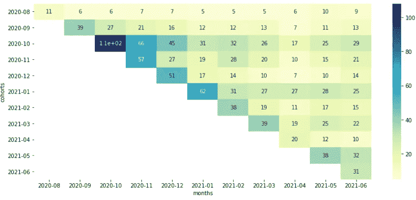
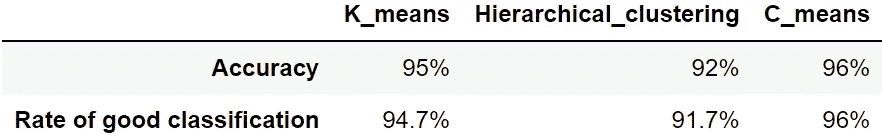
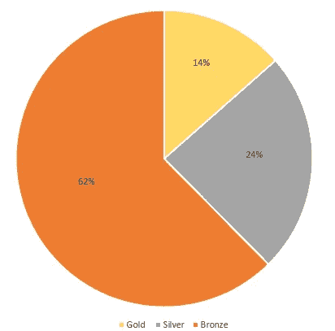
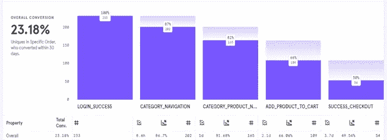
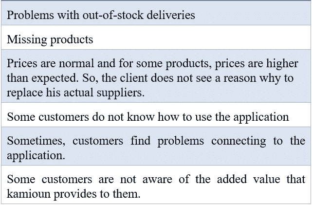
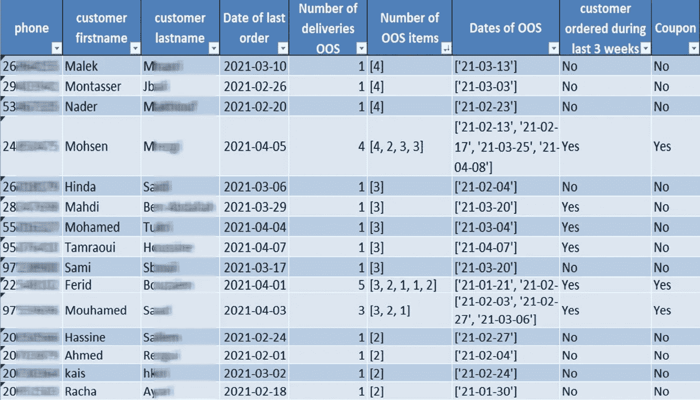
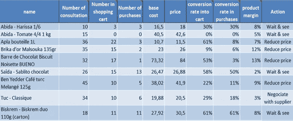
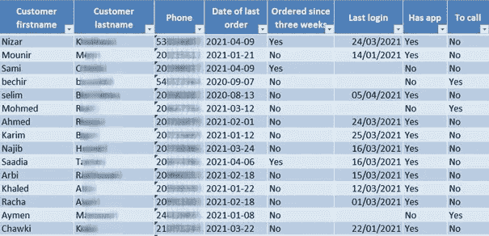

# 机器学习和数据分析改善突尼斯一家初创公司的营销策略

> 原文：<https://medium.com/analytics-vidhya/machine-learning-and-data-analytics-to-improve-the-marketing-strategy-of-a-tunisian-startup-52e21374851f?source=collection_archive---------8----------------------->

***简介***

在本文中，作为第一步，我们将分析一家电子商务初创公司的数据，以了解客户的购买行为。然后，我们将应用 STP(细分、目标和定位)框架来确定适当的营销策略。因此，本文由五部分组成:

第一部分:介绍研究的背景和问题。

第二部分:根据 RFM 标准对客户进行细分。

第 3 部分:根据盈利能力和细分市场的规模锁定客户。

第 4 部分:从客户的角度定位公司。

第 5 部分:提出基于数据分析的解决方案，以改善营销组合。

***呈现学习的脉络和问题***

我们将要实施我们的解决方案的初创公司是一个 B2B 市场，它连接了快速消费品(FMCG)制造商和小型杂货店。它提供了一个透明的市场，允许零售商通过一个平台下订单，该平台包含通过精心管理的第三方物流网络在 24 小时内交付的各种产品。同时，各种数据都保存在一个结构良好的数据库中，包括订单数据库、客户数据库、产品数据库和制造商数据库。

大多数初创公司在第一年更多地关注开发他们的技术解决方案，而不是在客户中营销和宣传自己。这可以追溯到许多原因，其中最相关的是缺乏必要的预算。

然而，如果没有营销计划，公司的增长将会放缓，甚至可能停滞。新客户会非常少，现有客户可能不知道新产品或即将到来的销售，减少了他们成为回头客的机会。这可以在保留矩阵中显示:

> 保留矩阵计算每个群组每个月的购买者数量，其中群组代表在同一个月加入创业公司的客户群。它旨在衡量变革是否会提高客户参与度。换句话说，它评估营销策略的行动是否提高了销售额，从而增加了收入。

保留矩阵

正如所观察到的，x 轴代表从 Kamioun 推出到分析日期的月份，y 轴代表群组，单元格根据矩阵右侧的色标显示每个群组每月的购买者数量。左边的竖条给出了分析的最后一个月(即 2021 年 4 月)每个群组的买家数量。

以代表从 2020 年 10 月开始使用 Kamioun 服务的客户群为例。在第一个月，这个群体中的买家数量非常高，超过 300 人，然后在几个月内开始急剧下降，直到 2021 年 4 月达到近 60 人。不幸的是，这种现象在所有其他群组中都观察到了，这反映了不鼓励客户定期使用该服务的不良营销策略。

因此，在本文中，我们旨在通过开发基于数据分析的解决方案来改善一家突尼斯初创公司的营销策略，而无需任何预算。

***根据 RFM 标准对客户进行细分***

为了能够推出方便的营销组合，我们将遵循 STP 营销模式。

> STP 营销模式(细分、目标、定位)是现代营销中常见的战略方法。最常见的是，STP 模型被用于电子商务业务，它显示了其有效性，并产生了惊人的结果。要了解更多关于这种方法的信息，你可以访问这个[网站](https://www.yieldify.com/blog/stp-marketing-model/)。

在本节中，我们将从 STP 框架的第一个分支开始，即细分。它包括根据有意义的标准将顾客分成同类的群体。在我们的案例中，由于我们正在与一家电子商务初创公司打交道，我们选择的标准(也称为特征)是:

*   最近:自上次订单以来的天数。
*   频率:订单总数。
*   货币:订单的平均花费。

所以，对于每个顾客，我们计算了这些特征。然后，结合主成分分析，应用了三种不同的机器学习分类模型:K-means、层次聚类和 C-means。

所有模型都将客户分为三类:金、银、铜。为了选择最适合我们情况的模型，我们基于混淆矩阵确定了正确分类的准确率和比率。

分类模型的性能

正如所观察到的，C-means 具有最高的准确性和良好分类率，这就是为什么我们将采用该模型给出的结果来进行其余的分析。

***根据盈利能力和细分市场的规模瞄准客户***

确定目标的第一个目标是根据盈利能力和规模来评估客户的细分。第二，它旨在选择一个目标战略，以确定哪一组客户是营销战略的重点。

*   *根据盈利能力评估客户*

评估每个细分市场盈利能力的最佳方法是计算 CLV(客户终身价值)，其公式如下:

> CLV =交易总数*每笔交易的平均收入*利润

为了确定每组客户的 CLV，我们编写了一个 Python 脚本，其中导入了订单数据库以及包含客户细分结果的数据帧。然后，我们执行一些查询来获得想要的结果。

因此，我们从获得的结果中注意到，黄金客户是盈利能力最高的客户。然后是银牌客户，最后是铜牌客户，他们对利润的贡献最低。

*   *根据规模评估客户*

在营销活动中选择关注哪个群体之前，了解每个细分市场的客户数量非常重要。事实上，越是有潜力快速增长的客户群，购买该客户群的可能性就越大。因此，对于我们的案例，客户的分布如下图所示:

客户分布

据观察，大多数客户属于青铜级，占 62%。另一方面，白银和黄金客户的比例较低，分别为 24%和 14%。

根据不同标准评估客户细分后，我们得出以下结论:

*   黄金和白银客户代表着公司的利润来源，因为他们拥有更高的 CLV。这就是为什么最好向数据库中添加更多极有可能成为金牌或银牌客户的原因。
*   青铜客户对公司利润的贡献不如其他客户。但是他们代表了大部分客户。这就是为什么明智的做法是想办法鼓励他们下订单，从而至少成为白银级客户。

***从客户的角度定位公司***

在定位中，我们试图理解客户对公司产品或服务的观点。这可以通过跟踪客户购买行为和进行市场调查来实现。

为了跟踪客户的购买行为，我们使用了一个名为 Mixpanel 的产品分析平台。这个[链接](https://leadsbridge.com/blog/how-to-boost-productivity/what-is-mix-panel/)包含了更多关于这个工具的信息。因此，我们确定了转换率，它衡量的是成功完成下订单的应用程序用户占用户总数的百分比。下图显示了 Mixpanel 给出的结果:

从登录到结账的转化率

如上图柱状图所示，从打开应用到购买的整体转化率为 23.18%。这一比率被认为非常低，这使我们得出结论，客户对服务不够满意。这就是为什么进行市场调查以了解这种行为背后的原因是很重要的。

在进行市场调查后，我们尝试将客户最常遇到的问题汇总到下表中:

最常见的客户服务问题

***提出基于数据分析的解决方案，改善营销组合***

基于 STP 分析，我们可以决定采取什么行动来改善营销组合。这些活动分为三个部分:产品、价格和促销。

*   *产品*

营销词汇中的产品既可以指实物商品，也可以指服务。由于我们从事 it 工作的初创公司被认为是一家服务公司，我们将在这一部分讨论应该采取哪些措施来改善服务。

正如在市场研究阶段所注意到的，许多顾客抱怨 OOS(缺货)。不幸的是，在大多数情况下，创业公司无法控制这种现象，因为这个问题背后的唯一原因是供应商的产品不可用。但是，我们可以赔偿受此事件影响的客户。

在这个框架内，我们开发了一个 Python 脚本，可以定期确定应该得到补偿的客户列表。这种补偿包括一张优惠券，提供给两次以上未完成交付的客户，其中包括至少两件 OOS 商品。为此，我们首先确定每位客户未完成交付的数量、每次未完成交付的 OOS 产品数量列表以及未完成交付的日期列表。然后，我们添加了一个“优惠券”列，对于满足以下两个条件的客户，我们在其中写“是”:

*   在过去三周内订购了。
*   有两个以上的未完成交货，包括至少两个项目 OOS。

最后，生成的数据帧将自动保存在 excel 文件中，如下表所示:

OOS 交付结果摘录

*   *价格*

正如在市场调查中观察到的，许多客户对创业公司提供的价格有异议。这就是为什么在这一部分，我们将提出一个既符合公司利益又符合客户利益的解决方案。

解决方案的第一部分包括跟踪每种产品在应用程序中导航时被咨询的次数以及购买时的转化率。因此，一个被咨询了很多次但没有被购买的产品意味着它是一个非常受欢迎的产品，但客户由于它的高价格而没有购买它。接下来是第二步，我们根据利润阈值采取行动:

*   对于利润率超过 3%的产品，我们可以降低价格。
*   对于利润低于 3%的产品，我们将尝试与合适的供应商重新谈判。

这样，顾客将不再关心价格，因此他们的购买量将会增加，从而导致公司利润的增长。

与上一个解决方案相同，我们开发了一个 Python 脚本，该脚本定期提供一个 excel 文件，如下表所示:

价格分析结果的摘录

由于上面的 excel 表格，很容易利用产品的转换率和利润来做出正确的决定

*   *促销*

我们通过询问客户发现，他们中的大多数人，尤其是铜像，并不太了解创业公司服务的特点。因此，促销就成了不可或缺的角色，其目的是将服务商业化，以刺激需求。

在这种情况下，我们将把重点放在一种方法上，这种方法在我们的案例中显示了它的威力。这种方法被称为电话销售，包括定期给目标客户群打电话，并与每个人进行个性化的交谈，以说服他购买。

我们这一阶段的任务是准备电话销售的客户名单。事实上，这个列表取决于我们想要锁定的客户群。例如，我们可以向那些未能登录到应用程序的客户或者那些在特定时间段内没有订购的客户发送邮件。因此，我们开发了一个 Python 脚本来确定三周以来没有订购并且还没有安装应用程序的客户列表。结果将自动保存在 excel 文件中，如下所示:

电话销售分析结果摘录

***结论***

在本文中，我们将 STP 方法应用于一家突尼斯初创企业。因此，我们首先使用最流行的机器学习分类技术对客户进行细分。得益于这些模型，我们能够将客户分为三类，即黄金级、白银级和青铜级。接下来，我们根据 CLV 和规模对每个细分市场进行评估，以确定目标客户。然后，我们通过 Mixpanel 和市场调查，在目标受众的心目中定位创业公司的服务。最后，我们推出了基于数据分析的解决方案，以增强营销组合的三个分支，即产品、价格和促销。