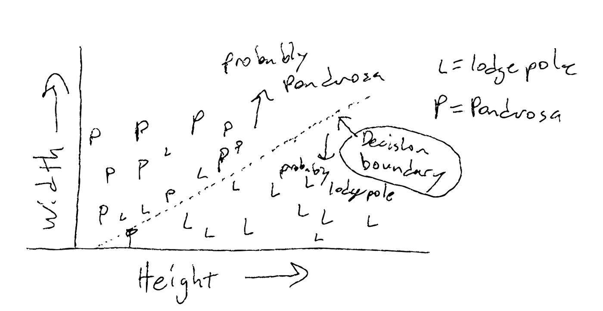
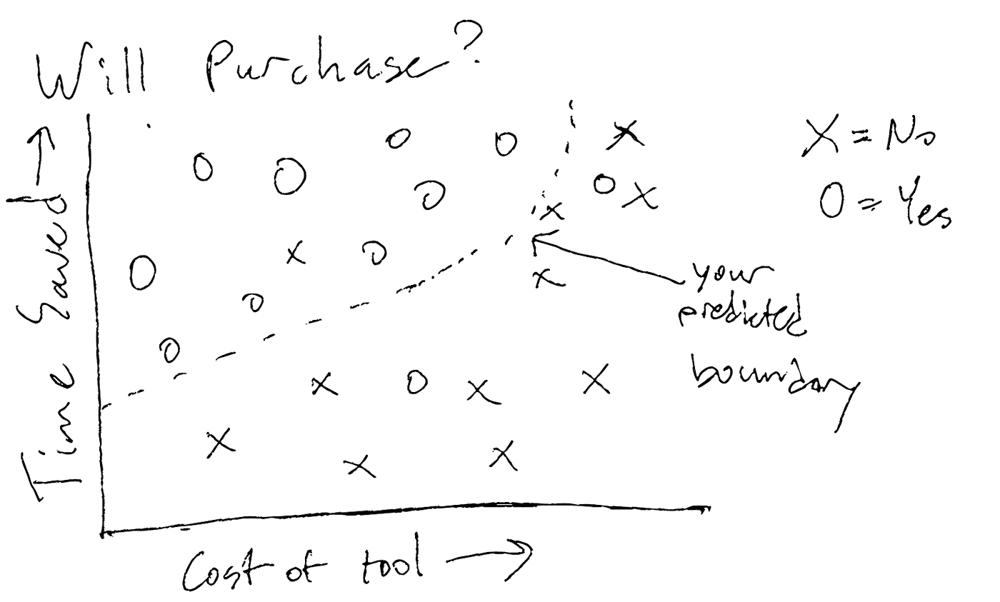
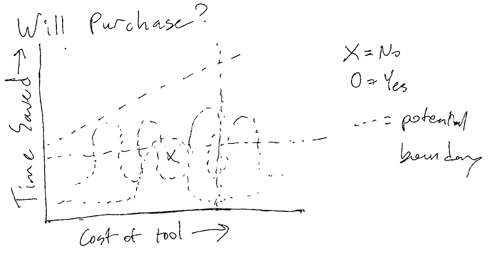
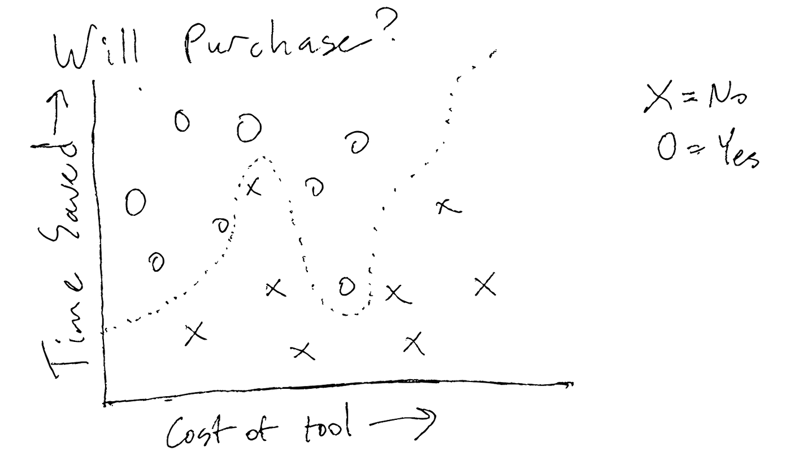

# 机器学习和领导力

> 原文：<https://medium.com/analytics-vidhya/machine-learning-and-leadership-a31dd40d813b?source=collection_archive---------24----------------------->

## *h . A . A . d .(人类作为数据点)的寓言——不需要理解机器学习*

*照片由* [*克里斯利维拉尼*](https://unsplash.com/@chrisliverani?utm_source=unsplash&utm_medium=referral&utm_content=creditCopyText) *上* [*下*](https://unsplash.com/s/photos/data?utm_source=unsplash&utm_medium=referral&utm_content=creditCopyText)

在我与 Siamo 的合作中，我们坚信以人为本的方法。人不是资源，不能像电脑一样被人指手画脚，比技术更复杂。

也就是说，将人培养成领导者很像开发一个机器学习数学模型。听我说完。

# 机器学习的核心概念

这部分不是技术，但是很书呆子气。如果你想直接了解这一点如何应用于领导力，你可以跳过这一部分，但如果你想事先快速了解机器学习，请继续阅读。

对于机器学习和人工智能来说，目标通常是相同的——训练代码来识别模式，并创建一个模型来“做出决定”，在未来类似的情况下做什么。

这些模型有许多已经运行的例子，被广泛使用:

1.  **Snapchat 过滤器**——人类的面孔足够独特，我们可以使用 Face-ID 来保护我们的手机，但也没有独特到我们无法训练计算机知道嘴在哪里，我们的舌头是否伸出来，从而知道在哪里添加兔子耳朵和火花。
2.  **检查农业健康** —计算机已经在数百张水果、蔬菜和作物的图片上接受了训练，以捕捉疾病，或自动调整浇水/施肥计划，或确定哪些水果和蔬菜可以在超市货架上出售，而不是切碎用于食品生产。
3.  **照片中的物体识别**——能够在不被告知的情况下确定照片中的物体(想想硅谷秀中的热狗，而不是热狗应用程序)

所有这些现在都可以在没有人工干预的情况下发生，极大地提高了各种用例的处理速度..

作为人类，我们无时无刻不在不假思索地进行这种分类。看过足够多的鸟后，我们可以告诉你我们是否看到了一只鸟，即使我们从未见过这个物种。我们对特定识别训练得越多，我们就能得到越多的细节，就像一个鸟类学家能立即区分其他人会忽略的长相相似的雀鸟。机器学习模型也是如此。

# 太棒了。这和领导力有什么关系？

作为领导者，我们必须帮助团队完成目标。从公司的角度来看，它可能是一个项目、一项业务或任何其他需要协作和规划的计划。作为领导者，我们希望帮助那些需要自己完成的事情。

从领导力的角度来看，当我们相信我们的团队能够自主地解决尽可能多的问题时，任何工作都会更成功，工作量也会明显减少。我们越是帮助我们的团队了解自己的情况，他们将来就越有可能在没有帮助的情况下做出好的决定，这为每个人腾出了一些宝贵的时间，并避免了当领导者无法提供帮助时(比如说，想休假)的信心危机。

像领导人类一样，训练计算机(最终通过 0 和 1“理解”世界)评估复杂情况的过程至少可以说有点复杂。有几十种技术和工具，都有各种各样的权衡，可以单独使用或串联使用，都是为了创建精确的预测模型，在没有我们持续指导的情况下运行。

# 一个应用实例

机器学习中的一个常见问题是创建“决策边界”，也就是说，给定一组新输入，机器能否“决定”下一步做什么，是对输入进行分类，还是预测接下来会发生什么？

例如，如果给你许多黄松和美国黄松的高度和宽度，如果给你一棵新松树的高度和宽度，你能准确预测正在测量的是什么类型的树吗？

您拥有的数据可能如下图所示，虚线代表决策边界。一侧的输入将以一种方式分类，另一侧将以另一种方式分类。

将此转化到人/业务环境中，想象一下您团队中的某人发现了一种新工具，他们想购买这种工具来提高工作效率。他们想知道高管团队是否愿意购买。

作为领导者，您从经验中了解到，执行团队想要知道将节省多少时间和金钱，以便他们可以准确评估该工具是否值得。

在 X/Y 图上，我们可以指定 X 为工具的价格，Y 为节省的时间/金钱。作为领导者，我们被要求就这一特定购买是否会得到高管的认可给出过多/过少的信息，我们有一系列选择来决定如何进行。

根据您的经验，您已经看到执行团队做出了许多这样的决策，并且您已经在心里像这样规划了这些决策:

你知道，高管们的裤腰带非常紧，在节省大量时间之前，他们甚至不会考虑使用某个工具，即使这样，他们也会对超过某个价格的价格感到震惊，不太可能继续前进。

什么是帮助你的团队理解他们将来如何做出这些决定的最有用的方法？

# 一次性的答案

一种选择是直截了当地告诉你的团队成员你认为答案会是“是”还是“否”。也许你会根据你过去的经验做出预测，或者也许你只是知道答案会是“否”，因为今年的预算非常紧张。不管你的理由是什么，你都没有向你的队友解释这些因素。

在这种情况下，你已经回答了他们的问题，但是没有给他们在未来做出类似决定的能力。他们可能不理解这是一个异常值，或者可能认为他们知道为什么这是一个是或否，并形成他们自己潜在的非常扭曲的预测。

从一个数据点(甚至只有几个数据点)开始，潜在的决策边界几乎是无限的:

在机器学习中，这将被认为是一个“不适合”的模型，也就是说，它不能很好地捕捉可用数据，并且很可能不能准确预测我们正在寻找的结果。

作为领导者，我们要么创造了一种局面，在这种情况下，人们必须在他们没有学习或成长的情况下回到我们这里寻求未来的答案，从而使我们成为这种决策的瓶颈。或者我们没有提供足够的指导，团队成员将在未来做出可能无益(并且可能代价高昂)的猜测。

# 给出太多的上下文

另一方面，我们可以选择告诉团队成员我们所看到的高管们做出的每一个决定。如果我们向他们提供我们背景的所有信息，他们肯定会有信息提出他们自己的模型，并对未来做出他们自己的预测，对吗？

在没有测试和解释上下文的情况下，我们可能会给我们的队友一个如下所示的预测模型:

现在，高管们看起来似乎几乎是在追随一种趋势，但在一定的成本/效率水平下，他们似乎会接受一项我们可以看到并不真正符合趋势的采购，反之亦然。

在机器学习中，这被称为“过度拟合”，也就是说，我们拥有的模型在预测已知数据方面非常准确，但对现有数据的细微差别过于敏感，很可能无法准确预测新的场景。我们发现的错误越多，我们就越不可能信任这个模型，也越有可能完全避免使用它。

如果我们作为领导者这样做，我们的团队可能会发现我们没有帮助(或微观管理),并避免在未来找我们，这可能会很快造成双方的怨恨以及沟通障碍。

# 找到平衡

在领导力和机器学习中，当我们提供一个具有良好“拟合”水平的模型时，我们会发现最大的好处。我们可以传授智慧，让我们的团队理解并在未来做出好的决策，知道智慧不会适合每种情况，当未来发生异常时，我们应该为自己和我们的队友着想。

我们希望提供足够的信息和指导性问题来帮助我们的团队自给自足。

这种自主性防止团队由于微观管理而精疲力竭，并有助于激发对领导者和团队的信任。

*原载于* [*暹罗博客*](https://www.wearesiamo.com/blog)