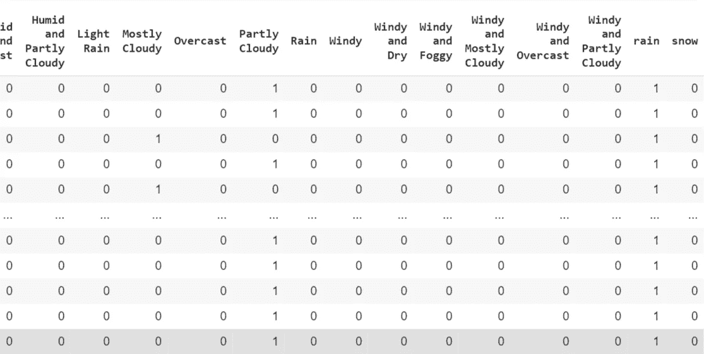
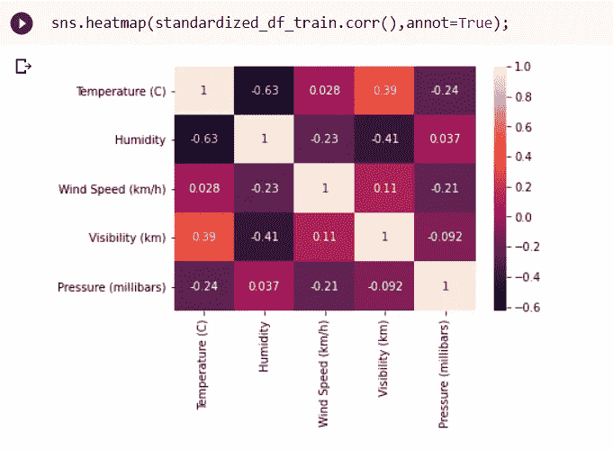

# 表观温度预测的机器学习方法

> 原文：<https://medium.com/analytics-vidhya/machine-learning-approach-for-apparent-temperature-prediction-6751e750f9d5?source=collection_archive---------8----------------------->

嗨，伙计们，很高兴见到你们。今天，我将向您展示分析天气历史数据集并使用该数据集进行预测的基本工作流程。

点击下面的数据集链接。

[](https://www.kaggle.com/budincsevity/szeged-weather?select=weatherHistory.csv) [## 塞格德 2006-2016 年的天气

### 每小时/每天汇总温度、压力、风速等信息

www.kaggle.com](https://www.kaggle.com/budincsevity/szeged-weather?select=weatherHistory.csv) 

现在让我们看看我们的数据集是什么样子的:


天气历史数据集

以下是每小时可用的响应数据:

**格式化日期**:此处日期和可用时间，**汇总**:逐时汇总，**每日汇总**:当日汇总，**降水类型**:降水类型(无论是雪还是雨)，**温度**，**视在温度**:人类感知的温度当量，**湿度**:空气中的水汽量，**风速，风向:**

首先，让我们看一下程序概述:


首先，我们需要做预处理来去除数据集的噪声。大多数情况下，缺失值、异常值或异常值是数据集中出现噪声的原因。此后加载数据集时，我们将首先处理缺失值。

```
import warnings
warnings.filterwarnings('ignore')
import os
import numpy as np
import pandas as pd
import scipy.stats as stats
from matplotlib import pyplot as plt
%matplotlib inline
import sklearn
from sklearn.model_selection import train_test_split
from sklearn.metrics import accuracy_score
from sklearn.linear_model import LinearRegression
import tensorflow as tf
from tensorflow import keras
from sklearn import preprocessing
import pandas as pd#Mount the drive
from google.colab import drive
drive.mount('/content/drive')#loading the dataset
df = pd.read_csv('/content/drive/My Drive/Colab Notebooks/data/weatherHistory.csv')
df.head(10)#checking if there any null or NAN value
df.isnull().any() 
```


这里 precip 类型中有缺失值，这些值的数量很少考虑到整个数据集。整个数据集中缺少的数量是 0.536%，因此我们可以使用下面的代码删除这些行。

```
df = df.dropna()*#drop all nan*
```

之后，我们将删除重复如下。


这里你可以看到压力有异常值，但当我检查时，有 1288 个零值，所以它是一个异常值。如果值不仅远离正态分布，而且只有很少一部分应该在那里，我们就认为它们是异常值。

然后，我们将检查是否有可用的异常值或异常值。当谈到异常时，大多数时候我们需要添加一个类别，但这里湿度和压力值为 0 是不可接受的。可以看出，它们是误读，在湿度中，只有 22 个数据点的值为零。所以，我决定放弃这几行。

```
#Removing humidity 0 rows
X.drop(X[X['Humidity'] == 0].index, inplace = **True**)
```

当谈到压力时，它有 1288 个数据点，零值可用。因为百分比不低于 0.5%，我们不能放弃它。这里我认为压力值 0 是一个缺失值，因为压力值 0 是一个不可接受的值。所以我决定用最小百分位值 0.1%来代替它们


```
fig, axes = plt.subplots(1,2)
plt.tight_layout(0.2)
print("Previous Shape : ",X.shape)
sns.boxplot(X['Pressure (millibars)'],orient='v',ax=axes[0])
axes[0].title.set_text("Before")
Q1 = X["Pressure (millibars)"].quantile(0.10)
Q3 = X["Pressure (millibars)"].quantile(0.95)
print(Q1,Q3)
IQR = Q3-Q1
print(IQR)
lower_limit = Q1 - 1.5*IQR
upper_limit = Q3 + 1.5*IQR
print(lower_limit,upper_limit)X['Pressure (millibars)'] = np.where(X['Pressure (millibars)']>upper_limit,upper_limit,X['Pressure (millibars)'])X['Pressure (millibars)'] = np.where(X['Pressure (millibars)']<lower_limit,lower_limit,X['Pressure (millibars)'])print("Shape After :", X.shape)
sns.boxplot(X['Pressure (millibars)'],orient='v',ax=axes[1])
axes[1].title.set_text("After")
plt.show()
```

由于下面提到的原因，我们将放弃这些值。

大声覆盖:整个数据集只有一个值

格式化日期:对于每个数据行都是唯一的

每日汇总:可以根据汇总属性导出

```
X=X.drop([ 'Daily Summary','Loud Cover','Formatted Date'], axis = 1)
```

然后我们在这里进行编码，主要有两种编码方式。

1.  标签编码
2.  一个热编码

**标签编码**是指将标签转换成数字形式，从而转换成机器可读的形式。

[](https://www.geeksforgeeks.org/ml-label-encoding-of-datasets-in-python/) [## Python - GeeksforGeeks 中数据集的 ML |标签编码

### 在机器学习中，我们通常处理包含一列或多列多个标签的数据集…

www.geeksforgeeks.org](https://www.geeksforgeeks.org/ml-label-encoding-of-datasets-in-python/) 

一个热编码

移除整数编码变量，并为每个唯一的整数值添加新的二进制变量。


在这里，我使用了一个热点编码，当谈到标签编码时，它不适合线性模型，因为数字可以被解释为具有顺序，并且模型可以假设线性关系。同时，如果我们对有许多类别的属性使用一键编码，由于它有许多虚拟变量，这是不合适的，并且这会引入冗余信息。

```
def encode_features(before_coding):
encoded_df_1 = pd.get_dummies(before_coding['Summary'])
encoded1 = pd.concat([before_coding,encoded_df_1],axis=1)
encoded_df_2 = pd.get_dummies(before_coding['Precip Type'])
encoded2 = pd.concat([before_coding,encoded_df_2],axis=1)
df_new=pd.concat([encoded1,encoded2.iloc[:,-2:]],axis=1)
coded_df = df_new.drop(['Summary','Precip Type'],axis=1)
return coded_dfX = encode_features(X)
```



编码后

移除缺失值和异常后，我们需要分割数据集。这里这样做的原因是为了避免数据泄漏。假设我们有一个数据集，我们获得了 99%的准确率，但当我们在真实世界的数据中测试它时，它失败了。当我们在不分割数据集和单独应用的情况下进行标准化、转换和裂缝提取等预处理技术时，就会发生这种情况。这将影响性能的水平。因此，在本例中，我们将首先分成 80%的训练数据集和 20%的测试数据集。如下面的代码所示。

```
target_column = pd.DataFrame(X['Apparent Temperature (C)'])X = X.drop(['Apparent Temperature (C)'], axis='columns')X_train, X_test, y_train, y_test = train_test_split(X, target_column, test_size=0.2)
```

当我们查看箱线图、Q-Q 图或直方图时，可以看到湿度是左偏的，风速是右偏的。我们总是喜欢正态分布而不是偏态分布。在方框中也可以看到它们是倾斜的。

什么是左斜或右斜？


移除异常值和异常值后的箱线图


非分类变量直方图

为了解决这个问题，我们可以使用转换。这里，对于湿度和能见度(左偏)，我们可以使用 exp，对于风速(右偏)，我们可以使用对数变换或 sqrt 变换。

```
#Do the  trasnformations for required featuresfrom sklearn.preprocessing import FunctionTransformer
X = df.copy()
#Righ skewed transformationsqrt_transformer = FunctionTransformer(np.sqrt)
data_new = sqrt_transformer.transform(X['Wind Speed (km/h)'])
X['Wind Speed (km/h)']=data_new#left skewed tranformation
exp_transformer = FunctionTransformer(np.exp)
data_new1 = exp_transformer.transform(X['Humidity'])
X['Humidity']=data_new1expo_transformer = FunctionTransformer(np.exp)data_new1 = expo_transformer.transform(X['Visibility (km)'])
X['Visibility (km)']=data_new1X.hist()
```

转换后，直方图如下所示


变换后的直方图

## 标准化

然后我们将标准化数据集的非分类变量。我们这样做是为了使数据内部一致和规范化。

```
from sklearn.preprocessing import StandardScalernoncategoricaldata =  ['Temperature (C)','Humidity','Wind Speed (km/h)','Wind Bearing (degrees)','Visibility (km)','Pressure (millibars)']standardization = StandardScaler()
standardization.fit(X[noncategoricaldata])
X_Scaled=standardization.transform(X[noncategoricaldata])
X[noncategoricaldata] = X_Scaled
```

标准化后的数据集如下图所示


标准化后的箱线图和直方图如下


然后，我们可以专注于对风向进行离散化，因为它与风向有关，当我们考虑 360 度时，我们知道主要有 8 个方向。因此，我们可以将面元大小设置为 8，并将连续值转换为离散值，使其平滑且易于理解。

```
# create the scaler object
scaler = StandardScaler()
data1 = pd.DataFrame(X3_train, columns=['Wind Bearing (degrees)'])data1 = data1.dropna()
data2 = pd.DataFrame(Y3_test, columns=['Wind Bearing (degrees)'])
data2 = data2.dropna()# fit the scaler to the  datadiscretizer = KBinsDiscretizer(n_bins=8, encode='ordinal', strategy='uniform')
discretizer.fit(data1)_discretize1 = discretizer.transform(data1)
_discretize2 = discretizer.transform(data2)
X_dis = pd.DataFrame(_discretize1)
Y_dis = pd.DataFrame(_discretize2)
X_dis.hist()
```

现在，我们将使用特征提取技术，如降维和相关矩阵。谈到降维，我们可以删除冗余数据，保留对训练模型有用的相关信息。为此，我们可以使用不同的技术，如 PCA，SVG。在这里，我将使用主成分分析，这是众所周知的主成分分析(PCA)。这里实际发生的是增加可解释性，同时最小化信息损失。它通过创建新的不相关变量来实现方差的连续最大化。

在这里，通过使用训练数据集，我们分析维度，然后根据这些维度转换训练数据集和测试数据集。这里，我使用主成分分析将维度最小化到 11。

```
from sklearn.decomposition import PCA
from sklearn.preprocessing import StandardScaler
pca = PCA(n_components=11)
pca.fit(X1_train)
X_train_pca = pca.transform(X1_train)
X_test_pca = pca.transform(Y1_test) 
```


这是主成分分析的协方差矩阵。

最大化总扩散=最小化重建误差

如果我们可以最小化重建误差，那么我们可以进行降维，因为这个动作的损失是低的。当我们考虑每个属性的主成分分析方差比时，如果它低于该维度，则不符合数据的主要分布。因此，移除这些维度不会有太大影响，并且这些维度的重建误差很低。

```
pca.explained_variance_ratio_
```


主成分分析比率

在这里，为了决定我们需要的维数，我们将从最高比率增加到最低比率，直到我们得到一个大于 90%的值

那么我们可以认为 90%的数据细节都可以在这些维度上获得

另一种特征提取技术是相关矩阵。它将给出每两个属性之间的关联。如果有高度相关的属性，我们需要删除它们。正如你们所看到的，没有任何属性与另一个属性有更高的相关性。其具有高度接近颜色 1.0。



这里，当有两个维度时，举个例子，如果我们决定得到目标，因为湿度和温度以及表观温度是特征，那么我们可以看到表观温度和温度是高度相关的。然后，我们可以删除其中一个，检查删除它是否对模型有影响，并决定删除它。

当谈到显著性矩阵时，正如您在下面看到的，我们在本例中将目标“表观温度”包括在相关矩阵中。如果与目标相关的矩阵值接近于零。然后，根据我们减少维度的要求，我们可以删除它，因为它们不会影响目标值。

```
d_data = standardized_df_train.copy()
d_data['Apparent Temperature (C)'] = train_y
d_data.head(10)
print(d_data.corr())
sns.heatmap(d_data.corr(),annot=True)
```


当谈到线性回归时，它所做的是模拟标量响应和一个或多个解释变量之间的关系。这里我们给出了数据集，并检验线性模型是否能准确预测测试值。


这是逻辑回归方程。人口斜率被称为权数。当权重较低且准确度较高且均方误差较低时。我们可以把它作为一个好的模型。具有 99%的准确度和较大的权重可能是过度拟合模型的结果。


均方误差(MSE)被广泛地用作确定算法性能的度量。均方差是目标值和预测值之差的平方的平均值。


MSE 方程

这里 yi 是真值，其他 yi 帽子是预测值。当它更低时，模型变得更好。

RMSE:均方根误差，这里指的是预测误差的标准差。意思是“数据点离回归线有多远”。

RMSE 应该小于 0 到 1。那就好了。

模型的准确性是正确预测的百分比。在这个模型中，准确率为 97%。

希望你了解了应用线性回归模型的步骤。谢谢你。