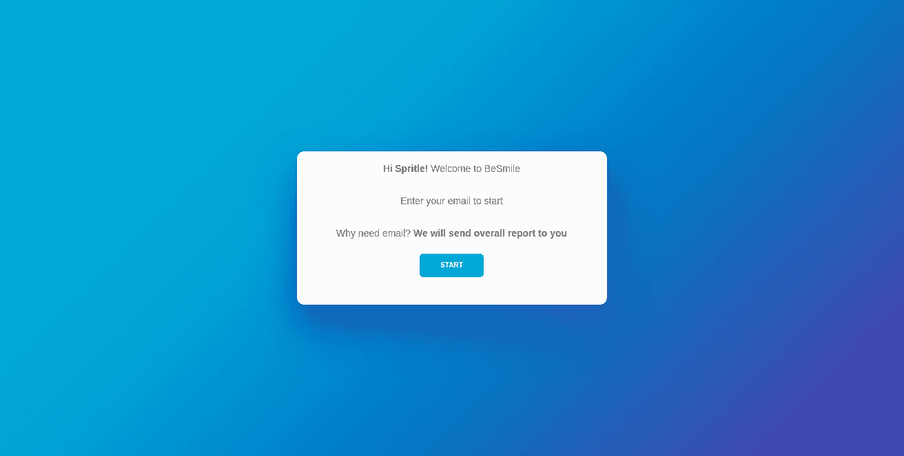
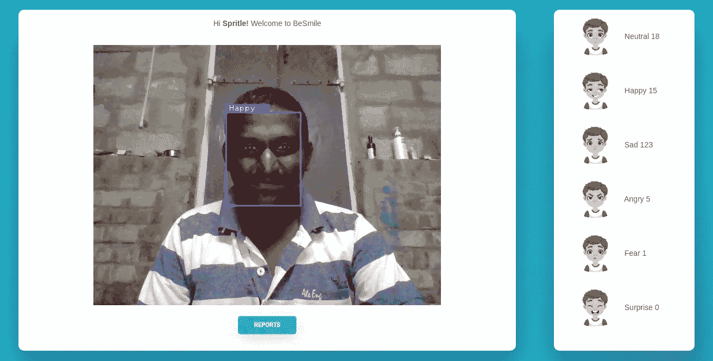
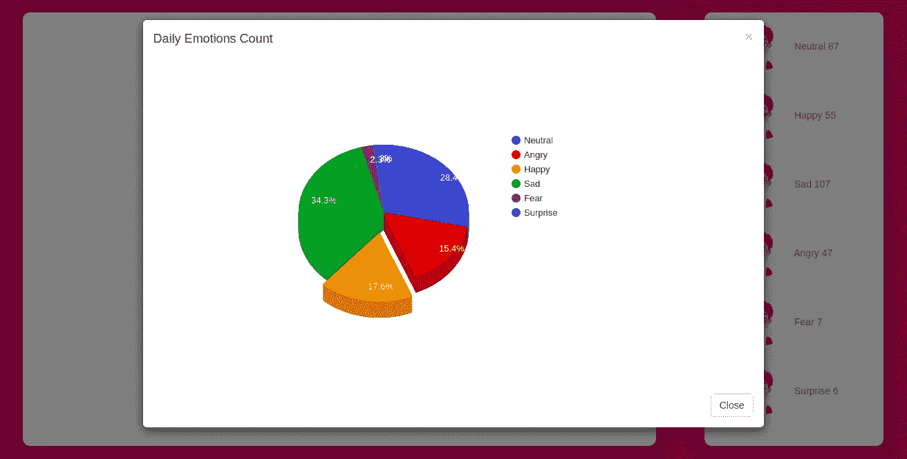
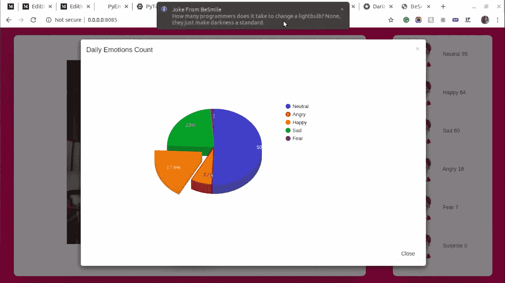

# 机器学习——bes mile App with GridDB

> 原文：<https://medium.com/analytics-vidhya/machine-learning-besmile-app-with-griddb-543f1b55e4ec?source=collection_archive---------8----------------------->

## 使用人工智能程序和 GridDB 来检测人们在工作时的情绪

由 [Karthick Nagarajan](https://medium.com/u/3d009db858de?source=post_page-----543f1b55e4ec--------------------------------) 创作

## **简介**

在这篇博客中，我们将了解**如何使用机器学习应用程序**如 [**BeSmile**](https://github.com/karthick965938/BeSmile) App。GridDB 是一个为物联网应用和机器学习应用而构建的数据库。这里我要解释一下如何用 python 连接 GridDB，以及如何为 Python 通信 GridDB。我不想让你觉得无聊，我们开始吧。

## BeSmile 是什么？

[**BeSmile**](https://github.com/karthick965938/BeSmile) 是一款 web app，主要用[**pyeomotion Python 包**](https://github.com/karthick965938/PyEmotion) 构建。BeSmile 的主要核心部分是使用人工智能程序来检测人们在工作时的情绪。这有助于增加你开心的脸的数量。

## **什么是 GridDB？**

[GridDB](https://griddb.net/en/) 是一个高度可扩展的内存 NoSQL 时序数据库，针对物联网和大数据进行了优化。GridDB 有很好的关于[安装过程](https://griddb.net/en/blog/griddb-quickstart/)的文档，他们也有支持多种编程语言的指南。在这里，我正在使用 Python for BeSmile 应用程序，我正在使用[这个](https://griddb.net/en/blog/python-client/)文档来安装 Python 的 GridDB。

在这里，你们有一个疑问，为什么 GridDB 对不对？GridDB 有 IoT 和 ML 的一些规范。下面我补充了 GridDB 的一些物联网和 ML 的终极东西。

**高性能→** GridDB 的“内存第一，存储第二”设计提供了比领先的 NoSQL 数据库高 4-5 倍的平均吞吐量和低 3-4 倍的延迟。

**高可扩展性→** GridDB 使用商用硬件进行线性和水平扩展，即使扩展到 1，000 个节点也能保持出色的性能。

**高可用性&可靠性→** GridDB 通过混合集群管理和容错系统消除了单点故障。

## **为什么我们需要使用贝斯威？**

Besmile 不仅能检测到一个人的情绪，还能帮助你在紧张的工作时间增加快乐的面孔数量。是的，Besmile 会在你工作时间发这个搞笑的笑话。事实上，它真的有助于增加你的快乐面孔数。

因此，BeSmile 的总体想法是提高快乐脸的数量。

Besmile 还可以检测孩子们的情绪，并为在线教师提供见解。我的意思是，在隔离期间，大多数人使用视频会议电话。因此，我们可以在通话和在线课程等过程中跟踪特定人的情绪。

 [## 卡希克 965938/贝斯米尔

### bes mile——使用 PyTorch 进行面部情绪识别的 Python Web 应用程序。BeSmile 是开发和使用 pyeomotion…

github.com](https://github.com/karthick965938/BeSmile) 

## 贝斯米尔是如何工作的？

使用 python flask，我创建了一个简单的 web 应用程序，并实现了 PyEmotion 的功能。这个应用程序基于 3 个主要页面，让我们分别讨论这些页面。

*   **欢迎页面—** 这是应用的起点，只需输入邮箱即可进入下一页。电子邮件选项是强制性的，我们需要输入正确的选项。输入仅在第一次时可用的电子邮件选项。不是每次都这样。

**欢迎页面**

*   **主页—** 这是主页，在这里您可以看到网络摄像头视图和您的情感计数。在 cam 视图下方，报告按钮可用。

**主页——检测一个人的情绪**

*   **弹出报告—** 点击报告按钮，可以查看自己的情绪数。

**报告弹出**

在弹出的报告中，我们可以看到情感的百分比。每隔 10 分钟，应用程序将显示有趣的笑话。我们还可以设置笑话间隔时间，是的，它喜欢酷吧。

**展示笑话**

## 贝斯米尔是如何受到启发来做这件事的？

我坚信下面这句话

> 每个发明都有个人需求

所以，这个想法是在 covid 隔离期间产生的。是的，在隔离期间工作是我人生中最糟糕的部分。每一天我都以一张快乐的脸开始，却以一张愤怒的脸结束。

我需要减少我愤怒的脸。所以，这是构建这个应用程序的主要原因。

## BeSmile 的优点是什么？

*   **功能:**使用不受 GPU 支持的系统没有任何限制，您可以在任何类型的系统以及各种操作系统上运行该应用程序。
*   没有外部 API: 我们不需要在这个应用程序上使用任何外部 API。
*   **数据安全:**每一个用户的数据都会是安全的。不存在数据泄露的可能性。
*   **脱机:**该应用程序将在脱机模式下工作:)
*   **部署:**同样，我们不需要部署任何东西，因为最初，我已经创建了一个名为 PyEmotion 的 python 包。因此，它将负责模型文件的可用性和其他事情。

## BeSmile 的下一步是什么？

*   我会花点时间把这个开发成桌面应用，分享给同事朋友使用。
*   它可以检测孩子的情绪，并为在线教师提供见解。我的意思是，在隔离期间，大多数人使用视频会议电话。因此，我们可以在通话或在线课程等过程中跟踪特定人的情绪。
*   需要添加一个选项，如。每个用户都可以在他们的社交媒体上发布总体报告。
*   将添加空闲选项。
*   检测多人情绪的限制。

# 接触

[**贝斯米尔**](https://github.com/karthick965938/BeSmile) 是由[卡厚·那加拉詹](https://stackoverflow.com/users/6295641/karthick-nagarajan?tab=profile)创造的。请毫不犹豫地通过[Twitter](https://twitter.com/Karthick965938)[Linkedin](https://www.linkedin.com/in/karthick-nagarajan-44800710b/)或[电子邮件联系我们！](mailto:karthick965938@gmail.com)