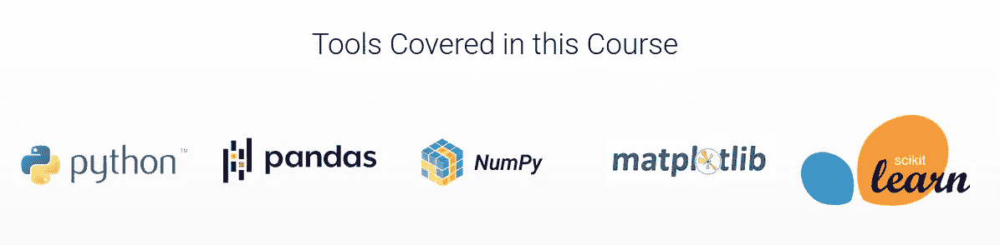
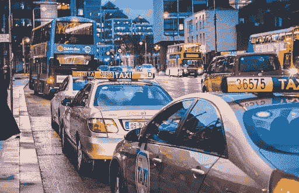

# 面向初学者的机器学习认证课程

> 原文：<https://medium.com/analytics-vidhya/machine-learning-certification-course-for-beginners-cf81af8d2a?source=collection_archive---------4----------------------->

# 是时候开始免费的机器学习之旅了！

从人脸解锁到生物识别考勤，机器学习几乎渗透到人类生活的每个阶段。机器学习是如此广泛，以至于你可能会在不知不觉中一天使用无数次

目前，机器学习就像那个金色的梦，每个人都想要但不知道如何获得。这正是分析 Vidhya 的魔杖发挥作用的地方。我们的课程为高质量的内容设定了基准，我们还为初学者提供了另一门课程**，那也是**免费的**。**

**因此，如果你问自己，“我应该从哪里开始我的机器学习之旅？”，答案是 [***初学机器学习认证课程***](https://courses.analyticsvidhya.com/courses/Machine-Learning-Certification-Course-for-Beginners?utm_source=medium&utm_medium=announcement_article) ***！*****

****

# **什么是面向初学者的机器学习认证课程**

**面向初学者的机器学习认证课程是一个**免费的**循序渐进的在线入门课程，旨在学习机器学习的基础知识，听取行业专家和数据科学专业人士的意见，并在机器学习黑客马拉松中应用您的知识！**

**我们将涵盖 Python 对于数据科学、统计学和 EDA 的重要性、几种机器学习算法背后的潜在直觉，然后使用 Python 中的机器学习概念解决案例研究/项目。**

**因此，如果你每周投资**8-10 小时**学习这门课程，你可以在**6-8 周**内完成整个课程。**

**面向初学者的**机器学习认证课程**的目标是:**

*   **帮助你理解这个领域是如何改变和颠覆行业的**
*   **让你熟悉核心的机器学习算法**
*   **通过竞赛和黑客马拉松来增强和补充您的学习**

**这是点燃你初出茅庐的机器学习生涯的完美起点，并朝着你梦想的数据科学家角色迈出了一大步。我们相信整体学习方法，这就是我们如何为初学者策划 [***机器学习认证课程***](https://courses.analyticsvidhya.com/courses/Machine-Learning-Certification-Course-for-Beginners?utm_source=medium&utm_medium=announcement_article) **！****

# **我将从本课程中学到什么？**

*   **像 Numpy，Pandas 等 Python 库。高效地分析您的数据。**
*   **统计学和探索性数据分析(EDA)在数据科学领域的重要性。**
*   **用于构建机器学习模型的线性回归、逻辑回归和决策树。**
*   **了解如何使用机器学习解决分类和回归问题**
*   **如何使用正确的评估指标来评估您的机器学习模型？**
*   **通过特征工程改善和增强您的机器学习模型的准确性**

**头奖:成功完成课程后，您将获得由 Analytics Vidhya 提供的**区块链认证证书**，终身有效。**

# **本课程涵盖的工具:**

*   **计算机编程语言**
*   **熊猫**
*   **Numpy**
*   **Matplotlib**
*   **Scikit 学习**
*   **海生的**

****

# **本课程涵盖的项目**

*   ****客户流失预测** 这个项目要求你预测每个客户的流失倾向。**

****

*   ****纽约市出租车出行持续时间预测** 该项目将涵盖提取重要特征的技术，并使用纽约 TLC 委员会的数据准确预测纽约出租车出行的持续时间。**

****

# **机器学习认证课程是给谁上的？**

**机器学习认证课程面向以下任何人:**

*   **是机器学习的初学者**
*   **想要开始他们的机器学习之旅**
*   **想了解核心机器学习算法**
*   **对实用的学习环境感兴趣**
*   **想要练习和增强他们现有的机器学习知识**

**但是等等，额外津贴是什么？**

**本课程不需要预先了解数据科学或任何工具。**

****那么，你还在等什么？免费报名参加面向初学者的** [***机器学习认证课程***](https://courses.analyticsvidhya.com/courses/Machine-Learning-Certification-Course-for-Beginners?utm_source=medium&utm_medium=announcement_article) **，立即开始您的学习之旅！****

***原载于 2021 年 8 月 25 日 https://www.analyticsvidhya.com**T21*[。](https://www.analyticsvidhya.com/blog/2021/08/announcing-free-machine-learning-certification-course-for-beginners/)**