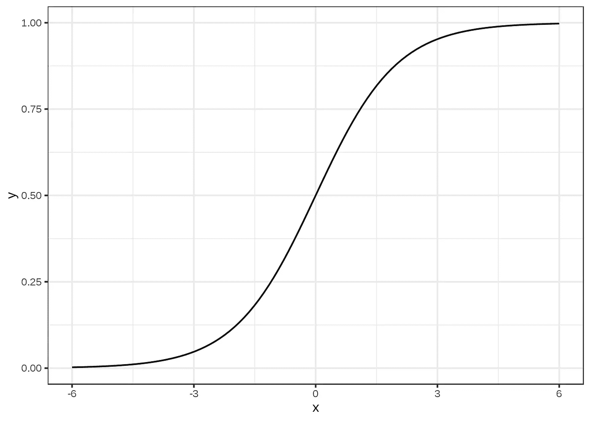
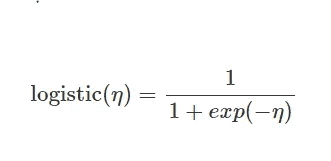

# 机器学习作弊 heat-Logistic 回归

> 原文：<https://medium.com/analytics-vidhya/machine-learning-cheat-sheat-logistic-regression-72d826d64824?source=collection_archive---------9----------------------->

本·怀特在 [Unsplash](https://unsplash.com?utm_source=medium&utm_medium=referral) 上的照片

*大家好*👋*，*

如今，机器学习及其应用正与日俱进。我们每天都很难回忆起与机器学习相关的基本概念。

*因此介绍机器学习算法备忘单系列，我们将在其中回顾与机器学习算法相关的核心概念，这将有助于您解决任何数据科学面试或项目。*

*将会是一个点对点的讲解，快速修正和理解机器学习算法。*

> 所以抓紧了……..

> **逻辑回归**

*   逻辑回归目标*是对具有两个结果 0 或 1，是/否的分类问题的概率进行建模。它基本上是用于执行分类的线性回归模型的扩展*。
*   线性回归基本上对*回归问题有效，但对分类却失败了，为什么？*
*   *线性模型不输出概率，但是它将类别 0 和 1 视为数字，并试图找到最小化点和线之间距离的最佳拟合线。*此外，*它没有给出线性分离两个类所需的概率。*

[来源](https://christophm.github.io/interpretable-ml-book/logistic.html)

*   因此，逻辑回归*不是拟合直线，而是使用 Logit 函数，这是一种 sigmoid 函数，用于压缩 0 和 1 之间的线性方程的输出。逻辑函数定义为:*

*   逻辑回归算法估计*根据给定的自变量落入特定分类因变量的概率。描述单次迭代结果的几率或概率被建模为解释变量的函数。*
*   *逻辑回归根据目标特征数据类型*分为三种类型-

1.  **二元逻辑回归** - *当依赖特征有二元响应是/否或 0/1 等时常用。*
2.  **多项逻辑回归** - *当目标特征有 3 个以上的反应或类别，而没有任何顺序示例预测用于治疗新冠肺炎的药物类型时。*
3.  **有序逻辑回归***——当目标特征有超过 3 个具有特定排序的响应或类别时。预测新冠肺炎严重性的示例，即高/中/低。*

> **逻辑回归用户手册**

***#*** *当有特定要求将目标特征的概率建模为其他解释特征的函数时，可使用逻辑回归。*

***#*** *当需要预测作为其他解释特征函数的二元分类因变量的概率时，使用 Logit 回归。*

***#*** *当需要基于其他解释特征对两个类别进行分类时，使用逻辑回归算法。*

> **Logit 回归的优势**

*   *易于解释且不复杂*
*   *可以处理非线性数据点，因为预测值之间不存在线性关系。*
*   *不假设特征间正态分布的分类算法。*
*   *提供其他机器学习模型的概率分布。*
*   *Logistic 回归也可以从二元分类扩展到多类分类。*

> **Logit 分布的缺点**

*   *当我们拥有高维数和稀疏的训练数据时，可能会发生过度拟合。*
*   *对异常值和缺失值不稳健。*
*   *需要更多的数据点以获得稳定和有意义的结果。*
*   *Logit 回归预测一个依赖于特定独立特征组的结果。*

> **Logit 回归的应用**

*   *逻辑回归算法在流行病学领域的应用。*
*   *用来预测政治选举的结果。*
*   *用于将一组单词分类为名词、代词、动词、形容词。*
*   *用于天气预报，预测下雨的概率。*
*   *在零售银行业务中用于预测贷款违约或风险管理。*

ℹ ***Scikit 学习实现的逻辑回归算法可以在这里找到*******。****

*ℹ ***R 实现的逻辑回归算法可以在这里找到*******。*****

> **以上几点，希望你对 Logistic 回归有更好的理解。你也可以破解任何与逻辑回归算法相关的面试问题。**
> 
> **ML 的下一个备忘单，算法请参考这个[链接](/analytics-vidhya/machine-learning-cheat-sheat-support-vectors-machines-8abb9c350804)。**

# **请点击这里查看我的其他与 ML/DL 相关的博客[。](https://shashwatwork.github.io/blog/#)**

**如果你喜欢这个帖子，请关注我。如果你注意到思维方式、公式、动画或代码有任何错误，请告诉我。**

**干杯！**