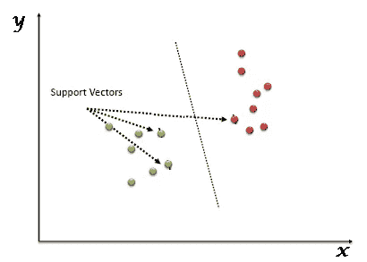
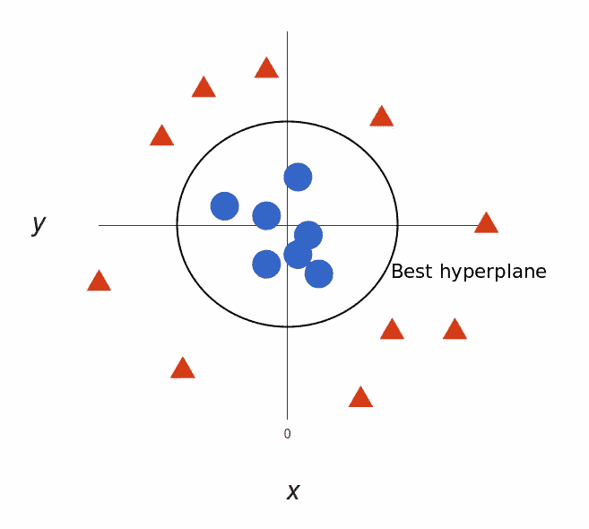

# 机器学习作弊 heat-支持向量机

> 原文：<https://medium.com/analytics-vidhya/machine-learning-cheat-sheat-support-vectors-machines-8abb9c350804?source=collection_archive---------14----------------------->

安妮·斯普拉特在 [Unsplash](https://unsplash.com?utm_source=medium&utm_medium=referral) 上的照片

*大家好*👋*，*

如今，机器学习及其应用正与日俱进。我们每天都很难回忆起与机器学习相关的基本概念。

*因此介绍机器学习算法备忘单系列，我们将在其中回顾与机器学习算法相关的核心概念，这将有助于您解决任何数据科学面试或项目。*

*这将是一个点对点的解释，用于快速修改和理解机器学习算法。*

> 所以抓紧了……..

> **支持向量机**

*   监督学习算法可用于分类和回归问题陈述。
*   其工作原理是*通过找到将训练数据集分成不同类别的线，即超平面，将数据分成不同类别*。
*   在 SVM，我们将数据绘制成 n 维空间中的*点，其中 n 是特征的数量，每个特征的值是坐标值*。然后通过寻找区分两个类别的超平面来执行分类。

[来源](https://www.analyticsvidhya.com/blog/2017/09/understaing-support-vector-machine-example-code/)

*   支持向量机试图最大化所涉及的不同类别之间的距离，这被称为边际最大化。基本上，两个类别之间的界限已经确定，那么 SVM 将很有可能推广到看不见的数据。
*   SVM 分为以下几类

**#线性 SVM-**

线性 SVM *是通过超平面*分离训练数据的分类器。在 SVM 分类器中，很容易在两个类之间添加超平面，但问题是我们应该手动添加特征以形成超平面。这种技术被称为*核技巧。*

**#非线性 SVM-**

[来源](https://www.analyticsvidhya.com/blog/2017/09/understaing-support-vector-machine-example-code/)

在非线性 SVM 中，不可能使用超平面来分离训练数据

SVM·科尔纳尔定义了一个函数，它将低维输入空间转换到高维空间，从而将不可分离的数据点转换成可分离的。

> **支持向量的优势**

*   SVM 提供了*在训练数据上最好的分类性能(准确性)。*
*   SVM 为未来数据的正确分类提供了更高的效率。
*   SVM 最好的一点是，它不会对数据做出任何强有力的假设。
*   它不会*过度拟合数据*。

> **支持向量机的缺点**

*   大规模数据集的训练时间*更长*。
*   当数据集中有噪声时*不会给出好的结果。*
*   SVM 没有直接*提供概率估计*。因此，可以使用 k 倍交叉验证来计算。
*   由于公式的复杂性，SVM 算法稍微难以可视化。

> **支持向量机的应用**

*   *股市*各金融机构预测。
*   *人脸检测*将部分图像分类为人脸或无脸，并创建边界框。
*   可用于*生物医学成像*如癌症和蛋白质细胞的分类。
*   手写识别我们使用支持向量机来识别广泛使用的手写字符。
*   用于*文本文档的分类*。
*   对于需要极高预测能力的情况至关重要。

ℹ ***Scikit 学习支持向量机算法的实现可以在这里找到*******。****

*ℹ ***R 实现的支持向量机算法可以在这里找到*******。*****

> **有了以上信息，我希望你能更好地理解支持向量机算法。你也可以回答任何与 SVM 氏症相关的面试问题。**

# **ML 的下一张备忘单，算法请参考这个[链接](https://datasciencehub.medium.com/machine-learning-cheat-sheet-k-nearest-neighbors-algorithm-93462a66831)。**

# **请点击查看我其他与 ML/DL [相关的博客。](https://shashwatwork.github.io/blog/#)**

**如果你喜欢这个帖子，请关注我。如果你注意到思维方式、公式、动画或代码有任何错误，请告诉我。**

***干杯！***