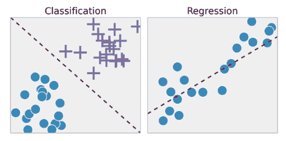
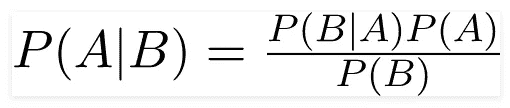
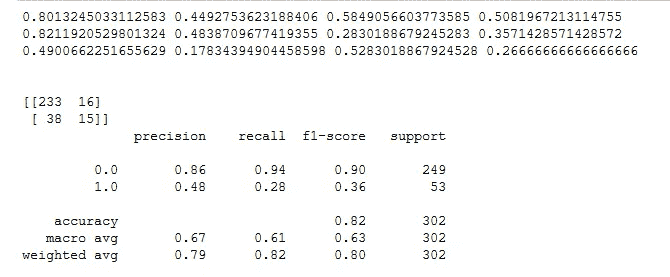
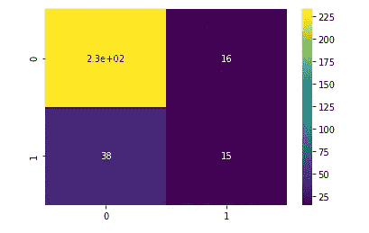
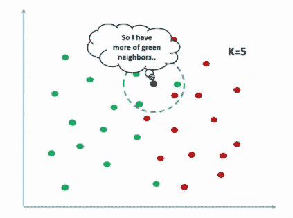
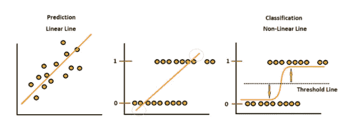
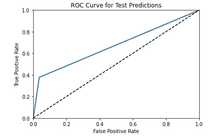
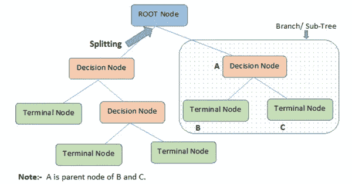
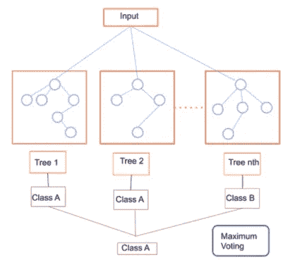
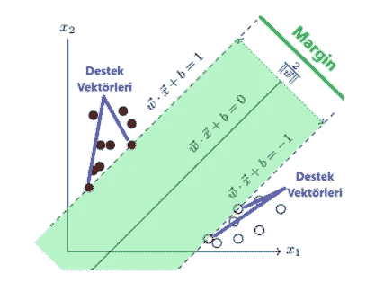

# 带代码的机器学习分类算法

> 原文：<https://medium.com/analytics-vidhya/machine-learning-classification-algorithms-with-codes-5a8af4491fcb?source=collection_archive---------3----------------------->

大家好，今天我要讲的是分类算法。你可以在这里找到我关于回归和分类的区别的文章。

我们说我们用回归来预测数值数据比如价格预测，用分类来预测没有连续变量比如标注，是或否的问题，我不得不说有些算法可以应用，而且对回归和分类都很管用(比如 K-NN，SVM，决策树和随机森林)。今天的话题:

*   朴素贝叶斯分类器(基于概率)
*   k-最近邻分类器(基于组)
*   逻辑回归(基于最大熵)
*   决策树分类器(基于树)
*   随机森林分类器(基于集成的 Bagging)
*   梯度增强分类器(基于集成的增强)
*   支持向量机(SVM)

## 朴素贝叶斯分类器

**朴素贝叶斯算法**是一种基于贝叶斯定理的分类技术，假设预测器之间相互独立。简而言之，朴素贝叶斯分类器假设一个类中特定特征的存在与任何其他特征的存在无关。

贝叶斯定理

P(A|B):事件 B 发生时事件 A 发生的概率。

在这个数据集中，我们将预测雇员是否会被雇用。

我们将数据分为测试和训练。我们使用 train 来训练数据，使用 test 来测试我们的预测。

它使用拟合函数从数据中学习，并使用预测函数进行预测。

准确性分数:它是被分类为正确的值的百分比。

精度分数:它显示了我们正面猜测的值中有多少实际上是正的。

回忆分数:它显示“有多少真阳性被正确定义？”。

F1 得分:它是精确值和召回值的调和平均值。如果精确值和召回值对问题都很重要，F1 分数也将变得很重要。

b 检验的混淆矩阵

混淆矩阵中的数字是数据中 TN、FP、FN、TP 值的个数。这是我们的概率

准确度:(TP + TN) / (TN + FP + FN + TP)
精密度:TP / (FP + TP)
灵敏度:TP / (TP + FN)
特异性:TN / (TN + FP)

混淆矩阵

让我们根据混淆矩阵来计算准确度:

(233+15) / (233+16+38+15) = 0.8211920529801

## k 近邻分类器

它被列入绿色类，因为它有更多的绿色邻居。

KNN 根据待预测值的自变量构成的向量的最近邻的类密度进行预测。计算要预测的点到其他点的距离。闵可夫斯基距离计算函数用于此目的。(K:我们告诉你要计算多少个最近邻。)

为了在基于距离的算法(如 KNN)中获得更成功的结果，数据被归一化。

## 逻辑回归

逻辑回归试图找到区分这两个类别的最佳界限。它常用于线性分类问题。因为线性，所以和线性回归很像。

ROC 曲线描绘了假阳性率对正确阳性率。用函数 roc_auc_score()找到该曲线下的面积。该字段越接近 1，模型预测得越好。要查找 ROC-AUC 分数:

## 决策树分类器

决策树是一种监督学习算法，主要用于分类问题。它从单个节点开始，变成了树形结构。它通过从数据属性中提取简单的规则并学习这些规则(就像人一样)，来创建一个预测变量值的模型。

现在，我们来预测一下 Iris 数据集中的花的种类。

## 随机森林分类器(装袋)

在 Bagging 中，子集数据的每个集合都用于训练他们的决策树。结果，我们得到了不同模型的集合。使用来自不同树的大多数投票预测，这比单个决策树更健壮。

## 梯度推进分类器

梯度推进=梯度下降+推进。它使用梯度下降算法，可以优化任何可微损失函数。一个系综树被一个接一个地构建，并且各个树被顺序地求和。下一个采油树试图恢复损失(实际值和预测值之间的差异)。

## 支持向量机

Destek Vektö rleri 表示支持向量

像逻辑回归一样，支持向量机试图找到区分这两类的最佳直线。这条线 1 以内的绿色区域称为边距。边距越宽，两个或多个类的分离越好。SVM 预测新样本会落在缺口的哪一边。

SVC:支持向量分类器(机器)

[github 账户/esmabozkurt](https://github.com/esmabozkurt)