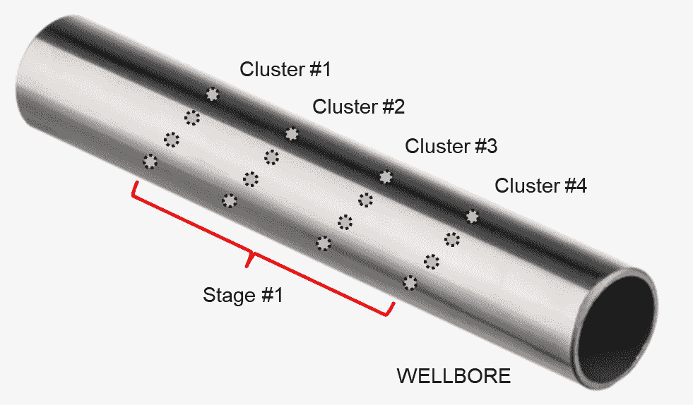
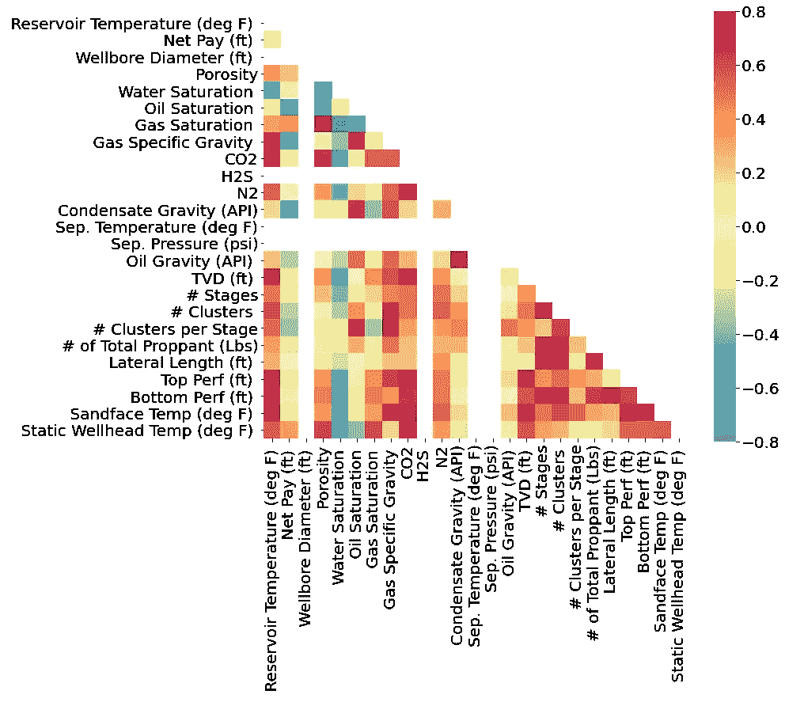
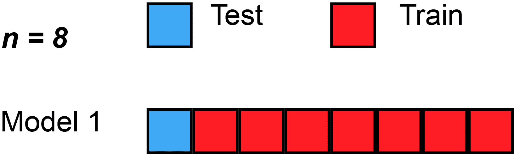
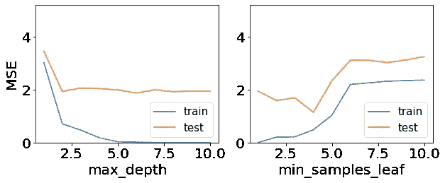
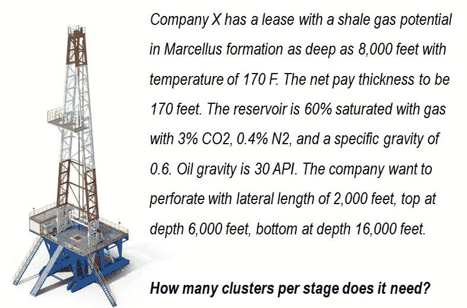
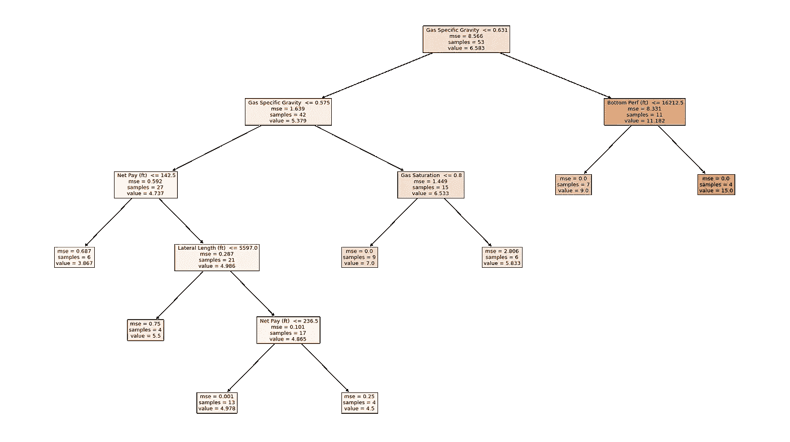
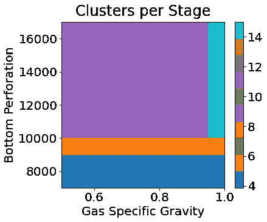

# 水力压裂预测的机器学习

> 原文：<https://medium.com/analytics-vidhya/machine-learning-for-prediction-in-hydraulic-fracturing-43de92b0e10a?source=collection_archive---------1----------------------->

## 预测每个阶段性能簇数量的决策树

[工地有限公司](https://unsplash.com/@worksite?utm_source=unsplash&utm_medium=referral&utm_content=creditCopyText)在 [Unsplash](https://unsplash.com/s/photos/oil-rig?utm_source=unsplash&utm_medium=referral&utm_content=creditCopyText) 上的照片

非常规页岩生产为当今世界石油和天然气经济做出了巨大贡献，这些经济来自美国、加拿大和俄罗斯等主要生产国。在生产阶段，最重要的活动之一是从井筒对储层进行射孔。我们遇到的作为固体岩相的储层需要射孔，以提供人工通道(或渗透性),使石油或天然气流向井筒。稍后，支撑剂将被泵入以进一步打开这些通道——这一过程被称为水力压裂。

从井筒对储层进行射孔并不容易。例如，我们需要设计每个阶段需要多少个集群。什么是集群和阶段？丛是射入套管的一组射孔，在多个层段或间距上重复。然后，该组簇形成将被支撑剂增产的阶段。一个阶段可以由少至 1 个到多于 15 个集群组成。

射孔井中的阶段和集群图——yo hanes nu wara

通常，工程师使用数值模拟软件设计射孔。它依赖于许多数学模型，如有限元模型。然而，鉴于我们生活在一个数据驱动的世界，我们可以利用数据通过机器学习来生成数据驱动的模型。

本文的目的是说明如何建立一个预测模型，在给定储层岩石、储层流体、目标深度等数据的情况下，预测油藏射孔所需的每一阶段的丛数。

本文附有 Jupyter 笔记本中的源代码，以便复制。点击进入[或者在下面的浏览器中向下滚动。](https://github.com/yohanesnuwara/volve-machine-learning/blob/main/notebook/spe_data_machinelearning.ipynb)

# 数据集概述

数据集是从 [SPE 数据库](https://www.spe.org/en/industry/data-repository/)中获得的。一个人必须有一个 SPE 帐户才能访问这个存储库，但是，我们已经对这些数据进行了预处理，准备了更干净的数据[这里是](https://github.com/yohanesnuwara/energy-analysis/blob/main/data/SPE_welldata_string_preprocessed.csv)。

> 感谢 Sebastien Matringe 允许本文使用这些数据！Sebastien 是拥有这个库的 BERG/SPE 委员会成员之一。

该数据集包括 53 行代表个人租赁(或油井)和 27 列。2 列(租赁名称`Lease`和地层名称`Formation/Reservoir`)是分类变量，其他 25 列是数字变量，代表有关储层特性、流体特性和射孔几何形状的信息。我们的目标是每个阶段的集群数量`# Clusters per Stage`。

数据的前 10 次观察

平均而言，租赁每个阶段有 6 个集群。每个阶段的最小和最大集群数是 3 和 15。我们可以从每个阶段集群数量的最大值到最小值对租赁进行排序。这是前 10 名，包括每阶段 15 个集群的 4 个租赁(红衣主教、鹰、猎鹰和乌鸦)和每阶段 9 个集群的 6 个租赁(百灵鸟、松鸦、鱼鹰、麻雀、雨燕和风筝)。

每个阶段集群数量最多的前 10 个租赁

# 特征选择

有太多的特征可用于我们的预测模型。需要特征选择来减少我们的特征数量。我们使用相关系数的热图来分析哪些特性与我们的目标`# Clusters per Stage`有足够强的相关性。

25 个特征的相关热图— Yohanes Nuwara

这里有两个我们不会用到的冗余特性；`# Clusters`和`# Stages`。我们的目标是根据这两个特征计算出来的。然后，我们发现另外两个冗余特征，它们有很强的相关性；`Reservoir Temperature (deg F)`和`Sandface Temp (deg F)`。在油田术语中，砂面被定义为储层和井筒之间的界面。我们不会使用沙面功能。

我们将使用哪些作为特征？强相关性有多强？我们的观测数据很少，只有 53 个。为了回答这些问题，我们可以设计一种叫做 **t 检验**的统计检验。

> 在这里找到一个关于 t-test [的很好的介绍视频](https://www.youtube.com/watch?v=pTmLQvMM-1M)。

这里，在给定 N 个观察值的情况下，应用 t 检验来确定相关系数的**临界值。我们发现，对于 53 次观察和 5%的置信水平，相关系数的临界值是 0.27。因此，两个独立特征之间的强相关性必须在 0.27 以上。**

## Rcrit = +/- 0.27

回到相关性热图，与`# Clusters per Stage`的相关性低于 0.27 的特征被剔除。我们最终将功能从 25 个减少到 12 个。

从一个**分类变量** `Formation/Reservoir`中添加了一个新特征，对于 Bossier 页岩，该分类变量编码为 0，对于 Eagle Ford 页岩编码为 1，对于 Haynesville 页岩编码为 2，对于 Marcellus 编码为 3，对于 Upper Marcellus 编码为 4。

因此，总共有 13 个特征。

预测模型的选定功能

含油饱和度与每个阶段的聚类数正相关，而含气饱和度与聚类数负相关。因此，我们可以说油页岩储层每个阶段具有更多的簇，而油页岩储层每个阶段具有更少的簇。此外，净薪酬也呈负相关。产油层越薄，我们每个阶段射孔的组就越多。

# **针对小数据集的机器学习策略**

我们使用的预测模型(或回归器)是**决策树**。决策树通过将输入空间分成两部分(二叉树)来进行回归。选择具有最佳成本(最低成本，因为我们最小化了成本)的分割。以贪婪的方式评估和选择所有输入变量和所有可能的分裂点(例如，每次选择最佳分裂点)。

该数据被认为是一个小数据集，因为它只有 53 个观测值。对于小数据集，存在过度拟合的风险。这里，使用了一种特定的交叉验证策略，称为**留一交叉验证(LOOCV)** 。LOOCV 是通过从整个实例中分离出一个实例作为验证实例，然后将其交叉验证给其余实例来完成的。LOOCV 也被认为是一种 K 倍交叉验证，其折叠数等于实例数(观察值)。

LOOCV 的动画(来源:[维基媒体](https://commons.wikimedia.org/wiki/File:LOOCV.gif))

我们还使用**验证曲线**来评估**超参数**的哪个组合给了我们最佳模型，该模型既不过度拟合也不欠拟合。我们这里研究的决策树的两个超参数是树的最大深度`max_depth`和在一个叶节点需要的最小样本数`min_samples_leaf`。

以下是以均方误差(MSE)为损失函数的`max_depth`和`min_samples_leaf`的验证曲线。MSE 是通过对做 LOOCV 得到的分数取平均值来计算的。在左图中，验证(或测试)误差稳定在`max_depth`等于 5。训练误差也低。在右图中，由于训练误差低但验证误差高，模型在较少的`min_samples_leaf`处过度拟合。它在`min_samples_leaf`等于 4 时最小化。然后，它上升到高训练和验证错误，因此模型开始不足。

因此，可能给我们最佳决策树模型的最佳组合是 5 的`max_depth`和 4 的`min_samples_leaf`。我们使用这个模型来拟合 53 个观察值。

“最大深度”和“最小样本叶”超参数的验证曲线

# 预言；预测；预告

模型已经准备好接受我们的输入了。在给定储层信息的情况下，该模型有助于推荐每个阶段的射孔簇数量。下面是这种情况的一个例子。

一个例子——约哈内斯·努瓦拉

该公司询问他们每个阶段需要多少 perf 集群。我们已经制作了一个程序，使用上述决策树模型来预测每个阶段的聚类数。查看笔记本(上面的链接)来使用和运行这个程序。使用这个程序给我们的答案是**每个阶段 7 个集群**。

# 模型可解释性

直到这个阶段，我们仍然不知道模型是如何进行预测的。为了解释我们的模型，我们可以**可视化二叉树**。下面是我们的树的可视化。我们可以看到决策节点中突出的五个描述性特征；气体比重、气体饱和度、侧向长度、净产层和射孔底部。

每阶段聚类数预测的决策树模型— Yohanes Nuwara

我们也可以画出**决策空间**。请注意，决策树生成的是离散预测，而不是像 SVM 那样的连续预测。假设我们有与上述例子相似的输入，但改变了两个变量——气体比重和净产层——产生了以下决策分区图；

决策空间图—约哈内斯·努瓦拉

我们的决策树模型产生了 4 个空间，每个空间在颜色条上用不同的颜色表示；

*   每级 3.867(或 4)个簇—深蓝色
*   每个阶段 5.83(或 6)个簇—橙色
*   每个阶段 9 个集群—紫色
*   每个阶段 15 个集群—浅蓝色

如果我们看看上面的可视化二叉树，每个空间都是由决策链产生的，如下所示；

*   气体比重≤ 0.631 →气体比重≤ 0.575 →净产层≤ 142.5 英尺→每级 3.867 簇
*   气体比重≤ 0.631 →气体比重≤ 0.575 →气体饱和度≤ 0.8 →每级 5.83 团
*   气体比重≤ 0.631 →底部射孔≤16212.5 英尺→每级 9 组
*   气体比重≤ 0.631 →底部射孔> 16212.5 英尺→每级 15 组

示威游行。

# 结论

我们已经成功实现了机器学习来预测水力压裂作业中每个阶段的射孔簇数量。我们使用了来自 53 个页岩油气租约的少量观察数据，这些租约最初有 25 个特征。通过特征选择，我们已经从 25 个特征减少到只有 12 个特征，其中 1 个分类特征编码自地层名称列。我们构建了一个决策树模型，并使用留一交叉验证(LOOCV)和验证曲线来寻找两个超参数的最佳组合，以避免过度拟合。使用该模型，我们拟合 53 个观察值，并根据用户给出的新输入进行预测。我们展示了一个公司的示例案例，该公司需要知道每个租赁阶段有多少个集群。为了解释模型如何“在幕后”工作，我们将二进制决策树和决策空间可视化。人们发现，至少有 5 个特征会在决策中产生影响。

很明显，我们需要更多的观测数据来建立一个更加可靠和稳健的预测模型。如果更多类似于这个 SPE 数据仓库的数据能够被公开，进一步的研究将会进行。

# 数据参考

SPE 数据仓库:数据集:1，井号:所有井。来自 URL:[https://www . SPE . org/datasets/dataset _ 1/CSV _ files/dataset _ 1 _ all _ wells/well _ data](https://www.spe.org/datasets/dataset_1/csv_files/dataset_1_all_wells/well_data)

**请关注我即将发布的关于我在我们惊人的能源行业中的更多人工智能实验的文章！💡**

 [## 基于机器学习的 Volve 油田声波测井预测

### 使用 Scikit-Learn 逐步解释

towardsdatascience.com](https://towardsdatascience.com/prediction-of-p-sonic-log-in-the-volve-oil-field-using-machine-learning-9a4afdb92fe8)  [## 基于机器学习的钻井数据油田岩性预测

### 实际工作流程和经验教训

towardsdatascience.com](https://towardsdatascience.com/oilfield-lithology-prediction-from-drilling-data-with-machine-learning-520ee9ff6e7c)