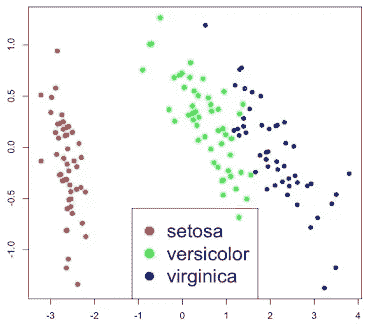
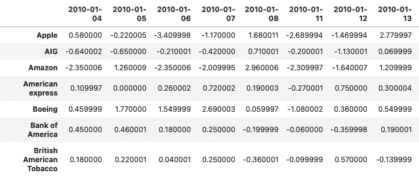
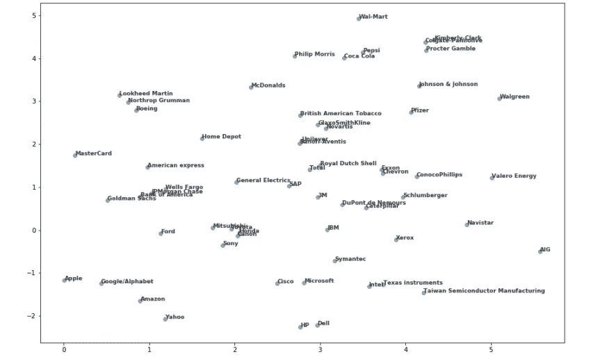
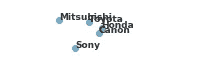
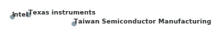
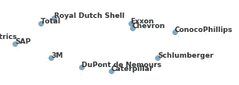

# 股票市场的机器学习:使用 Python 寻找行为相似的公司

> 原文：<https://medium.com/analytics-vidhya/machine-learning-for-the-stock-market-use-python-to-find-companies-that-behave-similarly-81eceee04f2c?source=collection_archive---------4----------------------->

# 介绍

下面的文章将指导您开发一个机器学习模型，该模型能够根据股票价格走势的相似程度，对股票市场上表现相似的公司进行分组。

用于构建该模型的过程和数据建立在 Datacamp 的 Python 无监督学习课程的材料之上。

# **型号**

我们将制作的模型是 t-SNE 或 t-分布式随机邻居嵌入(别担心，代码实现没有名字那么复杂)，这是一种无监督学习(不需要预期结果的显式标签的模型)技术，它将多维样本(具有许多列的数据)映射到二维或三维，从而使它们可视化。在这种情况下，失真是不可避免的，但 SNE 霸王龙在保持数据点的接近性方面做得很好。

下面是一个 SNE 霸王龙形象化的例子:



上面的示例是应用于 Iris 数据集的 t-SNE(一个非常受欢迎的花卉数据集，广泛用于测试机器学习算法，测量三种不同花卉的不同示例)。iris 数据集具有 4 维样本(4 列测量值+识别每朵花及其物种所需的列)。

SNE 霸王龙将虹膜样本映射到 2D 空间，它不知道有三个不同的物种，但绘制 SNE 霸王龙的结果并按物种着色，我们可以看到 SNE 霸王龙可以很好地将数据集分成三个物种。

t-SNE 图的轴没有可解释的意义它们实际上在每次应用 t-SNE 时都是不同的，如果你多次运行产生 t-SNE 可视化的代码，你会注意到图似乎每次都不同，但是组或簇是守恒的，只是似乎在图的不同版本之间旋转。

# 数据

我们将用来建立这个模型的数据集包含每日股票价格变动(每个交易日收盘价和开盘价之间的差异)，可以在我的 [Kaggle](https://www.kaggle.com/giordan/company-stock-movements-2010-2015) 或 [Datacamp 的网站](https://assets.datacamp.com/production/repositories/655/datasets/1304e66b1f9799e1a5eac046ef75cf57bb1dd630/company-stock-movements-2010-2015-incl.csv)上下载。以下是它的外观示例:



# 代码

首先，我们需要导入我们将使用的库和模块:

```
import numpy as np
import matplotlib.pyplot as plt
import pandas as pd
from sklearn.preprocessing import normalize
from sklearn.manifold import TSNE
```

Numpy 将用于从数据集中的值(股票价格变动)和索引(公司名称)创建数组。

Matplotlib.pyplot 将用于显示 t-SNE 的输出。

Pandas 将用于读取数据帧，并且是我们的基本数据操作库。

我们将使用 sklearn(最流行的机器学习库之一)中的两个模块:. preprocessing.normalize 将所有股票价格变动值调整到相同的比例，以避免对股票价格较高的公司给予更多的重视，这些公司的变动将代表更大的金额，以及. manifold. TSNE 作为我们模型的基础。

我们将使用熊猫。read_csv()方法来读取我们的 dataframe，表明第一列将是 index_col = 0 参数的索引。

那我们就用 numpy 的。价值观和。指数方法创建两个数组:运动和公司。

```
stocks = pd.read_csv('company-stock-movements-2010-2015-incl.csv', index_col = 0)
movements = stocks.values
companies = stocks.index
```

接下来，我们将使用 sklearn 的 normalize 及其默认设置，将股票走势的所有单个值转换为相同的比例(例如，如果整个比例从-1 变为+1，所有值都可以转换为它们的等效值)，并将该规范化数组命名为“normalized_movements”

```
normalized_movements = normalize(movements)
```

在此之后，我们将启动 sklearn 的 TSNE()的实例，学习率为 50，称为“模型”，不同的学习率必须在不同的数据集上进行测试，您可以判断它何时不是一个好值，因为它将散点图中的所有样本分组在一起。尝试 50 到 200 之间的值是正常的。

```
model = TSNE(learning_rate = 50)
```

现在，我们将把这个模型应用到我们通过。fit_transform()方法，我们将根据生成的要素创建数组，这些要素将构成散点图的 X 和 Y 坐标。

```
tsne_features = model.fit_transform(normalized_movements)xs = tsne_features[:,0]
ys = tsne_features[:,1]
```

然后，我们将使用在前面步骤中创建的数据来创建散点图，我们还将使用我们之前创建的数组中的公司名称来标记散点图中的每个公司。最后，我们将使用 tight_layout 方法来调整绘图的填充，我们将使用。show()方法来显示绘图。

```
fig, ax = plt.subplots(figsize = [15, 10])
plt.scatter(xs, ys, alpha = 0.5)for x, y, company in zip(xs, ys, companies):
    plt.annotate(company, (x, y), fontsize=9, alpha=0.75)plt.tight_layout
plt.show()
```

完整的算法如下所示:

```
import numpy as np
import matplotlib.pyplot as plt
import pandas as pd
from sklearn.preprocessing import normalize
from sklearn.manifold import TSNEstocks = pd.read_csv('company-stock-movements-2010-2015-incl.csv', index_col = 0)
movements = stocks.values
companies = stocks.indexnormalized_movements = normalize(movements)model = TSNE(learning_rate = 50)tsne_features = model.fit_transform(normalized_movements)xs = tsne_features[:,0]
ys = tsne_features[:,1]fig, ax = plt.subplots(figsize = [15, 10])
plt.scatter(xs, ys, alpha = 0.5)for x, y, company in zip(xs, ys, companies):
    plt.annotate(company, (x, y), fontsize=9, alpha=0.75)plt.tight_layout
plt.show()
```

# **输出**



请注意该算法如何将相似行业的公司分组:



放大 1



放大 2

同时也不产生完全基于部门或行业的集群:



放大 3

# 结论

所提出的算法被设计成基于公司的股票价格运动来对公司进行分组，并使所述分组可视化。它有可能让不了解所有行业的人了解哪些公司属于同一类型的企业，或者也可以让专业人士了解哪些公司非常相似，哪些公司不独立，取决于它们是否属于同一行业。最后，它可以手动使用，也可以与其他算法结合使用，根据与可视化中的公司之一相关的数据或新闻来预测股票价格的变动。