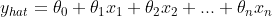
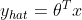

# 机器学习基础:学习基础知识

> 原文：<https://medium.com/analytics-vidhya/machine-learning-foundations-learning-the-fundamentals-71be05aeffe3?source=collection_archive---------3----------------------->

两个学习资源，一本书和一个面向初学者的在线课程，可以帮助你在机器学习方面打下坚实的基础

斯科特·布雷克在 [Unsplash](https://unsplash.com?utm_source=medium&utm_medium=referral) 上拍摄的照片

在这篇文章中，我想推荐几个学习资源，它们在我的机器学习历程中被证明是非常有用的。这些可以被认为是“经典”资源，在你深入挖掘之后，你会意识到为什么它们会成为这个行业的参考。

在我关于人工智能/机器学习的传奇故事中，我搜索了专注于人工智能基础的课程。不幸的是，我发现大多数在线课程不仅忽略了基础知识，而且实际上坚持认为学习 ML 所需要的只是基本的高中数学和一些编程技能。当你只是复制有效的代码或者想要对这个主题有一个肤浅的了解时，这可能是真的。

在这些学习资源的帮助下，您将使用 Python 编写的工具学习有监督和无监督的学习概念和算法，并且您还将通过神经网络的介绍掌握深度学习的基本知识。

# 假设

如果你不了解 Python，有数以千计的免费 MOOCs 和 YouTube 视频供你使用。如果你像我一样喜欢书，我会推荐 Deitel Bros 的[计算机科学和数据科学 Python 入门](https://www.pearson.com/us/higher-education/program/Deitel-Intro-to-Python-for-Computer-Science-and-Data-Science-Learning-to-Program-with-AI-Big-Data-and-The-Cloud/PGM2392788.html)，它涵盖了 Python 语言、计算机科学概念和数据科学/ML 的 Python 库(如 Numpy、Pandas、Tensorflow)，有无数的练习和应用。

如果你知道 Python 但是没有学过 ML，一定要学习 NumPy 库，因为它在实现编程任务的算法时会很有用。Numpy 处理多维矩阵既快又容易，但是它优于 Python 原始数据结构的细节已经超出了本文的范围。其他你需要的库有 Pandas 和 Matplotlib。Jupyter 笔记本工具将在整本书中广泛使用。

你必须能够熟练阅读数学符号，并具备线性代数、微积分、概率和统计方面的数学知识。是的，你必须。否则，你不能说你真的了解机器学习。然而，你不需要数学或统计学学位来理解内容。通过理解它背后的数学，它将帮助你理解最初的算法是如何工作的，它将使你能够理解更复杂的算法，因为它们大多数是经典算法的增强/启发版本。这只是我对那些喜欢在学习一门新学科时有良好基础的人的建议。

# 资源

虽然它们不是出自同一作者，但使用的术语、数学符号和学习方法非常相似。有时候，它感觉你是在跟随一门在线课程和它的教科书。我相信那些学习资源的编写/创建方式对于那些来自计算机科学或软件工程的人来说更容易理解。

例如，您将不会在统计书籍中看到线性回归，而是看到它的矢量化版本，因此它可以被理解为准备在代码中实现的向量和矩阵。下面这个简单的例子说明了为什么人们需要了解线性代数。

线性回归

你会在书/课程里找到的是系数的向量 **𝜃** (𝜃₀到𝜃n)和特征的向量 **x** (x₀到 xn)。

线性回归

这无非就是θ和 x 转置的 ***点积。不知道向量/矩阵的点积和转置是什么，就不能说真正理解了上面的内容。这些知识将来自线性代数。(你会看到，当实现这个矢量化版本时，x₀必须等于 1)***

微积分呢？好吧，等到你得到梯度下降优化算法。

两位作者都将解释这些概念背后的直觉。例如，不要指望他们能证明你为什么一个矩阵是可逆的或不可逆的。

最后说一下学习资源本身。从现在起，我将称它们为“书”和“课程”。

# 这本书

[**用 Sickit-Learn 进行动手机器学习，Keras&tensor flow**](https://www.oreilly.com/library/view/hands-on-machine-learning/9781492032632/)**，作者 Aurélien Géron。**

如果你曾经谷歌过“机器学习最佳书籍”，这肯定会出现在结果中，如果不是第一个结果的话。你还可以在任何地方读到大量关于这本书的精彩评论。

我相信这本书最好的特点是涵盖了大量的主题，以及作者给出的关于算法如何工作以及如何实现其中一些算法的细节。这本书有很多你可以跟随的代码示例，一个带有代码示例和练习答案的支持 github 帐户。这本书是 100%用 Python 写的。

这本书提供的另一个很好的资源是作者用来解释许多 ML 算法概念的精彩情节的代码。这也是一个学习 Matplotlib 绘图和图形库的机会。

这本书肯定能让你阅读更复杂的书籍、论文和类似的主题。

# 课程

[**机器学习**](https://www.coursera.org/learn/machine-learning) **，由吴恩达—斯坦福大学**

这门课程是 10 年前发布的，但是很少有课程能给你理解从那时起 ML 发生了什么的基础。

您将看到一些概念，如推荐系统是如何创建的，如何在大型数据集中执行梯度下降优化，甚至是一个基本的照片 OCR 系统。你也将能够实现作为编程作业一部分的算法。

该课程的一个不利方面是，在创建它的时候，作者使用了 Octave，这是 Matlab 的开源版本，作为该课程的编程语言。如果你想使用 Octave，这取决于你，但是在我的情况下，我用 Python 做了作业，这迫使我更深入地学习 Numpy。Numpy 有很多线性代数运算的函数。此外，在现实世界中，绝大多数公司都在运行他们主要用 Python 编写的 ML 系统，Python 的文献也是最多的。因此，我相信如果你现在努力学习 Python 和 Numpy 的更多细节，将会有所收获。

因为这本书涵盖了课程的所有内容，所以您可以参考这本书，看看如何使用 Python 来解决 Octave 中显示的相同问题。例如，你也可以通过与 Scikit-learn 的算法输出进行比较来检查你的答案。

如果你想获得认证，你必须完成 Octave 的编程作业。

# 学习指南

我计划了这个指南，希望它能帮助你逐步建立你的基础知识。我建议你遵循这个帖子上建议的顺序。

这本书和这门课的共同点是:你应该做编程作业和练习。理想情况下，你可以就你所学的科目做些小项目。例如，一旦你完成了逻辑回归的理论和练习，试着找到一个数据集并应用你所学的技术。

第一个提示适用于你打算读的任何一本书:与作者达成协议。知道这些术语在 ML 上下文中是什么意思，行话是什么样的。例如，你可能会注意到，一些作者互换使用标准化和规范化这样的术语，其他人可能会将它们作为同义词或不同的术语使用，而实际上它们是这样的。一些术语在开始时可能会有点混乱，特别是对那些有统计学背景的人来说。

## 第一步

**课程:**观看**第 01 周**欢迎和介绍部分

**书:**读**第 01 章和第 02 章**。它将向您概述什么是机器学习，有哪些类型的 ML，它在人工智能领域的位置，以及一个端到端的实践项目，让您快速了解 ML。

## 监督学习

**课程:**观看剩余的**第 01 周、第 02 周**和**第 03 周**讲座

**书:**读**第 03 章和第 04 章**。我建议先读第 04 章。的确，这是最重要的章节之一。你会注意到，在整个课程中，你将不得不查阅第 4 章。作者强调读者理解他介绍神经网络的章节是至关重要的。第 03 章是关于分类的，一旦你学习了第 04 章和课程的第 1、2、3 周的概念，它会更有意义。

**课程:**观看**第 06 周和第 10 周**讲座

**书:**第 06 周和第 10 周的话题在书的前 4 章都有涉及，大部分在**第 04 章。**

**课程:**观看**第 07 周**讲座——支持向量机

**本书:**阅读**第 05 章** —支持向量机

**课程:**不涵盖决策树和随机森林

**本书:**阅读**第 06 章和第 07 章**

## 无监督学习

**课程:**观看**第 08 周和第 09 周**讲座

**本书:**阅读**第 08 章和第 09 章**

## 神经网络

**课程**:观看**第 04 周和第 05 周**讲座

**书:**读**第十章和第十一章**。如果你希望在这个问题上更进一步，这本书的其余部分都是关于深度学习和神经网络的。。

ML 还有很多其他很棒的课程和书籍，但是在获得了这里建议的知识之后，你将能够更自然地观看和阅读更多的材料。也许你可以在云服务提供商那里学到一些关于 ML 工程的知识，或者在 NLP 或计算机视觉项目中使用神经网络。可能性数不胜数！

另一个重要的资源是谷歌的 ML 平台， [Kaggle](https://kaggle.com) ，你可以在学习的同时应用你的知识。在 Kaggle 上，你可以看到人们如何使用最新的算法、库等进行表演。它是一种活的资源，每天都在增长，包括课程、免费 GPU 处理、论坛、竞赛等等。

我希望这个指南能帮助你巩固机器学习所需的基础知识。它可能会避免你旅途中最终会遇到的许多“为什么”。

感谢阅读！