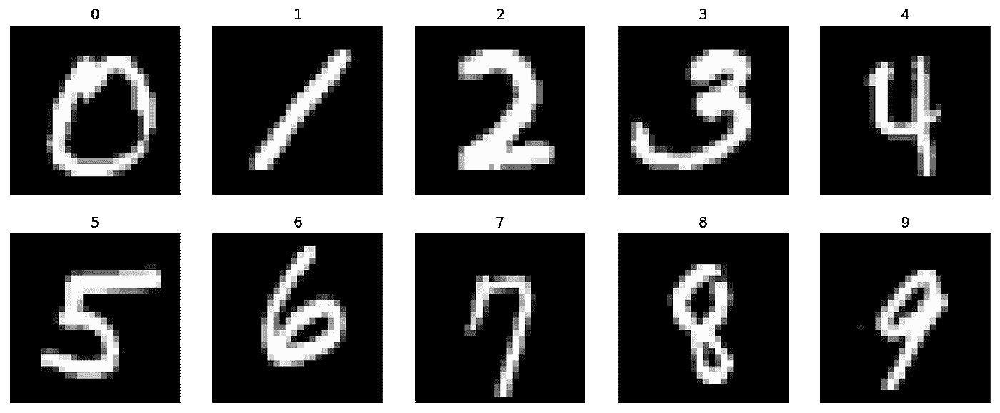
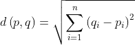

# 从零开始的机器学习

> 原文：<https://medium.com/analytics-vidhya/machine-learning-from-scratch-a3952180bade?source=collection_archive---------26----------------------->

## 如何用 c++从头开始写一个机器学习程序


美国宇航局在 [Unsplash](https://unsplash.com?utm_source=medium&utm_medium=referral) 拍摄的照片

机器学习是这样一个话题，当你在谷歌上搜索它的时候，你要么会找到它的基本解释，要么会找到一个拥有五个 T4 统计学和计算机科学博士学位的人写的学术论文，而这两者之间什么也没有。我们今天生活的世界喜欢这个*时髦词*，但是用一种不是 python 的语言从零开始创造东西需要什么呢？我开始做一个 c++项目，在这个项目中，我想使用 K-最近邻算法来制作手写数字分类器，我发现这是一种非常直观和容易理解的算法。

**注意:**该项目依赖于 [Eigen](https://eigen.tuxfamily.org/index.php?title=Main_Page) 外部库

# **从哪里开始？**


由[马克·范·里梅纳姆](https://markvanrijmenam.medium.com/?source=post_page-----78c7918cb35d--------------------------------)博士在[培养基](/dataseries/7-steps-to-machine-learning-how-to-prepare-for-an-automated-future-78c7918cb35d)上绘制的图表

根据机器学习的 7 个步骤，我们首先需要的是数据！因此，对于这个项目，我们将使用 [MNIST 数据集](http://yann.lecun.com/exdb/mnist/)。该站点有四个我们将要使用的文件，train 文件和 t10k 文件。训练文件包含所谓的具有 60000 个手写数字图像的训练数据集，而 t10k 文件包含具有 10000 个手写数字图像的测试数据集，这些图像不同于训练数据集中的 60000 个。

您会注意到，我们有两个文件，对于训练和测试数据集来说，它们看起来彼此相似，这些是所谓的标签文件，它们只是范围从 0 到 9 的值，代表图像文件中对应的*图像*的*标签*。当你试图打开这些文件的时候，你可能已经注意到了，它们包含了看起来像是乱码的东西，但是真正酷的是你看到的是纯字节编码的数据！文件以 idx 文件格式存储，这是存储矩阵和其他数字数据的首选格式。我们需要编写一个算法来解析这些文件，以便从中获得一些有意义的数据。因此，我们进入了机器学习管道的下一步**数据准备。**

# **数据准备**

现在我们终于可以开始编程了。我写的这个项目将会用 c++14 来写，因为我觉得它会在一个足够低的层次上给出一个理解，但是有适量的抽象，一切都仍然有意义。

我们需要解析的两种文件是图像数据文件和这些图像的标签文件。我们将编写以下函数:

```
public:
void prepareData(const std::string& image_file_path, 
const std::string& label_file_path){ read_Label_File(label_file_path); read_Image_File(image_file_path);
}private:void read_Image_File(const std::string& image_file_path);
void read_Label_File(const std::string& label_file_path);
```

prepare data 函数将是 read_Image 和 read_Label 函数的包装器，因为函数调用的顺序很重要，这一点在本教程的后面部分会变得很明显。

让我们仔细看看 read_Image_File 函数，我们看到它有一个 image_file_path 字符串参数，这个参数就是我们下载的 MNIST 文件的绝对路径。我们要做的第一件事是创建一个代表我们文件的 ifstream 对象:

```
std::ifstream image_file(image_file_path);if(!image_file.is_open()){ // Ensure that it has found the file
    std::cerr << "Could not open image file\n";
    return;
}
```

现在到了棘手的部分，在网站上我们看到数据是如何在 MNIST 图像文件中表示的

```
[offset] [type]          [value]          [description] 
0000     32 bit integer  0x00000803(2051) magic number 
0004     32 bit integer  60000            number of images 
0008     32 bit integer  28               number of rows 
0012     32 bit integer  28               number of columns 
0016     unsigned byte   ??               pixel 
0017     unsigned byte   ??               pixel 
........ 
xxxx     unsigned byte   ??               pixel
```

这可能看起来很奇怪，但实际上非常简单和直观。查看表中的*第一行*，我们看到 0000 表示我们在文件的开头，我们期望在文件的这个位置找到的数据类型是一个 32 位整数，十六进制值为 0x00000803 或十进制值为 2051。这就是所谓的幻数，它可以被看作是指示文件类型的签名。表中的*第二行*的偏移量为 0004，表示我们已经将 4 个字节进一步移入文件，这是有意义的，因为幻数是 4 个字节的数据块。我们再次期望找到一个 32 位的整数，其值为 60000，表示文件中图像的数量。移动到下两行，我们期望找到我们将要阅读的图像的尺寸。现在，在读取该元数据之后，我们可以继续读取图像的像素值，其具有一种无符号字节，这是由于图像是灰度的事实，这意味着像素将具有 0 到 255 之间的值，这是无符号 8 位(1 字节)值可以表示的范围。



这些是图像的样子

现在，为了从文件中一次读取一定数量的字节，我们将从 ifstream 对象中使用 *read* 方法。read 方法接受两个参数:指向存储数据的变量的指针和从文件中读取的字节数。我们将首先从读取标签文件中的数据开始。

```
std::ifstream label_file(label_file_path);if(!label_file.is_open()){ // Check if the file is found
    std::cerr << "Could not open label file\n";
    return;
}int magic_number_label = 0; // 32 bit int (4 bytes)
int number_of_labels = 0;label_file.read((char*)&magic_number_label,sizeof(magic_number_label));
magic_number_label = reverseInt(magic_number_label); label_file.read((char*)&number_of_labels,sizeof(number_of_labels));
number_of_labels = reverseInt(number_of_labels); // Will explain this later
```

现在我们有了文件元数据，可以开始读取实际的标签数据了:

```
std::vector<unsigned char> labels;
for(int i = 0; i < number_of_labels; i++){
   label_file.read((char*)&label,sizeof(label));
   labels[i] = label;
}
```

从图像文件中读取元数据是类似的:

```
std::ifstream image_file(image_file_path);if(!image_file.is_open()){ // Ensure that it has found the file
    std::cerr << "Could not open image file\n";
    return;
}image_file.read((char*)&magic_number_image,sizeof(magic_number_image));
magic_number_image = reverseInt(magic_number_image);image_file.read((char*)&number_of_images,sizeof(number_of_images));
number_of_images = reverseInt(number_of_images);image_file.read((char*)&number_of_rows,sizeof(number_of_rows));
number_of_rows = reverseInt(number_of_rows);image_file.read((char*)&number_of_cols,sizeof(number_of_cols));
number_of_cols = reverseInt(number_of_cols);
```

您可能已经注意到了第二种方法的使用，那就是 reverseInt 函数，函数背后的逻辑并不重要，它用于将无符号的 char 值转换回有符号的整数值，实现方式如下:

```
int reverseInt (int i){
            unsigned char c1=0, c2=0, c3=0, c4=0;
            c1 = i & 255;
            c2 = (i >> 8) & 255;
            c3 = (i >> 16) & 255;
            c4 = (i >> 24) & 255;
            return ((int)c1 << 24) + ((int)c2 << 16) + ((int)c3 << 8) + c4;
};
```

现在，在我们读取像素数据之前，我们将创建一个 Image 类来简化事情。我们将使用特征矩阵将像素数据存储为整数值，以便进行更简单的数学运算，但是您可以使用任何选择的数据结构，这只是在我们实现 ML 算法时简化了事情。

```
class Image{public:
        static const int rows = 28;
        static const int cols = 28;Image(std::vector<std::vector<unsigned char>>,unsigned char);
        Image();
        ~Image();
        Eigen::Matrix<int,rows,cols> getPixelData() const;
        int getLabel() const;private:
        Eigen::Matrix<int,rows,cols> pixels;
        int label;};Image::Image(){}Image::Image(std::vector<std::vector<unsigned char>> pixels, unsigned char label){
    for(int i = 0; i < rows; i++){
        for(int j = 0; j < cols; j++){ // The () operator has been overloaded in the Eigen library to access specific elements this->pixels(i,j) = (int)pixels[i][j];
        }
    }
    this->label = (int)label;
}Image::~Image(){}Eigen::Matrix<int,28,28> Image::getPixelData() const{
    return this->pixels;
}int Image::getLabel() const{
    return this->label;
}
```

现在，我们可以开始从训练数据集文件中读入像素数据。

```
for (int num = 0; num< number_of_images; num++) { // Creating a 28x28 vector to store pixel values
      std::vector<std::vector<unsigned char>> pixels(number_of_rows,std::vector<unsigned char>(number_of_cols)); // Looping through file to construct 28x28 pixel matrix for (int j = 0; j < number_of_rows; j++) {
        for (int k = 0; k < number_of_cols; k++) {
            unsigned char temp;
            image_file.read((char*)&temp,sizeof(temp));
            pixels[j][k] = temp;
        }
      } // Construct Image object with pixels and corresponding label
      this->image_data[num] = Image(pixels,labels[num]);
}
```

我们在这里使用无符号字符，因为它们相当于我们试图从文件中读取的无符号字节。

# 模型设计

如前所述，我们将使用 K-最近邻算法。它是一种受监督的机器学习算法，可用于分类或回归。监督学习指的是我们用示例数据训练算法的事实。这对我们的例子来说是完美的，因为我们希望它对*手写数字进行分类。所做的假设是，相似的事物存在于彼此附近，在我们的情况下，这意味着属于相同数字分类的数字将具有相似的*外观，坦率地说就是*。我们将声明以下函数:*

```
// Choose k to be 10 because there are 10 possible digits 0-9
bool Classify(std::vector<Image> data, Image query, int k=10);
```

因此，数据准备后算法的第一步是距离计算，我们将使用欧几里德公式，如下所示:



我们有代表这些像素值的矩阵，所以我们将计算这些值之间的距离。

```
std::vector<std::pair<int, int>> dist_and_k;for (int i = 0; i < data.size(); i++) {
        dist_and_k.push_back(
        std::make_pair(
          (data[i].getPixelData()
           -query.getPixelData()).array().pow(2).sum(),
           data[i].getLabel())
        );
}
```

上面的片段有点复杂，让我们从头到尾看一遍。首先，我们定义一个向量对，代表一个标量距离值和该图像的标签。我们开始遍历所有图像，取训练图像的像素值和查询图像的像素值之间的差。然后，我们将该矩阵转换为一维数组，这样我们就可以轻松地对值求平方，然后将所有值相加，得到一个标量值，并将其与相应的标签值配对。这是使用一些本征魔术来简化操作到一行。

在构建我们的向量对之后，我们需要按降序对其进行排序，以找到最短距离，这对应于与查询图像最接近的图像。

```
sort(dist_and_k.begin(), dist_and_k.end(),
           [](std::pair<int, int> p, std::pair<int, int> p2) {
             return p.first < p2.first; 
}); 
```

我们使用排序算法，并向它传递一个 lambda 函数，根据距离对向量进行排序。

现在我们存储排序向量中前 k 个标签的标签(记住 k 是作为参数给我们的)。

```
std::vector<int> k_labels(k); // Create vector of size kfor (int i = 0; i < k; i++) {
   k_labels[i] = dist_and_k[i].second; // Only store the labels in vector
}
```

在我们评估我们的猜测是否正确之前，我们需要定义一个选择函数来确定哪一个 K 标签最有可能是正确的。所以我们定义了一个函数，它采用标签的*模式*。

```
#include <algorithm> int mode(std::vector<int> v) {int maxCount = 1;
int mode = v[0]; // Init mode value to first labelfor_each(v.begin(), v.end(), [&](int i) {
       int d = std::count(v.begin(), v.end(), i); // Count each value
       if (d > maxCount) { // See if count is greater than max
         maxCount = d;
         mode = i; // Update mode to new label
       }
  });
  return mode; 
}
```

上面的函数只是在我们选择的 k 个标签中寻找最常见的标签。

现在我们可以将下面的表达式添加到 Classify 函数的底部。

```
return mode(k_labels)==query.getLabel();
```

如果我们的猜测与赋予函数的标签相匹配，则计算结果为 true。

就这样，现在我们可以看到我们的算法有多精确。

# 估价

```
dh.prepareData("path_to_images", "path_to_labels"); // Get image data
// Read test data, you can implement your own function for thisdouble count = 0;
double iterNum = 10;for(int i = 0; i < iterNum; i++){
     bool eval =   Classify(dh.get_Image_Data(),dh.get_Test_Image_Data([i],10);
     if(eval) count++;
}cout << "Accuracy: " << (count/(iterNum)*100) << "%\n";// Output Example: Accuracy: 97.4%
```

现在需要添加的是读取测试数据，但这将使用我们用于读取训练数据的确切函数，我将实现留给读者。另外需要注意的是，执行需要一段时间，因为每次调用 classify 函数时，我们都要遍历 60000 张图像。

# 现在去哪里？

现在你可以找点乐子了，通过调整 iterNum 变量，试试 k 的值，看看它是如何影响结果的，或者看看在运行更大块的数据时，精度是如何变化的。通过试验不同的距离计算函数，有一些提高程序效率的方法，如果你想知道更多，请看这篇[学术论文](https://springerplus.springeropen.com/articles/10.1186/s40064-016-2941-7)。这是一个非常简单的项目，但我认为这是一个很好的起点，也许可以添加不同的算法，也许可以创建自己的 ML 库，但希望你喜欢！完整的项目在下面链接的我的 Github 上。

[**完整项目**](https://github.com/sKorpion19091/KNearestNeighbourFromScratch)