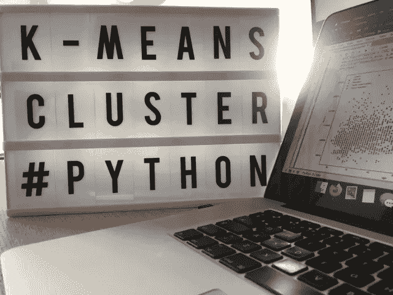

# 机器学习:用 Python 实现分层聚类和 K 均值聚类

> 原文：<https://medium.com/analytics-vidhya/machine-learning-hierarchical-and-k-means-clustering-with-python-fb73ee729128?source=collection_archive---------0----------------------->

一种数据科学方法，涵盖了在 Python 中执行聚类分析和客户细分的最常用模型。

图片由 gon alo GUI mares Gomes 提供

# 该项目

我们即将开始探索数据集的 python 之旅，在此过程中，我们将深入研究数据库分段，相应地预处理特征以实现最佳效果…