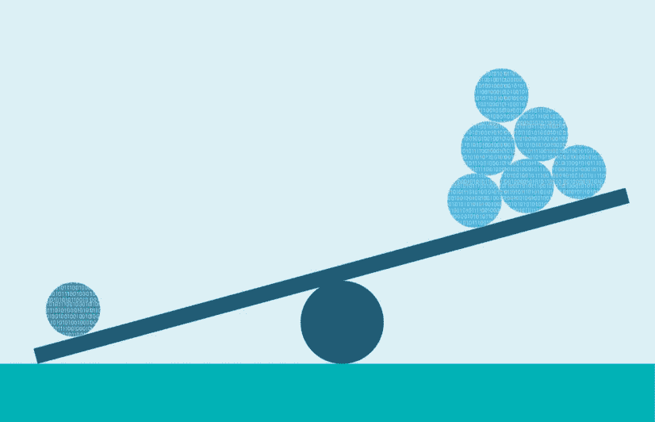
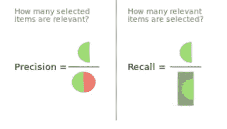

# 机器学习:如何处理班级失衡

> 原文：<https://medium.com/analytics-vidhya/machine-learning-how-to-handle-class-imbalance-920e48c3e970?source=collection_archive---------7----------------------->

## **简介:**

当构建分类模型时，您可能会获得很好的结果(高准确度分数),但会意识到您的模型只是将每个观察值预测到一个类。这是阶级不平衡造成的。类别不平衡是机器学习中的一个问题，其中一类数据的总数远远超过另一类数据的总数。为了说明类别不平衡是什么样子以及它是如何工作的，我们假设您有一个两个类别的数据集，其中包括 50 名糖尿病患者和 5000 名非糖尿病患者。在这个例子中，分类模型倾向于将患者分类为非糖尿病患者，因为它不能拾取将导致患者患有糖尿病的数据和趋势。即使该模型通过仅仅将每个患者分类为非糖尿病患者而以 99%的准确率结束，该模型也不能有效地对患者进行适当的分类。

许多数据集在每个类中都有奇数个实例，但微小的差异通常是可以接受的。根据经验，如果两个类的数据集之间的差异大于 65%到 35%，那么它应该被视为具有类不平衡的数据集。如果您使用的数据集包含两个以上的类，并且不确定是否存在类不平衡，您可以随时尝试在不进行任何调整的情况下运行您的模型，并确定模型是否正常运行，或者它是否仅预测某些类。

## **处理阶层失衡的方法:**

**我)使用不同的绩效指标**

如前所述，当数据中存在类别不平衡时，准确度分数不是一个好的度量标准。在处理班级失衡时，一些指标可能更有帮助:

*   精度—相关实例在检索到的实例中所占的比例
*   召回—检索到的相关实例的比例
*   F1 分数—精确度和召回率的加权平均值
*   混淆矩阵——说明正确预测和错误预测的表格

精确度和召回率

混淆矩阵

**II)收集更多数据**

这可能是不言自明的，但是，通过收集更多的数据，您可能能够创建一个更加平衡的数据集。如果有更多的数据可以帮助平衡数据集中的类，这可能是一种简单易行的解决类不平衡的方法。

**III)对数据集进行重新采样**

您可以通过添加少数类的实例副本(过采样)或删除多数类的实例(欠采样)来对数据集进行重采样，以创建更加平衡的数据集。这两种方法非常简单，易于实现。根据一般经验，当数据集非常大时，通常应该使用欠采样。同样，当数据集很小时，通常应该使用过采样。不管怎样，尝试这两种方法并看看你的结果会受到怎样的影响是没有坏处的。

**IV)生成合成样本**

您可以使用一些算法来生成合成样本，如 SMOTE(合成少数过采样技术)和 Tomek 链接。

SMOTE 是一种从少数类创建合成样本的过采样方法。它的工作原理是选择彼此相似的少数观察值，并在示例之间画一条线，以创建新的合成样本。

Tomek 链接通过检测最近邻的相反类的观察值来工作。它删除这些对的大多数实例。Tomek 链接的目标是澄清少数民族和多数民族类之间的边界，以使少数民族区域在模型中更加明显。

## **参考文献:**

*   队伍，走向 AI。"处理阶层失衡——虚拟分类器."*走向人工智能——最好的技术、科学和工程*，2020 年 8 月 2 日，
*   布朗利，杰森。"在你的机器学习数据集中对抗不平衡类的 8 个策略."*机器学习掌握*，2020 年 8 月 15 日，machinelingmastery . com/tactics-to-combat-unbalanced-classes-in-your-Machine-Learning-dataset/。
*   布朗利，杰森。"对不平衡分类的温和介绍."*机器学习掌握*，2020 年 1 月 14 日，machinelementmastery . com/what-is-unbalanced-classification/。
*   布朗利，杰森。"如何结合过采样和欠采样进行不平衡分类."*机器学习掌握*，2021 年 1 月 4 日，machinelementmastery . com/combine-over-sampling-under-sampling-for-unbalanced-class ification/。
*   “从不平衡的班级中学习。”*kdnugges*，[www . kdnugges . com/2016/08/learning-from-unbalanced-classes . html/2。](http://www.kdnuggets.com/2016/08/learning-from-imbalanced-classes.html/2.)