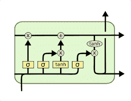
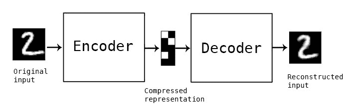
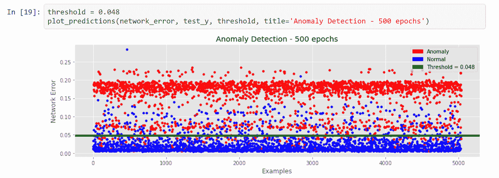

# 5G IOT 中的机器学习

> 原文：<https://medium.com/analytics-vidhya/machine-learning-in-5g-iot-97d68de44b93?source=collection_archive---------16----------------------->

**瞄准**

解决 5G 驱动的物联网中的网络管理和安全问题，并为其建立机器学习或深度学习算法。

**简介**

由于电子和通信技术的进步，5G 物联网系统的数量越来越多(例如，可穿戴电子设备、物联网设备和 5G 电信解决方案)。这些技术提高了城市和郊区服务的质量和性能，包括医疗保健、运输、能源、交通等等。

近年来，随着 5G 物联网系统的普及，虽然人工智能技术实现了更多的自主和智能功能，但随着越来越多的个人数据通过这种现代 5G 物联网系统生成和通信，这些系统的安全性变得越来越重要。

传统的安全措施或传统的隐私增强技术无法解决这些新出现的安全问题。因此，当前的 5G 物联网系统架构面临着巨大的挑战，需要处理越来越多的设备和服务器的安全性和隐私，以及保护大量实时处理的数据。

因此，需要依赖于深度学习的新的安全方法和隐私保护解决方案来构建更安全和更好的隐私保护 5G 物联网系统。最近观察到将深度学习与 5G 物联网系统的访问控制、入侵检测/预防和行为分析相结合的趋势越来越明显。

这种集成将在为智能自主 5G 物联网系统提供增强的安全性方面发挥至关重要的作用，并使组织能够对其安全格局做出重大改变。

**解决 5G IOT 的网络管理问题**

目标:由于 5G IOT 设备数量的快速增长，网络无法应对，最终崩溃。目标是使用机器学习有效地处理这种情况，并根据需求对网络进行优先排序。

**插入**

5G 最大的好处之一是实现虚拟网络的能力。这将创建具有不同流量优先级的子网。例如，在医院中，网络可以被设计成确保外科医生和机器人之间的连接优先于例如患者正在使用的通信。因此，即使网络达到容量极限，紧急传输也能得到保护。

**提议的解决方案**

1.跟踪网络中每个 IP 地址的使用情况，并根据使用强度分配网络资源。

2.设计一个参数来寻找最高的强度，并且当网络中出现拥塞时，该参数被给予优先权。

3.创建虚拟子网，并确保优先级较高的子网分布在不同的子网中，这样特定子网中就不会发生拥塞。

4.在完成上述所有工作后，我们使用一个**递归神经网络**来预测特定使用的网络使用，并因此根据该数据分配资源。

**概念:利用 LSTM 神经网络进行时间序列预测**

这里，我们将每天特定时间的数据消耗视为一个时间序列，然后使用 LSTM 预测所需的时间

使用 LSTM 预测时间序列在本文中有清晰的解释:[https://machine learning mastery . com/Time-series-prediction-lstm-recurrent-neural-networks-python-keras/](https://machinelearningmastery.com/time-series-prediction-lstm-recurrent-neural-networks-python-keras/)

**模拟**

让我们考虑纽约市的一个网络。该数据来自纽约市的 ISP 提供商。让我们建立一个递归神经网络，它接受网络消耗作为时间序列数据，并预测网络拥塞时网络的使用情况。

预测值和模拟的结果如下所示

算法链接:[https://github . com/avssridhar/5G-IOT-资源-管理/blob/master/5G](https://github.com/avssridhar/5G-IOT-RESOURCE-MANAGEMENT/blob/master/5G) IOT 资源管理. ipynb

代码在上面的 github 库中解释得很清楚。

**解决 5G IOT 的隐私问题**

目标:5G 无疑是实现 IOT 非常有用的技术之一。但是也有不利的一面。安全和隐私问题日益增加。本节的目标是构建一个有效的机器学习算法，用于监控网络并预测攻击。

**插入**

当网络受到攻击时，一些网络参数会发生变化。我们还利用黑客入侵网络的事实，网络的某些参数会发生变化，当黑客再次进行攻击时，我们会检测网络参数中的异常，从而阻止攻击。我们可以用自编码神经网络来预测异常。

**提议的解决方案**

1.使用网络错误作为检测异常的参数

2.每次新设备进入设备时，查找网络错误。

3.继续把这些数据输入我们的自动编码器神经网络算法。

4.固定一个阈值，如果由于网络错误的变化而预测的匿名值大于该阈值，则阻止该 IP 地址，直到对该 IP 进行进一步的认证

这尤其适用于防止攻击的组织。所有的用户 IP 都可以在服务器上注册，并作为数据存储在机器学习算法中，当黑客攻击网络时，自动编码器可以很容易地预测异常。

**概念:自动编码器神经网络**

本文对自动编码器进行了详细说明:[https://towards data science . com/auto-encoder-what-is-it-and-what-it-is-use-for-part-1-3e5c6f 017726](https://towardsdatascience.com/auto-encoder-what-is-it-and-what-is-it-used-for-part-1-3e5c6f017726)

**模拟**

让我们考虑一个遭受攻击的组织的数据，该数据是从 kaggle 获得的。当有攻击时，该算法正确地预测异常。

代码参考这个 github 库:[https://github . com/avssridhar/INTRUSION-detection-in-an-IOT-network/blob/main/INTRUSION detection . ipynb](https://github.com/avssridhar/intrusion-detection-in-an-iot-network/blob/main/INTRUSION%20DETECTION.ipynb)

希望以上解释对你有用。考虑为下面的文章鼓掌。😉

请随时联系我们进行进一步的讨论。

领英:[https://www.linkedin.com/in/avs-sridhar-8b9904176/](https://www.linkedin.com/in/avs-sridhar-8b9904176/)

推特:[https://twitter.com/AvsSridhar2](https://twitter.com/AvsSridhar2)