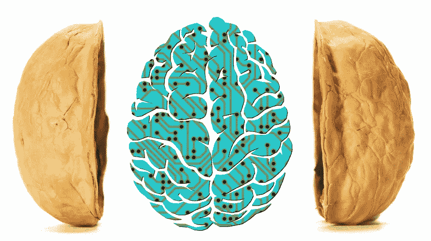
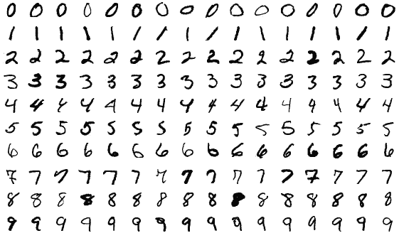

# 简而言之，机器学习

> 原文：<https://medium.com/analytics-vidhya/machine-learning-in-a-nutshell-e84a73267836?source=collection_archive---------15----------------------->

> “机器学习是在没有明确编程的情况下赋予计算机学习能力的研究领域。”阿瑟·塞缪尔，1959 年

传统上，要在计算机上解决问题，你需要使用基于规则的算法。然而，为每一种不同类型的任务编写基于规则的算法要么是不可能的，要么是不容易的。出于这个原因，有时使用机器学习方法来解决一些具有挑战性的问题会更方便。

为了让机器能够学习，你需要使用模型和数据来训练它。

# 在 ML 中建立模型的阶段

1.  **数据管理:**

在这一阶段，所有的数据收集、数据探索和准备都要进行。

**2。模特培训:**

这里是学习发生的地方。首先，您选择想要用来创建模型的学习方法。然后，您开始为模型提供它需要学习的数据。

**3。模型测试:**

在用数据训练模型之后，是时候用我们收集的一些数据来测试模型的运行情况了。在这个阶段，您评估您的模型，并查看是否需要一些更改。

**4。型号部署:**

最后，部署模型以实现其目标。在这个阶段，你最终确定你的模型，并付诸行动。

# 机器学习模型的类型

有几种方法对机器学习系统进行分类，最常用的是根据它们是否在人类监督下接受训练进行分类。

> "机器学习系统可以根据它们在训练期间得到的监督的数量和类型来分类."— **奥雷连·盖伦**

一般来说*，有 3 个主要类别:*

1.  ***监督学习:*** *模型通过标注的数据进行训练，达到期望的输出或预测。它用于分类，并预测目标数值*。
2.  ***无监督学习:*** *在这里，训练数据没有被标记，因此模型*试图通过寻找隐藏模式或数据分组来捕捉最佳可能的知识，而不需要人工参与。主要用于数据聚类。
3.  ***强化学习:(或边做边学)*** 机器在一个奖惩机制上接受训练，做出具体决策。然后，它被暴露在一个环境中，在这个环境中，它不断地使用试错法来训练自己。例如自动驾驶汽车和机器人吸尘器。

# 数据分割

用于创建模型的收集数据需要分成两组。一是训练模型，二是测试验证。

> “将 80%的数据用于训练，将 20%的数据用于测试是很常见的。但是，这取决于数据集的大小。”*——**奥雷连·盖伦***

*分割数据时，需要考虑两个主要问题:*

1.  *由于训练数据较少，模型可能无法学习任务。*
2.  *由于测试数据较少，模型的性能统计可能会有很大变化。(如“统计”语言所述:会有**大方差**)。*

*分割数据没有完美的比例，但是定型分割总是占用分区的大部分。*

*正如我之前在 [*中提到的，数据科学在数据宇宙中的地位*](/swlh/the-place-of-data-science-in-the-data-universe-81a803b03146) *，* ***机器学习*** *是计算机算法从数据中学习的能力，并且以这样一种方式学习，可以在未来改善它们的功能。*“这意味着需要数据来创建基于数据的模型。在机器学习的语言中，这些数据被称为***训练数据集*** 。*

# *训练数据集*

*它是用于创建模型并使其能够学习的样本的总称。*

**

*训练数据集示例*

*训练集中使用的数据类型取决于模型的功能。例如，上图是用于检测手写数字的模型的训练数据集样本。因此，模型将从提供的示例中学习和检测模式。*

# ***测试数据集***

*它是一组数据，用于找出模型在实际情况下的工作方式，以及模型在新情况下的推广效果。*

**

> *“测试数据集提供了用于评估模型的黄金标准。只有当一个模型被完全训练后，它才会被使用。”——[**塔朗沙阿**](/@starang)*

*T **rivia 事实:**新案例上的错误率被称为 ***泛化错误*** ，通过在测试集上评估你的模型，你就可以得到这个错误的估计值。该值告诉您您的模型在它以前从未见过的实例上执行的有多好。*

> *“人工智能，深度学习**，**机器学习——无论你在做什么，如果你不理解它——学习它。因为否则你会在三年内变成恐龙。”— **马克·库班***

*机器学习在我们的生活中无处不在。因此，每个人都需要对它及其工作原理有一个基本的了解。在这个故事中，我试图以简化的方式涵盖机器学习的一些主要概念和术语。*