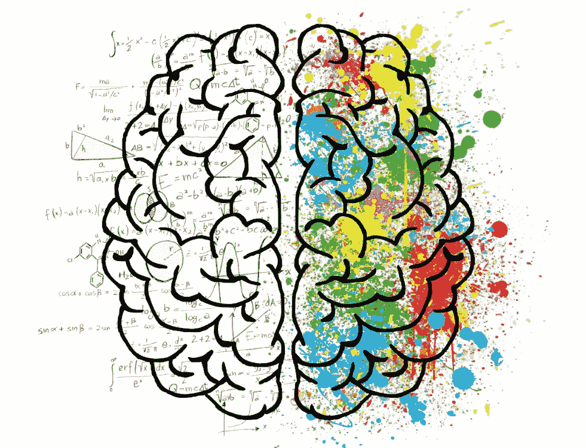
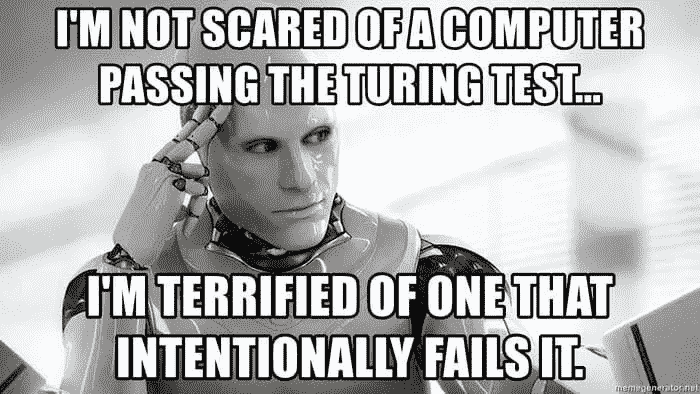
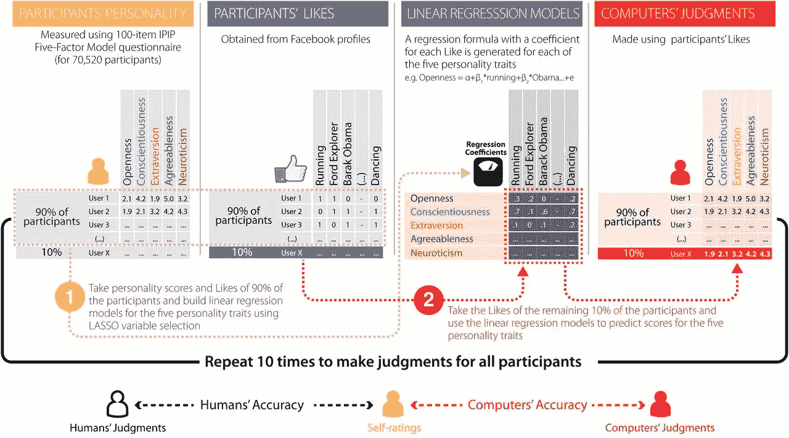

# 行为科学中的机器学习

> 原文：<https://medium.com/analytics-vidhya/machine-learning-in-behavioural-sciences-c2355c594c7?source=collection_archive---------19----------------------->

行为科学探索生物体内部的认知过程和自然界中生物体之间的行为相互作用。

教机器帮助我们理解人类的认知过程听起来很有趣。字面意思是，教机器认识、记忆、判断和解决人类思考、认识、记忆、判断和解决问题的能力。

在探索可以应用机器学习的领域时，我遇到了一个非常有趣的领域，那就是*行为科学*。

我们在很多领域应用机器学习技术来更有效地理解和解决问题。但是，将它应用到我们自己身上，以更好地理解人类大脑是如何运作的，当我们遇到任何恐慌的情况时，它会对我们有很大的帮助。

在特朗普总统当选后，剑桥分析公司事件占据了世界各地的头条新闻后，机器学习在心理测量中的使用引起了媒体的关注。最初，英国剑桥大学心理测量中心的学者收集了大量的社交媒体数据(超过 50，000 名参与者)，根据他们的脸书行为预测脸书个人资料所有者的个性。这项研究产生了一份极具影响力的出版物，作者在其中展示了如何使用基于反馈的行为(即喜欢)来高准确度地识别私人特征(民主党与共和党，AUC = 0.88)

心理科学的实验传统上是用统计推断工具来分析的。然而，最近关于这种分析工具在行为研究中的可复制性水平的争论已经引起了人们对开发更有效的技术来分析心理学实验结果的兴趣。机器学习已经开发出了至少可以控制某些形式的可复制性的技术，这种可复制性是以与看不见的新数据相似的准确度复制结果。

# 借助机器学习实现更好的结果复制

最近对行为实验缺乏可复制性的关注被称为*可复制性危机*。一个潜在问题的来源回到了推理统计学的使用及其对 T4 p 值的误解。

交叉验证通常是一个很好的衡量结果可复制性的方法。由于交叉验证包括在一组保留的实验实例上评估模型，这组实例与用于模型开发的实例没有什么不同。虽然交叉验证不能防止模型过度拟合，但它仍然可以估计真实的性能。

pnas.org

# 统计推断与机器学习结果

机器学习使用主要针对分类准确性的评估度量，例如准确性、曲线下面积(AUC)等。相比之下，统计指标是不同的，更多地与推断(*p*-值)联系在一起，并侧重于报告效果大小(例如，Cohen 的 d 等)。).

# 结论

用于认知理论的机器学习模型很少用于心理实验的分析和心理测量测试的开发。大脑图像的分类(功能性和结构性)是一个显著的例外。

以下是在行为科学实验中使用机器学习技术的一些优势

1.  将结果复制到看不见的数据是现实的估计，而不是乐观的夸大。
2.  n 重交叉验证保证了心理学实验中典型的小数据集(例如， *n* = 40)的可复制结果。
3.  报告了实用且清晰易懂的度量标准，而不是间接的推断性测量。

# 参考

*   *心理测量学和心理学研究中的机器学习。*
*   Dominic B. Dwyer、Peter Falkai 和 Nikolaos Koutsouleris 的临床心理学和精神病学机器学习方法。