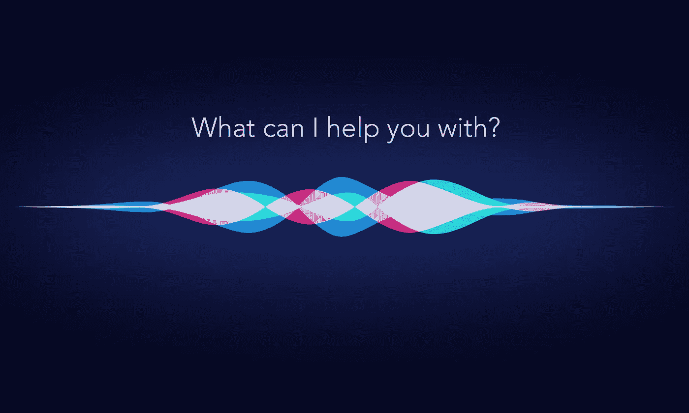
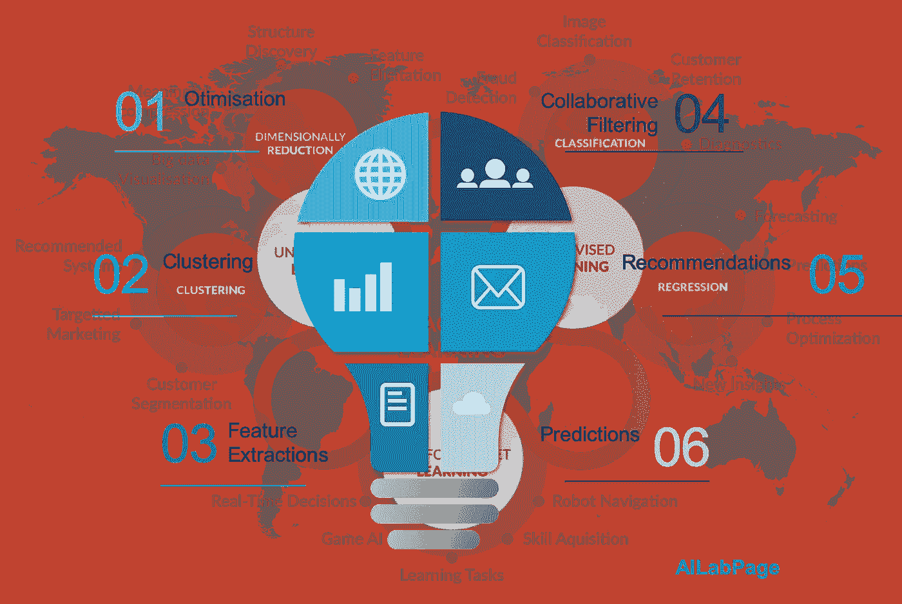
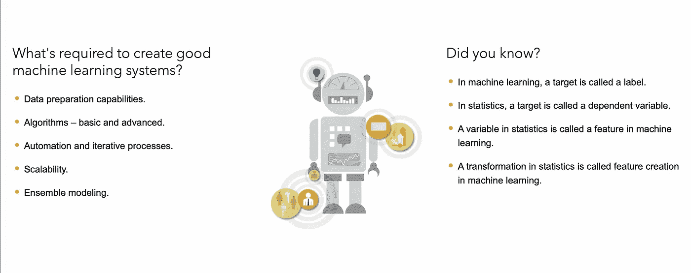
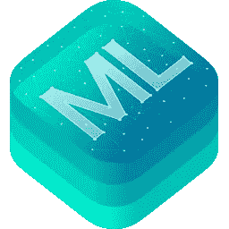
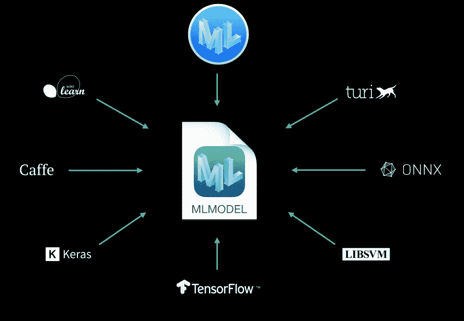
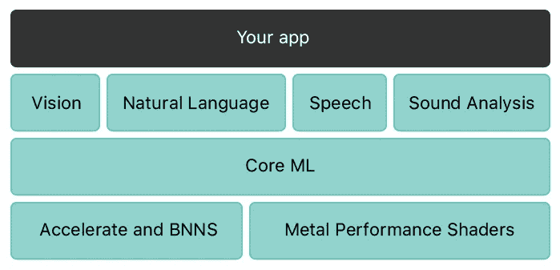

# 具有核心 ML 的 IOS 中的机器学习

> 原文：<https://medium.com/analytics-vidhya/machine-learning-in-ios-with-core-ml-adce88ca43ef?source=collection_archive---------17----------------------->

人工智能，尤其是机器学习，是当下的热门话题。互联网上可用的数据量一直在增加，因此我们有理由探索这些数据并将其转化为有用的信息。

# 机器学习

机器学习是一种自动开发分析模型的数据处理技术。它是人工智能的一个子领域，专注于这样一个前提，即系统可以从数据中学习，识别模式，并在很少或没有人类参与的情况下做出决策。

由于计算机技术的进步，现在的机器学习与过去的机器学习不一样。它起源于模式检测和计算机无需训练就能学习完成特定任务的想法；人工智能研究人员试图了解计算机是否可以从数据中学习。机器学习的迭代性质很重要，因为当模型被引入新数据时，它们会独立进化。他们从以前的计算中学习，以便做出一致的、可重复的决策和结果。

# 核心 ML

通过利用 Apple 硬件并最小化内存占用和功耗，Core ML 针对各种型号的设备输出进行了优化。

在 iOS 11 中，苹果发布了 Core ML 和 Vision。Core ML 使开发人员能够将机器学习框架整合到他们的应用程序中。这有助于创建智能设备上的功能，如对象检测。iOS 13 在 Core ML 3 中推出了设备上训练，并解锁了自定义用户界面的新方式。

## 模型

模型是机器学习算法应用于一组训练数据的结果。模型用于根据新的输入数据呈现预测。模型将执行各种各样的任务，这些任务用代码来实现是不可能或不切实际的。

Xcode 中包含的 Create ML 应用程序允许您创建和训练模型。创建 ML 模型采用核心 ML 模型格式，可以在您的应用程序中使用。您也可以使用许多其他机器学习库，然后使用 Core ML 工具将模型转换为 Core ML 格式。如果一个模型在用户的设备上，您可以使用 Core ML 使用该用户的数据重新训练或微调它。

## 结构

特定领域架构和特性的基础是核心 ML。Core ML 支持用于图像识别的视觉、用于文本解释的自然语言、用于音频到文本翻译的语音以及用于识别音频中的声音的声音分析。核心 ML 建立在诸如 Accelerate 和 BNNS 等低级原语以及金属性能着色器上。

基于金属的机器学习部署通常将使用移动设备的 GPU 和低级 API 和协议，迫使开发人员遵循通常与桌面或基于云的人工智能系统中使用的流程和管道一样复杂和健壮。虽然基于金属的应用程序也可以使用苹果专用的神经网络硬件芯片 A11–13 处理器 1，但生产工作流程可能同样苛刻。

Metal 仍然是最通用的应用途径，其覆盖范围比 Core ML 讨论的四个应用更广，允许基于 GPU 的低级功能，如光线跟踪以及 Core ML 不支持的自定义机器学习模型实现。