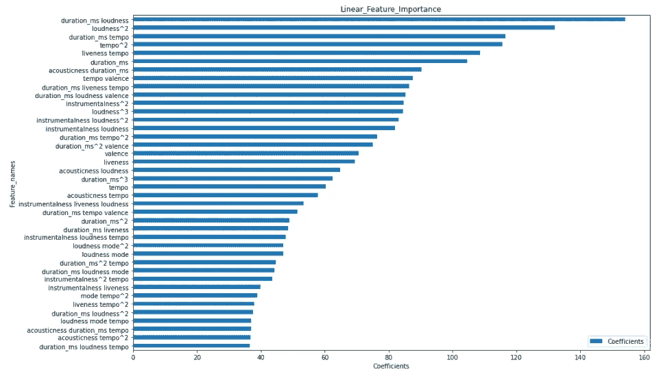
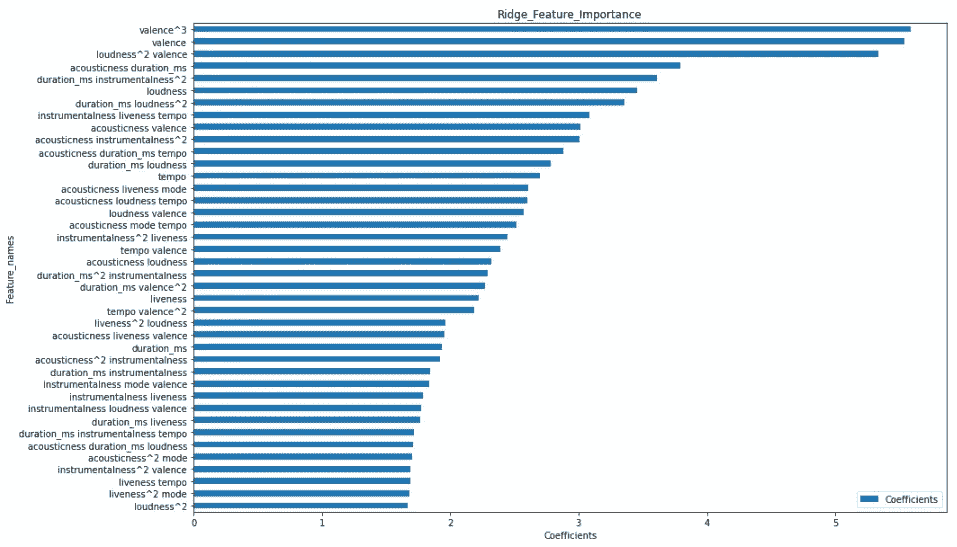
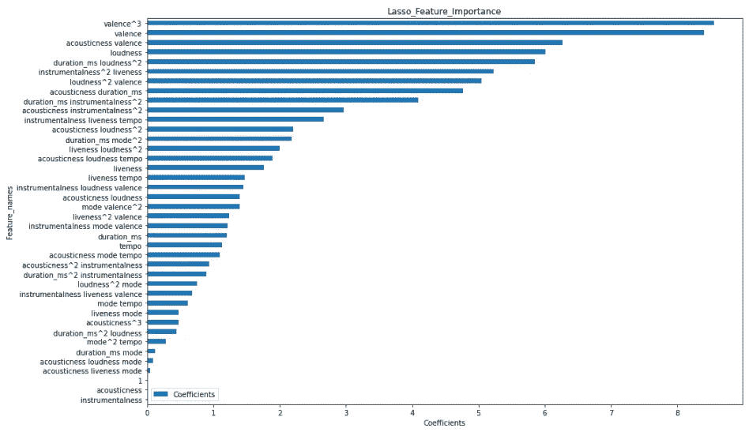
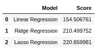
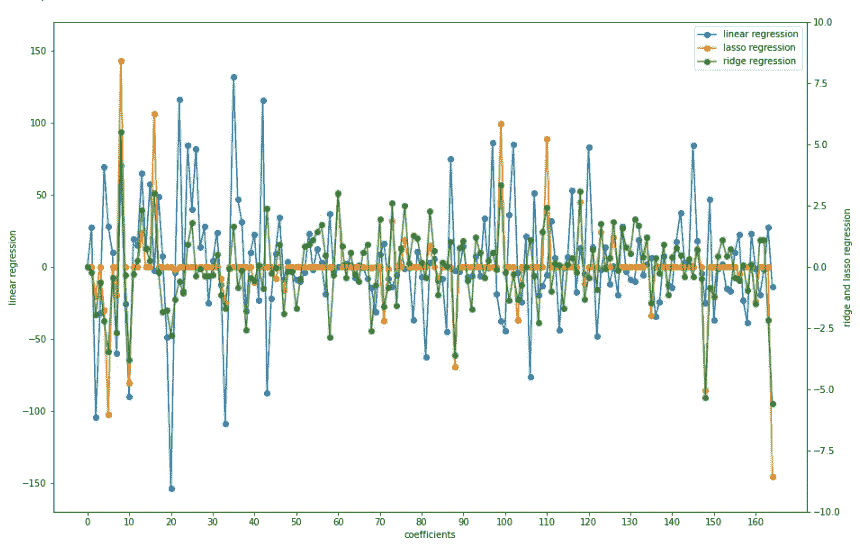

# 音乐行业的机器学习

> 原文：<https://medium.com/analytics-vidhya/machine-learning-in-the-music-industry-586cbac45107?source=collection_archive---------17----------------------->

## 介绍

我们大多数音乐爱好者欣赏制作不同音乐艺术杰作的复杂程度。从无数的录音室时间到宣传一首单曲或整张专辑的大量劳动。音乐制作人、艺术家和支持他们的唱片公司必须确保他们完全了解他们的目标听众。这导致人们对音乐行业使用预测分析越来越感兴趣。

像 Spotify 这样的行业巨头在使用预测分析的公司名单上并不少。2014 年，Spotify 收购了一家名为 Echo Nest 的预测分析公司。Echo Nest 是一个面向开发者和媒体公司的音乐智能和数据平台，它最初是麻省理工学院媒体实验室的一个研究副产品，旨在了解录制音乐的音频和文本内容。

2015 年，排名第一的互联网广播电台 Pandora 也采取了行动，收购了纽约的一家提供在线音乐分析的公司 Next Big Sound。此外，Apple Music 收购了总部位于英国的预测分析公司 Symmetric。

随着世界进一步进入数字时代，确定一首歌是否能进入“前 100 名排行榜”变得越来越复杂。很久以前，这样做相对容易，因为唱片公司会简单地盘点当地商店售出的唱片数量(CD、黑胶唱片、磁带等)，甚至查看音乐会的门票销售情况。说实话，时代已经变了，我们中的许多人都会同意，自从我们上次购买硬拷贝唱片已经有很长一段时间了，而且，许多人甚至从未购买过你最喜欢的艺术家的专辑的硬拷贝唱片。现在，我们在网上购买电子版本，或者只是在各种简化平台上听，只要我们的月订阅有效。这导致了几家音乐商店倒闭。就在赞比亚，我们目睹了一家以音乐目录《Sounds Arcade》闻名的商店被关闭。

那么，预测分析公司如何适应这个新的数字时代，以洞察音乐听众的行为？这就是机器学习发挥作用的地方，尤其是回归模型的使用。那么，如果你可以利用音频特征安全地预测一首歌的受欢迎程度会怎么样呢？考虑到这一点，我决定更好地了解音频功能对歌曲流行度的影响。为此，我决定训练三个不同的回归模型，以找到在预测受欢迎程度方面提供最大价值的最佳特征。最后，我评估了三种型号的性能，以得出最佳型号。

## 数据描述

Spotify 数据库提供免费的在线音频功能。利用这些数据，我能够采取数据驱动的方法来测试歌曲流行的决定因素。歌曲的受欢迎程度作为因变量，而自变量"名称"、" id "、"声音"、"可跳舞性"、"持续时间"、"能量"、"乐器性"、"活跃性"、"响度"、"语速"、"节奏"和"价"。

## 数据收集

Spotify 的 API 允许你通过搜索音乐类型来获取歌曲，所以我决定只关注非洲最常见的音乐类型。这将我的搜索范围缩小到 60 个流派。亮点包括: "非洲 hip hip "、"非洲灵魂"、" Afrobeat "、" Amapiano "、" Kwaito "、"非洲伦巴"和" Soukous "。通过这些流派名称和 Spotify 搜索 API 请求，我检索到了指定感兴趣的年份为 2021 年的歌曲。

我用一个 python 脚本从每个流派中自动抽取 40 首歌曲，选出前 20 首，然后跳过 1000 首，选出后面的 20 首。理想情况下，这会产生 1200 个音轨的样本。然而，一些流派没有足够的歌曲。所以应用了这个方法之后，最终我有了 550 首歌。

接下来，我将所有歌曲收集到一个 pandas 数据框中，其中每行包含一首歌曲，而每列包含音频特性的值。

## 数据清理

由于每个特征都有不同的尺度，因此需要对特征进行标准化，以便能够比较回归系数。接下来，我进行了相关性分析，以测试哪些特征在决定歌曲受欢迎程度方面最为重要。从相关性测试中获得的结果如下:

*   ****声音与流行度*** *的皮尔逊相关系数为-0.12722650565997423，P 值为 P = 0.002798069569184011**
*   *****舞蹈性与流行性*** *的皮尔逊相关系数为-0.09477470459838025，P 值为 P = 0.02624197758993717***
*   ******duration _ ms vs population****的皮尔逊相关系数为-0.1662029399647502，P 值为 P = 8.99531712018831e-05****
*   ******能量对人气*** *的皮尔逊相关系数为 0.03855230551394703，P 值为 P = 0.3668389968271691****
*   ******工具性与流行性*** *的皮尔逊相关系数为 0.259759600855517，P 值为 P = 6.229369988414457e-10****
*   ******键对人气*** *的皮尔逊相关系数为 0.055470039614771545，P 值为 P = 0.1939685341487687****
*   ******活跃度对人气*** *的皮尔逊相关系数为 0.2071422771266901，P 值为 P = 9.578322170034305e-07****
*   ******响度与流行度*** *的皮尔逊相关系数为-0.31155208385793326，P 值为 P = 7.615157883989493e-14****
*   ******模式对人气*** *的皮尔逊相关系数为-0.13106552397464172，P 值为 P = 0.002695734488557797****
*   ******语音与人气*** *的皮尔逊相关系数为-0.04801655710106188，P 值为 P = 0.2609389561215743****
*   ******tempo 对人气*** *的皮尔逊相关系数为-0.19799628326806562，P 值为 P = 2.877851205751624 e-06****
*   ******时间 _ 签名与人气*** *的皮尔逊相关系数为 0.06653962437244768，P 值为 P = 0.1190745098597834****
*   ******效价与人气*** *的皮尔逊相关系数为-0.29861731404594316，P 值为 P = 8.610749564339601e-13****

## **数据分析**

**在对每个变量进行相关性分析之后，是时候训练回归模型了。训练的第一个模型是线性回归模型。在线性回归模型中添加多项式特征，使我们能够捕捉独立变量之间的交互作用。使用 python 的 scikitlearn 库进行交叉验证后，多项式= 3 次被选为最佳。一旦模型被拟合，独立变量的总共 165 个参数估计被获得。这些参数表示与具有预期目标值的特征 x 相关的系数。这些参数被用来学习每个特征在预测一首歌的流行度中的重要性。我们看到“持续时间 _ 毫秒响度”的影响最大，系数为 153.965，其次是“响度”，系数为 131.914。我们还注意到，歌曲的“活跃度”也有相当大的影响，系数为 69.334。下图显示了影响最大的前 40 个系数。**

****

**值得注意的是，这里采用的参数值是绝对值，因此大的影响可能对流行度测量产生负面或正面的影响。但是为了解释的目的，我们通常取每一项的绝对值。我们注意到的另一件事是模型的 r 分数，去除无关紧要的决定因素和只选择预测变量提高了解释能力，给我们 0.584 分。**

**拟合数据的第二个模型是岭回归模型。获得的 r 值为 0.433。看看下面岭回归的非零系数，有一些不同的趋势，如“价”，“响度价”和“价”占主导地位。观察到的另一件事是岭回归只有 164 个回归系数。这是由于正则化效应。同样，我们可以从下图中看到这一点，该图显示了影响最大的前 40 个系数。**

****

**最后，对 lasso 回归模型进行训练，该模型彻底清除了大部分系数，总共只有 37 个系数。类似于岭回归，特征如“价”和“价”占主导地位。然而，lasso 回归模型得出的 r 值最低，为 0.406。**

****

**均方根误差(rmse)测量用于评估每个模型的性能。分数如下所示。**

****

## **讨论**

**这个项目的主要目的是为了更好地了解音频特性对歌曲流行程度的影响。我进一步评估了所使用的三个机器学习模型的性能。相关性的结果表明，音频特征和流行度之间存在显著的关系。然而，观察到的关系普遍较弱。接下来，从选择的特征中拟合线性回归模型。线性回归模型的 r 值为 0.584，这意味着该模型解释了受欢迎程度变化的 58.4%。岭回归模型 r 值为 43.3%，lasso 回归模型 r 值为 40.6%。**

**使用岭和套索回归的主要原因之一是试图通过减少系数的数量来减少过度拟合的影响。下图显示了三种模型的系数影响的变化。**

****

## **结论**

**因此，我们得出结论，线性回归比其他模型表现更好，因为它具有最低的 rmse 得分和最高的 r 得分。但是，我们可以有把握地说，我们可以使用拟合的线性回归模型来自信地预测任何歌曲的流行程度吗？嗯，在某种程度上我们可以。对 Spotify 功能和流行度进行的分析证明，一首歌曲的功能和它在全球范围内的普遍流行度之间存在普遍的相关性。这对于音乐行业来说是一项重要的活动，因为准确预测某首歌曲的受欢迎程度的能力对于在发行前确定盈利能力非常有帮助。**

**我相信，这些模型的预测能力和可解释性可以通过扩展它们来提高，包括其他已建立的预测因素，如流量计数、社交媒体数据等。另一件事是专注于一个特定的类型。**

## **密码**

**对于那些想了解我的代码的人来说，我的 [Github 账户](https://github.com/Musa70/Spotify-Project)上有这个笔记本。**