# 机器学习直觉…

> 原文：<https://medium.com/analytics-vidhya/machine-learning-intuition-9e20bf6cadf8?source=collection_archive---------13----------------------->

一个机器自己学习的时代

你一定听说过媒体中的机器学习和人工智能这两个术语。或许，机器学习算法如何在象棋、围棋等游戏中击败人类，或者机器学习和人工智能可以用来提供更好的医疗诊断和治疗。那些很有趣，对吧？

让我们来理解 ML 背后的概念和直觉。

> 从自动驾驶汽车到可信的假货，人工智能和机器学习对我们社会的未来和我们的运作方式都有影响。

首先，让我们看看人工智能、ML 和数据科学是如何相互联系的:

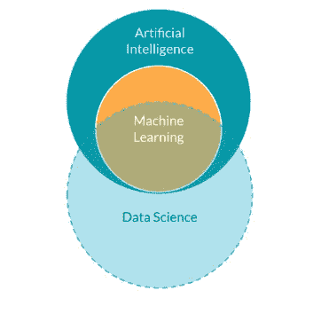

**人工智能(AI):** 通俗地说，AI 基本上就是一个庞大的让计算机智能行为的工具集。它包括各种子领域，如机器人，ML 等。

**机器学习(ML):** 它是人工智能中最普遍的子集，可以被解释为“一套从数据中做出推断和预测的工具”

**数据科学(DS):** 众所周知，数据科学就是从数据中发现并传达洞察力。机器学习通常是 DS 工作的重要工具，尤其是在预测方面。

**机器学习模型**(啊！不要想那个‘模特’:D):

它基本上是基于数据的真实世界过程的统计表示。很典型，对吧？。想象一下，你有一个盒子，当你输入一些东西时，它会产生一个输出。

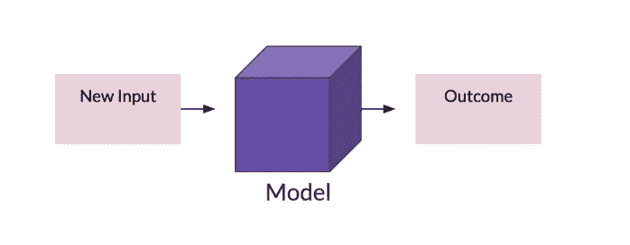

ML 模型的一般视图

例如:我们的模型可以将任何“推文”归类为“假”或“非假”。

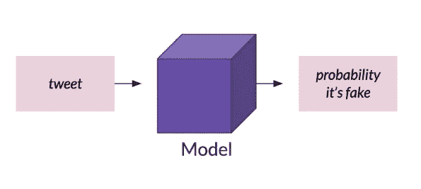

ML 模型的示例

在讨论 ML 的类型之前，我想让你熟悉一些我们将要用到的术语，你必须知道这些标准术语。

i) **训练数据集:**现有数据集，我们将使用它来构建我们的 ML 模型。

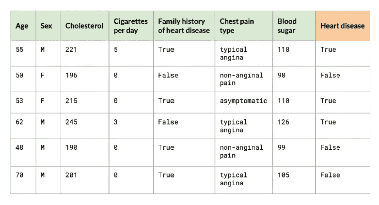

训练数据集

ii) **目标变量&标签:**目标变量有时也被称为(因变量，输出变量)本质上就是我们所针对的(想要预测的)。

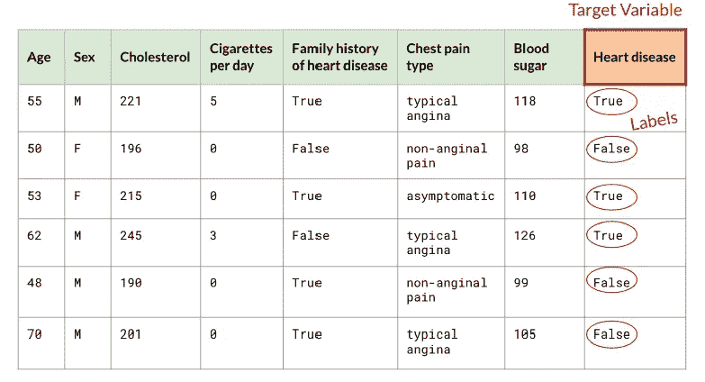

目标变量和标签

iii) **观察/实例/记录/实例/样本:**这些基本上是隐含观察的行数。

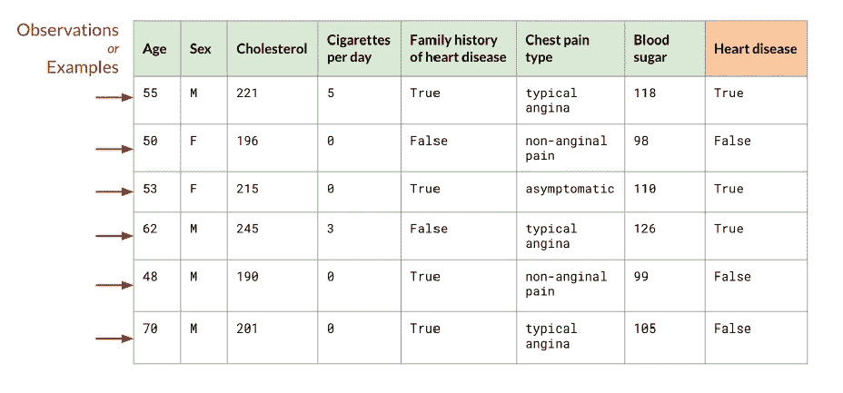

观察/例子/记录

iv) **特征/独立变量:**特征本质上是你正在考虑的与我们的目标变量(我们想要预测的)有某种关联的特征。

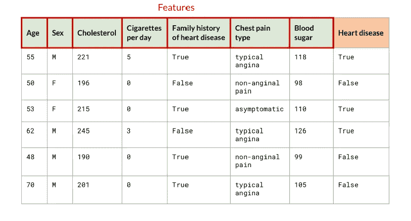

数据集的特征

现在，让我们讨论机器学习的类型:

1.  监督 ML
2.  无监督 ML
3.  钢筋 ML

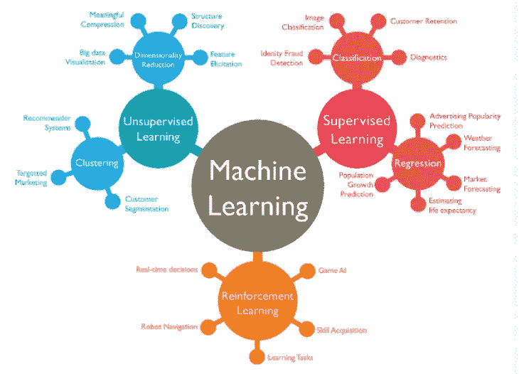

机器学习的类型及相关示例

在本文中，我们将更多地关注有监督和无监督的 ML，因为这两种 ML 是最常用的，也是最适合开始使用的。

1.  **监督学习:**监督学习基本上就是一个贴标签的机器。它需要观察并给它分配一个标签。

有两种监督学习:

*   **分类:**在上面的例子中，当我们想要将一条推文分类为“*假*或*‘非假’*时，我们实际上是在处理监督分类 ML。所以，你一定会有这样的感觉，在分类中，我们有点像是在把事物分类到一些预先定义的不连续的类别中，是的，你说得对！事情就这么简单。

> 分类就是给一个观察值分配一个类别。我们预测的是一个离散变量，一个只能取几个不同值的变量。该客户是否要停止订阅？这个痣到底是不是癌？这酒是红的、白的还是玫瑰红的？这朵花是玫瑰、郁金香、康乃馨还是百合？

一个非常经典的分类示例是“垃圾”邮件分类，如下所示:

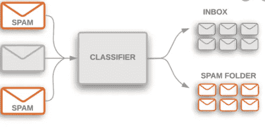

*   **回归:**分类分配类别的同时，回归分配一个连续变量，即可以取任意值的变量。比如这只股票会值多少钱？这个孩子成年后会有多高？明天的温度是多少？在回归的帮助下，可以处理更多的语句。

借助下面的例子来描述它，在这个例子中，我们将借助一个可用的特性“湿度”来预测温度。

数据集:

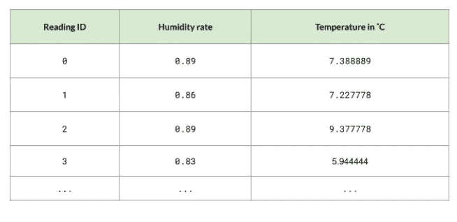

回归的简单数据集示例

当我们绘制它的时候，我们会得到如下的结果:

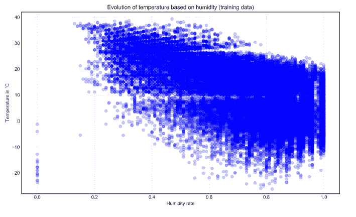

现在，在回归(这里是线性回归)的帮助下，我们想找出这些数据点的最佳拟合线，这将帮助我们预测给定湿度值的任何新温度值。

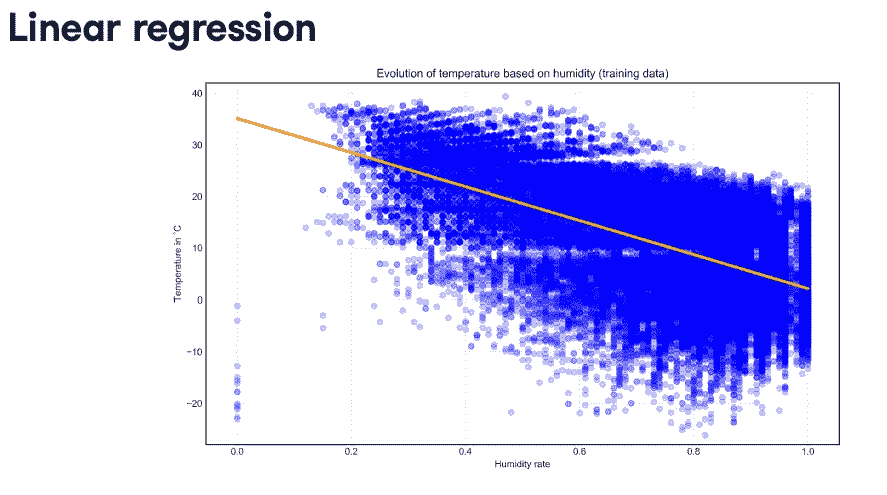

线性回归

> 简而言之，**分类=类别**(离散值)& **回归=连续(如温度、身高、价格等)。**

2.**无监督学习:(无监督)-** 无标签数据，即我们没有任何关于标签的先验信息(无目标变量列)。

那么，还有什么意义呢？

关键是，无监督学习从数据集学习，并试图找到模式。这就是这项技术如此有趣和强大的原因:我们可以在不太了解数据集的情况下找到洞察力。

无监督学习有三种形式:

**一)聚类**

**b)异常检测**

**c)联想**

让我们先看看集群，并将在下一篇文章中讨论其他两个。

**a)聚类:**聚类包括识别数据集中的组。这些组中的观察结果与他们组的成员比与其他组的成员有更强的相似性。

你将通过下面的例子得到它:

假设，你有不同的狗和猫，如下所示:

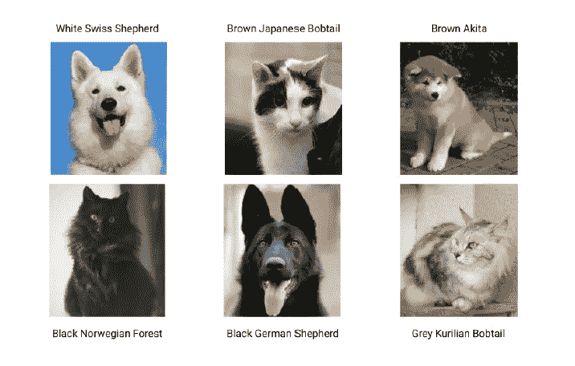

聚类示例

你可以通过*【物种】*来创建集群/群组，对吗？

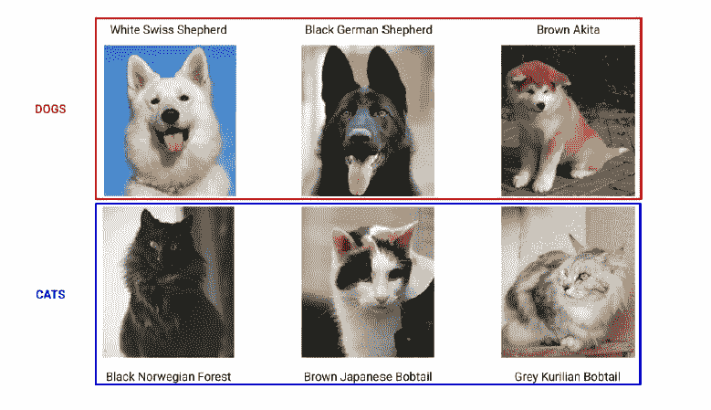

按物种聚类

另一种方法是按*【颜色】*，如下图:

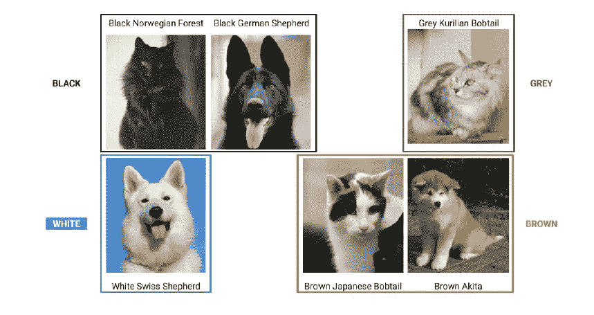

按颜色聚类

现在，你一定非常清楚集群的概念。有各种方法可以做到这一点，这将是一个完全独立的事情，我们可以在接下来的文章中讨论。

这篇文章的全部目的是以尽可能简单的方式提供机器学习的直觉。虽然它涵盖了非常基础的内容，但我希望，在阅读完这篇文章后，你们中的许多人会对机器学习及其相关术语感到更舒服。

***快乐学习！！***