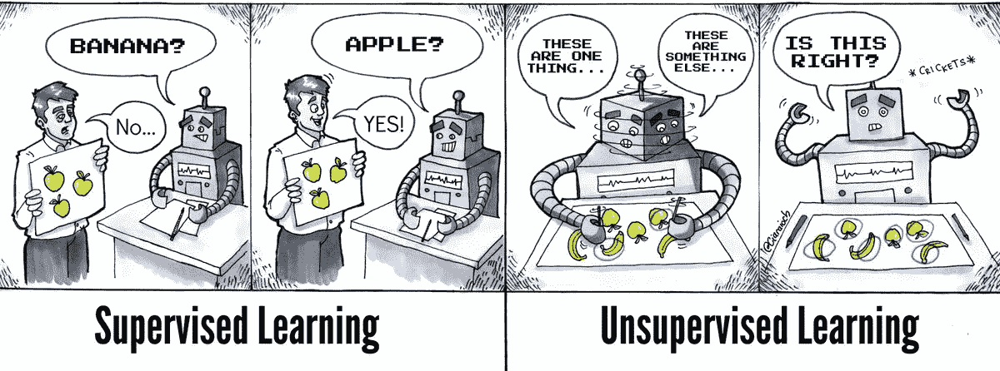
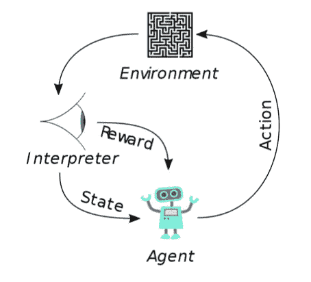
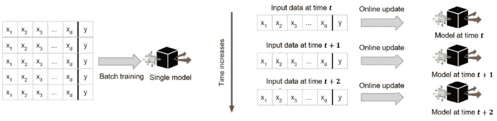
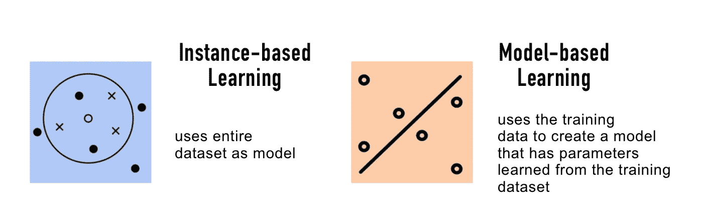

# 初学者的机器学习前景

> 原文：<https://medium.com/analytics-vidhya/machine-learning-landscape-for-beginners-19aeb5dbd466?source=collection_archive---------28----------------------->

机器学习是系统在没有明确编程的情况下从数据中学习的能力。例如，我们邮箱中的垃圾邮件过滤器是一个机器学习程序，可以标记垃圾邮件。如果我们必须使用传统方法构建垃圾邮件过滤器；—首先，我们将找出在主题中经常出现的单词和短语。其次，识别发件人的电子邮件 id 和电子邮件正文中的模式。最后，构建一个定义这些规则的算法来识别每个模式，并将电子邮件标记为垃圾邮件。随着时间的推移，算法可能会成为一长串的规则，因为垃圾邮件发送者不断改变他们的模式，因此算法需要相应地更新。相反，使用机器学习方法的垃圾邮件过滤器通过检测不寻常的频繁单词模式来自动学习哪些单词和短语是垃圾邮件的良好预测者。该程序更短，易于维护，适应性更强。

# 为什么是机器学习？

*   用传统方法解决问题需要大量的手工调整和一长串难以管理的规则
*   波动的环境，机器学习系统可以很容易地适应新的数据

# 机器学习系统的类型

机器学习系统有许多不同的分类方式。以下是基于以下内容的宽泛分类:

## 他们是在人的监督下接受训练的吗？

> 监督学习
> 
> 无监督学习
> 
> 半监督学习
> 
> 强化学习

## 他们是在飞行中逐渐学习的吗？

> 批量学习
> 
> 在线学习

## 他们是将新数据点与已知数据点进行比较，还是检测训练数据中的模式并建立预测模型？

> 基于实例的学习
> 
> 基于模型的学习

这些标准不是唯一的，我们可以任意组合。例如，垃圾邮件过滤器可以使用使用垃圾邮件和 ham(nonspam，也称为“ham”)训练的深度神经网络模型进行动态学习；这使得它成为一个在线的、基于模型的、受监督的学习系统。

> 机器学习系统可以根据系统在训练期间接受的监督的数量和类型分为四个主要类别。

个人电脑:雅典娜分析

## 1.监督学习:

在监督学习中，训练数据包含所需的标签。垃圾邮件过滤器学习被标记为垃圾邮件或 ham 的示例电子邮件。一个典型的监督学习任务是**分类**，垃圾邮件过滤器就是一个很好的例子。另一个典型的例子是预测目标数值。例如，根据汽车的里程、年龄、品牌等特征预测汽车价格，这被称为*预测。这种任务叫做* ***回归。***

> 在机器学习中，属性是数据类型*例如里程*，而特征是属性及其值*例如里程=15000*

一些监督学习算法是:

*   k-最近邻
*   线性回归
*   逻辑回归
*   支持向量机(SVM)
*   决策树和随机森林
*   神经网络(一些神经网络也可以是无监督和半监督的)

> 将在接下来的博客中学习这些算法。现在，让我们知道算法名称和它们的类型。

## 2.无监督学习

在无监督学习中，正如您所猜测的，训练数据没有被标记，系统试图通过识别模式并对其进行分组来学习。

一些无监督学习算法是；

*   使聚集

— k 均值

—层次聚类分析(HCA)

—期望最大化

*   可视化、维度缩减和异常检测

主成分分析

—内核 PCA

—局部线性嵌入(LLE)

—t-分布式随机邻居嵌入(t-SNE)

*   关联规则学习

—先验的

Eclat

例如，我们希望将访问者分组到一个博客站点，以便可以向访问者提供相关的博客建议。

## 3.半监督学习

在半监督学习中，算法使用部分标记的数据进行训练。照片托管服务就是一个很好的例子。这些服务可以将相似的人的照片分组，它希望我们做的唯一一件事就是给他们贴上标签，即每个人一个标签。

大多数半监督学习模型是监督学习和非监督学习的结合。

*   深度信念网络(DBN)是半监督学习的一个例子。这些模型使用无监督学习依次训练，然后使用监督学习进行微调。

## 4.强化学习

在强化学习中，系统有一个 ***智能体*** ，它通过观察一个环境进行学习，选择并执行动作，作为回报获得奖励/惩罚。最好的学习方法是制定政策。该策略定义了在给定情况下代理应该采取的动作*。*

强化学习

> 用于对机器学习算法进行分类的另一个标准是基于系统是否可以从输入数据流中进行增量学习。

批量学习 v/s 在线学习

## 1.批量学习

在批量学习中，系统不能进行增量学习:每次新数据到达时，它必须使用所有可用的数据进行训练。这需要大量的时间和计算资源，通常是离线完成的。如果一个系统需要像智能手机这样的有限资源自动学习，那么在线学习将是一个更好的选择。

## 2.在线学习

在在线学习中，系统通过分批顺序输入数据实例进行增量训练。学习是快速和廉价的，系统可以在数据到达时学习，一旦学习到就丢弃它们。在线学习的一个重要参数是系统应该以多快的速度适应变化的数据:这被称为 ***学习速率。*** 在线学习的一大挑战是选择学习率，如果学习率太高，系统将学习得更快，但往往会忘记旧的学习(垃圾邮件过滤器可能只会标记最新类型的垃圾邮件)如果学习率太低，系统将学习缓慢，对新数据中的噪声不太敏感。为了降低风险，需要对系统进行监控，并且必须关闭学习。在性能下降的情况下，需要监控系统的输入并对异常数据做出反应。

> 不要和在线学习中的在线单词混淆，这里的在线是指离线的增量训练。

> 对机器学习系统进行分类的另一种方式是基于它们如何概括。

基于实例的学习和基于模型的学习

概括有两种主要方法:

## 1.基于实例的学习

在基于实例的学习中，系统用心学习例子，然后使用相似性度量来归纳成新的案例。例如，垃圾邮件过滤器标记与已知垃圾邮件相同的电子邮件，也可以被编程来标记与已知垃圾邮件非常相似的电子邮件。

## 2.基于模型的学习

在基于模型的学习中，使用训练示例建立模型，然后使用该模型进行预测。我们如何知道模型表现最好？我们需要定义一个效用函数，也称为适应度函数，来衡量模型有多好，或者定义一个成本函数，来衡量模型有多差。

现在我们知道机器学习到底是什么，它为什么有用，以及一些最常见的类别。

参考:

由 [Aurélien Géron](https://www.linkedin.com/in/aurelien-geron/) 用 Scikit-Learn 和 Tensorflow 进行机器实践学习