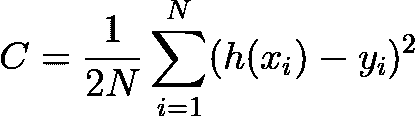

# 从零开始的机器学习线性回归项目(无库)

> 原文：<https://medium.com/analytics-vidhya/machine-learning-linear-regression-project-from-scratch-without-library-87294048020?source=collection_archive---------7----------------------->

线性回归是一种受监督的机器学习，用于预测一定范围内的值，而不是将它们分类。

> 在本文中，您可以找到一元线性回归在 Python 中的实现，而无需使用任何机器学习库。代码将一步一步地用提供的数学背景解释。


# **概要**

*   理论背景
*   Python 代码
*   摘要

# **背景**

你可能认为，“我可以在不知道发动机如何工作的情况下驾驶汽车”。是的，你是对的。但是，如果你在高速公路上行驶时，发动机出现了简单的故障，该怎么办呢？等待服务几个小时还是自己在几分钟内解决问题？同样的事情也适用于机器学习算法。如果你了解背景，你会自己解决问题，甚至可能发明一个更好的引擎。

了解任何算法背后的数学将会给你 100%的控制权。在建立机器学习模型时，您可能需要修改算法，以便从提供给您的数据中获得最佳模型。在这种情况下，了解算法如何在后台工作以进行任何改进是至关重要的。

我已经发表了两篇关于线性回归背后的数学理论的论文。第一个是单变量线性回归，用简单的例子解释了算法的基础。从一元线性回归开始是一个好的做法，因为它是线性回归的最简单版本。在你获得了基本信息之后，你可以看看第二篇论文——多元线性回归。MLR 的概念与 ULR 相同，但它用于更复杂的数据集(多个输入要素):

1.  [一元线性回归](/analytics-vidhya/machine-learning-univariate-linear-regression-1acddb85aa0b)——需要开始的基本信息。

2.[多元线性回归](/analytics-vidhya/machine-learning-multivariate-linear-regression-8f9878c0f56f) —线性回归的更复杂形式。

# **Python 代码**

代码将分为两部分。第一部分将是关于如何阅读和可视化数据集。在我们完成这一部分后，函数(成本函数，梯度下降等。)的算法将被编写。

> 在一步步深入代码之前，我想提一下，你可以在[我的 github 账户](https://github.com/anarabiyev/Machine-Learning-Linear-Regression-from-scratch-without-library-)中找到所有的代码和数据集。

## **第一部分。读取和可视化数据集**

要建立任何机器学习模型，你需要一个数据集，而要建立一个成功的模型，你需要可视化数据集，以便更好地进行分析。因为可视化将使您对数据有清晰的理解，并帮助您对使用哪种算法有初步的想法。

数据集提供为 **csv** 文件，**熊猫**库用于读取 csv 文件。read_csv 函数将数据集写入名为“data”的变量中。

head()函数返回数据集的前 5 行。

```
import pandas as pd                       
data = pd.read_csv("train.csv")      #reading csv
print(data.head())                   #returns first 5 row of datasetOutput:
    x          y
0  24  21.549452
1  50  47.464463
2  15  17.218656
3  38  36.586398
4  87  87.288984
```

*注意:*请记住，py 和 csv 文件应该在同一个目录中，以编写上述代码，否则您必须复制存储 csv 文件的完整路径:

```
data = pd.read_csv(r"Full path\Filename.csv")
```

读取 csv 文件后，x 和 y 值应该作为单独的变量存储，以便能够使用它们。这可以通过多种方式实现，例如，使用 **iloc** 和**loc**(pandas 的函数)，直接写入列名(我们将在本例中使用)等等。

```
X = data['x']
Y = data['y']
```

在上面这里，X 和 Y 变量的类型是熊猫系列。Pandas 系列是比 numpy 数组和 python 列表更复杂的数据结构。这就是为什么它需要更多的时间来操作熊猫系列。为此，我们将熊猫系列中的 X 和 Y 转换为 python 列表:

```
X = X.tolist()
Y = Y.tolist()
```

为了可视化，使用了 matplotlib 库。它有广泛的功能来定制一个情节。在这个例子中，我将使用其中的一些。有关 matplotlib 的更多信息，请查看参考资料中的链接。

```
import matplotlib.pyplot as plt
plt.scatter(X, Y)
plt.grid()
plt.xlabel("x values")
plt.ylabel("y values")
plt.show()
```

输出:


图中的每个点代表数据集中的一个样本。从输出可以看出，线性回归算法非常适合这个数据集。

## **第二部分。算法主体**

注意:在这一节中，我将简要地谈论函数，对于每个函数的详细的数学解释，你可以看看我上面提到的文章或者你可以在参考文献中找到它们。

当我们开始编码算法的主体时，最好提一下变量代表什么。请记住，假设(直线方程)是:


除此之外，alpha 是学习速率，n_iter 是迭代次数。

**成本函数**

成本函数也叫损失函数。它用于计算直线与数据的拟合程度。成本函数值越小，解决方案越好-如果所有样本都在线上，成本函数值将为零，如果样本远离线，成本函数值将返回高值。



```
def cost_function (X, Y, w, b):N = len(X)
    total_error = 0.0
    for i in range(N):
        total_error += ((w*X[i] - b) - Y[i])**2 return total_error / (2*float(N))
```

**梯度下降**

我们以 w 和 b 的随机初始值(通常为零)开始算法，因此成本函数将返回一些高值。所以我们必须以某种方式优化 w 和 b，以减少成本函数的回报。梯度下降是以这种方式使用的算法。在每次迭代中，梯度下降算法更新 w 和 b 的值，并且线更好地拟合数据。


```
#alpha - learning rate
#N - number of samples in the datasetdef gradient_descent(X, Y, w, b, alpha):

    dl_dw = 0.0       
    dl_db = 0.0       
    N = len(X) for i in range(N):
        dl_dw += -1*X[i] * (Y[i] - (w*X[i] + b))
        dl_db += -1*(Y[i] - (w*X[i] + b)) w = w - (1/float(N)) * dl_dw * alpha
    b = b - (1/float(N)) * dl_db * alpha return w, b
```

**列车功能**

在算法期间，梯度下降运行多次，准确地说，是在迭代次数上。在一些迭代之后，成本函数的值降低，并且看到成本函数的值是好的实践。因为在某一点之后，成本函数值不变或变化极小。这就是为什么，在那个点之后一遍又一遍地运行梯度下降是没有用的，并且你在下一次尝试中减少了迭代的次数。

因此，我们将所有这些操作结合起来，定义迭代次数，选择在多少次迭代后(在本例中，在每 400 次迭代中)您希望看到成本函数的返回，将梯度下降函数称为一个函数，该函数称为训练函数。

```
def train(X, Y, w, b, alpha, n_iter): for i in range(n_iter):
        w, b = gradient_descent(X, Y, w, b, alpha) if i % 400 == 0:
            print("iteration:", i, "cost: ", cost_function(X,Y,w,b)) return w, b
```

**预测功能**

预测函数是线性回归函数中最简单的一个。它只是在梯度下降找到 w 和 b 之后，计算并返回 y 和相应 x 的值。

```
def predict(x, w, b):
    return x*w + b
```

**如何调用函数**

由于训练函数本身包含梯度下降函数，只调用训练函数就足够了:

```
w, b = train(X, Y, 0.0, 0.0, 0.0001, 7000)
```

这里，

*   0.0s 是 w 和 b 的初始值；
*   0.0001 是学习率(可以根据你的数据集增减学习率)；
*   7000 是迭代次数

训练函数返回 w 和 b 的值后，您可以借助预测函数检查您的结果:

```
x_new = 50.0
y_new = predict(x_new, w, b)
print(y_new)
```

# 摘要

综上所述，监督机器学习的算法范围很广。线性回归是主要使用的方法之一。在本文中，我们从头开始研究了如何使用 Python 代码实现它。代码的各个部分被逐一解释，背景参考资料来自我以前的文章。

下一篇论文将讲述如何使用 sklearn 库实现线性回归。

# 参考

*   [一元线性回归](/analytics-vidhya/machine-learning-univariate-linear-regression-1acddb85aa0b)
*   [多元线性回归](/analytics-vidhya/machine-learning-multivariate-linear-regression-8f9878c0f56f)
*   [Matplotlib Pyplot 文档](https://matplotlib.org/stable/api/_as_gen/matplotlib.pyplot.plot.html)
*   [GitHub](https://github.com/anarabiyev/Machine-Learning-Linear-Regression-from-scratch-without-library-)

# 谢谢你。