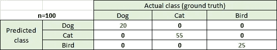
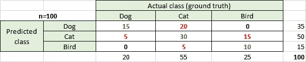
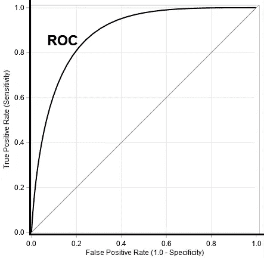

# 简单来说，机器学习指标

> 原文：<https://medium.com/analytics-vidhya/machine-learning-metrics-in-simple-terms-d58a9c85f9f6?source=collection_archive---------3----------------------->

*解释准确度、精密度、召回率、F1 分数、ROC 曲线、总体准确度、平均准确度、RMSE、R 平方等。用简单的术语举例*

机器学习中有很多衡量标准来评估一个模型。我将讨论我们在机器学习中使用的重要方法。

**注意:**我在不同的指标下重复表格，以减少认知负荷，同时用值分析公式。

# 分类指标

大多数分类模型度量最好使用混淆矩阵来定义。那么，什么是混淆矩阵呢？让我们考虑一个分类的例子。假设总共有 100 个动物样本。其中，狗 20 只，猫 55 只，鸟 25 只。理想的多类分类器将预测以下内容，这些内容显示为混淆矩阵:

如果我们认为它是一个二元类，那么有 20 只狗和 80 种其他动物。让分类器预测一只狗(P-正类)而不是一只狗(N-负类)。理想的二元分类器将预测以下内容:

但是，多类分类器预测了以下情况:

所以，在 20 只狗中，它预测了 15 只，在 55 只猫中，它预测了 30 只，在 25 只鸟中，它预测了 10 只。

二元分类器预测如下:

因此，在 20 只狗中，它预测了 15 只正确的狗(真阳性)，在 80 只不正确的狗中，它预测了 60 只正确的狗(真阴性)。它预测 5 只狗不是狗(假阴性)，20 只不是狗是狗(假阳性)。

混淆矩阵为我们提供了分类器出错的线索。

让我们使用简单的二元分类器添加一些术语:

*   **真阳性** (TP):预测阳性，实际也是阳性。在上面的例子中，它是 15。
*   **真阴性** (TN):预测阴性，实际也是阴性。在上面的例子中，它是 60。
*   **假阳性** (FP):预测阳性，实际为阴性。在上面的例子中，是 20。在假设检验中，这被称为**I 型错误**(当一个无效假设实际上为真时拒绝该假设的错误。换句话说，这是在结果可以归因于偶然性的情况下，接受另一种假设的错误)。
*   **假阴性** (FN):预测阴性，实际阳性。在上面的例子中，是 5。在假设检验中，这被称为**类型 II 错误**(当替代假设是自然的真实状态时，不拒绝零假设的错误。换句话说，这就是当我们没有足够的权力时，未能接受另一种假设的错误)。

使用上述术语更新图

一旦我们有了这些数据，让我们讨论评估机器学习模型的指标。

**注:**与二元分类不同，多类分类没有正类或负类。可以为每个类计算度量 TP、TN、FP 和 FN。

# 1-(总体)准确性

正确的是预测的比例。换句话说，它是正确预测的样本数与总样本数之比。

准确度=(TP+TN)/(TP+FP+FN+TN)=(TP+TN)/合计= (15+60)/100 = 0.75

大多数时候，预测类可能是不平衡的。例如，如果数据集中的阳性类的数量很高，并且分类器预测所有的类都是阳性的，则准确性仍然很高。在上面的示例中，如果它预测所有样本都不是狗，那么精度将是(0+80)/100 = 0.8，这是不正确的，因为模型不进行预测，并认为所有样本都不是狗。因此，使用了其他指标。

让我们考虑一个多类案例，以更好地理解整体准确性。

对角线元素表示正确分类的计数。

总体准确度=正确分类/总计= 15+30+10/100 = 0.55

# 2-平均精度

让我们考虑如下所示的多类情况:

正确分类= 15+30+10 = 55

TP 狗= 15

TN 狗=正确分类- TP 狗= 55=15=40

FP 狗= 20+0 = 20

FN 狗= 5+0 = 5

Dog 类的精度=Acc。狗= (TP 狗+TN 狗)/(TP 狗+FP 狗+FN 狗+TN 狗)

=(15+40)/(15+20+5+40) = 55/80 = 0.68

类似地，我们可以计算其他类的精度。

平均准确度= (Acc。狗+Acc。cat+Acc。鸟)/总类= (0.68+0.55+0.73)/3 = 0.65

# 3-错误率/ **误分类率**

预测不正确的比例=(FP+FN)/总数= (20+5)/100 = 0.25。这等于**1.0-精度**！

差错率也叫**误分类率**。

# 4-精度

积极的阶级认同正确的比例是多少？换句话说，如果分类器预测了一个肯定的类别，那么它的正确率是多少？

Dog 的精度= TP/预测正= TP/(TP+FP) = 15/35 = 0.42

在狗被预测的所有时间中，42%的时间，分类器是正确的。

*多类:*

*   Dog 的精度= TP Dog/(TP Dog+FP Dog)= TP Dog/Total 预测为 dog = 15/35 = 0.42
*   Cat 的精度= TP cat / (TP cat + FP cat) = TP cat /预测的总 cat = 30/50 = 0.6
*   鸟的精度= TP 鸟/ (TP 鸟+ FP 鸟)= TP 鸟/总预测鸟= 10/15 = 0.66

# 5-召回

实际被正确识别的阳性类的比例是多少？换句话说，当它实际上是积极的时候，它预测积极的频率是多少？

狗的回忆= TP/实际阳性= TP/(TP+FN) = 15/20 = 0.75

在应该预测狗标签的所有时间中，分类器正确预测了 75%的标签。

*多级:*

*   召回狗= TP 狗/ (TP 狗+ FN 狗)= TP 狗/实际狗总数= 15/20 = 0.75
*   召回数量= TP 数量/ (TP 数量+ FN 数量)= TP 数量/总实际数量= 30/55 = 0.54
*   鸟的召回= TP 鸟/ (TP 鸟+ FN 鸟)= TP 鸟/实际鸟总数= 10/25 = 0.4

回忆也称为**敏感度或真阳性率(TPR)。**

# 6-特异性/ **真阴性率(TNR**

正如回忆处理积极类，特异性处理消极类。换句话说，当它实际上是负数时，它预测负数的频率是多少？

特异性= TN/实际阴性= TN/(FP+TN) = 60/80 = 0.75

特异性也称为**真阴性率(TNR)**

# 7-假阳性率(FPR)

绘制 ROC 曲线时，假阳性率很重要。这等于**1.0-特异性(TNR)。换句话说，当它实际上是负面的时候，它预测正面的频率是多少？**

FPR = FP/实际负值= FP/(FP+TN) = 20/80 = 0.25

这一指标在医学测试领域非常重要。假阳性意味着一个人被检测为阳性，而实际结果应该是阴性。

# 8-假阴性率(FNR) /缺失率

假否定率(FNR)的计算类似于 FPR。这一指标在医学测试领域非常重要。假阴性意味着一个人被检测为阴性，而实际结果应该是阳性的。

FNR = FN/实际正值= FN/(TP+FN) = 5/20 = 0.25

FNR 也叫**脱靶率**。

# 9- F1 分数/ **F 分数** / **F 度量**

提高精确度通常会降低召回率，反之亦然。有时候，我们希望同时考虑精确度和召回率。这可以通过 F1 成绩来实现。它被定义为模型精度和召回率的调和平均值。换句话说，它是精确度和召回率的加权平均值。

狗的 F1 分数= 2*(精确度*召回率)/(精确度+召回率)

= 2* (0.42*0.75)/(0.42+0.75) =0.53

对于多类分类，我们可以计算每个类的 F1 分数，因为我们知道在以上部分中计算的每个类的精度和召回率。

F1 分数也称为 **F-score** 或 **F-measure** 。

**用上述公式更新图:**

# 10- ROC(接收机工作曲线)

ROC 曲线在 y 轴上具有真阳性率(TPR/回忆/灵敏度),在 x 轴上具有在二元分类器的各种截止阈值(0 到 1)下的假阳性率(FPR = 1.0-特异性)。一般来说，默认的截止阈值是 0.5。

ROC 图上的每个点代表对应于特定决策阈值的灵敏度/特异性对。一个完美的分类器有一个通过左上角的 ROC 图(灵敏度 1.0，特异性 1.0)。ROC 图显示整体模型性能。阈值选择基于我们是愿意最小化假阳性率(FPR)还是最大化真阳性率(TPR)，这是一个商业决策。

# 11- AUC(曲线下面积)

是 ROC 图下的面积，介于 0 和 1 之间。用一个数字来概括模型性能是最好的方法。AUC (~1)越高，模型性能越好，更高 AUC 的重要性基于业务决策。这个度量对于高度不平衡的类很有帮助。

# 回归度量

回归模型的输出总是一个连续的量。以下是一个简单的数据:

# 1-平均绝对误差(MAE)

此指标计算预测值和实际值之间的平均绝对距离(误差)。

MAE 惩罚错误的欧几里德距离，如果样本方差不存在，它更合适。该指标对于异常值是稳健的。

# 2 均方误差(MSE)

此指标计算预测值和实际值之间的平均平方距离(误差)。输出是一个非负的值，如果我们让它接近 0 会更好。

MSE 惩罚误差的平方，并且是误差方差的一致估计。因此，大错误比小错误受到更多的惩罚。

# 3 根均方误差(RMSE)

此指标计算预测值与实际值的平均偏差。它假设误差是无偏的，并且遵循正态分布。RMSE 惩罚较大的误差，更适合于实际值或预测值较大的情况。离群值会影响这一指标，必须小心移除它们。输出是一个非负的值，如果我们让它接近 0 会更好。

# 4-均方根对数误差(RMSLE)

如果我们有异常值，这个度量是好的。它对低估的惩罚大于高估。如果目标呈指数增长，并且关心百分比误差而不是误差的绝对值，则此指标很有用。如果实际值或预测值包含零值元素，则可以使用此指标。但是如果其中一个是负值，这是不合适的。

# 5- R 平方(决定系数)

值的范围通常从 0 到 1，值越大表示模型越合适。最好的分数是 1.0，也可以是负数。向我们的模型中添加更多的预测变量将增加 R 平方的值，但会导致过度拟合。

# 6 调整的 R 平方

*   N -数据集中的数据点数
*   独立变量的数量

调整后的 R 平方可根据模型中的变量数量进行调整。如果我们添加更多有用的变量，价值就会增加，如果我们添加较少有用/冗余的变量，价值就会减少。它通过考虑额外的独立变量的影响来增加精度和可靠性，而这些变量不是仅仅通过 R 平方测量来处理的。一般来说，调整后的 R 平方为正。它总是低于 R 的平方值。

我们可以使用调整后的 R 平方来比较具有不同数量预测值的模型。

**感谢**阅读！请👏如果你喜欢这个帖子，请**关注我**，因为它**鼓励我**写更多！