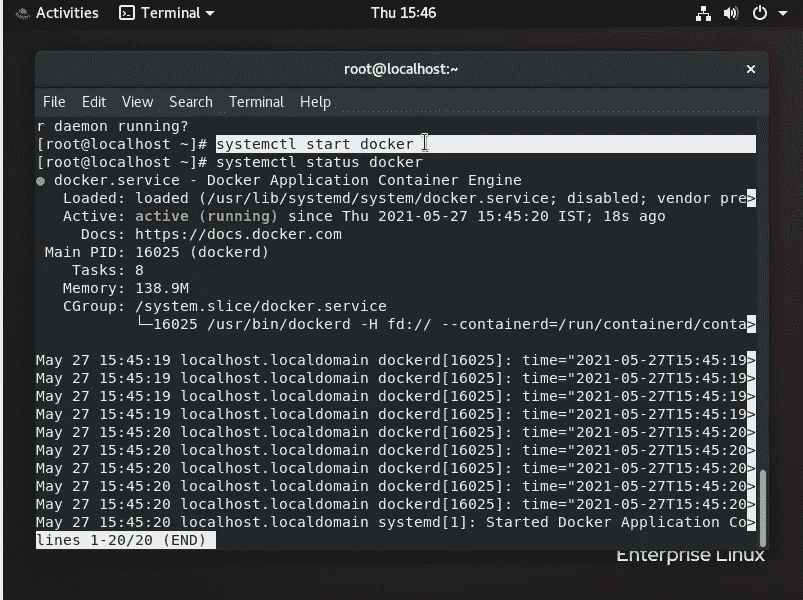
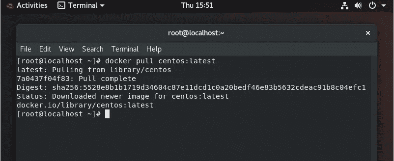
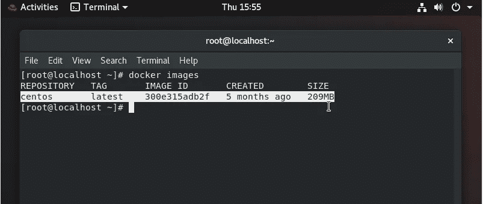
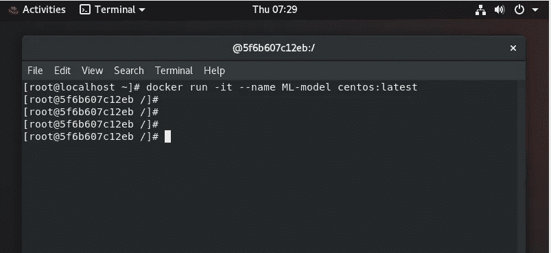
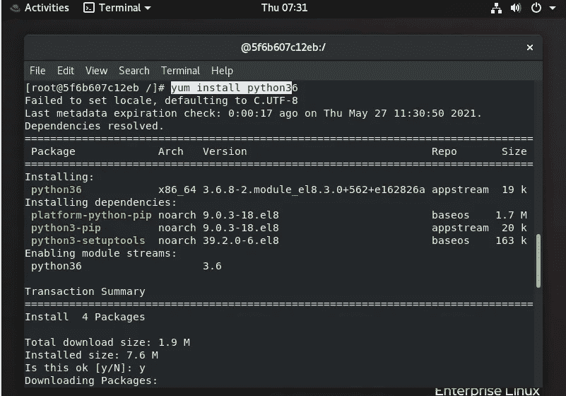
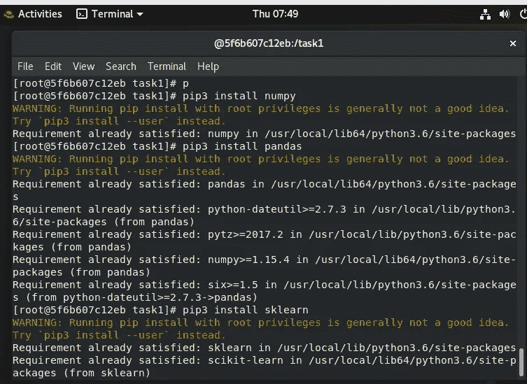
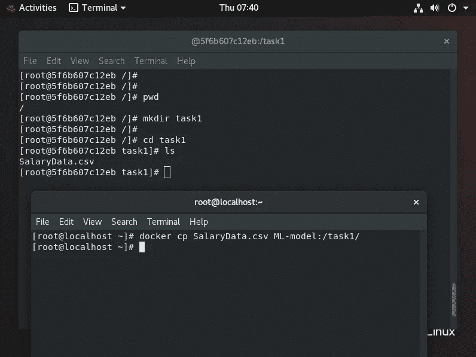
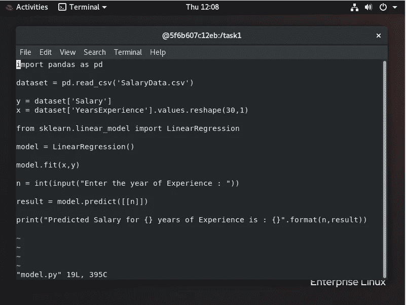
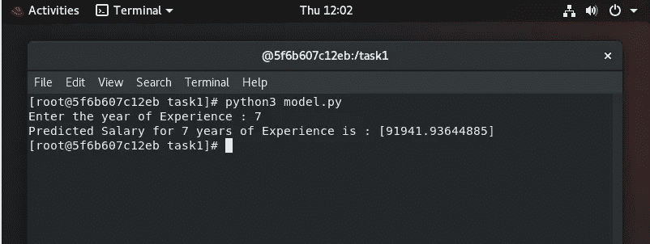

# Docker 容器中的机器学习模型。

> 原文：<https://medium.com/analytics-vidhya/machine-learning-model-inside-docker-container-6b361e787d17?source=collection_archive---------11----------------------->


在这个机器学习模型中，我们将制作一个程序来估算给定经验年限的人的工资。

完成任务的步骤:

*   从 docker hub 下载 CentOS 图像。
*   使用 CentOS 映像创建新容器。
*   在新容器的顶部安装 python 软件
*   导入训练 ML 模型所需的库。
*   将数据文件复制到容器中。
*   在一个文件中训练和加载模型以预测值。

让我们开始吧

***首先让我们从..***

# ***什么是机器学习？***

***机器学习****(****ML****)是研究通过经验和利用数据自动改进的计算机算法。它被视为人工智能的一部分。机器学习算法基于样本数据(称为“训练数据”)建立模型，以便在没有明确编程的情况下进行预测或决策。机器学习算法用于各种各样的应用中，例如在医学和计算机视觉中，在这些应用中，开发常规算法来执行所需的任务是困难的或不可行的。*

现在，

# Docker 是什么？

Docker 是一个开发、发布和运行应用程序的开放平台。Docker 使您能够将应用程序从基础设施中分离出来，这样您就可以快速交付软件。使用 Docker，您可以像管理应用程序一样管理基础设施。通过利用 Docker 快速交付、测试和部署代码的方法，您可以显著减少编写代码和在生产中运行代码之间的延迟。

# Docker 是如何工作的？

Docker 技术使用 Linux 内核和内核的特性，如 C 组和名称空间，来隔离进程，使它们能够独立运行。这种独立性是容器的目的——能够彼此独立地运行多个流程和应用程序，以更好地利用您的基础架构，同时保留您在独立系统中拥有的安全性。

***包括 Docker 在内的容器工具提供了基于映像的部署模型。这使得跨多个环境共享一个应用程序或一组服务及其所有依赖关系变得很容易。Docker 还在这个容器环境中自动部署应用程序(或组成应用程序的组合进程集)。***

***这些构建在 Linux 容器之上的工具——这使得 Docker 用户友好且独一无二——为用户提供了前所未有的应用访问、快速部署能力以及对版本和版本分发的控制。***

## **待办步骤:**

*   **启动 docker 服务**

```
***$ systemctl start docker***
```



*   **从 docker hub 中提取 CentOS 图像**

```
***$ docker pull centos:latest***
```



*   **使用 CentOS 映像创建名为 ML-model 的新容器**

```
***$ docker run -it --name ML-model centos:latest***
```



使用上面的命令，我们可以像在命令中使用-it 选项一样直接与容器交互

*   **在新容器顶部安装 python 软件**

因为它是新的容器，我们必须检查是否有 python 软件，如果没有，使用下面的命令安装 python 软件。

```
***# yum install python***
```



*   **导入训练 ML 模型所需的库。**

现在我们必须导入一些训练模型所需的库。为此，我们使用 pip3 命令来安装这些库。

```
***# pip3 install numpy
# pip3 install pandas
# pip3 install sklearn***
```



*   **将数据文件复制到容器中。**

我们必须将基本操作系统(即 RedhatOS)中的数据复制到 centos 容器，为此，我们在基本操作系统中运行以下命令。

注意:在这种情况下，您可以复制您的训练模型以在容器中运行，或者我们可以复制数据集以训练该数据集并在容器中创建模型。在这种情况下，我复制数据集并在 docker 中创建模型。

**docker CP****<src><container _ name>:<dest>**

```
***$ docker cp Salaray.csv ML-model:/task1/***
```



*   **创建训练模型文件并保存模型。**

```
***# vim model.py***
```



*   现在，运行并输入我们想要预测的值。在这种情况下，我训练了一个模型，在这个模型中，我们必须给出经验年数，这样，它将预测该年数的预期工资。

```
***# python3 model.py***
```



在这里，我们的模型是在容器顶部正确创建和预测的。

所以，

***任务成功完成***

这就是你如何在 docker 容器中创建任何机器学习程序。

**T29！！感谢您阅读文章！！**