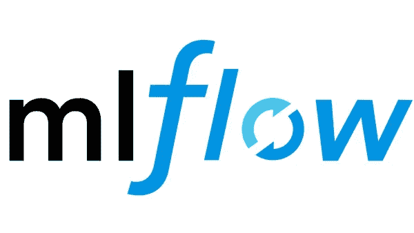

# 使用 MLflow 的机器学习模型工作流和跟踪

> 原文：<https://medium.com/analytics-vidhya/machine-learning-model-workflow-and-tracking-using-mlflow-777c1df0a4cc?source=collection_archive---------14----------------------->

MLflow 是机器学习生命周期的开源平台。

在当前世界中，有连续的数据流，我们需要确保我们的模型的知识库也是更新的。模型知识的并行改进变得越来越重要，以便不损害精度。