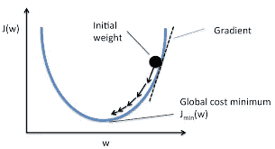

# 机器学习模型-线性回归

> 原文：<https://medium.com/analytics-vidhya/machine-learning-models-linear-regression-58855efb2355?source=collection_archive---------1----------------------->

如果你是数据科学或机器学习的初学者，那么这是你作为初学者会遇到的最常见的模型。

**线性回归**是最古老、最简单、最广泛用于预测分析的监督机器学习算法。

# **什么是线性回归？**

线性回归是在统计学领域发展起来的，作为理解输入和输出数值变量之间关系的模型进行研究，但已被机器学习借用。它既是一种统计算法，也是一种机器学习算法。

# **线性回归的表示**

线性回归方程

这是一种通过拟合因变量和自变量之间的最佳线性关系来预测目标变量的方法。

线性回归

在上图中，我们可以清楚地看到因变量 y 和自变量 x 之间的线性关系，这种线性关系用最佳拟合线表示。

执行线性回归时，最佳拟合线给出最准确的预测。

# **什么是最佳拟合线？**

最佳拟合线可以是任何形状，取决于独立变量的数量(轴上的点、二维中的线、三维中的平面或更高维中的超平面)。

当所有误差总和的平方最小时，该线被认为是最佳拟合线。所以我们可以说，最佳拟合点和实际点之间的距离应该是最小的。

成本函数方程

成本函数是误差平方和，其中 m 表示数据点的数量，而(h(x))表示最佳拟合点，y(i)表示实际点。现在这个成本函数应该最小化，这样我们可以得到最佳拟合线。

# **如何找到最佳拟合线？**

我们使用称为**梯度下降**的优化算法，通过在**最陡下降的方向上迭代移动来最小化成本函数。**

J(w)->成本函数，w->直线斜率

成本函数最小(全局最小值)的点，斜率的点被认为是最佳拟合线。

计算每对输入和输出值的误差平方和。学习率被用作比例因子，并且系数朝着最小化误差的方向被更新。重复该过程，直到达到最小平方和误差，或者不可能进一步改进。使用这种方法时，您必须选择一个学习率(alpha)参数，该参数决定了在过程的每次迭代中要采取的改进步骤的大小。

# 普通最小二乘法

当我们有多个输入时，我们可以使用普通的最小二乘法来估计系数的值。[普通最小二乘法](https://en.wikipedia.org/wiki/Ordinary_least_squares)程序寻求最小化残差平方和。这意味着给定一条穿过数据的回归线，我们计算每个数据点到回归线的距离，对其求平方，并将所有平方误差相加。这是普通最小二乘法试图最小化的量。

# **正规化**

存在称为正则化方法的线性模型训练的扩展。这些方法寻求最小化训练数据上模型的平方误差的总和(使用普通的最小二乘法),并且降低模型的复杂性(如模型中所有系数总和的数量或绝对大小)。

线性回归正则化过程的两个常见示例是:

**岭回归**:-岭回归有助于克服过拟合情况。过度拟合条件是当训练数据集的误差较低，而测试数据集的误差较高。这是一种高方差低基数的情况。一个好的模型应该给出低方差和低偏差。在线性回归图中，如果你有一个陡峭的斜率，那么有可能出现过度拟合的情况。所以，我们需要以这样的方式改变斜率，随着 x 的微小变化，斜率也应该有微小的变化。

**套索回归:-** 套索回归也克服了过度拟合的情况。除此之外，它还有助于功能选择。它消除了斜率值非常小的所有独立变量/特征。

# **如何检查选择的型号是否正确？**

对于给定的数据集，很难找到哪个模型是完美的，但这里有一些方法，从中我们可以找到模型的准确性。

**1。R 平方和调整的 R 平方-:** 在回归中，我们使用 R 平方和调整的 R 平方来检查模型的准确性，并且对于分类，我们使用混淆矩阵。

SSres->残差或误差之和，SStot->平均总和之和

如果 R 平方值更接近 1，那么它是一个好模型，如果它小于 0，那么最佳拟合线比平均值差。

随着我们不断添加独立特征，R 平方值增加，这意味着我们的模型具有良好的准确性，但可能存在独立特征与从属特征不相关的情况。在这种情况下，我们使用调整的 R 平方。

k->独立特征，n->整体样本量

这里，与从属特征不相关的属性对准确度没有贡献，并且调整后的 R 平方总是小于或等于 R 平方值。

**2。预测值的 p 值**:-****低** p 值的变量是最显著的变量。**

# **用 Python 实现**

**所以，重要的是看看如何使用我们所获得的。我对自己创建的数据集应用了线性回归，其中记录了过去 3 年的*月收入*、*月旅行*和*月支出*。**

**点击 [***此处***](https://anaconda.org/sanchitiitr/linear-regression-model/notebook) 查看完整代码，看看机器学习的世界在线性回归方面有多简单。**

**感谢阅读。
:)*还有，❤这本书读得不错。尽情享受吧！***

**编辑: [Ashishkumar](https://medium.com/u/f709789d3ba4?source=post_page-----58855efb2355--------------------------------)**