# 机器学习模型-逻辑回归

> 原文：<https://medium.com/analytics-vidhya/machine-learning-models-logistic-regression-3b71d8a0f3b8?source=collection_archive---------11----------------------->

# **简介**

本博客涵盖的主题:

1.  什么是逻辑回归？
2.  为什么不使用线性回归
3.  关于逻辑回归的更多信息
4.  最大似然估计。
5.  逻辑回归中的成本函数
6.  梯度下降
7.  Python 实现

为了理解逻辑回归，有必要了解一下我们之前已经介绍过的[线性回归](/analytics-vidhya/machine-learning-models-linear-regression-58855efb2355)。

# 什么是逻辑回归？

逻辑回归是广义线性模型。与根据数字数据预测值的线性回归不同，逻辑回归用于**分类问题**。分类问题的一些例子是电子邮件垃圾分类器、虹膜种类分类、信用卡欺诈检测。

**那为什么叫逻辑回归呢？**

逻辑回归实际上预测从属特征的概率值，其范围在[0，1]之间。如果这是一个二元分类问题，并且如果该值大于或等于 0.5，则它被分类为真，否则它被分类为假。然而，我们知道在线性回归中，范围是从负无穷大到正无穷大，但这里我们有[0，1]之间的值。为了解决这个问题，我们有一个函数叫做 **Sigmoid 函数。** Sigmoid 函数给出一条曲线。

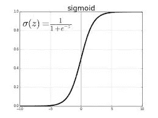

**为什么不用线性回归？**

第一个显而易见的原因是，与线性回归不同，逻辑回归是一种分类模型。线性回归的范围是从负无穷大到正无穷大，因此它可能会生成负预测。而范围在[0，1]之间的逻辑回归则没有这个问题。

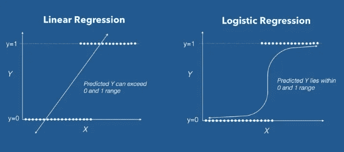

线性回归的另一个问题是，当您有一些异常值时，最佳拟合线将向异常值倾斜，从而导致错误的预测。

## **关于逻辑回归的更多信息。**

如前所述，逻辑回归有点类似于线性回归。为了预测最佳拟合曲线，我们使用 Logit 函数将该曲线转换为直线，该函数将概率作为输入，给出概率的对数作为输出。

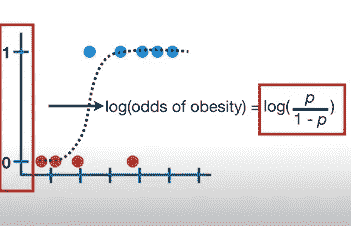

图一

对于每一个点，我们将计算奇数值的对数，这些数值将在图中的 y 轴上使用。这样我们就可以为曲线生成一条直线。

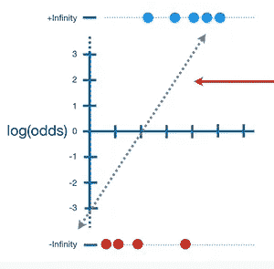

图二

**最大似然估计**

在线性回归中，我们使用误差平方和的最小二乘法来寻找最佳拟合线。在图-2 中，由于大部分点都趋于负无穷大和正无穷大，所以误差值也会趋于无穷大。我们不能使用最小二乘法，而是使用最大似然估计。

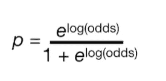

我们计算每个对数(比值)点的最大似然，并将所有似然相乘，以获得完整数据集的似然。获得完整数据集的最大似然值的曲线被认为是最佳曲线。

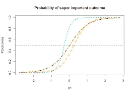

**如何最大化对数似然？**

在统计学中，最大似然估计(MLE)被广泛用于获得分布的参数。在这个范例中，最大化对数似然等于最小化成本函数 *J* 。它是凸优化中的一个对偶问题。

# **逻辑回归中的成本函数**

我们学习了线性回归中的成本函数 *J* ( *θ* )，成本函数代表优化目标，即我们创建成本函数，并尝试使用梯度下降来最小化成本函数，以便我们可以获得全局最小值。

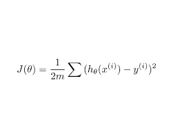

成本函数线性回归

因此，如果我们尝试将线性回归的成本函数用于逻辑回归的假设函数(sigmoid 方程),那么可以观察到它给出了非凸函数。在非凸函数中，除了全局极小值之外，我们还会得到局部极小值，而寻找全局极小值将是一项困难的任务。

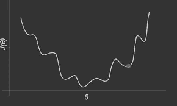

对于逻辑回归，成本函数定义为:-

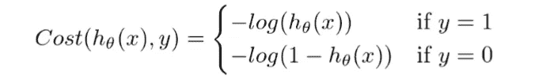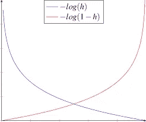

上述两个方程可以合并得到一个新方程

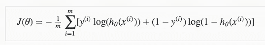

价值函数

现在使用这个成本函数，我们可以使用梯度下降的全局最小值。

# **梯度下降**

逻辑回归的梯度下降与线性回归相同。现在，为了最小化成本函数，我们需要对每个参数运行梯度下降函数，即

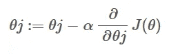

为了最小化成本函数，我们必须对每个参数运行梯度下降函数

# **Python 实现**

所以，重要的是看看如何使用我们所获得的。我在鸢尾上应用了逻辑回归，它可以根据萼片和花瓣的长度和宽度对物种进行分类。

点击[此处](https://www.kaggle.com/ashishkumarbehera/iris-species-classification)查看完整代码，看看机器学习的世界在逻辑回归方面有多简单。

# **结论**

在这篇博客中，我已经向你介绍了我们必须知道的逻辑回归的基本概念。我希望这是有帮助的，让你保持动力。

感谢阅读。
:)*还有，❤这本书读得真好。尽情享受吧！*

编辑: [Ashishkumar](https://medium.com/u/f709789d3ba4?source=post_page-----3b71d8a0f3b8--------------------------------)