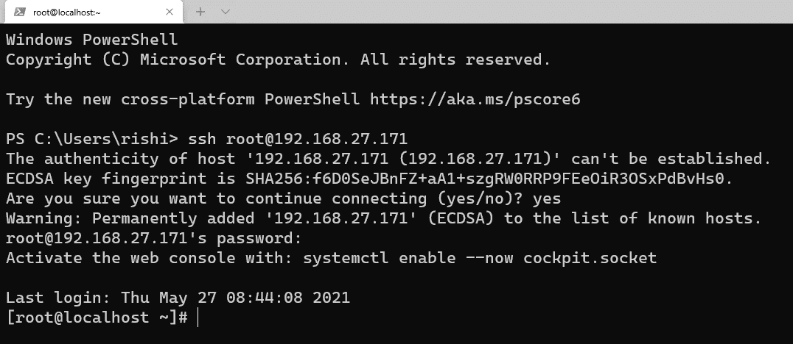
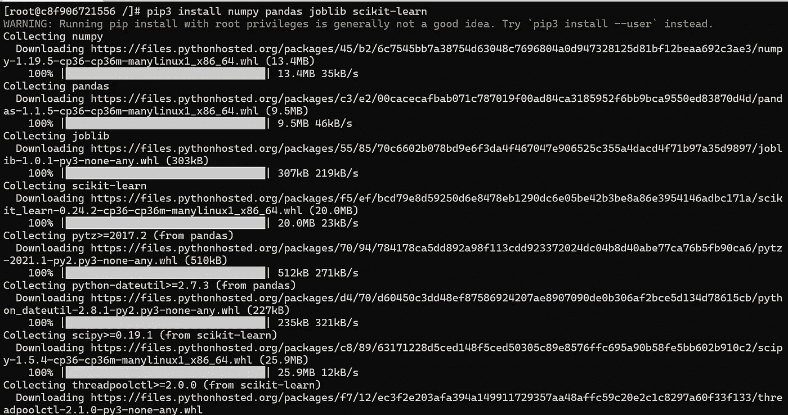

# 容器上的机器学习！

> 原文：<https://medium.com/analytics-vidhya/machine-learning-on-containers-a27ec5288526?source=collection_archive---------32----------------------->

集装箱中的机器学习是一个很好的用例，它非常重要，因为世界正在迅速转向集装箱化技术。

在这篇博客中，我将讨论如何在容器上运行简单的机器学习代码。在开始这一切之前，让我们看看关于机器学习和 docker 的一些观点。


## **什么是机器学习？**

根据谷歌的说法，如果你搜索“机器学习”，它会给出以下结果-

> **“机器学习**是一种自动建立分析模型的数据分析方法。它是人工**智能**的一个分支，基于系统可以从数据中学习、识别模式并在最少人工干预的情况下做出决策的理念

好吧，对于那些不知道它是什么的人，我来简化一下上面的陈述，举个例子。

想想几个月大的婴儿，他有头脑，但他什么都不知道。假设他和父母一起出门，看见了一只黑猫。看到猫后，他问他的父母，这是什么？他们回答说:“这是一只猫”。然后在一段距离他看到一只白猫，再次问父母，这是什么？父母会再次回答:猫。现在，当婴儿看到猫时，他的大脑会储存猫的形象，并给猫贴上标签。现在，当他在未来看到猫时，他的脑海里会回想起猫这个标签。所以，男孩会知道这是一只猫。

如果你看清楚了，这就是机器学习的工作原理。在机器学习中，头脑是模式/模型，父母是提供经验和训练的数据，模型经过训练后，它可以用置信度得分进行预测。

现在，再读一遍上面引用的语句，你一定会明白，它想说什么。

为了简单起见，我使用了一个非常基本的 ML 模型，但是在以后的博客中，我还将实现高级模型。

所以，我创建了一个模型，根据多年的经验来预测工资。它基于简单的线性回归。并将其作为. py 可执行文件。

更多关于车型和代号:[这里](https://github.com/rishiagrawal2609/simple-salary-predictor)[https://github.com/rishiagrawal2609/simple-salary-predictor](https://github.com/rishiagrawal2609/simple-salary-predictor)。

## **什么是容器？**

容器只不过是作为进程启动的缩小版操作系统。通常，如果您已经安装了操作系统，您会注意到操作系统的安装过程需要很长时间，即大约 20-30 分钟(取决于操作系统和硬件的风格)。如果你在测试/ QC 部门，你必须安装许多操作系统和删除，想想浪费的时间。今天，世界是关于你有多快，你的产品有多敏捷。为了解决这个问题，集装箱化应运而生。它们的速度非常快，不到一秒钟就能启动操作系统。有许多工具可以使用容器，但是我将使用 Docker 来启动我的容器。

我们将使用 Centos:实用的最新图像。要下载，请使用命令:

```
# docker pull centos
```


下载 Centos 图像

该命令将下载我们将要使用的 Centos 映像。

## **系统需求/我的系统:**

为了这篇博客，我在 VMware 上使用新安装的 RHEL 8，我已经在它上面安装了 docker。我使用 Windows 终端远程登录到我的虚拟机。所有的 ML 文件都已经创建好了，可以在我的 GitHub 中[这里](https://github.com/rishiagrawal2609/simple-salary-predictor)找到。



通过 windows 终端进行 SSH 登录

# 让我们看看如何在容器上制作 ML:

我将逐步展示如何设置可以运行机器学习代码的容器:

**步骤 1:** 启动名为 mlcontainer 的 centos 容器(您可以给出任何名称)。命令执行相同的操作:

```
# docker run -it --name mlcontainer centos
```

这将启动容器。如何验证？查看从`[root@localhost ~]#`到`root@c8f9067..`的提示变化(在您的情况下会有所不同)。


发射容器

**步骤 2** :安装所有需要的软件，即 git、python3、vim、net-tools

```
# yum install vim python3 git net-tools -y
```


会是这个样子。

**第三步**:安装机器学习需要的重要库，如 numpy、pandas、scikit-learn、joblib

```
# pip3 install numpy pandas joblib scikit-learn
```



pip 安装命令

这将完成运行 ML 程序的所有要求。

第四步:复制/创建程序文件并复制数据。在这里，我已经创建了程序，并添加为 GitHub repo。我们将在这里使用回购协议。在容器内运行以下命令。

```
# git clone [https://github.com/rishiagrawal2609/simple-salary-predictor.git](https://github.com/rishiagrawal2609/simple-salary-predictor.git)
```


导航到文件夹并列出所有文件，所有文件的描述见 README.md。


让我们看看 salarypredictor.py 里面有什么


salarypredictor.py 代码

这段代码将训练模型，然后要求用户输入多年的经验。并输出预测工资。

```
# python3 salarypredictor.py
```


运行 salarypredictor.py

注意:这是一个非常小的数据集，这就是为什么它只需要几秒钟来训练。当数据集很大时，模型训练将花费大量时间。

为了解决这个问题，我使用 joblib 库保存了权重，并使用保存的权重重新生成模型，然后用它来预测工资。


salpred.py

```
# python3 salpred.py
```

请注意这一条，因为我们将在以后的博客中更多地使用它。

结论:

我们可以创建特定的容器来执行机器学习任务，我们可以用它来创建后端。在即将到来的博客中会有更多的介绍。

这个博客到此为止。特别感谢 ***维马尔·达加先生*** 教授我们正确的概念，以便我们能够实施和展示它。

感谢所有世卫组织到目前为止阅读这篇博客的人。