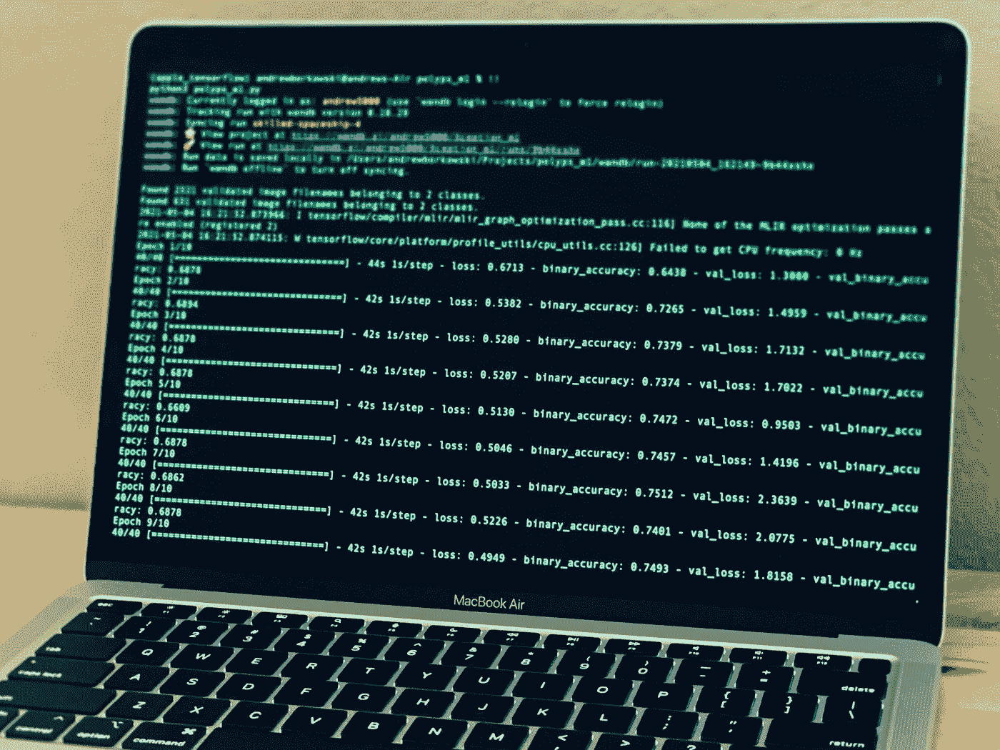
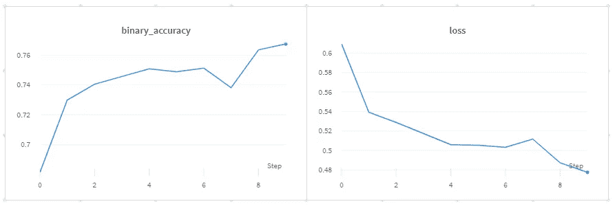
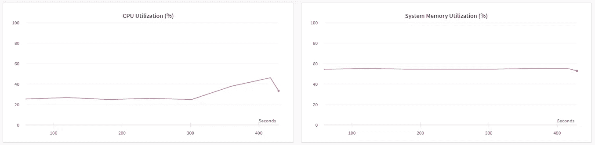
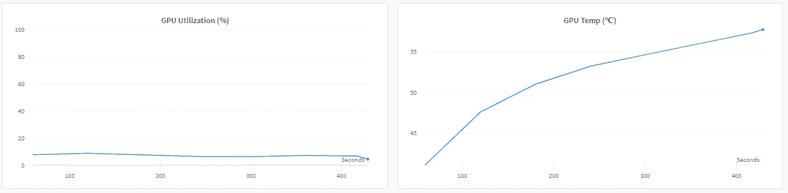
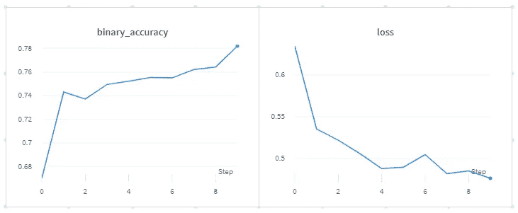
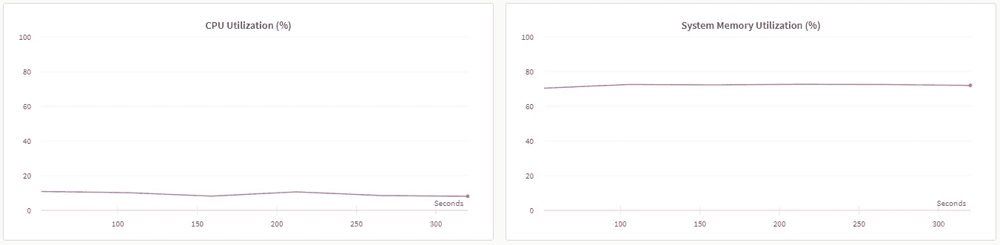
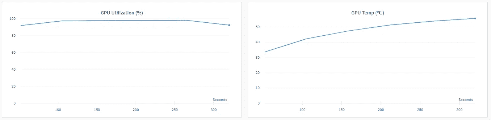

# M1 MacBook Air 上的机器学习

> 原文：<https://medium.com/analytics-vidhya/machine-learning-on-m1-macbook-air-1674ac0ca777?source=collection_archive---------0----------------------->

基于 Mac 优化张量流的结肠息肉分类

作者照片

我最近把我的 M1 Mac Mini 换成了一台新的 M1 MacBook Air，它有 16GB 内存和 512GB 硬盘。我需要轻便和可移动的东西，而且我的大部分重型 ML 训练都是在我的 Linux 机器上进行的。新款 M1 MacBook Air 是一款漂亮的笔记本电脑，电池续航时间很长，可以用一整天。由于数据科学社区中的许多人想知道您是否可以将它用于机器学习培训，我决定试用它并运行一个相对简单的 TensorFlow 项目。本项目旨在对两种结肠息肉，增生性息肉和无柄锯齿状腺瘤进行分类。我使用了 MHIST，这是一个公开的组织学数据集，我在之前的文章中描述过。

MHIST 是一个二元分类数据集，包含 3，152 个固定大小(224 x 224 像素)的结肠直肠息肉图像，每个图像都有一个由七名委员会认证的胃肠病理学家的多数投票决定的黄金标准标签。MHIST 还包括每个图像的注释者协议级别。作为一个极简数据集，MHIST 占用了 354 MB 的磁盘空间。

由于全新的 ARM 芯片架构，在 M1 MAC 电脑上安装 TensorFlow 和 python 包可能会很棘手。Gonzalo Ruiz de Villa 写了一篇很棒的媒体文章，题为[“MacBook M1:安装 TensorFlow 和 Jupyter 笔记本”，](/gft-engineering/macbook-m1-tensorflow-on-jupyter-notebooks-6171e1f48060)，提供了如何安装 python 和相关 python 包的分步说明。

我遵照他的指示，一切都很顺利。我安装了 TensorFlow，python 3.8，NumPy，pandas，和 scikit-learn。我还安装了一个[重量和偏差包](https://wandb.ai/site)，方便实验跟踪。

下面的代码不言自明。我使用 Google Xception 模型作为特征提取器，并在其上创建了一个简单的分类器。我训练了十个纪元的模型。

该模型达到了 0.7676 的精度，训练时间为 424.81 秒。

我注意到程序运行在 CPU 上，而不是 GPU 核心上。

在搜索网页后，我发现了这个[代码](https://wandb.ai/vanpelt/m1-benchmark/reports/Can-Apple-s-M1-help-you-train-models-faster-cheaper-than-NVIDIA-s-V100---VmlldzozNTkyMzg)，它迫使程序使用 GPU 核心。

模型的精度提高到 0.7818，训练时间减少到 314.95 秒(时间提高了 26%)。

这一次，程序充分利用了 GPU 核心。

有趣的是，芯片温度非常相似，约为 55 摄氏度。这可以用 M1 芯片上 CPU 和 GPU 核心的接近来解释。

随着时间的推移，在 M1 MAC 电脑上安装必要的数据科学程序变得越来越容易。TensorFlow 运行良好，即使在广播中也可以训练相对较小的数据集。使用权重和偏差跟踪实验非常方便，您可以获得许多关于您的系统性能的信息。不过，如果你打算独家使用 Mac，我建议等待即将推出的芯片更强大的 14 英寸和 16 英寸 pro 版本。

感谢你花时间阅读这篇文章。

安德鲁

[@tampapath](http://twitter.com/tampapath)