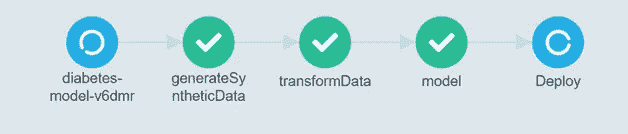

# 使用 ArgoWorkflow 的机器学习流水线

> 原文：<https://medium.com/analytics-vidhya/machine-learning-pipeline-using-argoworkflow-d519c70467e?source=collection_archive---------7----------------------->

在我们上一个[系列](/me/stats/post/1e1fd8c03939?source=main_stats_page)中，我们介绍了 Argo 工作流，并演示了如何利用它们的 API 来创建数据工程管道。在本文中，我们将扩大范围，并演示如何将相同的管道 API 用于机器学习项目。

**数据科学发展管道**

数据科学家通常会在开发阶段经历以下步骤，但重要的是要强调很少会这么容易。数据科学家项目经理使用**CR**OSS**I**industry**S**standard**P**process for**D**ATA**M**ining(*CRISP-DM*)定义流程，这是一个描述数据科学生命周期的六个阶段的流程模型。

1.数据收集:从离线或在线来源自动收集数据

2.手动标记、探索和丰富数据，以识别潜在的模式和特征

3.模型训练和验证

4.模型检验

5.重复 1–5 次

6.部署模型

一旦开发完成，模型就被部署到生产中，然后…数据变化，模型精度漂移，我们发现自己再次运行大部分(如果不是全部)管道来产生新版本的模型。每个迭代和步骤都可以很容易地扩展范围和复杂性。就像任何敏捷软件交付一样，运行多个实验只会打造一个更高性能的模型。

**构建高效的数据科学管道**

我们在 IndustrialDataOps 的目标是开发一个“ML 工厂”,在这里管理管道、实验和运行，并存储和版本化它们的结果。管道解决了复制和解释我们的 ML 模型的主要问题。这也意味着我们可以直观地比较运行，并在各种对象/文件存储库中存储版本化的输入和输出工件。我们使用三个指导原则:

1.**使其功能化** —创建可重用的抽象函数/步骤，这些函数/步骤可以接受参数。

2.**使其可扩展** —将并行性应用于每一步(或者尽可能经常地，在合理的范围内)。

3.**自动化** —通过使用声明性语义和工作流来避免手动和重复的任务。

本例中的 ML 项目将尝试使用综合的患者健康记录来预测二型糖尿病。您可以在这个[存储库](https://github.com/IndustrialDataops/Diabetic_ML_Argo_WorkFlow)中找到项目代码。我们将使用的基础数据来自[合成公司](https://github.com/synthetichealth/synthea)。我们的管道包括使用 pandas、matplotlib 和 numpy 创建特性，使用 scikit-learn 进行训练-测试分割和训练/评分，最后使用 streamlit 部署模型。

ML 工作流程

**生成合成数据**

Synthea 是一个合成的患者群体模拟器，它输出真实的(不是真实的)患者记录。我们提供了一个 Docker 容器来帮助开发，你可以在这里找到 repo。在 python DAG 中，我们创建了以下任务，该任务创建了 10 条记录。对于模型训练方面，您肯定需要增加记录的数量，您的本地系统资源将决定总数。

**数据角力**

出于各种各样的原因，我们是 spark 数据处理的忠实粉丝。将数据转换成适合任何模型的格式是非常繁琐的，并且可以说是 ML 项目中最耗时的方面。我们用来转换和丰富原始数据的代码既可以在 python [代码](https://github.com/IndustrialDataops/Diabetic_ML_Argo_WorkFlow/blob/main/FeatureExtract/transformData.py)中找到，也可以在 jupyter [笔记本](https://github.com/IndustrialDataops/Diabetes-prediction/blob/master/datapreprocessing.ipynb)中找到。

**模型开发**

基于几次迭代和模型选择，我们决定使用 sklearn 和 RandomForestClassifier 算法。请查看 jupyter 笔记本[此处](https://github.com/IndustrialDataops/Diabetes-prediction/blob/master/diabete_rf.ipynb)查看我们如何找到最佳模型的更多细节。一旦我们找到了最优模型，我们就建立了一个容器，这里的代码可以看到[这里的](https://github.com/IndustrialDataops/Diabetic_ML_Argo_WorkFlow/blob/main/Model/Model.py)。

**部署**

将机器学习模型部署到生产中以执行推理已被证明是复杂的，并且许多项目未能从概念证明过渡到生产。根据我们的经验，有三个主要因素使得生产部署具有挑战性；1)在游戏后期开始这个过程 2)不成熟的架构模式 3)过多的竞争平台和技术，每个都有一个利基焦点。在将 ML 模型部署到产品中时，需要做出许多技术决策，包括打包、版本控制、批处理与在线、监控等，所有这些都需要大量的时间投入。我们选择了 [streamlit](https://streamlit.io/) 作为一个轻量级的快速原型制作工具，它提供了一个非常快速简单的工具来让你的模型上线。

现在我们已经开发了完整的管道，在执行之后，您现在可以使用 UI 预测结果:

**管道配置**

现在我们知道了如何用 python 开发工作流，让我们更仔细地看看 YAML 配置。

# 请联系！

如果您有任何问题，请联系我们。在这里找到我【https://www.linkedin.com/in/roberthheise/ 

你可以在[https://www.linkedin.com/in/gopalkrishna9/](https://www.linkedin.com/in/gopalkrishna9/)找到 Gopal