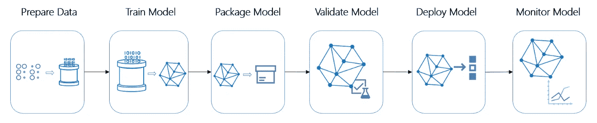
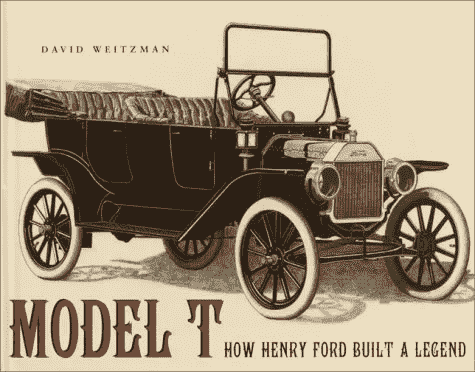

# 机器学习管道|第 1 部分

> 原文：<https://medium.com/analytics-vidhya/machine-learning-pipelines-part1-9ec16ad5ba12?source=collection_archive---------2----------------------->

打开机器学习管道的价值

当亨利·福特的公司在 1913 年建造了第一条移动装配线来生产其传奇的 T 型车时，它将生产每辆汽车的时间从 12 小时减少到了 3 小时。这极大地降低了成本，使 T 型车成为历史上第一款经济实惠的汽车。这也使得大规模生产成为可能:很快，道路上充斥着 t 型车。

由于生产流程现在是一系列定义明确的步骤(也就是 ***流水线*** )，因此可以实现其中一些步骤的自动化，从而节省更多的时间和金钱。今天，汽车大多是由机器制造的。但这不仅仅是时间和金钱的问题。对于许多重复性的任务，机器将比人产生更加一致的结果，使最终产品更加可预测、一致和可靠。

另一方面，建立一条装配线可能是一个漫长而昂贵的过程。而且如果想生产小批量或者高度定制的产品，也不太理想。福特有一句名言，“任何顾客都可以把车漆成他想要的任何颜色，只要是黑色的。”

过去几十年来，汽车制造的历史在软件行业重演:如今，每一个重要的软件通常都是使用自动化工具构建、测试和部署的，如**詹金斯**或**特拉维斯**。然而，T 型车的比喻已经不够了。软件不只是被部署和遗忘；必须定期对其进行监控、维护和更新。软件管道现在看起来更像动态循环，而不是静态生产线。能够快速更新软件(或管道本身)而不破坏它是至关重要的。而且软件比 T 型车更加可定制:软件可以涂上任何颜色(例如，试着计算现有的 MS Office 变体的数量)。

不幸的是，“经典的”自动化工具不太适合处理完整的机器学习流水线。事实上，ML 模型不是一个普通的软件。首先，它的行为很大一部分是由它训练的数据驱动的。因此，训练数据本身必须被视为代码(例如，版本化)。这是一个相当棘手的问题，因为新数据每天都会突然出现(通常是大量的)，通常会随着时间的推移而演变和漂移，通常包括私人数据，并且必须在您可以将其提供给监督学习算法之前进行标记。

第二，一个模型的行为通常是相当不透明的:它可能通过了一些数据的所有测试，但在另一些数据上却完全失败了。因此，您必须确保您的测试覆盖了您的模型将在生产中使用的所有数据域。特别是，你必须确保它不会歧视你的一部分用户。

> 出于这些(以及其他)原因，数据科学家和软件工程师首先开始手动构建和训练 ML 模型，可以说是“在他们的车库中”，他们中的许多人现在仍然这样做。但在过去几年中，新的自动化工具已经开发出来，可以应对 ML 管道的挑战，如 TensorFlow Extended (TFX)和 Kubeflow。越来越多的组织开始使用这些工具来创建 ML 管道，使构建和训练 ML 模型的大部分(或全部)步骤自动化。这种自动化的好处与汽车工业的好处基本相同:节省时间和金钱；构建更好、更可靠、更安全的模型；花更多的时间做更有用的事情，而不是复制数据或盯着学习曲线。

然而，构建 ML 管道并不简单。

在过去的几年里，机器学习领域的发展令人震惊。随着图形处理单元(GPU)的广泛使用和新的深度学习概念的兴起，如 BERT 等变压器，或深度卷积 gan 等生成性对抗网络(gan)，人工智能项目的数量急剧增加。人工智能创业公司的数量是巨大的。组织越来越多地将最新的机器学习概念应用于各种商业问题。在这种寻求最高效的机器学习解决方案的热潮中，我们观察到了一些很少受到关注的事情。我们已经看到，数据科学家和机器学习工程师缺乏概念和工具的良好信息源来加速、重用、管理和部署他们的开发。需要的是机器学习流水线的标准化。

> 机器学习管道实现并形式化了加速、重用、管理和部署机器学习模型的过程。大约十年前，随着持续集成(CI)和持续部署(CD)的引入，软件工程经历了同样的变化。过去，测试和部署 web 应用程序是一个漫长的过程。如今，这些过程已经被一些工具和概念大大简化了。以前，web 应用的部署需要 DevOps 工程师和软件开发人员之间的协作。如今，该应用可以在几分钟内进行可靠的测试和部署。数据科学家和机器学习工程师可以从软件工程中学到很多关于工作流的知识。

我邀请您关注本系列的第 2 部分，了解机器学习管道的价值及其对技术和工业革命的贡献。