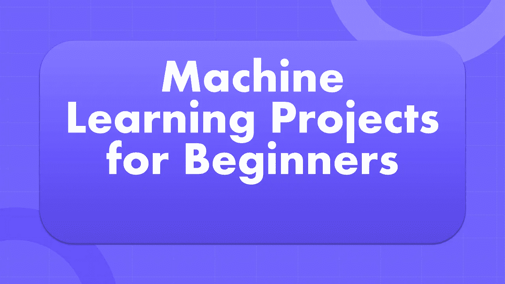

# 面向初学者的机器学习项目

> 原文：<https://medium.com/analytics-vidhya/machine-learning-projects-for-beginners-99c1e47ab83c?source=collection_archive---------9----------------------->

## 面向初学者的 4 个惊人的机器学习项目

从事一些机器学习项目是你作为初学者学习机器学习可以使用的最有用的策略之一。作为初学者，你不知道如何开始一个项目，也不知道应该使用哪些数据。因此，在本文中，我将带您了解 4 个面向初学者的机器学习项目。

# 面向初学者的机器学习项目

## 1.聊天机器人:

聊天机器人是一种像人一样与用户互动的应用程序。聊天机器人通常用于解决企业每天从客户那里收到的最常见的查询。例如，如果你想知道你银行账户的 CRN，聊天机器人会通过询问你的银行信息来帮助你，然后它会给你你的 CRN。但是，如果你想知道一些不常见的事情，比如问你如何把你的账户变成联名账户，授权员工可能会帮助你。因此，在为任何公司创建聊天机器人时，你都应该知道该公司经营什么，以及他们的客户每天会遇到什么问题。你可以从 [***这里***](https://thecleverprogrammer.com/2021/03/25/chatbot-using-python/) 学习用 Python 制作聊天机器人。

## 2.股票价格预测:

股价预测是机器学习的一个惊人用例。为了预测任何公司的未来价格，我们可以使用该公司的历史数据。预测股票价格是基于机器学习中的回归任务，因此您可以使用线性回归模型来预测任何公司的未来价格。从 [***这里***](https://thecleverprogrammer.com/2020/11/14/stock-price-prediction-using-machine-learning/) 可以找到使用 Python 进行股价预测的完整项目。

## 3.点击率预测:

在任何广告公司中，预测最有可能对定向广告作出反应的最有利可图的用户是非常重要的。通过预测点击率，广告公司选择最有可能对广告做出回应的潜在访问者，分析他们的浏览历史，并根据用户的兴趣显示最相关的广告。

这项任务对每一家广告公司都很重要，因为互联网上促销的商业价值只取决于用户对它们的反应。用户对广告的反应对每个广告公司来说都是非常有价值的，因为它允许公司选择与用户最相关的广告。从 [***这里***](https://thecleverprogrammer.com/2021/01/24/click-through-rate-prediction-with-machine-learning/) 可以找到关于点击率预测的完整项目。

## 4.酒店推荐系统:

我们都计划旅行，计划旅行的第一件事就是找旅馆。有很多网站为我们的旅行推荐最好的酒店。酒店推荐系统旨在预测用户最有可能从所有酒店中选择哪家酒店。因此，建立这种类型的系统，这将有助于用户预订最好的酒店。我们可以通过顾客评论来做到这一点。

例如，假设您要出差，那么酒店推荐系统应该向您显示其他客户认为最适合出差的酒店。因此，这也是我们的方法，建立一个基于客户评论和评级的推荐系统。你可以从 [***这里***](https://thecleverprogrammer.com/2021/02/13/hotel-recommendation-system-with-machine-learning/) 获得酒店推荐系统上的完整项目。

# 摘要

所以这些是对初学者来说最好的机器学习项目，你可以从今天开始学习机器学习。上面提到的所有项目都是用 Python 编程语言来解决和解释的。我希望你喜欢这篇关于初学者的机器学习项目的文章。欢迎在下面的评论区提出你有价值的问题。