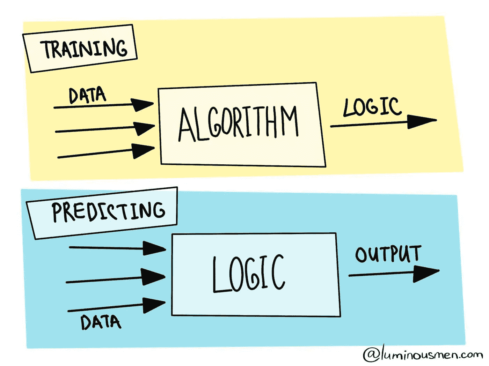

# 机器学习——简化定义

> 原文：<https://medium.com/analytics-vidhya/machine-learning-simplified-definition-5a3ee2ac6ef3?source=collection_archive---------15----------------------->

## 机器学习不仅仅是美化了的统计学

> 人们担心计算机会变得太聪明并接管世界，但真正的问题是它们太笨了，它们已经接管了世界。佩德罗·多明戈斯

感觉就像谷歌或脸书每周发布一项新的人工智能技术，以加快或改善用户…