# 机器学习|体育预测

> 原文：<https://medium.com/analytics-vidhya/machine-learning-sports-predictions-f01c1736ef73?source=collection_archive---------4----------------------->

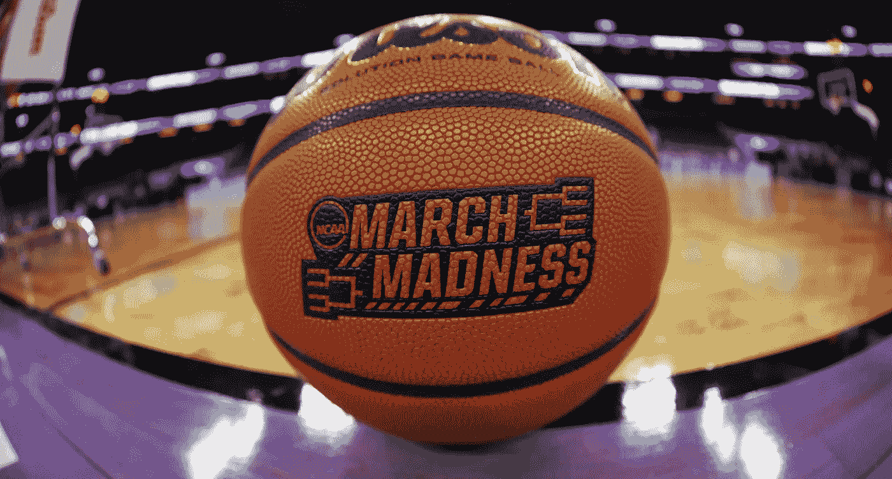

**先说一个重要的问题:什么是机器学习？**

> 机器学习是人工智能的一个子集，它使用算法来检测数据中的模式和趋势。

机器学习可以很容易的分解成以下几种方法；有人监督和无人监督。本文将讨论前者，并由此引出两种类型的任务；回归和分类。这篇文章是一个分类任务，我们想预测一个 NCAA 篮球队是否会赢得或输掉他们的下一场比赛。

在计算机科学中，算法是计算机被编程来遵循的一系列命令。在机器学习中，我们根据历史数据“训练”这些算法，以做出决策和预测——因此当收到新数据时，算法可以提供对未来的准确洞察。算法越好，决策和预测就越准确。

当今世界，机器学习的例子在我们身边比比皆是。数字人工智能机器人根据我们在线观看、收听或搜索的内容，向我们推荐电影、歌曲，甚至度假目的地。

**机器学习是如何工作的？**

> **I.** 选择&准备数据集
> 
> **二。**实现期望的算法(建立 AI 模型)，并在准备好的数据上对其进行训练
> 
> **三世。**确定模型指标

**选择&准备数据集**

> 步骤 1:安装/导入

在运行这段代码之前，您可能需要安装的模块:

[类别编码器 PyPI](https://pypi.org/project/category-encoders/)

[体育参考 PyPI](https://pypi.org/project/sportsreference/)

[Sportsipy:为 python 编写的免费运动 API—sports ipy 0 . 1 . 0 文档(sports reference . readthedocs . io)](https://sportsreference.readthedocs.io/en/stable/)

> 步骤 2:获取并处理模型输入的数据

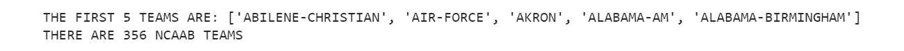

现在我们有了所有 NCAAB 球队的列表，我们可以获取每个球队的数据，并开始为机器学习模型建立数据集。

***细目:***

*   上面的函数获取所有 NCAAB 队的数据。接下来，我将数据分为“特征”(X)和“目标”(y)。
*   特征数据包含将用于预测输赢的游戏统计数据。见下文:

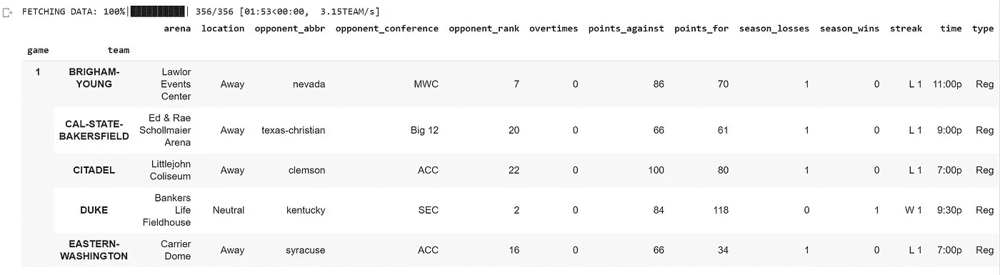

*   目标数据包含我们试图预测的内容，在这种情况下，它是游戏的结果。注意 API 返回游戏的结果(赢或输)，因为我们希望模型是可预测的，所以我们将结果移回一场游戏。因此， ***模型正在被训练，以最近一场比赛发生的事情为基础，预测下一场比赛会发生什么。***

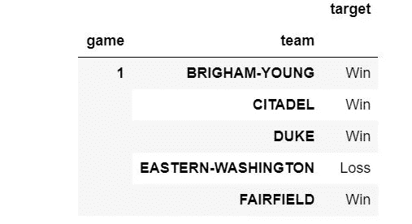

迄今为止，最好的概念化过程的方法是这样的:

*   记住——目标是下一局的结果。例子:杨百翰，城堡和杜克大学都赢得了第二场比赛。 ***我们将它设置为第一场比赛，所以我们的模型被训练来预测下一场比赛。***
*   想象一下目标，作为上面大数据框的最后一列。然后，根据这些特征(游戏统计数据)对算法进行训练，对输赢进行分类。

机器学习分类任务的好处之一是，我们实际上可以可视化我们的模型训练过程，以了解它是如何学习和做出决策的。在接下来的部分中，我将用信息图展示一个例子。

**建立和训练机器学习模型**

> 步骤 1:分割数据用于训练/测试

这将把我们的特征矩阵(X)和目标向量(y)分成训练和测试数据集。这样做的目的是训练一个模型并测量初始精度。

> 步骤 2:定义基线精度

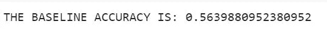

***基线精度*** 可以定义为:模型每次预测多数类(赢或输)时的精度得分。

评估这一指标的原因是为了看看我们的目标类有多平衡，在这种情况下，我们可以看到它们平衡得相当均匀。一个发生的概率是 56%，另一个是 44%。

> 第三步:建立模型并训练它

***细分:***

*   使用 sklearn.pipeline 模块定义模型。这只是更健壮的代码——模型不必在管道中定义。
*   使用 category_encoder 模块对分类特征进行普通编码。
*   实例化机器学习模型:RandomForestClassifier。
*   根据训练数据拟合模型。

**这不是上面概述的步骤之一，因为它不是构建模型所必需的，但对于理解机器学习如何工作是重要的。**

> 将模型可视化

这段代码与模型构建过程无关，也不是本节的重点(见下文)，因此我不打算进行分解——如果您感兴趣，请阅读单元格中的注释。

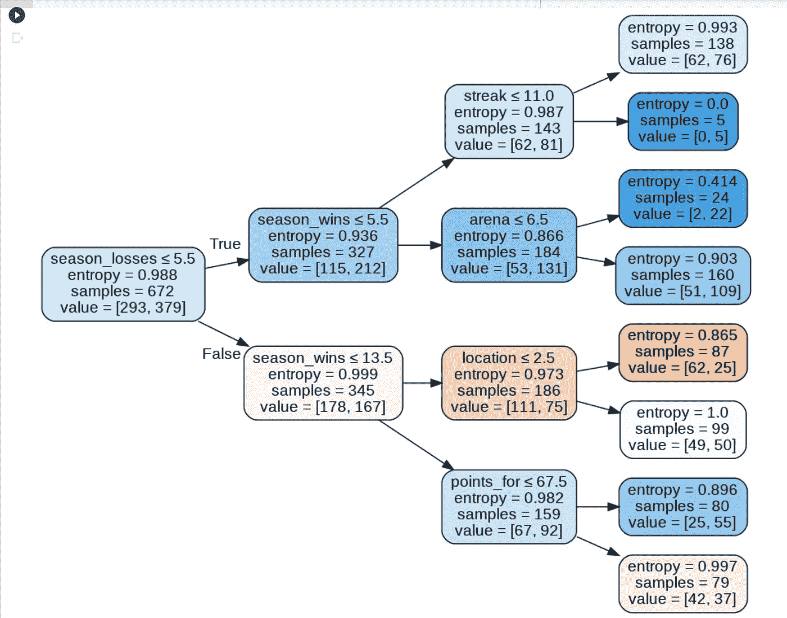

这是我上面提到的信息图

前面我提到过，机器学习模型使用特征(游戏统计)，来预测目标(赢或输)。

上面的信息图是这种特定机器学习模型的可视化，但是，这对于所有基于树的模型都是一样的。你在上面看到的是训练，这是我们模型的决策过程。这个模型所要做的是，准确地对输赢进行分类。用专业术语来说；根据分离情况，尽量减少杂质(下面将详细讨论)。

***什么是拆分？***

很棒的问题！分割或“节点”只是我们数据集的特征。如上图所示，根节点是 season_losses < 5.5 — and the resulting classification is 293 wins, and 379 losses. This yields an entropy or “impurity” of 0.988 (we expect high entropy at the root node! ). The model above is very simple, and was only created for the purpose of this visual, there are only 3 layers in 1 tree. Therefore, as expected, this model never successfully minimizes entropy (model is not learning).

***什么是熵？***

熵是机器学习模型的杂质的度量。

***模型如何最小化熵？***

当您调用“fit”函数时，模型将在训练集的每个特征(列)上分裂，您在上面的信息图中看到的节点是导致最低熵的分裂。

模型通过最小化熵来学习。公式如下所示:

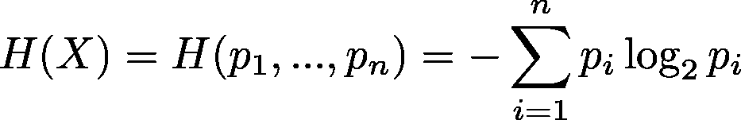

香农熵公式

***细分:***

*   i/n 代表类…对 1 到 n 个类重复上面的计算。
*   这个模型只有两个类(赢或输)，在下面的实现中也可以看到(每个 log2 函数代表一个类)。

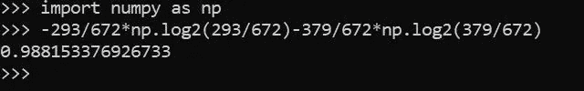

根节点的熵

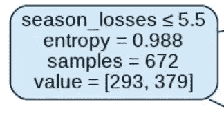

根节点

该模型继续分裂，并行运行数以千计的这些计算，最小化熵，因此“学习”。当出现新数据时，模型将使用上面看到的相同分割来准确地分类成功或失败！

**确定模型指标**

> 步骤 1:计算准确度分数

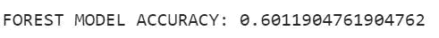

我们使用 sklearn.metrics accuracy_score 对模型进行评分。参数是模型预测和实际结果。

> 步骤 2:确定特性的重要性

注意——“特征”变量已在第一节“准备数据”中定义。

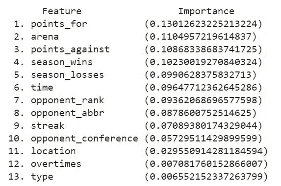

非常酷！我们可以想象每个特征(游戏统计)对预测有多重要。

这个模型已经可以使用了！虽然——你可以调整超参数，选择不同的分类器，设计新的特性，等等……但是，在这一点上，我希望这篇文章的信息已经被接受了！你应该知道如何为 NCAAB 预测建立 ML 模型，如果你不是程序员；我希望你能够了解一点人工智能！

**感谢阅读！**