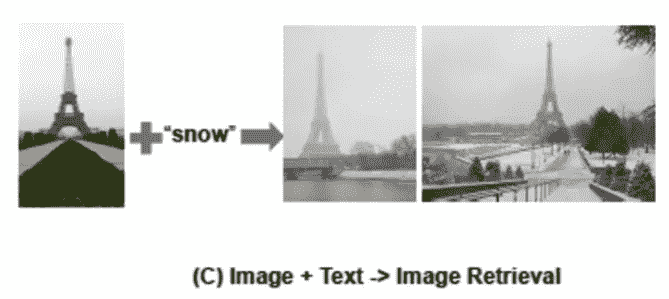

# 机器学习总结；2021 年 2 月

> 原文：<https://medium.com/analytics-vidhya/machine-learning-summary-february-2021-fd4d3d1cdc5a?source=collection_archive---------16----------------------->

# 2020 年 2 月特稿/新闻。

*   上个月发表在 OpenAI 博客上的 DALL-E 现在可以在 arXiv 上看到了。这是一个非常高性能的文本到图像模型，并使用像 VQ-VAE 码本生成图像。
*   [NFNet，一个超越 EfficientNet 无需批量归一化的图像分类模型，已经发布](https://arxiv.org/abs/2102.06171)。批量标准化是一项重要的技术，但它存在的问题是，当批量很小时，它不起作用，并且推理期间的行为不同于训练，因此在这个方向上的研究发展对工业也很重要。
*   [微软发布了非常高性能的预训练 ResNet，通过多任务学习训练，性能超过 OpenAI 的 CLIP](https://www.microsoft.com/en-us/research/blog/microsoft-vision-model-resnet-50-combines-web-scale-data-and-multi-task-learning-to-achieve-state-of-the-art/) 。与 CLIP 一样，为了训练高性能的预训练模型，在多任务和多媒体中包含多种见解可能是必不可少的。
*   [提出了一个模型，该模型可以用相同的参数运行 7 个图像和语言相关的任务(不需要对每个任务进行微调](https://arxiv.org/abs/2102.10772))。它用的是 Transformer，论文题目是《Transformer 是你需要的全部》。

# 机器学习用例

*   [物联网和 AI 可以结合起来，让很多事情自动化](https://techhq.com/2021/02/ai-and-iot-5-use-cases-where-its-gathering-pace/)。随着机器学习的快速发展和 5G 的广泛使用，我们可能会来到一个结合物联网和人工智能的全自动化和优化系统将成为常态的社会。但是，[脸书误判不当广告的故事](https://www.nytimes.com/2021/02/11/style/disabled-fashion-facebook-discrimination.html)显示了机器学习完全自动化的危险。现阶段的机器学习模型还不具备人类的认知能力，所以我认为它们在一段时间内需要适当的人类支持。另外，正如[那篇关于自动消除说或做冒犯性事情的用户的文章](https://thegradient.pub/catching-cyberbullies-with-neural-networks/)中提到的，如果我们不小心使用它，我们最终会陷入反乌托邦，所以我认为伦理讨论是必要的。
*   我觉得自动驾驶系统对攻击的脆弱性是一个主要问题。就汽车而言，被攻击与人的死亡直接相关，因此在自动驾驶变得普遍之前，对策将是必要的。
*   用 Transformer 筛选出高质量的文章，我觉得是个很有意思的[做法。在今天的社会中，有如此多的信息，如果有一种方法可以筛选出低质量的信息，那就太好了。同样有趣的是，可以了解到“文章质量”这一非常模糊的指标。](https://mondaynote.com/deepnews-has-transformed-5746a0fba2e1?gi=dfe16615de22)

# 报纸

*   已经发表了很多使用变形金刚的论文，比如使用变形金刚的[图像检索，使用变形金刚](https://arxiv.org/abs/2102.05644) s 的[动作识别，仅使用变形金刚](https://arxiv.org/abs/2102.05095?utm_campaign=Akira%27s%20Machine%20Learning%20News%20%28ja%29&utm_medium=email&utm_source=Revue%20newsletter)的[甘。正如在](https://arxiv.org/abs/2102.07074) [ViT](https://arxiv.org/abs/2010.11929) 中指出的，电感偏差很小，因此在没有非常大的数据集的情况下，可能还需要实施各种措施。
*   有一项研究表明，在大型数据集上进行训练，即使有一点噪音，也会产生高性能。自 2019 年[大转移](https://arxiv.org/abs/1912.11370)以来，在成像界，向更大数据和模型发展的趋势已经变得相当明显，如果没有大数据集，可能很难参与 SotA 竞争。
*   有很多关于视觉和语言的研究，并且已经发表了两项研究( [1](https://arxiv.org/abs/2102.02779) 、 [2](https://arxiv.org/abs/2102.10772) )，其中单个模型可以执行多项任务。Transformer 系统不仅将文本视为令牌，还将图像视为令牌，这可能是 Vision &语言的一个很好的匹配，因为通过自我关注很容易获得图像和文本之间的交互。

— — — — — — — — — — — — — — — — — — –

在下面的章节中，我将介绍各种文章和论文，不仅仅是关于上述内容，还包括以下五个主题。

1.  本月特稿/新闻
2.  机器学习的真实使用案例
3.  报纸
4.  机器学习技术相关文章
5.  其他主题

— — — — — — — — — — — — — — — — — — –

# 1.本月特稿/新闻

[**高性能文本到图像模型 DALL-E 的论文**发表](https://arxiv.org/abs/2102.12092?utm_campaign=Akira%27s%20Machine%20Learning%20News%20%20%20&utm_medium=email&utm_source=Revue%20newsletter)

图片引自 [OpenAI 博客](https://openai.com/blog/dall-e/)。

*【2102.12092】零镜头文本到图像生成*
他们提出了 DALL-E，用零镜头从文本生成图像。首先，正如在 VQVAE 中一样，他们使用编码器将图像压缩为 32x32，从码本中重新选择一个接近每个网格表示的表示，并学习离散 VAE 以从中生成图像。接下来，使用图像和文本的配对数据，他们训练了一个自回归模型，以使用文本作为输入，使用码本中的 8192 个表达式作为词汇来生成“图像令牌”。

图片引自本文

*【2102.06171】无需归一化的高性能大规模图像识别*
他们提出的 NFNets 优于无需批量归一化的 EfficientNet。虽然采用了一种机制，模拟网络的缩放与先前的工作([https://arxiv.org/abs/2101.08692](https://arxiv.org/abs/2101.08692?utm_campaign=Akira%27s%20Machine%20Learning%20News%20%20%20&utm_medium=email&utm_source=Revue%20newsletter))批量归一化，他们使用自适应梯度裁剪(AGC)来根据权重的大小自适应地限制梯度大小。

[**来自微软**](https://www.microsoft.com/en-us/research/blog/microsoft-vision-model-resnet-50-combines-web-scale-data-and-multi-task-learning-to-achieve-state-of-the-art/?utm_campaign=Akira%27s%20Machine%20Learning%20News%20%20%20&utm_medium=email&utm_source=Revue%20newsletter) 的超高性能培训 ResNet50

这张图片引自这个[博客](https://pypi.org/project/microsoftvision/?utm_campaign=Akira%27s%20Machine%20Learning%20News%20%20%20&utm_medium=email&utm_source=Revue%20newsletter)。

微软发布了一个非常高性能的训练过的 ResNet50 模型，它可以在多个大型数据集上进行多任务处理。它可以在多个大型数据集上进行多任务处理，并显示出超越 Google 的 Big Transfer 和 OpenAI 的 Clip 的迁移学习性能。此处有训练有素的模特。

[**用相同的参数做一个模型中的七个任务**](https://arxiv.org/abs/2102.10772?utm_campaign=Akira%27s%20Machine%20Learning%20News%20%20%20&utm_medium=email&utm_source=Revue%20newsletter)

图片引自本文

*【2102.10772】Transformer 是你需要的全部:用统一的 Transformer 进行多模态多任务学习*
他们提出了 UniT(统一的 Transformer)，一种使用 Transformer 的模型，可以同时学习和推断视觉、文本视觉&语言等多项任务。每个任务都不需要微调，所有七个任务都可以使用相同的模型参数。

— — — — — — — — — — — — — — — — — — –

# 2.机器学习用例

[**脸书广告系统拒绝残疾人时尚广告**](https://www.nytimes.com/2021/02/11/style/disabled-fashion-facebook-discrimination.html?utm_campaign=Akira%27s%20Machine%20Learning%20News%20%20%20&utm_medium=email&utm_source=Revue%20newsletter)

 [## 为什么脸书拒绝这些时尚广告？

### Instagram 和脸书的自动情报系统一再拒绝小企业发布的广告…

www.nytimes.com](https://www.nytimes.com/2021/02/11/style/disabled-fashion-facebook-discrimination.html?utm_campaign=Akira%27s%20Machine%20Learning%20News%20%20%20&utm_medium=email&utm_source=Revue%20newsletter) 

脸书的广告系统正在使用机器学习来确定广告是否合适，但针对残疾人的时尚广告因不合适而被拒绝。当这样的事件发生时，拒绝的原因是不公开的，所以广告发送者自己需要猜测原因。正如你所看到的，机器学习模型并不完美，但被脸书这样的大型平台拒绝广告对小企业来说是一个很大的打击。

[**自动驾驶系统易受网络攻击**](https://venturebeat.com/2021/02/22/eu-report-warns-that-ai-makes-autonomous-vehicles-highly-vulnerable-to-attack/?utm_campaign=Akira%27s%20Machine%20Learning%20News%20%20%20&utm_medium=email&utm_source=Revue%20newsletter)

 [## 欧盟报告警告称，人工智能使自动驾驶汽车“极易”受到攻击

### 自动驾驶汽车的梦想是它们可以避免人为错误并拯救生命，但一个新的欧盟机构…

venturebeat.com](https://venturebeat.com/2021/02/22/eu-report-warns-that-ai-makes-autonomous-vehicles-highly-vulnerable-to-attack/) 

欧盟网络安全机构(ENISA)指出，自动驾驶系统非常容易受到攻击，包括机器学习对抗性攻击。可以考虑采取一些措施，比如让行人看不见。已经发表的许多研究表明，这些是非常危险的，可以通过多种方式进行攻击。

[**物联网 x AI 的五个用例**](https://techhq.com/2021/02/ai-and-iot-5-use-cases-where-its-gathering-pace/?utm_campaign=Akira%27s%20Machine%20Learning%20News%20%20%20&utm_medium=email&utm_source=Revue%20newsletter)

 [## 人工智能和物联网-it 加速发展的 5 个用例- TechHQ

### 人工智能(AI)和物联网(IoT)的融合释放出巨大的商业潜力…

techhq.com](https://techhq.com/2021/02/ai-and-iot-5-use-cases-where-its-gathering-pace/) 

介绍了物联网和 AI 结合可以做的五个用例。举例来说，通过管理建筑能源、防止网络攻击和预测图像检测系统中的设备故障，能耗降低了 20%。

****——**[**【www.reddit.com】**](https://www.reddit.com/r/MachineLearning/comments/la0uux/d_how_widespread_deep_learning_really_is_in/?utm_campaign=Akira%27s+Machine+Learning+News+++&utm_medium=email&utm_source=Revue+newsletter)**

**一个讨论深度学习在工业界有多广泛的帖子。就这个线程来说，很多公司都在用深度学习(但注意这个线程属于机器学习板，所以有偏差)。关于预测股票价格的努力已经有了很多讨论。**

**[**从智能手机拍摄的图像中检测皮肤癌。**](https://newatlas.com/medical/ai-ugly-duckling-melanoma-skin-cancer/?utm_campaign=Akira%27s%20Machine%20Learning%20News%20%20%20&utm_medium=email&utm_source=Revue%20newsletter)**——**[【newatlas.com】T21](https://newatlas.com/medical/ai-ugly-duckling-melanoma-skin-cancer/)**

** [## 人工智能利用“丑小鸭”技术高精度识别黑色素瘤

### 人工智能开始与智能手机技术相结合，这可能会对……产生深远的影响

newatlas.com](https://newatlas.com/medical/ai-ugly-duckling-melanoma-skin-cancer/?utm_campaign=Akira%27s%20Machine%20Learning%20News%20%20%20&utm_medium=email&utm_source=Revue%20newsletter) 

利用深度学习，他们根据痣的变化与正常痣的特征有多么不同来测量痣的异常，并创建了一个与皮肤科医生的判断 88%一致的模型。** 

**[**大规模的语言模型会如何改变社会？**](https://hai.stanford.edu/blog/how-large-language-models-will-transform-science-society-and-ai?utm_campaign=Akira%27s%20Machine%20Learning%20News%20%20%20&utm_medium=email&utm_source=Revue%20newsletter)**——**[**hai.stanford.edu**](https://hai.stanford.edu/blog/how-large-language-models-will-transform-science-society-and-ai)**

** [## 大型语言模型将如何改变科学、社会和人工智能

### 计算机科学、语言学和哲学领域的学者探索了 GPT-3 的痛苦和希望。

hai.stanford.edu](https://hai.stanford.edu/blog/how-large-language-models-will-transform-science-society-and-ai?utm_campaign=Akira%27s%20Machine%20Learning%20News%20%20%20&utm_medium=email&utm_source=Revue%20newsletter) 

一篇讨论大型语言模型 GPT-3 将如何改变社会的文章。它表示，GPT 3 号越来越接近人类的认知能力，但仍不够接近，未来，它将像 DALL-E 一样，不仅能够从语言中学习，还能从图像中学习。** 

******——**[**mondaynote.com**](https://mondaynote.com/deepnews-has-transformed-5746a0fba2e1?gi=2a20c5ced5bf)****

**** [## 深度新闻已经转型了

### Deepnews.ai 现在由基于 Transformer 架构的全新算法提供支持。在…中

mondaynote.com](https://mondaynote.com/deepnews-has-transformed-5746a0fba2e1) 

deepnews.ai 开发了一种算法，可以使用 transformer 自动确定文章的质量。1-5 分用于训练一个模型，根据文章的质量对其进行分类，准确率约为 80-90%。**** 

****[**识别网络游戏中的有害玩家。**](https://thegradient.pub/catching-cyberbullies-with-neural-networks/?utm_campaign=Akira%27s%20Machine%20Learning%20News%20%20%20&utm_medium=email&utm_source=Revue%20newsletter)**——**[**the gradient . pub**](https://thegradient.pub/catching-cyberbullies-with-neural-networks/)****

**** [## 用神经网络捕捉网络恶霸

### 数字骚扰在互联网的许多角落都是一个问题，像互联网论坛，评论区和游戏聊天…

thegradient.pub](https://thegradient.pub/catching-cyberbullies-with-neural-networks/) 

一篇早期识别网游中骚扰诽谤玩家的文章。由于只检测特定单词(例如，fuck)的算法经常出现故障，因此使用机器学习模型提高了检测精度。文章提到，早期发现这些玩家可以对他们的社区产生积极影响，但也存在许多道德问题和挑战。**** 

****— — — — — — — — — — — — — — — — — — –****

# ****3.报纸****

# ****[**单一模型下的多种视觉语言任务**](https://arxiv.org/abs/2102.02779?utm_campaign=Akira%27s%20Machine%20Learning%20News%20%20%20&utm_medium=email&utm_source=Revue%20newsletter)****

********

****图片引自本文****

*****【2102.02779】通过文本生成统一视觉和语言任务* 他们提出了 VL-巴特和 VL-T5，通过使用具有自回归语言模型的文档生成，可以用单一模型执行各种图像语言任务。这个结果比以前那些需要特定任务的大脑的研究要好。****

****[**变压器动作识别任务**](https://arxiv.org/abs/2102.05095?utm_campaign=Akira%27s%20Machine%20Learning%20News%20%20%20&utm_medium=email&utm_source=Revue%20newsletter)****

********

****图片引自本文****

*****【2102.05095】视频理解只需要时空注意力吗？*
他们提出了仅使用变形金刚的 TimeSformer，在动作识别任务上超越了基于 CNN 的模型。它计算时间方向上的注意力，然后像在 ViT 中一样在修补每一帧后计算空间方向上的注意力。它在 Kinetics-400，600 上实现了 Sota 性能，在 Something-Something-V2 上也实现了高精度。****

****[**生成型模型用小波提高分辨率**](https://arxiv.org/abs/2102.06108?utm_campaign=Akira%27s%20Machine%20Learning%20News%20%20%20&utm_medium=email&utm_source=Revue%20newsletter)****

********

****图片引自本文****

*****【2102.06108】SWAGAN:一种基于风格的小波驱动生成模型*
在 StyleGAN 中，这项研究通过渐进增长小波而不是 RGB 图像来生成高分辨率图像，并且它可以实现与基于 RGB 的方法相同的质量，而只需要计算资源。****

****[**检测艺术品中的人物**](https://arxiv.org/abs/2102.06529?utm_campaign=Akira%27s%20Machine%20Learning%20News%20%20%20&utm_medium=email&utm_source=Revue%20newsletter)****

********

****图片引自本文****

*****【2102.06529】仅使用风格转换改进艺术图像中的对象检测*
这是一项研究，通过使用修改后的样式转换为艺术风格的 COCO 女士进行微调来检测艺术作品中的人物。原则上，它可以用于非人类的检测，并且它可以用于收集描绘某个对象的艺术品。****

********——**[**arxiv.org**](https://arxiv.org/abs/2102.03141?utm_campaign=Akira%27s+Machine+Learning+News+++&utm_medium=email&utm_source=Revue+newsletter)******

********

****图片引自本文****

*****【2102.03141】Character gan:少镜头关键点角色动画和寄托*
这是一个从多个图像创建动画的研究。通过将图像的每个部分分成三层，他们可以生成不会混淆前景和背景的图像，同时通过预测遮罩，他们可以让模型学会保持各个部分之间的联系。****

****[**分子的自我监督学习**](https://arxiv.org/abs/2102.10056?utm_campaign=Akira%27s%20Machine%20Learning%20News%20%20%20&utm_medium=email&utm_source=Revue%20newsletter)****

********

****图片引自本文****

*****【2102.10056】MolCLR:通过图形神经网络进行表征的分子对比学习*
提出了 MolCLR，一种分子的自我监督学习方法。该方法被设计用于学习分子的相同表示，即使原子被掩蔽或键被消除。通过微调，SotA 性能在各种任务中得以实现。****

****[**从图像中生成最佳字幕**](https://arxiv.org/abs/2102.01645?utm_campaign=Akira%27s%20Machine%20Learning%20News%20%20%20&utm_medium=email&utm_source=Revue%20newsletter)****

********

****图片引自本文****

*****【2102.01645】通过 CLIP 引导的生成式潜在空间搜索，从字幕生成图像，反之亦然*
研究将遗传算法与 CLIP 相结合，从图像生成最优字幕，通过分别嵌入文本和图像，计算一致度，实现零镜头推理。他们使用预先训练的 GAN 生成器，通过遗传算法搜索最佳潜在空间，以使生成的图像与剪辑中的文本相匹配。****

****[**配置一个只有变形金刚的 GAN**](https://arxiv.org/abs/2102.07074?utm_campaign=Akira%27s%20Machine%20Learning%20News%20%20%20&utm_medium=email&utm_source=Revue%20newsletter)****

********

****图片引自本文****

*****【2102.07074】trans GAN:两个变压器可以组成一个强大的 GAN*
一项仅使用变压器构建 GAN 的研究发现，位置感知初始化(如 CNN 中那样逐渐打开可见部分)是有效的，并且它也可以很容易地受益于数据增强和多任务学习。****

****[**利用变压器进行图像检索**](https://arxiv.org/abs/2102.05644?utm_campaign=Akira%27s%20Machine%20Learning%20News%20%20%20&utm_medium=email&utm_source=Revue%20newsletter)****

********

****图片引自本文****

*****【2102.05644】训练用于图像检索的视觉变形器* 他们提出用变形器进行图像检索的 IRT(图像检索变形器)。除了对比损失之外，他们还使用了最近邻不会靠得太近的损失项，以防止硬阴性样本靠得太近。SotA 性能是在三个数据集上获得的。****

****[**在嘈杂但庞大的数据集上训练**](https://arxiv.org/abs/2102.05918?utm_campaign=Akira%27s%20Machine%20Learning%20News%20%20%20&utm_medium=email&utm_source=Revue%20newsletter)****

********

****图片引自本文****

*****【2102.05918】利用噪声文本监督按比例放大视觉和视觉语言表征学习* 复杂的过滤过程会产生干净的数据，但数据会变小。因此，他们采用一种策略，通过简单的预处理，在有噪声但数据量大的图像/文本对上进行对比损失的学习，以获得良好的表示。在从图像中检索字幕方面实现了强大的性能。****

****— — — — — — — — — — — — — — — — — — –****

# ****4.机器学习技术相关文章****

****[**通过优化摄像机参数，目标检测的地图性能提升高达 48%**](https://www.edge-ai-vision.com/2021/02/optimizing-image-processing-for-computer-vision/?utm_campaign=Akira%27s%20Machine%20Learning%20News%20%20%20&utm_medium=email&utm_source=Revue%20newsletter)****

**** [## 为计算机视觉优化图像处理-边缘人工智能和视觉联盟

### 一家汽车 1 级供应商如何使用 Atlas 在几天内将计算机视觉精度提高了 48%。

www.edge-ai-vision.com](https://www.edge-ai-vision.com/2021/02/optimizing-image-processing-for-computer-vision/?utm_campaign=Akira%27s%20Machine%20Learning%20News%20%20%20&utm_medium=email&utm_source=Revue%20newsletter) 

目标检测技术是自动驾驶系统中的核心技术之一，但手动调整图像处理(ISP)非常耗时。在这里，他们报告说，通过使用 Atlas [相机优化套件](http://applewebdata//46DD55F3-A15D-456E-8910-BD7370194D89/Camera%20Optimization%20Suite?utm_campaign=Akira%27s%20Machine%20Learning%20News%20%20%20&utm_medium=email&utm_source=Revue%20newsletter)来优化对象检测模型的 ISP 方法，他们能够在几天内将 mAP 提高 48%。**** 

****— — — — — — — — — — — — — — — — — — –****

# ****5.其他主题****

****[**谷歌发布模型搜索代码**](https://ai.googleblog.com/2021/02/introducing-model-search-open-source.html?utm_campaign=Akira%27s%20Machine%20Learning%20News%20%20%20&utm_medium=email&utm_source=Revue%20newsletter)****

**** [## 介绍模型搜索:一个寻找最佳 ML 模型的开源平台

### 神经网络(NN)的成功通常取决于它对各种任务的推广能力。然而，设计…

ai.googleblog.com](https://ai.googleblog.com/2021/02/introducing-model-search-open-source.html?utm_campaign=Akira%27s%20Machine%20Learning%20News%20%20%20&utm_medium=email&utm_source=Revue%20newsletter) 

Google 已经发布了一个网络探索库，不仅可以处理变形金刚和 LSTM 组合探索，还可以处理蒸馏等等。这里的代码是[这里是](https://github.com/google/model_search?utm_campaign=Akira%27s%20Machine%20Learning%20News%20%20%20&utm_medium=email&utm_source=Revue%20newsletter)。**** 

****[**闪电来自 Pytorch 闪电**](/pytorch/introducing-lightning-flash-the-fastest-way-to-get-started-with-deep-learning-202f196b3b98?utm_campaign=Akira%27s%20Machine%20Learning%20News%20%20%20&utm_medium=email&utm_source=Revue%20newsletter)****

**** [## 闪电简介—从深度学习基线到研究瞬间完成

### Flash 是一个任务集合，用于快速原型制作、基线和微调，以实现快速和可扩展的 DL，构建于…

medium.com](/pytorch/introducing-lightning-flash-the-fastest-way-to-get-started-with-deep-learning-202f196b3b98) 

Pytorch 闪电放出了闪电闪，比 Pyroch 闪电还要简单。它可以在几行代码中使用训练好的模型执行文本分类、表格数据分类和图像表示向量获取。**** 

****— — — — — — — — — — — — — — — — — — –****

# ****每周新闻信！请订阅！****

**** [## 阿基拉的机器学习新闻- Revue

### 由 Akira 的机器学习新闻-由 Akihiro FUJII:制造工程师/机器学习工程师/硕士…

www.getrevue.co](https://www.getrevue.co/profile/akiratosei) 

— — — — — — — — — — — — — — — — — — –

# 过去的时事通讯

 [## Akira 的机器学习新闻-# 2021 年第 9 周

### Akira 的机器学习新闻-第 9 周(2 月 22 日~)，2021 年

www.getrevue.co](https://www.getrevue.co/profile/akiratosei/issues/akira-s-machine-learning-news-week-9-2021-417831)  [## Akira 的 ML 新闻-# 2021 年第 7 周

### 以下是我在 2021 年第 7 周(2 月 7 日~)读到的一些我觉得特别有趣的论文和文章…

www.getrevue.co](https://www.getrevue.co/profile/akiratosei/issues/akira-s-ml-news-week-7-2021-372359)  [## Akira 的 ML 新闻# 2021 年 1 月

### 以下是我在 2021 年 1 月读到的一些我觉得特别有趣的论文和文章。

medium.com](/analytics-vidhya/akiras-ml-news-january-2021-34a7249c6bb9)  [## Akira 的 ML 新闻# 2020 年 12 月

### 以下是我在 2020 年 12 月读到的一些我觉得特别有趣的论文和文章。

medium.com](/analytics-vidhya/akiras-ml-news-december-2020-44f9235fb250)  [## 机器学习 2020 摘要:84 篇有趣的论文/文章

### 在这篇文章中，我总共展示了 2020 年发表的 84 篇我觉得特别有趣的论文和文章…

towardsdatascience.com](https://towardsdatascience.com/machine-learning-2020-summary-84-interesting-papers-articles-45bd45c0d35b)****