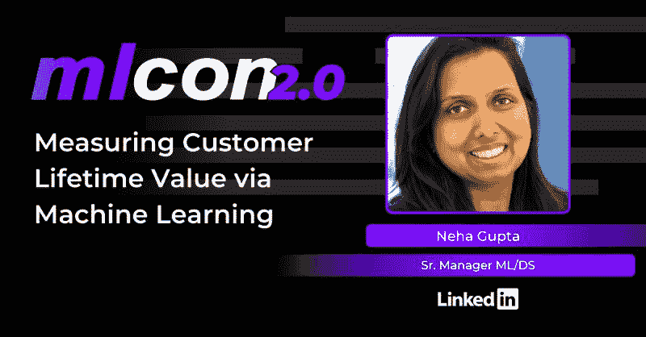
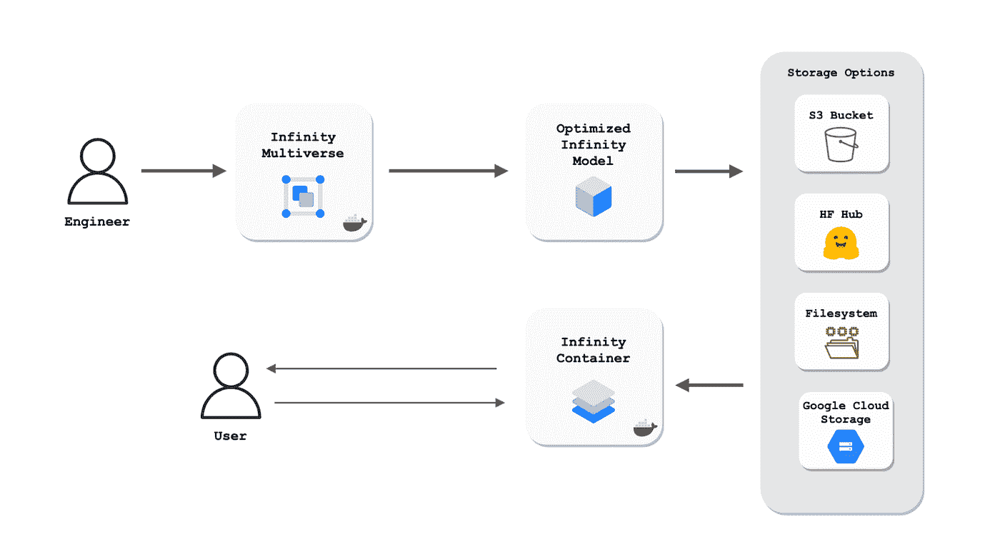

# 我对 mlcon 2.0 上的机器学习演讲感到兴奋

> 原文：<https://medium.com/analytics-vidhya/machine-learning-talks-i-am-excited-about-at-mlcon-2-0-795f2d82a21e?source=collection_archive---------3----------------------->

[mlcon 2.0](https://cnvrg.io/mlcon/) 。

可伸缩性是模型训练、推理等的主要关注点。例如，训练集可能非常大，以至于模型拟合可能非常慢。对于各种实时应用来说，预测延迟也是一个问题。这只是大多数机器学习项目无法投入生产的众多原因中的两个。问题是，生产机器学习知识通常可以从不同的来源获得，或者根本没有。 [mlcon 2.0](https://cnvrg.io/mlcon/) 大会的召开是为了打破这些孤岛，使其更容易交付真实世界的人工智能应用。mlcon 的主题包括可扩展机器学习、NLP 和 MLOps。以下是我在 mlcon 上最感兴趣的一些可扩展机器学习讲座。

# **通过机器学习测量客户终身价值**

客户的终身价值(LTV)是用于衡量客户价值的关键行业指标之一，通常用于在组织中获取、发展和保留“正确的”或有利可图的客户。Linkedin ML/DS 高级经理 Neha Gupta 将分享 LinkedIn 的上市数据科学团队如何通过构建一个可扩展的平台来支持 LinkedIn 跨不同业务的所有 ltv，从而使用机器学习来理解和预测客户价值。这一新平台将模型精度提高了 50–60 %,并大幅缩短了运行/构建新模型/数据管道的时间。

# **将变压器加速到 1 毫秒——到无限远甚至更远！杰夫·布迪尔**

准备这次演讲的一个好方法是查看拥抱脸关于使用拥抱脸 Infinity 和现代 CPU 的[毫秒延迟的案例研究(图片由](https://huggingface.co/blog/infinity-cpu-performance)[拥抱脸](https://huggingface.co/blog/infinity-cpu-performance)提供)。

很少有公司能够在生产中大规模部署大型、复杂的变压器模型。主要的瓶颈是预测的延迟，这使得大型部署的运行成本高昂，实时用例不切实际。拥抱 Face 的演讲将详细介绍他们通过研究和硬件优化加速 Transformer 机器学习模型的方法，以在商用硬件上实现 1 毫秒的延迟，并使任何公司都能将这些大型语言模型大规模部署到他们的生产基础设施中。

# **民主化 ML 开发，推动 Spotify 下一代音频个性化**

机器学习是 Spotify 一切的核心，实现了个性化的用户体验，为数十亿粉丝提供了欣赏平台上艺术家并从中获得灵感的机会。Spotify 机器学习平台团队的 AI/ML 产品经理 Divita Vohra 将讨论机器学习基础设施的使命和发展，这些基础设施是以用户为中心的体验的基础，如 Discover Weekly、Release Radar 和 playlist creation screen 中的推荐。Divita 将带您了解一个具体的个性化用例，支持它的软件架构，以及支持 ML 工程师大规模开发和实施 ML 解决方案的经验教训。

# **广告推荐系统模型更新的度量框架**

选择适当的性能度量是机器学习过程的重要部分，尤其是对于大规模系统。Pinterest 广告质量数据科学负责人阿什姆·达塔将发表一篇关于大规模推荐系统的演讲，该系统依赖于针对不同目标优化的多种模型。这是因为使用诸如 PR-AUC 或 Logloss 之类的度量的这种模型的离线评估并不总是确保推荐系统希望达到的结果。此外，使用单一的在线指标(如 CTR 或 timespent)来量化建模更新对试图为多个利益相关者创造价值的市场的影响并不总是足够的。演讲最后将重点介绍 Pinterest 如何建立一个在线指标框架来评估其广告推荐系统上 100 多个建模更新的成功。

# **结论**

这篇博客文章只是回顾了许多让我兴奋的免费 [mlcon](https://cnvrg.io/mlcon/) 机器学习讲座中的一些。如果你错过了你感兴趣的讲座，不要担心！活动结束后不久，所有的演讲都将在 [cnvrg youtube 频道](https://www.youtube.com/channel/UCG6xHct4yptQkuHPL3yz9-Q/featured)上发布！