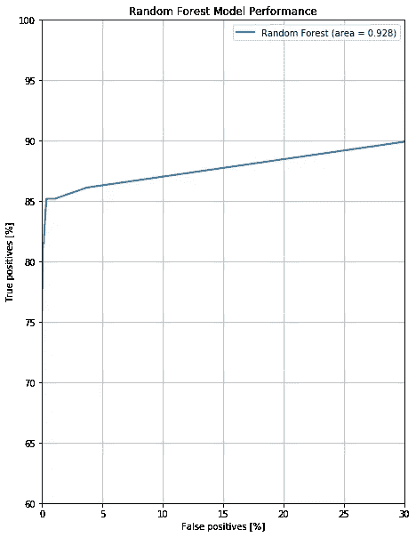

# 用于信用卡欺诈检测的机器学习技术

> 原文：<https://medium.com/analytics-vidhya/machine-learning-techniques-for-credit-card-fraud-detection-609421fbcc48?source=collection_archive---------7----------------------->


[rupixen.com](https://unsplash.com/@rupixen?utm_source=unsplash&utm_medium=referral&utm_content=creditCopyText)在 [Unsplash](https://unsplash.com/s/photos/credit?utm_source=unsplash&utm_medium=referral&utm_content=creditCopyText) 上拍照

网上诈骗空前猖獗。在我们日益数字化的世界中，欺诈者利用互联网剥削他人从未如此容易。更糟糕的是，许多消费者的密码、信用卡号和其他敏感信息在黑暗网络上泄露。这导致账户被接管，每天都有新的欺诈性信用额度被开立。许多仍然完全不为人知。

信用卡诈骗是最常见的网络诈骗之一。信用卡号、pin 和安全码很容易被窃取并用于欺诈交易。这会给商家和消费者带来巨大的经济损失。然而，信用卡公司最终有责任偿还客户的任何损失。因此，对于信用卡公司和其他金融机构来说，能够在欺诈发生之前检测到它是极其重要的。

机器学习已经成为一种越来越容易使用和可靠的方法来检测欺诈性交易。使用历史数据集，可以训练机器学习模型来学习欺诈行为背后的模式。然后可以应用一个模型来过滤掉欺诈性交易，并实时阻止它们的发生。

这篇文章将研究 4 种常用的欺诈检测机器学习方法。其中包括:

*   随机森林
*   CatBoost
*   深度神经网络(DNN)
*   隔离森林

我们将深入探讨如何用 Python 创建这些模型的基础知识，并比较它们彼此之间的表现。我们开始吧！

# 设置

首先，我们需要导入一些 Python 库，用于数据操作、建模和评估。

```
import pandas as pd
from sklearn.ensemble import RandomForestClassifier
from keras.models import Sequential
from keras.layers import Dense, Dropout, Flatten, Activation
from sklearn.metrics import roc_curve
from sklearn.metrics import auc
import matplotlib as mpl
import matplotlib.pyplot as plt#configure plot size and colors 
mpl.rcParams['figure.figsize'] = (10, 10)
colors = plt.rcParams['axes.prop_cycle'].by_key()['color']
```

使用 sklearn *roc_curve* 和 *auc* 来评估模型性能。这将帮助我们了解我们的模型在预测真阳性和假阳性方面的表现。一般来说，机构希望在低的、固定的假阳性率下有高的真阳性率。因此，ROC 曲线是衡量欺诈分类器性能的一种有意义的方法。

# 数据准备

为了评估欺诈检测的不同机器学习方法，我们将使用在 ka ggle([https://www.kaggle.com/mlg-ulb/creditcardfraud](https://www.kaggle.com/mlg-ulb/creditcardfraud))上公开提供的“信用卡欺诈检测”数据集。该数据集包含 2013 年欧洲持卡人的多笔信用卡交易。由于原始数据集包含敏感的个人身份信息(PII)，因此该数据集中的许多要素都使用 PCA 进行了转换。

每笔交易都在“类别”一栏中被如实标记为*欺诈*或*非欺诈*。看一下类别百分比，很明显只有极小比例的交易是欺诈性的(00.17 %)。由于大的类别不平衡，这使得训练分类器具有挑战性。

```
#load data
df = pd.read_csv('creditcard.csv')#drop NULL values
df = df.dropna()#drop Time column (contains limited useful information)
df = df.drop('Time', axis = 1)#group data by Class
groups = df.groupby('Class')
fraud = (groups.get_group(1).shape[0] / df.shape[0]) * 100
non_fraud = (groups.get_group(0).shape[0] / df.shape[0]) * 100#print class percentage
print('Percent Fraud: ' + str(fraud) + '%')
print('Percent Not Fraud ' + str(non_fraud) + '%')
```


接下来，我们将使用我们的数据创建一个训练集和一个维持集，以便我们可以快速评估我们的模型如何处理全新的、看不见的数据。

```
df_size = df.shape[0]
test_size = int(df_size * .3)
train_size = df_size - test_sizetrain_df = df.head(train_size)
test_df = df.tail(test_size)X_train = train_df.drop('Class', axis = 1)
Y_train = train_df['Class']
X_test = test_df.drop('Class', axis = 1)
Y_test = test_df['Class']
```

最后，我们将对所有特征应用标准缩放器，使它们的平均值为 0，标准差为 1。这将有助于我们的模型更有效地学习。

我们只在训练集上拟合我们的标准标量，以防止它偏离如何转换我们的测试集。

```
for feat in X_train.columns.values: ss = StandardScaler() X_train[feat] = ss.fit_transform(X_train[feat].values.reshape(-1,1)) X_test[feat] = ss.transform(X_test[feat].values.reshape(-1,1))
```

现在我们已经准备好了数据，是时候开始构建一些模型了！

# 方法 1:随机森林

我们将用于训练欺诈分类器的第一种方法是随机森林。随机森林是一种流行的监督机器学习算法，可用于分类和回归任务。该模型的工作方式是对训练数据集进行采样，构建多个决策树，然后让决策树的输出确定一个预测。该模型可以方便地处理高维大数据集，也可以方便地处理分类值。然而，它可能会受到我们的数据中的大类不平衡的影响。

首先，让我们启动一个基本的随机森林模型，并使用我们的训练数据对其进行训练。然后，我们将检索测试集中每个数据点的概率。

```
#create Random Forest Model
rf = RandomForestClassifier()#fit to training data
rf.fit(X_train, Y_train)#get class probabilities
probabilities = clf.predict_proba(X_test)
y_pred_rf = probabilities[:,1]
```

接下来，让我们计算一些基本的性能指标。我们将计算假阳性率(FPR)、真阳性率(TPR)和 ROC 曲线下的面积。

```
fpr_rf, tpr_rf, thresholds_rf = roc_curve(Y_test, y_pred_rf)
auc_rf = auc(fpr_rf, tpr_rf)
```

最后，让我们用 ROC 曲线(接受者操作者特征)来描绘我们模型的性能。这将帮助我们理解我们的模型在我们的测试集上产生的真阳性和假阳性之间的关系。如果我们的模型表现良好，我们应该在低假阳性率的情况下看到高真阳性率。

```
plt.plot(100*fpr_rf, 100*tpr_rf, label= 'Random Forest (area = {:.3f})'.format(auc_rf), linewidth=2, color = colors[0])plt.xlabel('False positives [%]')
plt.ylabel('True positives [%]')
plt.xlim([0,30])
plt.ylim([60,100])
plt.grid(True)
ax = plt.gca()
ax.set_aspect('equal')
plt.title('Random Forest Model Performance')
plt.legend(loc='best')
```



看起来相当不错！随机森林似乎是一种用于欺诈检测的好的机器学习方法。在不同的假阳性率(FPR)下，它有一个持续的高真阳性率(TPR)。

让我们看看更多的模型，看看他们如何比较。

# 方法 2: CatBoost

我们将尝试的下一个方法是 CatBoost，这是一个用于决策树梯度提升的开源库。CatBoost 算法的工作原理是连续构建决策树，并最小化每个新构建的决策树的损失。该算法因无需大量参数调整即可提供出色的结果而臭名昭著。此外，CatBoost 被设计为能够很好地处理不平衡数据，这使得该算法非常适合用于欺诈检测。

让我们启动一个默认的 CatBoost 模型，并使其适合我们的训练数据。然后，让我们得到测试集的类概率。

```
#create CatBoost Model
clf = CatBoostClassifier()#fit to our data
clf.fit(X_train, Y_train)#generate class probabilities
y_pred = clf.predict(X_test, prediction_type='RawFormulaVal')
```

现在，让我们做一些评估，看看我们的模型表现如何。


乍一看，CatBoost 似乎已经推翻了随机森林算法，提供了 **.978** 的 AUC 值。与我们的随机森林相比，这是一个显著的提升，随机森林的 AUC 值只有 **.928** 。

# 方法 3:深度神经网络(DNN)

威尔尝试的下一个方法是深度神经网络。神经网络是一种非常强大的机器学习方法，其灵感来自于神经元在大脑中的工作方式。神经网络继续应用于许多机器学习问题，如图像识别、语音检测和自动驾驶汽车。这些模型非常强大，因为它们学习了其他模型难以识别的输入和输出变量之间的复杂关系。然而，使用神经网络的一个缺点是，它们有时需要大量的微调才能产生理想的结果。

不幸的是，我没有时间(*或专业知识，坦率地说*)来真正深入研究如何建立和训练一个强大的神经网络。然而，我提供了一个基线神经网络，它是我在 Keras 中构建的，并且发现在欺诈检测中是成功的。这个神经网络包括 3 个密集层来从我们的数据中学习特征，以及 2 个下降层来防止过度拟合。

```
#Design and compile model
DNN = Sequential()
DNN.add(Input(shape=(X_train.shape[1],)))
DNN.add(Dense(100, activation='relu'))
DNN.add(Dropout(0.5))
DNN.add(Dense(100, activation='relu'))
DNN.add(Dropout(0.5))
DNN.add(Dense(10, activation='relu'))
DNN.add(Dense(1, activation='sigmoid'))
DNN.compile(loss='binary_crossentropy', optimizer='adam', metrics = keras.metrics.AUC(name='auc'))#fit model
DNN.fit(X_train, Y_train, epochs=10)#generate class probabilities
y_pred_DNN = DNN.predict(X_test).ravel()
```

在拟合我们的模型并生成我们的预测概率后，让我们看看我们的 DNN 表现如何。


杰出！似乎 CatBoost 和我们的 DNN 都是迄今为止我们表现最好的车型。

# 方法 4:隔离林

我们将尝试使用的最后一种方法是隔离林(或“I Forest”)；这是一种与我们以前的方法非常不同的欺诈检测方法。到目前为止，我们只看了 ***监督学习*** 方法，其中模型是基于真实标记的数据来训练的。同时，隔离森林是一种 ***无监督学习*** 方法，这意味着它不需要任何真值标记来进行预测，只从它在训练数据中找到的模式中学习。

在现实世界中，公司并不总是有真实的欺诈数据。例如，如果一个公司第一次尝试部署一个解决方案，并且它没有很多欺诈的例子可以使用，那么就不可能训练一个监督分类器。此外，出于安全原因，公司可能无法共享真实标记的欺诈数据，或者可能根本没有任何可用的欺诈示例。

隔离林是一种基于树的算法，用于异常检测。该算法通过使用决策树来隔离数据中的异常值。理论上，我们的欺诈群体应该主要由与我们的其余交易相比异常的数据点组成。因此，当我们没有任何标签时，这是识别欺诈的完美解决方案。

让我们用 Python 实现我们的 iForest。注意我们是如何不需要“Y_train”的，因为我们的模型不需要任何真值标记来训练。

```
#create iforest model
iforest = IsolationForest()#fit to data
iforest.fit(X_train)#generate class probabilities
y_pred_iforest = - iforest.decision_function(X_test)
```

最后，让我们看看它的表现如何。


这种方法在识别欺诈人群方面表现得非常好。然而，它比我们尝试的其他方法产生更多的假阳性。在需要的情况下，这可能非常有用。

# 结论

下面是我们为信用卡欺诈检测探索的所有机器学习方法的比较。


在我们的测试数据集中，深度神经网络和 CatBoost 似乎在检测欺诈方面工作得最好。然而，根据欺诈问题的背景，多种其他方法也可能有用。随着更先进的机器学习方法的不断开发，看看哪些方法在识别欺诈方面最有效将是一件有趣的事情。

Github repo 与所有代码/视觉效果在这里:[https://github.com/ryankemmer/CreditCardFraudDetection](https://github.com/ryankemmer/CreditCardFraudDetection)